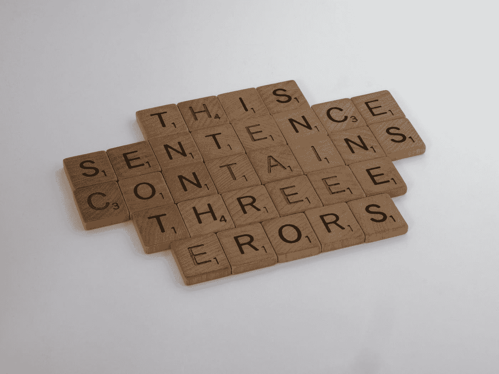

# Python 算法:Jaden 套管串

> 原文：<https://levelup.gitconnected.com/python-algorithm-jaden-casing-strings-a37d89d76f4a>

## 将字符串中的每个单词大写



布雷特·乔丹在 [Unsplash](https://unsplash.com?utm_source=medium&utm_medium=referral) 上拍摄的照片

我们将编写一个名为`to_jaden_case`的函数，它将接受一个字符串`string`作为参数。

从函数名的起源开始，我将引用 Codewars 算法页面上的指令:

> 贾登·史密斯，威尔·史密斯的儿子，是电影《空手道小子》(2010)和《地球之后》(2013)的主演。贾登也因他通过推特发表的一些哲学而闻名。当他在 Twitter 上写文章时，他以几乎总是大写每个单词而闻名。

给你一个字符串，函数的目标是返回每个单词都大写的字符串。

示例:

```
quote = "How can mirrors be real if our eyes aren't real"# output: "How Can Mirrors Be Real If Our Eyes Aren't Real"
```

首先，我们将使用`split()`把字符串输入转换成一个列表。我们将数组分配给`textArr`。

```
textArr = string.split(" ")
```

我们将创建另一个名为`jadenCaseArr`的变量，并给它分配一个空列表。这个列表将包含来自`string`的每个单词，但是要大写。

```
jadenCaseArr = []
```

接下来，我们将使用 for 循环遍历`textArr`并将每个单词添加到`jadenCaseArr`中。我们用`capitalize()`大写每个单词。

```
for word in textArr:        
    jadenCaseArr.append(word.capitalize())
```

最后，我们使用`join()`将列表转换回字符串，并返回该字符串。

```
return " ".join(jadenCaseArr)
```

下面是完整的函数:

如果您觉得这很有帮助，请查看我的另一篇 Python 算法解决方案文章:

[](/python-algorithm-count-duplicate-27dfd5d80505) [## Python 算法:重复计数

### 计算字符串中重复字符的数量

levelup.gitconnected.com](/python-algorithm-count-duplicate-27dfd5d80505)