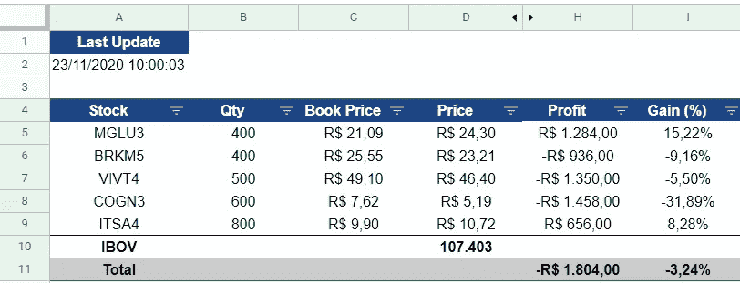
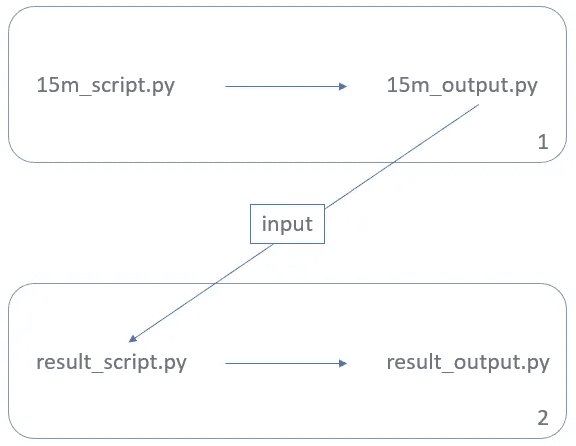

# 用于管理投资的 Python 和 Linux I/O 重定向

> 原文：<https://levelup.gitconnected.com/python-and-linux-i-o-redirection-for-managing-investments-ef009be30f39>

## 使用谷歌云平台(GCP)上的 Linux 虚拟机获得每日投资结果表

Emile Perron 在 [Unsplash](https://unsplash.com?utm_source=medium&utm_medium=referral) 上的照片

在这篇文章中，我们将看到如何在 Linux 虚拟机上存储一个文件，该文件包含最初在 Google Sheets 上提供的股票列表的每日结果。

每个人都认识一个朋友，他/她也在抱怨，他/她需要关注他们的银行或投资经纪平台，以便全天跟踪他们的金融投资结果。

当然，每个人都想知道自己的钱是怎么回事。然而，在这篇文章中，我们将探索一种方法来轻松跟踪您的投资的当前表现，并在一天结束时生成它们的每日视图。

此外，你可以随心所欲地个性化一切。

在我之前关于 Medium 的文章中，我探索了谷歌云平台(GCP)上可用的[计算引擎服务](https://cloud.google.com/)的一部分。在这篇提到的文章中，我在一个 Linux 虚拟机上部署了一个 Python 脚本，它有一个链接，链接到我自己的个人 Google Sheets 上的一些数据。

上一篇文章是继续本文的基本条件，因为它解释了如何设置整个环境，以便能够访问和处理所有相关数据。在这个意义上，我强烈邀请你去看看。

 [## 这个虚拟机节省了我的时间

### 在 Google 云平台之上的 Linux 虚拟机中部署您的 Python 脚本，以便与您的……

towardsdatascience.com](https://towardsdatascience.com/this-virtual-machine-is-saving-my-time-23076f592b94) 

在最初的简报之后，让我列举一下我们将要讨论的主题:

1.  环境设置
2.  谷歌工作表数据
3.  Linux 文件结构
4.  Linux 调度服务
5.  Python 文件
6.  最后的想法

事不宜迟，让我们最后看看我们在这里得到了什么。

# 1.环境设置

如前所述，让我们在前进之前先弄清楚需要采取哪些行动:

1.  启用对 Google 工作表的访问
2.  在 GCP 上实例化您的 Linux 虚拟机
3.  在 Linux 虚拟机上安装 Python

这些都是需要完成的主要步骤。都可以在之前通知的帖子上查到。

*同样重要的是要提到，虽然这些步骤据说是继续本文所必需的，但是如果你喜欢使用本地安装的 Linux VM 和 Microsoft Excel(而不是使用 GCP 和 Google Sheets ),你至少可以从理解 Python 和 Linux 的关系中受益。*

# 2.谷歌工作表数据

您可能已经注意到，我在这里准备了一个与上一篇文章中的表格非常相似的表格。考虑到列出的所有代码和一些列名，有一些小的变化:

Google Sheets 的数据(11 月 23 日上午 10 点)

只是为了强调一下，“价格”是指当前的股票价格。这与“账面价格”相比较，账面价格是股票被买入的价格。

“Stock”列包含本例中所有的报价机。你愿意为你考虑的每一个报价机都应该有一行。

# 3.Linux 文件结构

所有这些文件在我们的虚拟机中是如何构建的？下面，我从我的 CLI 拍摄了一个快照，在“pythonScript”目录下运行`tree`命令:

你可以注意到有 4 个`py`文件和 1 个`json`文件。

`py`文件将在接下来的会话中描述。`json`文件是一个包含 Google Sheets API 认证和授权过程所需的 Google 凭证的文件。您可以注意到，`json`文件是文件“15m_script.py”(会话 5)上的 python 脚本的一部分。

我创建了一个名为“log”的目录，只是为了拆分由“main one”(“15m _ script . py”)生成的文件。这不是强制性的，只是确保相应地调整文件的路径。

# 4.Linux 调度服务

下图考虑了分析中涉及的所有 Python 脚本文件及其相互关系:

Python 文件 I/O 重定向关系

在描述 Linux 服务时间表本身之前，让我们先了解一下每个目标:

*   “15m_script.py”是每 15 分钟运行一次的脚本，用于更新 Google Sheets 表
*   “result_script.py”是股票市场收盘后运行的脚本，用于考虑股票每天的收盘价。“15m_output.py”也用作“result_script.py”的输入

为了达到提到的频率，我们将使用`cron` job Linux 服务。键入`crontab -e`，您将看到类似于以下内容的内容(直到第 25 行，如果您没有用户的 crontab 作业):

让我们将 3 个预定的`cron`任务分开:

1.  第 28 行:

*   `*/15 10–17 * * MON-FRI`:调度规则；
*   `/usr/bin/python3.7` : python 解释器位置；
*   `/home/lucasnunesfe9/pythonScript/15m_script.py`:。py 文件位置

2.第 31 行:

*   `00 18 * * MON-FRI`:与先验定义相同；
*   `/usr/bin/python3.7`:与先验定义相同；
*   `/home/lucasnunesfe9/pythonScript/15m_script.py`:与先验定义相同；
*   `>`:标准输出语句(指示系统发送“15m_script.py”到“15m _ output . py”)；
*   `/home/lucasnunesfe9/pythonScript/log/15m_output.py`:。输出文件位置。

3.第 34 行:

*   `05 18 * * MON-FRI`:与先验定义相同；
*   `/usr/bin/python3.7`:与先验的定义相同；
*   `/home/lucasnunesfe9/pythonScript/log/result_script.py`:与先验定义相同；
*   `/home/lucasnunesfe9/pythonScript/log/15m_output.py`:“15m _ output”正被用作“result_script.py”的输入；
*   `>`:与先验定义相同；
*   `/home/lucasnunesfe9/pythonScript/log/result_output.py`:与先验定义相同。

# 5.Python 文件

让我们深入了解一下每个 Python 文件的作用。

## 15m(分钟)文件:

*   “15m_script.py”脚本的主要目标是为“股票”列中列出的每个报价器更新“价格”列。为了实现这一点，脚本将根据 [Google Finance](https://www.google.com/finance/) API 语法编写一个字符串。这个字符串为我们提供了每个股票的当前价格:

**这段代码已经写在知情的上一篇帖子里了。我在这里做了一些改动，主要是将脚本结构从函数式的改为面向对象的。*

*   “15m_output.py”是一个打印声明，包括:脚本运行的时间(`dt_string`)、报价机列表(`ticker_list`)及其当前价格(`value_list`)。让我们使用 Linux 的`cat`命令来检查“15m_output.py”内容:

## 结果文件:

*   “result_script.py”脚本的主要目标是使其报价器与其当前价格相匹配，这两个价格都存储在“15m_output.py”中，同时添加标题和总行数:

*   “result_output.py”是包含我们的**想要的** **结果**的打印语句。一个包含所有报价机及其收盘价格的表格。让我们再次使用 Linux 的`cat`命令来检查“15m_output.py”内容:

# 6.最后的想法

我们已经设法制定了一个定期的 Linux 时间表，给你一个每日投资结果的摘要。

这一成果主要用于考虑两种情况。想象一下…

*   …您需要处理多个用户的投资数据。通过设置像这样的循环机制，您可以轻松地生成他们的每个信息并与他们共享。
*   …您需要以历史的方式汇总每天的结果。因为您已经生成了一个包含每天结果的文件，所以您可以设法附加每天结果的数据，以便对它们进行比较，然后将合并的结果与一些投资的基准进行比较。

当然，这里提供的示例并不是万能的解决方案，但是，它可以为您通过管理一些计算资源来开始处理数据铺平道路，而不依赖于一些银行或投资经纪人服务来管理您的财务数据。