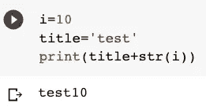
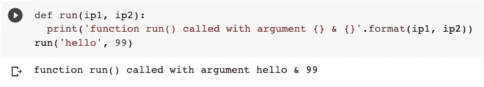
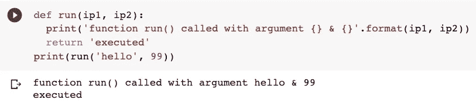
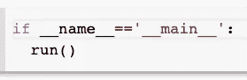
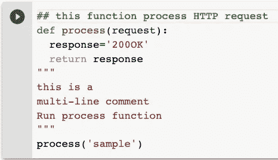
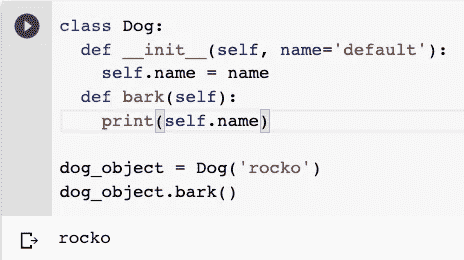

# 对于 Java 开发人员来说，Python 越快越好

> 原文：<https://levelup.gitconnected.com/python-as-fast-as-possible-for-java-developers-2867b689cc9d>

## 总结为 10 个要点，帮助您开始


Emile Perron 在 [Unsplash](https://unsplash.com?utm_source=medium&utm_medium=referral) 上的照片

P ython 是一种**优雅的**语言，其关键理念是*保持简单*。它的语法非常简洁，非常容易学习。Python 代码通常看起来像伪代码；您倾向于更多地关注编写您的逻辑，而不是语言的复杂性。这是它受欢迎的主要原因之一，尤其是在数据科学领域。

来自 Java 背景，近 3 年前进入 Python 它很快成为我的主要语言。它以几乎相同的效率快速完成工作。有一些例子表明 Java 工作得更好，但是随着现代容器化世界和机器学习的发展，Python 变得更加丰富，工作得更好。

如果你来自 Java 世界，这里有 10 个要点可以帮助你开始使用 Python

## 1.Python 是一种解释型语言

它自顶向下执行您的代码并退出。就这么简单。不涉及任何编译(几乎)或构建步骤。您的代码是用' * '写在一个文件中的。py '扩展名并直接执行。

> Python 是一种解释语言，与编译语言相反，尽管由于字节码编译器的存在，这种区别可能是模糊的。这意味着源文件可以直接运行，而不需要显式地创建一个可执行文件来运行。
> [Python 文档](https://docs.python.org/3/glossary.html)

文件中的一行程序- 'hello_world.py ':

```
print('hello world')
```

运行程序:

```
$ python hello_world.py
hello world
```

Python 还有一个交互式 shell，可以直接运行命令。

**注意**:如果你看到前缀为**双下划线**的变量或函数，只要知道它们有特殊的含义就行了。例如，Python 中的构造函数被命名为'**_ _ init _ _【T20]'，而不是像 Java 中的类名。**

## 2.Python 是动态类型的——“不再有声明变量”



作者图片

不需要在 python 中声明变量类型。动态类型化意味着解释器会在运行时发现它。这对于大多数解释型语言来说是常见的，并且使得编写代码更快更容易。

## 3.再见{大括号}(还有分号；).都是关于缩进的。

Python 代码的结构完全基于缩进。不再需要大括号来指示代码中的部分或循环。如果你的缩进错了，你就完了。开始的时候很奇怪，但是你会改变主意的。(*没有缩进的代码无论如何都是令人生厌的。*)

```
i=5
for i in range(0,i):
    print(i)0
1
2
3
4
```

## 4.声明函数

在 python 中使用' **def** 关键字来声明函数。



作者图片

为了从函数中返回值，我们使用了传统的' **return'** 关键字。



作者图片

## 5.没有神奇的主函数

Java 中没有类似 ***main*** 的具体入口点。这是一种简单的脚本语言。

但是为了将主程序与代码的其余部分区分开来，Python 只是在启动脚本时将一个特殊变量' **__name__** '设置为值' **__main__** '。另一方面，其余的模块在导入或注入时，会将它们的**模块名**设置为“ **__name__** ”变量中的。



作者图片

在 Python 中你会一直看到这段代码。只要知道它说——如果以运行为起点，则启动程序。如果在另一个模块中导入或注入，'**'运行()'功能将不会被执行。**

## **6.注释 Python 代码**

**Python 使用' # '来注释代码。**

****

**作者图片**

## **7.类别和对象**

**Python 支持 OOP(面向对象编程)。**

*   **没有'**新的**'关键字来创建对象。**
*   ****'__init__'** 函数是类的构造函数**
*   ****self** 关键字代替了 **this** 来指代一个类变量**

**在 Python 中我们是这样做的:**

****

**作者图片**

## **8.没有无意义的访问说明符**

**Python 没有任何访问说明符。跟**告别**跟**公开的，私有的，受保护的**关键词说，反正是浪费时间，没用。在 Python 的世界里，它被完美地概括为这样——**

> **我们都是成年人了**

## **9.Python 的线程和 GIL**

**好吧，我们只能说 Python 的线程比 Java 差。Python 并没有真正做到多线程。这是因为一个全局解释器锁， **GIL** 。**

**简而言之，有一个互斥体(或锁)只允许一个线程控制 **Python** 解释器。所以如果你有两个线程在 Python 中运行，要知道解释器一次只能执行一行。**

## **10.点**

**PIP 是 Python 的软件包管理系统，用于安装和管理用 Python 编写的软件包。这个类似于 **Java 的 Maven** 。**

**在 Python 中，我们在一个名为 **requirements.txt** 的简单文本文件中管理依赖关系。这类似于你在 maven 中的 **POM** 文件。**

**示例' *requirements.txt* ':**

```
scipy==1.4.1
six==1.14.0
tensorboard==2.1.1
tensorflow==2.1.0
```

**您可以像这样安装一个依赖项:**

```
pip install <package-name>
pip install flask 
```

**或者从 requirements.txt 安装:**

```
pip install -r requirements.txt
```

> **和..就是这样！“保持简单”是 Python 的哲学。**