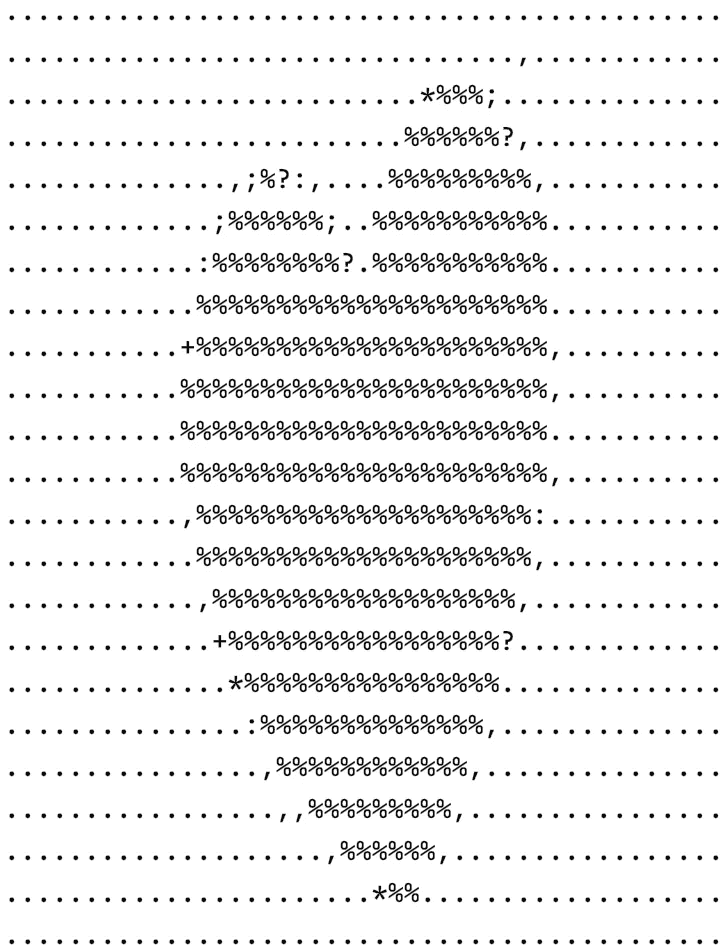

# Python ASCII 艺术生成器。

> 原文：<https://levelup.gitconnected.com/python-ascii-art-generator-60ba9eb559d7>

了解如何使用 Python 从图像生成 ASCII 图片。



用 Python 生成

将图像转换为 ASCII 字符的步骤

*   加载图像
*   调整图像大小
*   将图像转换为灰度
*   将每个像素的灰度数据转换成各自的 ASCII 字符

# 使用 PIL 图像库加载图像

为了加载图像，我们将使用`**PIL**`库。

```
import PIL.Image

def main():
    path = input("Enter the path to the image fiel : \n")
    try:
        image = PIL.Image.open(path)
    except:
        print(path, "Unable to find image ");
```

上面的代码从用户给定的路径读取图像。如果图像不在给定的路径上，我们将显示一条错误消息。

# 定义 ASCII 列表

让我们创建一个 ASCII 字符列表，

```
ASCII_CHARS = ["@", "#", "$", "%", "?", "*", "+", ";", ":", ",", "."]
```

ASCII 字符从最暗到最亮排列。这意味着最暗的像素将被替换为`**@**`，最亮的像素将被替换为`**.**`

# 调整图像大小

我们需要将图像转换成较小的宽度和高度，这样就不会产生大尺寸的文本。要找到`**new_height**`，将`**new_width**`乘以`**old_height**`，然后除以`**old_width**`。

```
def resize(image, new_width = 100):
    width, height = image.size
    new_height = new_width * height / width
    return image.resize((new_width, new_height))
```

# 将图像转换为灰度

我们可以在带有`**L**`选项的`**image**`上使用`**convert**`方法来获得灰度图像

```
def to_greyscale(image):
    return image.convert("L")
```

# 将灰度图像转换为 ASCII 字符

要先将图像转换成 ASCII 字符，获取每个像素值`**(0-255)**`。获取相应的 ASCII 字符，并将它们连接成一个字符串

```
def pixel_to_ascii(image):
    pixels = image.getdata()
    ascii_str = "";
    for pixel in pixels:
        ascii_str += ASCII_CHARS[pixel//25];
    return ascii_str
```

现在我们有一个`**to_greyscale**`方法将图像转换为灰度图像，`**pixel_to_ascii**`方法将灰度图像转换为 ASCII 字符串，一旦我们得到图像的 ASCII 字符串，我们需要根据图像的宽度分割字符串，并将其保存在文件中。

```
import PIL.Imagedef main():
    path = input("Enter the path to the image fiel : \n")
    try:
        image = PIL.Image.open(path)
    except:
        print(path, "Unable to find image ") #resize image
    image = resize(image); #convert image to greyscale image
    greyscale_image = to_greyscale(image) # convert greyscale image to ascii characters
    ascii_str = pixel_to_ascii(greyscale_image) img_width = greyscale_image.width
    ascii_str_len = len(ascii_str)
    ascii_img="" #Split the string based on width  of the image
    for i in range(0, ascii_str_len, img_width):
        ascii_img += ascii_str[i:i+img_width] + "\n" #save the string to a file
    with open("ascii_image.txt", "w") as f:
        f.write(ascii_img);
main()
```

感谢阅读。跟随 [Javascript 吉普🚙💨](https://medium.com/u/f9ffc26e7e69?source=post_page-----60ba9eb559d7--------------------------------)了解更多教程

# 分级编码

感谢您成为我们社区的一员！ [**订阅我们的 YouTube 频道**](https://www.youtube.com/channel/UC3v9kBR_ab4UHXXdknz8Fbg?sub_confirmation=1) 或者加入 [**Skilled.dev 编码面试课程**](https://skilled.dev/) 。

[](https://skilled.dev) [## 编写面试问题+获得开发工作

### 掌握编码面试的过程

技术开发](https://skilled.dev)