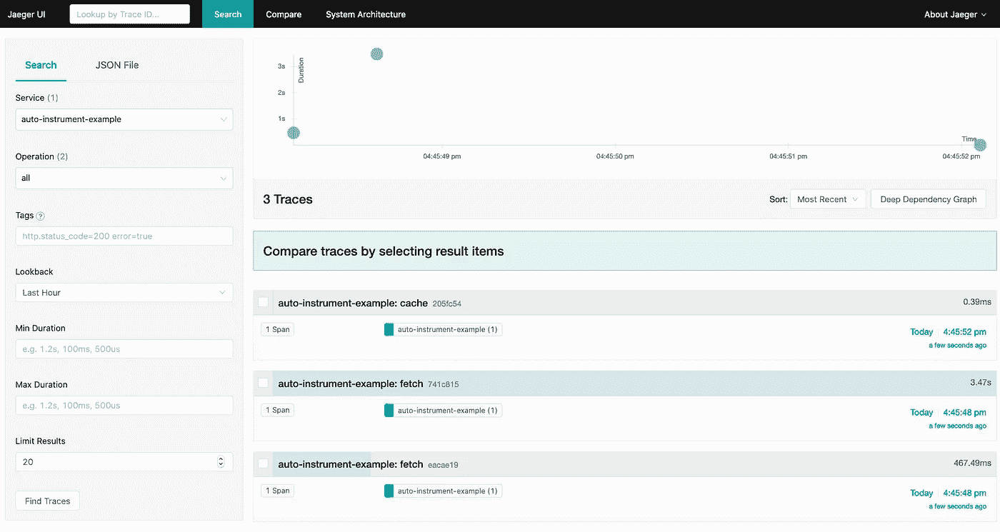
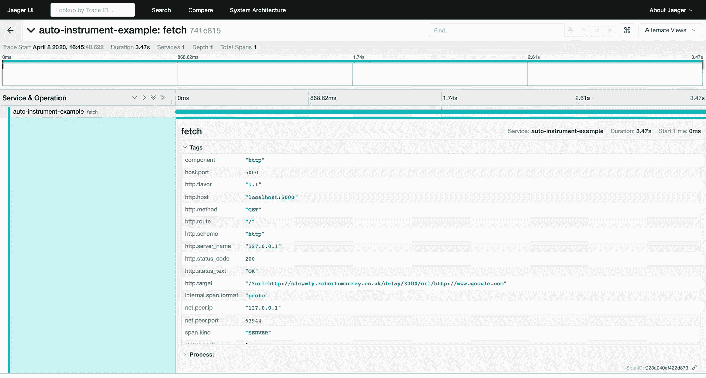

# 使用 OpenTelemetry 的 Python 自动仪器

> 原文：<https://levelup.gitconnected.com/python-auto-instrumentation-with-opentelemetry-ccd603c665af>


艾米·利·巴纳德在 [Unsplash](https://unsplash.com/s/photos/telescope?utm_source=unsplash&utm_medium=referral&utm_content=creditCopyText) 拍摄的照片

我们都经历过。您想开始使用分布式跟踪，但是没有时间重新查看系统中的几十个服务的代码库。别担心，OpenTelemetry 会保护你。由于来自许多组织成员的巨大社区努力，OpenTelemetry 项目已经能够快速提升其自动检测许多广泛使用的第三方库的各种语言代码的能力。

# 为什么选择自动仪器？

对于许多组织的工程团队来说，使用分布式跟踪并因此使操作员的生活至少改善 10，000 倍的最大障碍是检测系统所需的时间。自动插装通过直接挂钩到现有代码来帮助减轻这一负担。借助自动化仪器，工程师可以

*   只需对代码进行少量(如果有)更改，即可实现插装
*   了解图书馆正在做什么，而不必先了解所有细节
*   期望利用这些库的应用程序之间有一致的插装

插装是在应用程序中开发[可观察性](https://lightstep.com/observability)的第一步，它给了开发人员询问关于他们代码的有意义问题的超能力。

# 我如何使用它？

我可以不停地谈论自动化仪表如何让生活变得更好、更容易，但是还有什么比尝试更好的方法来证明这一点呢？以下示例将介绍如何使用 OpenTelemetry 检测 Python 应用程序。如果您已经有了一个使用任何支持库的应用程序，请随意跳过这一步，直接进入配置导出器一节。

否则，我们将创建一个接收 web 请求并向上游发出请求的小应用程序。

# 要求

*   使用 OpenTelemetry 需要 Python 3.4 以上版本
*   如果你想在本地运行 Jaeger，Docker 是必需的

# 这个例子

首先，我们将安装我们的应用程序将使用的 Python 包:

将下面的代码保存在新文件`server.py`中。你可以在[light step/open telemetry-examples](https://github.com/lightstep/opentelemetry-examples/tree/master/python/auto-instrumentation)repo 中找到这个例子的所有代码。

*注意:这可能是有史以来最差的代理服务器*

# *配置导出器*

*我们将在本地运行一个[积家](https://www.jaegertracing.io/)后端来收集和显示追踪信息。如果您的环境中已经有 Jaeger 在运行，您可以跳过以下步骤:*

```
*docker run --name jaeger -d -p 6831:6831/udp -p 16686:16686 jaegertracing/all-in-one:latest*
```

*为了允许我们的应用程序将其遥测具体化，我们需要将 OpenTelemetry 配置为使用导出器。*

*在我们之前创建的`server.py`文件的顶部附近插入以下代码。*

*接下来，我们将通过`pip`安装自动仪器包和 Jaeger exporter 包。*

```
*pip3 install opentelemetry-instrumentation opentelemetry-exporter-jaeger opentelemetry-instrumentation-flask*
```

*我们现在准备运行我们的应用程序！打开一个终端，用我们的应用程序作为参数运行`opentelemetry-instrument`可执行文件。*

**注意:我们正在导出一个环境变量来将 OpenTelemetry TracerProvider 设置为 opentelemetry-sdk 的 TracerProvider。在启动自动检测之前对其进行配置，可以确保所有检测都将使用相同的 TracerProvider。**

```
*export OTEL_PYTHON_TRACER_PROVIDER=sdk_tracer_provider
opentelemetry-instrument ./server.py*
```

*在另一个终端中，我们将向我们的应用程序发出一些请求。其中一个请求通过代理，这会导致响应延迟。*

```
*curl -s "localhost:5000/?url=https://en.wikipedia.org/wiki/Mars"  > /dev/nullcurl -s "localhost:5000/?url=http://slowwly.robertomurray.co.uk/delay/3000/url/http://www.google.com" > /dev/nullcurl -s "localhost:5000/cache"  > /dev/null*
```

# *看着这些痕迹*

*激动人心的部分来了。让我们到 [http://localhost:16686/](http://localhost:16686/) 的 Jaeger 界面中搜索踪迹。马上，我们可以看到我们对应用程序发出的所有请求的踪迹，我们编写了 **ZERO** 检测代码。*

**

*通过自动检测可以获得的一条有价值的信息是附加在每个库的跨度上的标签。在下面的例子中，确定应用程序响应缓慢的根本原因变得很简单。*

**

# *自动仪器的限制*

*自动插装与它插装的库紧密耦合。如果一个应用程序依赖于自动化工具尚不支持的库，将不会获得额外的洞察力。令人欣慰的是，OpenTelemetry 项目中有很多人每天都在努力增加受支持库的数量。花些时间通读一下[注册表](https://opentelemetry.io/registry/)，看看支持的语言和框架。有一个你正在使用的框架，但在注册表中看不到它？在项目中创建一个问题，让我们合作解决它！在 [OpenTelemetry.io](https://opentelemetry.io/) 关注项目，了解最新消息。*

*下一步是什么？开始追踪！自动检测可能永远不会像手动检测那样彻底，但是它是您的可观察性之旅的一个很好的起点。*

**2020–08–28:更新以反映 opentelemetry-python 0.12b0 中的变化**

**2020 年 6 月 11 日:更新以反映 opentelemetry-python 0.9b0* 中的变化*

**最初发表于*[T5【https://lightstep.com】](https://lightstep.com/blog/python-auto-instrumentation-with-opentelemetry/)*。**