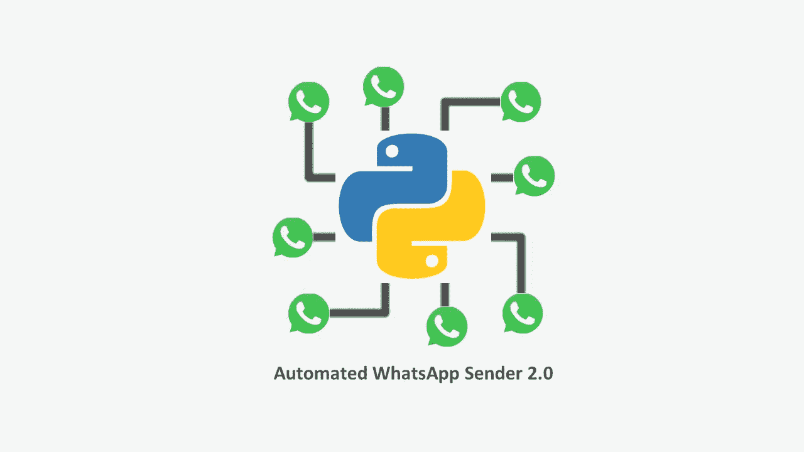
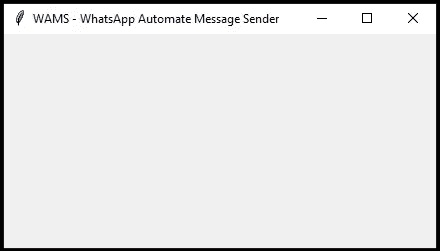
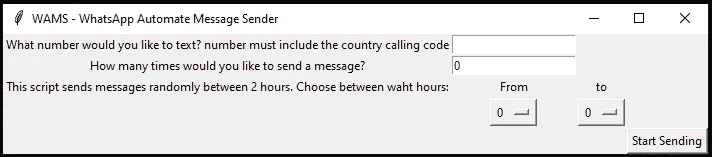

# Python 自动化 WhatsApp 消息发送器 2.0

> 原文：<https://levelup.gitconnected.com/python-automated-whatsapp-message-sender-2-0-d146704e7f2f>

## 让我们的自动化 WhatsApp sender 更上一层楼，并了解如何添加图形用户界面(GUI)以便更方便地使用。

作者图片

一周前，我发表了一篇关于如何“建立一个自动 WhatsApp 发送器，在白天代表你发送随机消息”的[故事](/python-automated-whatsapp-message-sender-db488c8c6bc7)，几天后，它获得了超过 20，000 次浏览。多个平台(Medium、LinkedIn 等)上的很多人问我很多关于我们如何让它更容易使用的问题。因此，使其更加适用的第一步是将用户界面转换成更加直观的 GUI。

在这个故事中，我们不会讨论 WhatsApp 自动消息发送器(WAMS)的基础知识，所以你可以回到上一个故事，从这里开始深入了解它的基础知识:

 [## Python 自动 WhatsApp 消息发送器

### 了解如何构建一个自动化的 WhatsApp 发送器，在白天代表你发送随机消息。

levelup.gitconnected.com](/python-automated-whatsapp-message-sender-db488c8c6bc7) 

## 我们开始吧

和往常一样，我们将从导入将要使用的库开始。在这种情况下，我们只需要一个库— [tkinter](https://docs.python.org/3/library/tkinter.html) ，它是 Python 的标准 GUI 库。当与 tkinter 结合使用时，Python 提供了一种快速简单的方法来创建 GUI 应用程序。此外，Tkinter 为 Tk GUI 工具包提供了一个强大的面向对象的接口。我们可以对这个库进行大量的修改，我们将使用其中的一些。

导入之后，我们首先需要创建 GUI 应用程序的主窗口，我们将用`.Tk()`方法来完成。由于窗口的默认标题是‘tk’，我们将使用`.title`方法来设置我们想要的标题。标题方法以一个字符串作为参数，所以我们将称之为“WAMS — WhatsApp 自动消息发送器”。最后，我们需要`.mainloop()`方法，它只是主窗口中的一个方法，执行我们希望在应用程序中执行的内容。顾名思义，它将永远循环下去，直到用户退出窗口或等待来自用户的任何事件。

我们的 GUI。显然，它现在是空的。(图片由作者提供)

现在，正如我们在前面的故事中构建 WAMS 一样，它需要用户的四个输入:

*   phoneNumber:用户想发什么号码的短信？请记住，该号码必须包括国家呼叫代码
*   numberOfMessages:应用程序将向该号码发送多少条消息？

由于这个脚本在两个小时之间随机发送消息，用户还需要指出他希望在哪两个小时之间发送消息，因此我们需要:

*   开始时间
*   结束时

## 让我们添加小部件

tkinter 提供了各种控件，比如 GUI 应用程序中使用的按钮、标签和文本框。这些控件通常被称为小部件。

对于我们的前两个输入，我们将使用`.Label`小部件来指示我们需要从他那里得到什么数据，使用`.Entry`小部件来收集数据。入口小部件是一个文本框，用户可以在其中输入内容，至少需要两个参数。首先，每个小部件都需要我们指出它要放在哪个窗口上(本例中是 master ),其次，它带有`text=`参数，这个参数显然指的是我们想要呈现的文本标签。

接下来，我们将定义两个变量来保存收集到的输入。注意，我们使用`.StringVar`方法来保存电话号码，因为它需要是一个字符串。第二个是我们发送的消息数量，需要是一个整数。

现在，如前所述，我们想使用`.Entry`小部件来收集输入。为此，我们再次从声明它将出现在哪个窗口开始，然后声明插入的要分配给耦合变量的文本。

注意，对于每个小部件，我们还调用了`.grid()`方法。网格几何管理器将小部件放在一个二维表格中。主小部件被分成许多行和列，结果表中的每个“单元”可以容纳一个小部件。在我们的例子中，我们将每个标签及其条目放在同一行中。

接下来，我们需要要求用户设置小时变量。为此，我们将要求他选择他想要发送消息的时间，并将其放在一行中，但分成三列。开始和结束时间都是整数值，在“从”和“到”下面，我们将放置两个`.OptionMenu`，一个下拉菜单的小部件。和往常一样，它首先获取将要放置它的窗口。其次，它接受将要赋值的变量。第三，它接受一个菜单选项列表，最后接受一个命令。该命令是一个函数，它所做的事情也可以取决于我们选择的值。

在这两个`.OptionMenu`小部件中，我们构建了一个函数，将值分配给小部件本身，因此用户可以看到他选择的值。为此，我们需要使用`.get()`方法来提取存储在 tkinter 变量中的值。

在我们跳到最后一个小部件之前，我们需要将我们的`numberOfMessages` while 循环定义为一个函数，这样它就可以用于最后一个小部件的执行:

最后，我们将添加一个按钮，用`.Button`小部件发送消息。声明窗口后，我们在按钮上设置文本，然后分配一个命令来激活`countMessages`功能。因为这个函数有五个参数，我们需要用 lambda 包装它，如下所示。最后，我们将按钮分配到第 4 行第 5 列。

最终结果:

# 真的是这样！

我就讲到这里，你可以在这里找到[的完整代码](https://github.com/Waeara/Python-Automated-WhatsApp-Message-Sender/blob/main/Whatsapp%20automate%20message%20sender%20with%20GUI.ipynb)。如前所述，我们可以在 GUI 中不断修改很多东西。因此，如果你做了任何进一步的修改，请留言告诉我，或者作为 git 的一个分支来做，如果你有任何想法或问题，请随时留下评论🙂

感谢阅读！👍

# 分级编码

感谢您成为我们社区的一员！在你离开之前:

*   👏为故事鼓掌，跟着作者走👉
*   📰查看更多内容请参见[升级编码刊物](https://levelup.gitconnected.com/?utm_source=pub&utm_medium=post)
*   🔔关注我们:[Twitter](https://twitter.com/gitconnected)|[LinkedIn](https://www.linkedin.com/company/gitconnected)|[时事通讯](https://newsletter.levelup.dev)

🚀👉 [**加入升级人才集体，找到一份神奇的工作**](https://jobs.levelup.dev/talent/welcome?referral=true)