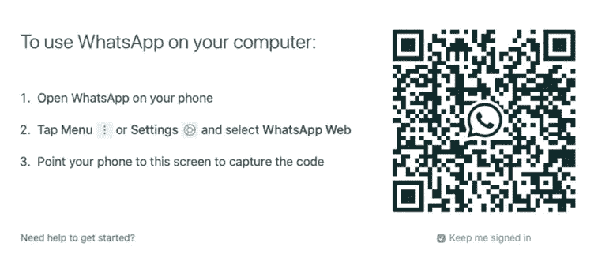

# Python 自动 WhatsApp 消息发送器

> 原文：<https://levelup.gitconnected.com/python-automated-whatsapp-message-sender-db488c8c6bc7>

## 了解如何构建一个自动化的 WhatsApp 发送器，在白天代表你发送随机消息。

作者图片

上周我工作非常忙，我几乎没有时间去安排午餐，更糟糕的是，我去和我的妻子聊天，问她怎么样了。一周之后，在晚上，我不得不解释为什么我没有几秒钟的时间来发送 WhatsApp 消息，我想到了一个主意——建立一个 Python 脚本来代表我发送每天的消息。所以我开始着手创建一个，并努力使它尽可能的通用、随机和可靠。我最不希望她发现我花时间写了这样一个脚本，而不仅仅是发送一条消息…

## 我们开始吧

我们将从导入我们将使用的库开始。首先，我们将导入主库 [PyWhatKit](https://pypi.org/project/pywhatkit/) ，这是 WhatsApp 和 YouTube automation 最流行的库之一，允许您在一行中非常容易地发送 WhatsApp 消息。事实上，该库的构建使得我们几乎不需要任何其他库，因为这些方法应该可以打开 WhatsApp web，自动发送消息，并关闭标签。但是到目前为止，还存在一些问题，所以我们需要更多的工作来解决这些问题。

其中一个错误(至少是我遇到的)是自动发送器不工作，所以为了解决它，我们将使用 [PyAutoGUI](https://pyautogui.readthedocs.io/en/latest/) ，它让您的 Python 脚本控制鼠标和键盘来自动与其他应用程序交互。此外，我们将使用 [PynPut](https://pypi.org/project/pynput/) ，特别是 Key 和 Controller 方法，因此我们可以向键盘添加控制来发送消息。

最终，我们将需要[表情符号](https://carpedm20.github.io/emoji/docs/)库来使我们的消息更加多样化，需要[随机](https://docs.python.org/3/library/random.html)库来随机选择消息和消息将被发送的时间，需要[时间](https://docs.python.org/3/library/time.html)库来给代码一些时间来完成它的工作。

为了发送消息，我们将编写如下函数。一般来说，我们会尝试发送消息(正如我提到的，我遇到了几个 bug，所以这样更容易工作)，如果它不起作用，我们将`except`错误并打印出来，这样我们就知道哪里出错了。我们的函数有四个参数:一个带有国家代码的电话号码和一条消息，两者都是字符串，还有两个整数表示小时(0 到 23)和分钟(0 到 59)。

在`try`中，我们首先使用`pywahtkit.sendwahtmsg`方法，顾名思义，它发送消息。这个函数的所有参数都是这个函数的输入，为了使这个函数正常工作，这个时间应该比发送消息的预期时间至少早 5-6 分钟。接下来，我们将使用`time.sleep()`等待 10 秒钟，以便我们的浏览器有时间打开 WhatsApp 标签，这可能会根据您的互联网而有所不同。

首次使用`pywahtkit.sendwahtmsg`方法后，WhatsApp web 会要求您将设备连接到浏览器，如下所示。这也可能会影响该功能的首次运行，因为打开标签和连接计算机将需要超过 10 秒的时间(该方法也有内置的 15 秒延迟，但这可能还不够)

作者图片

现在，我们需要建立一个消息“银行”，我们将使用`random.choise`方法每次随机选择一条消息。下面的例子向您展示了一些简单的文本消息。此外，我使用了`emoji.emojize`方法来增加一些信息的趣味，或者只是单独发送一个表情符号。

坚持住。我们快到了。为了让它更具互动性，我增加了一个选项，可以选择每天发送多少条消息，以及在哪个时间段发送(开始时间和结束时间)。显然，这取决于你的工作日长度。所有这些都是通过`input()`内置函数实现的，它要求用户写下他的答案作为输入。

最终，我们将运行一个 while 循环，只要它不发送我们要求的所有消息，就会一直运行。它首先随机选择一个小时，然后选择分钟，最后调用我们之前构建的 sender 函数。

## 真的是这样！

我就讲到这里，不过你可以在这里找到[的完整代码](https://github.com/Waeara/Python-Automated-WhatsApp-Message-Sender/blob/main/Whatsapp%20automate%20message%20sender.ipynb)。如果你有任何想法或问题，请随时留下评论🙂

感谢阅读！👍

# 分级编码

感谢您成为我们社区的一员！在你离开之前:

*   👏为故事鼓掌，跟着作者走👉
*   📰查看[级编码出版物](https://levelup.gitconnected.com/?utm_source=pub&utm_medium=post)中的更多内容
*   🔔关注我们:[推特](https://twitter.com/gitconnected) | [LinkedIn](https://www.linkedin.com/company/gitconnected) | [时事通讯](https://newsletter.levelup.dev)

🚀👉 [**加入升级人才集体，找到一份惊艳的工作**](https://jobs.levelup.dev/talent/welcome?referral=true)