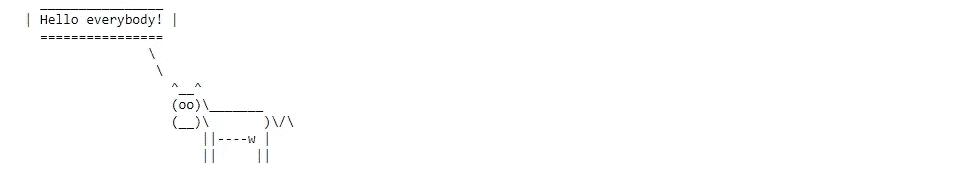
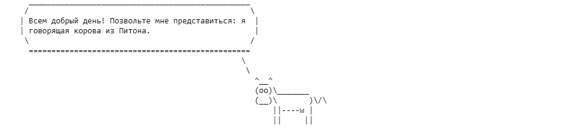
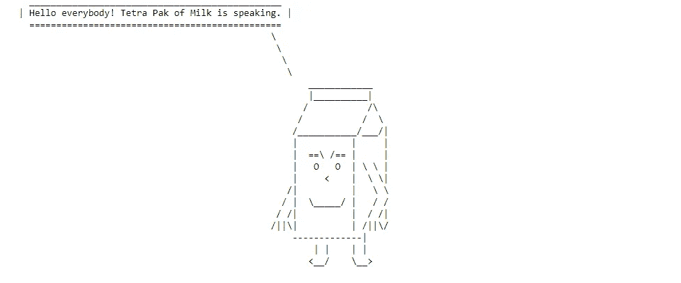
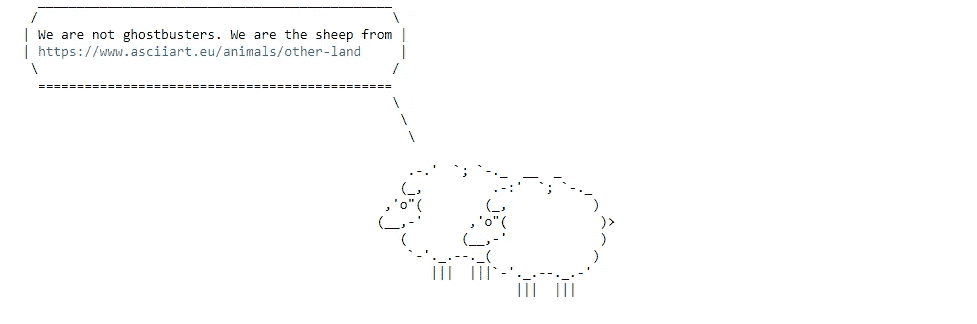
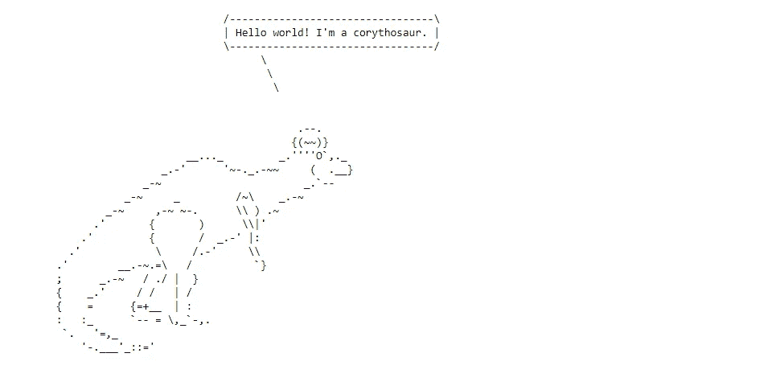
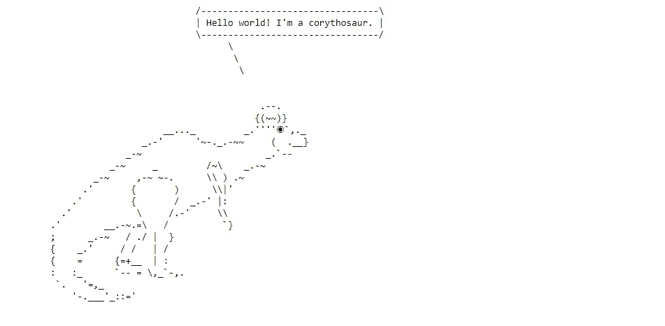
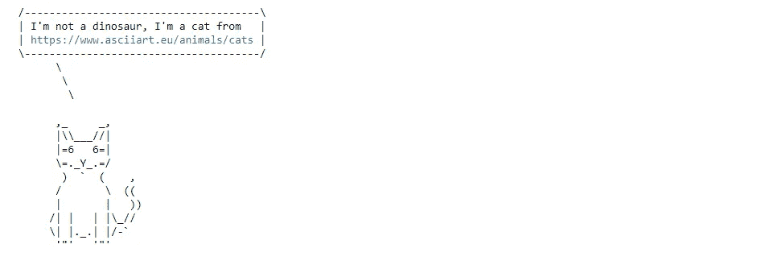
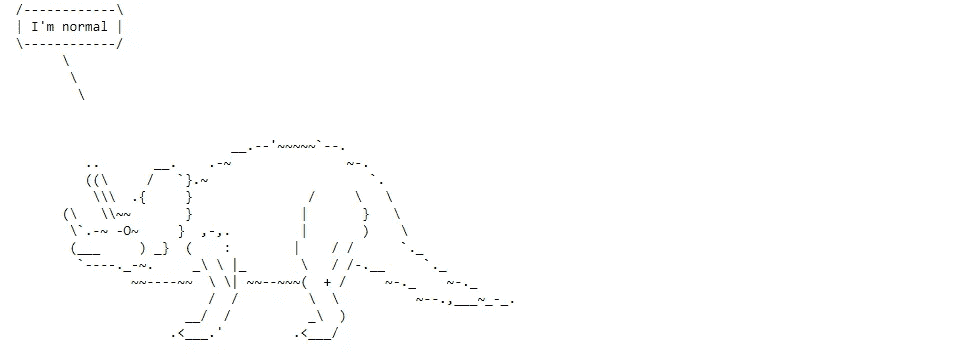
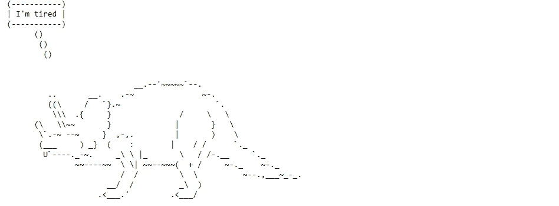
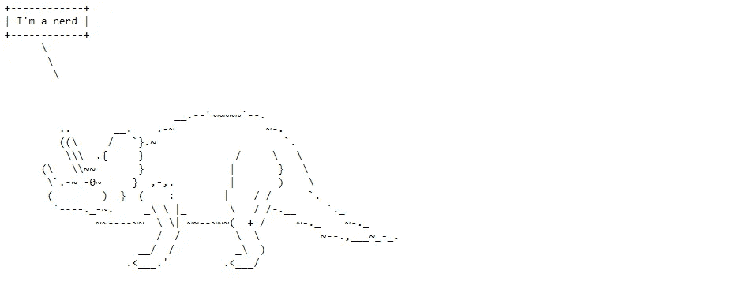

# Python 可以带来很多乐趣

> 原文：<https://levelup.gitconnected.com/python-can-be-lots-of-fun-999552d69d21>

## Cowsay 和 Dinosay 库，用于在 Python 中以 ASCII 艺术形式创建“会说话”的动物


作者照片

除了“严肃的”Python 库之外，还有很多模块可以用来娱乐。在本文中，我们将讨论其中的两个:`cowsay`和`dinosay`。

# `[Cowsay](https://pypi.org/project/cowsay/)`🐮

最初的 [**cowsay**](https://en.wikipedia.org/wiki/Cowsay) 是 20 多年前用 Perl 编写的一个好玩的程序。它用于生成带有消息的奶牛(或其他可用动物)的预定义 ASCII 艺术图片。最初是为 GNU/Linux 编写的，现在它也有 Python 和 r 的实现。

让我们从一个基本的例子开始:

```
import cowsay
cowsay.cow('Hello everybody!')
```

**输出:**



如果我们写一个更长的文本，它将被分散在几行中。此外，我们可以使用任何语言来编写字符串。用我的母语俄语说一段更长的牛话吧🙂：

```
cowsay.cow('Всем добрый день! Позвольте мне представиться: я говорящая корова из Питона.')
```

**输出:**



我们可以使用任何其他会说话的动物，甚至是图书馆里的物品:

```
print(f'Number of creatures: {len(cowsay.char_names)}')
print(list(cowsay.char_names))
cowsay.milk('Hello everybody! Tetra Pak of Milk is speaking.')
```

**输出:**

```
Number of creatures: 16
['beavis', 'cheese', 'daemon', 'cow', 'dragon', 'ghostbusters', 'kitty', 'meow', 'milk', 'pig', 'stegosaurus', 'stimpy', 'trex', 'turkey', 'turtle', 'tux']
```



每个生物实际上都是`cowsay`模块的一个函数，有一个默认参数`char_lines`，代表对应的 ASCII 艺术图像:

```
cowsay.tux**Output:** <function cowsay.func(text, char_lines="\n     \\\n      \\\n       \\\n        .--.\n       |o_o |\n       |:_/ |\n      //   \\ \\\n     (|     | )\n    /'\\_   _/`\\\n    \\___)=(___/\n")>
```

或者，如果我们只想提取 ASCII 艺术字符串本身:

```
import inspect
list(inspect.getfullargspec(cowsay.chars['tux']))[3][0]**Output:** "\n     \\\n      \\\n       \\\n        .--.\n       |o_o |\n       |:_/ |\n      //   \\ \\\n     (|     | )\n    /'\\_   _/`\\\n    \\___)=(___/\n"
```

对于这些函数中的任何一个，代替默认值`char_lines`，可以将任何 ASCII 艺术图像分配给该参数:

```
cowsay.ghostbusters('We are not ghostbusters. We are the sheep from \n [https://www.asciiart.eu/animals/other-land'](https://www.asciiart.eu/animals/other-land'), 
                    char_lines='''\n  \\\n   \\\n    \\\n 
    .-.'  `; `-._  __  _
   (_,         .-:'  `; `-._
 ,'o"(        (_,           )
(__,-'      ,'o"(            )>
   (       (__,-'            )
    `-'._.--._(             )
       |||  |||`-'._.--._.-'
                  |||  |||  ''')
```

**输出:**



# `[Dinosay](https://pypi.org/project/dinosay/)`🦕

正如本库的作者兼恐龙迷 Matteo Guadrini 所说，

> dinosay 是 cowsay 的一个谦逊、简单、不错的旧石器时代替代品。

与上一个模块不同，这个模块只针对恐龙(在`cowsay`动物中也有一些恐龙)。同样，它也可以在命令行上使用，但是这里我们将把`dinosay`作为一个 Python 模块来探索。要安装它，使用`pip install dinosay`。

```
from dinosay import dinoprint, DINO_TYPE
dinoprint(message="Hello world! I'm a corythosaur.", body=DINO_TYPE['corythosaur'])
```

**输出:**



有哪些种类的恐龙？

```
print(f'Number of dinosaurs: {len(DINO_TYPE)}')
print(list(DINO_TYPE.keys()))**Output:**
Number of dinosaurs: 14
['tyrannosaurus', 'dimetrodon', 'ankylosaur', 'hypsilophodon', 'stegosaurus', 'deinonychus', 'pterodactyl', 'archaeopteryx', 'maiasaur', 'pleisiosaur', 'brachiosaur', 'corythosaur', 'parasaurolophus', 'triceratops']
```

`DINO_TYPE`是一个字典，以恐龙的名字为关键字，以对应的 ASCII 艺术字符串为值。如果有必要，我们可以更新任何字典值，从而修改相应恐龙的图像。让我们修改一下我们的冠龙:

```
DINO_TYPE['corythosaur']**Output:** "\n                                 $comic\n    \n                                             .--.\n                                            {(~~)}\n                           __..._         _.''''$eye`,._\n                       _.-'      '~-._.-~~     (  .__}\n                    _-~                       _.`--$tongue\n                 _-~     _         /~\\    _.-~     \n              _-~     ,-~ ~-.      \\\\ ) .~\n            .'       {       )      \\\\|'\n          .'         {       /  _.-' |:\n        .'            \\     /.-'     \\\\\n      .'        __.-~.=\\   /          `}\n      ;      _.-~   / ./ |  }\n      {    _.'     / /   | /\n      {    =      {=+__  | :\n      :   :_      `-- = \\,_`-,.\n       `.   '=,_\n          '-.___'_::='\n    "
```

有三个替代变量(`$comic`、`$eye`、`$tongue`)，可以很容易地手动更新。例如，让我们改变动物眼睛的形状:

```
DINO_TYPE['corythosaur'] = "\n                                 $comic\n    \n                                             .--.\n                                            {(~~)}\n                           __..._         _.''''◉`,._\n                       _.-'      '~-._.-~~     (  .__}\n                    _-~                       _.`--$tongue\n                 _-~     _         /~\\    _.-~     \n              _-~     ,-~ ~-.      \\\\ ) .~\n            .'       {       )      \\\\|'\n          .'         {       /  _.-' |:\n        .'            \\     /.-'     \\\\\n      .'        __.-~.=\\   /          `}\n      ;      _.-~   / ./ |  }\n      {    _.'     / /   | /\n      {    =      {=+__  | :\n      :   :_      `-- = \\,_`-,.\n       `.   '=,_\n          '-.___'_::='\n    "
dinoprint(message="Hello world! I'm a corythosaur.", body=DINO_TYPE['corythosaur'])
```

**输出:**



在[文档](https://github.com/MatteoGuadrini/dinosay)中，库的创建者还建议了一些表示不同状态或情绪的眼睛模式，包括*飘飘欲仙*(`* *`)*催眠*(`@ @`)*开心*(`^ ^`)*关闭* ( `- -`)等。

由于我们更新了字典`DINO_TYPE`的一个值，现在如果我们想回到原来的版本，我们必须再次导入这个字典:`from dinosay import DINO_TYPE`。

当然，我们可以将我们想要的任何 ASCII 艺术图像赋给`body`参数，而不是修改字典中现有的恐龙，就像我们对`cowsay`所做的那样:

```
dinoprint(message="I'm not a dinosaur, I'm a cat from \nhttps://[www.asciiart.eu/animals/cats](http://www.asciiart.eu/animals/cats)", body='''
$comic
      ,_     _,
      |\\\___//|
      |=6   6=|
      \=._Y_.=/
       )  `  (    ,
      /       \  ((
      |       |   ))
     /| |   | |\_//
     \| |._.| |/-`
      '"'   '"'
''')
```

**输出:**



最后，还有一个更搞笑的玩法:每只恐龙都可以有不同的“行为”。下面是分配给`behavior`参数的潜在值的完整列表:*正常*(默认的一个)*快乐*、*开玩笑*、*懒惰*、*疲倦*、*书呆子*、*电子人*、*死亡*、*恍惚*、*飘飘欲仙*。让我们在三角龙身上尝试一下，观察一下不同之处:

```
print(dinoprint('I\'m normal', DINO_TYPE['triceratops']))
print(dinoprint('I\'m tired', DINO_TYPE['triceratops'], behavior='tired'))
print(dinoprint('I\'m joking', DINO_TYPE['triceratops'], behavior='joking'))
print(dinoprint('I\'m stoned', DINO_TYPE['triceratops'], behavior='stoned'))
print(dinoprint('I\'m a nerd', DINO_TYPE['triceratops'], behavior='nerd'))
```

**输出:**



生成的图像有不同的语音气泡设计，也有代表每种行为类型的不同形式的眼睛和舌头。

# 结论

我希望你喜欢探索`cowsay`和`dinosay`模块，并且现在有更多的好奇心使用 Python，不仅是为了工作，也是为了娱乐。

感谢阅读，恐龙快乐！🦖

**如果你想要更多关于 Python 有趣部分的想法，这里有可供进一步阅读的文章:**

[](https://medium.com/geekculture/emojize-your-data-science-projects-8f19d447f03c) [## 你的数据科学项目🎭

### 如何让你的代码和讲故事更生动

medium.com](https://medium.com/geekculture/emojize-your-data-science-projects-8f19d447f03c) [](https://betterprogramming.pub/read-your-horoscope-in-python-91ca561910e1) [## 如何用 Python 阅读你的星座运势

### 用 Python 找乐子

better 编程. pub](https://betterprogramming.pub/read-your-horoscope-in-python-91ca561910e1) [](https://towardsdatascience.com/hidden-treasures-of-python-78ae604f7e33) [## 蟒蛇的隐藏宝藏

### 很少使用的库以及如何使用它们

towardsdatascience.com](https://towardsdatascience.com/hidden-treasures-of-python-78ae604f7e33)