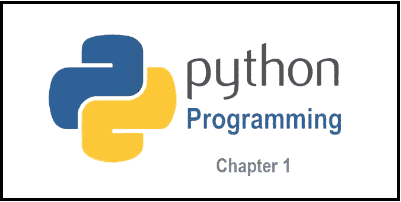

# Python 第 1 章:Python 编程中获取输入和输出的方法类型

> 原文：<https://levelup.gitconnected.com/python-chapter-1-type-of-methods-to-take-input-and-output-in-python-programming-3a5687c509ad>



图片来源:SpringPeople

在我们之前的文章——《[**为什么你应该学习 Python 编程以及如何作为初学者开始**](https://dilipkashyap15.medium.com/why-you-should-learn-python-programming-and-how-to-start-as-a-beginner-879debce69bc) 》中，我们已经看到了 Python 编程语言是如何在多个平台上发展和使用的。

我们将一章一章地继续学习 Python 编程。在第一章中，我们研究了 Python 编程中输入和输出的类型。

让我们从这里看主题

## **1。如何在 Python 中接受用户的输入:**

我们将看到数据类型的输入方法及其语法。

**例 1:接受用户的输入。**

```
# Taking input from the user
Name = input("Enter your Full Name: ")# Output
print("Hello, " + Name)# With the following syntax you can type of inputs
print(type(name))Output Screen:
Enter your Full Name: John
Hello, John
<class 'str**'**>
```

**示例 Python 中的整数输入:**如果您希望接受整数数据类型的输入，那么您可以使用以下语法。

```
# Taking input from the user as integer
number = int(input("Enter any Numeric Digit: "))add = number + 10# Output
print(add)Output screen: (if digit is = 10)
Enter any Numeric Digit: 10
20
```

在上面的例子中，您可以通过使用它们的关键字接受其他数据类型值的输入，如:Float、double 和 String。

## **2。如何在 Python 中显示输出:**

现在，我们将看到 Python 编程中的输出方法。Python 提供了 **print()** 函数来显示标准输出设备的输出。

**示例 1:打印功能的使用**

```
# Print function examples# print() method
print("Hello World!")
Output: Hello World!# print syntax for disabling the spaces feature
print('H', 'E', 'LL', 'O')
Output: H E LL O 
```

在上面的例子中，我们可以看到，在 print 2 语句中，所有字母之间有一个空格，在 print 语句中，它总是在字符串的末尾添加一个新的行字符。这是因为在每个字母之后会打印出 **sep(，)**参数，并且在字符串的末尾会打印出最后一个参数。让我们试着改变这个 **sep(，)**，完成参数。

**例 2:在打印语句中使用 *sep(，)*和 *end* 参数。**

```
# Python program to demonstrate
# print() method
print("ABC", end = "@")# code for disabling the softspace feature
print('A', 'B', 'C', sep="#")Output Screen: 
ABC@A#B#C
```

在上面的例子中，我们刚刚借助它们的关键字替换了 end 和 **sep** (，)参数。

**例 3:** 使用 **{}** 与 print 语句一起得到输出。我们可以使用字母**格式的**，在打开引号或三个引号之前以 **f 或 F** 开始字母单元。在本系列中，我们可以在 **{and}** 之间编写 Python 表达式，它可以引用变量或任何实数值。

```
# Declaring a variable
name = "ABC"# Output
print(f'Hello {name}! How are you?')Output Screen:
Hello ABC! How are you?
```

**例 4:** 我们还可以使用 **format()** 函数来格式化我们的输出，使它看起来更像样。花括号 **{ }** 充当占位符。我们可以指定变量在输出中出现的顺序。

```
# Initializing variables
a = 20
b = 10# addition
sum = a + b# subtraction
sub = a- b# Output
print('The value of a is {} and b is {}'.format(a,b))print('{2} is the sum of {0} and {1}'.format(a,b,sum))print('{sub_value} is the subtraction of {value_a} and {value_b}'.format(value_a = a , value_b = b, sub_value = sub))Output Screen: 
The value of a is 20 and b is 10
30 is the sum of 20 and 10
10 is the subtraction of 20 and 10
```

**例 5:** 使用 **%** 运算符**。**我们可以使用 **'% '运算符**。%值被替换为零个或多个元素值。使用%的格式类似于 C 编程语言中的' **printf** '的格式。

*   %d —整数
*   %f —浮点型
*   %s —字符串
*   %x —十六进制
*   %o —八进制

```
# Taking input from the user
num = int(input("Enter a value: "))add = num + 5# Output
print("The sum is %d" %add)Output Screen: 
Enter a value: 50
The sum is 55
```

如果你有兴趣学习 Google Apps 脚本和自动化你的 Google Workspace？必须试试这本**电子书**上的“ [**谷歌应用套件脚本:初学者指南**](https://www.amazon.com/dp/B0BTJC9X5R) ”

如果您能在 medium platform 上关注并投票支持更多这样的学习文章，我将非常高兴。非常感谢！

如有任何疑问，请发送电子邮件至:[**dilipkashyap.sd@gmail.com**](mailto:dilipkashyap.sd@gmail.com)