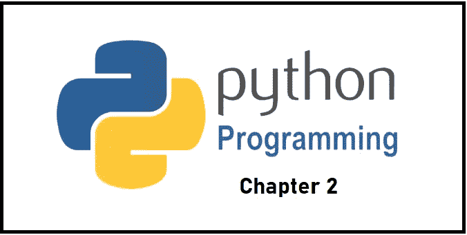

# Python 第 2 章:Python 中的列表

> 原文：<https://levelup.gitconnected.com/python-chapter-2-lists-in-python-39a38b81f3c0>



Python 第 2 章

在本文中，我们将学习 Python 编程中的列表，我们将学习 Python 列表的所有内容，例如:

1.  列出方法
2.  创建列表
3.  访问列表元素
4.  负索引
5.  列表切片
6.  更改/添加列表元素
7.  移除/删除列表中的元素

许多其他的列表操作都有例子的帮助。

## **用 Python 列出方法**

Python 中有许多有用的列表方法，使得使用列表变得非常容易。现在让我们看看一些常用的列表方法。

1.  **append():** 将一个元素添加到列表的末尾。

```
currencies = ['Rupees', 'Dollar', 'Pound']# append 'Yen' to the list
currencies.append('Yen')print(currencies)# Output: ['Rupees', 'Dollar', 'Pound', 'Yen']
```

**2。extend():** 将一个列表的所有元素添加到另一个列表中。

```
# create a list
numbers = [2, 3, 5]# create another list
extend_numbers = [1, 4]# add all elements of numbers to before the extend_numbers list
extend_numbers.extend(numbers)print('List after extend():', numbers)# Output: List after extend(): [1, 4, 2, 3, 5]
```

**3。insert():** 在定义的索引处插入一个项目。

```
# create a list of vowels
vowel = ['a', 'e', 'i', 'u']
index =   0    1    2    3# 'o' is inserted at index 3 (4th position)
vowel.insert(3, 'o')print('List:', vowel)# Output: List: ['a', 'e', 'i', 'o', 'u']
  index           0    1    2    3    4
```

**4。remove():** 从列表中删除项目。

```
# create a list
prime_numbers = [2, 3, 5, 7, 9, 11]# remove 9 from the list
prime_numbers.remove(9)# Updated prime_numbers List
print('Updated List: ', prime_numbers)# Output: Updated List:  [2, 3, 5, 7, 11]
```

**5。pop():** 返回并移除给定索引处的元素。

```
# create a list of prime numbers
prime_numbers = [2, 3, 5, 7]# remove the element at index 2
removed_element = prime_numbers.pop(2)print('Removed Element:', removed_element)
print('Updated List:', prime_numbers)# Output: 
# Removed Element: 5
# Updated List: [2, 3, 7]
```

**6。clear():** 从列表中删除所有项目。

```
prime_numbers = [2, 3, 5, 7, 9, 11]# remove all elements
prime_numbers.clear()# Updated prime_numbers List
print('List after clear():', prime_numbers)# Output: List after clear(): []
```

**7。index():** 返回第一个匹配项的索引。

```
animals = ['cat', 'dog', 'rabbit', 'horse']# get the index of 'dog'
index = animals.index('dog')print(index)# Output: 1
```

**8。count():** 返回列表中出现的项目的数量*(频率)*的计数，为其传递元素。

```
# create a list
numbers = [2, 3, 5, 2, 11, 2, 7]# check the count of 2
count = numbers.count(2)print('Count of 2:', count)# Output: Count of 2: 3
```

9。sort(): 按升序对列表中的项目进行排序。

```
prime_numbers = [11, 3, 7, 5, 2]# sorting the list in ascending order
prime_numbers.sort()print(prime_numbers)# Output: [2, 3, 5, 7, 11]
```

10。reverse(): 颠倒列表中项目的顺序。

```
# create a list of prime numbers
prime_numbers = [2, 3, 5, 7]# reverse the order of list elements
prime_numbers.reverse()print('Reversed List:', prime_numbers)# Output: Reversed List: [7, 5, 3, 2]
```

11。copy(): 返回列表的浅层副本。

```
# mixed list
prime_numbers = [2, 3, 5]# copying a list
numbers = prime_numbers.copy()print('Copied List:', numbers)# Output: Copied List: [2, 3, 5]
```

# 创建 Python 列表

在 Python 编程语言中，可以通过将元素放在方括号`[]`中，用逗号分隔来创建列表。

```
#Example:# list of integers
my_list = [1, 2, 3]
```

一个列表在 **[ ]** *(方括号)*中可以有任意数量的项，它们可以是不同的类型(整数、浮点、字符串等)。).

```
# empty list
my_list = []# list with mixed data types
my_list = [1, "Hello", 3.4]
```

一个列表也可以有另一个列表作为项目。这称为嵌套列表。

```
# nested list
my_list = ["mouse", [8, 4, 6], ['a']]
```

# 访问列表元素

有很多方法可以访问列表中的元素。

**基于列表索引的访问:**我们可以使用索引操作符`[]`来访问列表中的项目。在 Python 中，索引从 0 开始。因此，具有 4 个元素的列表将具有从 0 到 3 的索引 *{0，1，2，3}* 。

试图访问除此之外的索引将引发一个**索引错误**。索引必须是整数。我们不能使用 float 或其他类型，这将导致**类型错误**。使用嵌套索引来访问嵌套列表。

```
my_list = ['a', 'b', 'c', 'd', 'e']# first item
print(my_list[0])  # a# third item
print(my_list[2])  # c# fifth item
print(my_list[4])  # e# Nested List
n_list = ["Hello", [2, 0, 1, 5]]# Nested indexing
print(n_list[0][1]) 
#output  error occurred due to there is no properprint(n_list[1][3])
#output 5  (as we have list at index 1 and in that list also have index 3)# Error! Only integer can be used for indexing
print(my_list[4.0])
```

# 负索引

Python 允许对其序列进行负索引。索引-1 指的是最后一项，-2 指的是倒数第二项，就像— [-4，-3，-2，-1]。

```
# Negative indexing in lists
my_list = ['p', 'r', 'o', 'b', 'e']
index       -5  -4   -3    -2   -1# last item
print(my_list[-1])#output e# fifth last item
print(my_list[-5])#output:p
```

# Python 中的列表切片

我们可以通过使用切片操作符`:`来访问或切片列表中的一系列条目。

```
# List slicing in Pythonmy_list = ['p','r','o','g','r','a','m','i','z']# elements from index 2 to index 4
print(my_list[2:5])# elements from index 5 to end
print(my_list[5:])# elements beginning to end
print(my_list[:])#output
['o', 'g', 'r']
['a', 'm', 'i', 'z']
['p', 'r', 'o', 'g', 'r', 'a', 'm', 'i', 'z']
```

**注意:**当我们对列表进行切片时，开始索引是包含性的，而结束索引是排他性的。例如，`my_list[2:5]`返回一个列表，其元素从索引 2、3 和 4 开始，而不是从索引 5 开始。

# 更改/添加列表元素

列表是可变的，这意味着它们的元素可以像字符串或元组一样被改变。我们可以使用赋值操作符`=`来改变/替换一个条目，给出一个列表或一系列条目的索引。

```
# Correcting mistake values in a list
odd = [2, 4, 6, 8]# change the 1st item    
odd[0] = 1 print(odd)
#output [1, 4, 6, 8]# change 2nd to 4th items
odd[1:4] = [3, 5, 7] print(odd)
#output [1, 3, 5, 7]
```

# 移除/删除列表元素

我们可以使用 Python del 语句从列表中移除/删除一个或多个项目。它甚至可以完全删除列表。

```
# Deleting list items
my_list = ['p', 'r', 'o', 'b', 'l', 'e', 'm']# delete one item
del my_list[2]print(my_list)
#output ['p', 'r', 'b', 'l', 'e', 'm']# delete multiple items
del my_list[1:5]print(my_list)
#output ['p', 'm']# delete the entire list
del my_list# Error: List not defined
print(my_list)#output
Traceback (most recent call last):
  File "<string>", line 18, in <module>
NameError: name 'my_list' is not defined
```

**注意:**在 Python 中，要删除整个列表，我们必须提供索引的范围，或者我们可以使用如下空的开始和结束范围 **my_list[:]，**来删除整个列表。我们可以使用`remove()`删除给定的条目，或者使用`pop()`删除给定索引处的条目。

```
# deleting all elements
del my_list[:]

# Output: []
print(my_list)
```

如果没有提供索引，`pop()`方法将移除并返回最后一项。这有助于我们将列表实现为堆栈(先进后出的数据结构)。

如果我们必须清空整个列表，我们也可以使用`clear()`方法。

```
my_list.clear()

# Output: []
print(my_list)
```

如果你有兴趣学习 Google Apps 脚本和自动化你的 Google Workspace？必须试试这本**电子书**上的“ [**谷歌应用套件脚本:初学者指南**](https://www.amazon.com/dp/B0BTJC9X5R) ”

如果您能在 medium platform 上关注并投票支持更多这样的学习文章，我将非常高兴。非常感谢！

如有任何疑问，请发送电子邮件至:[**dilipkashyap.sd@gmail.com**](mailto:dilipkashyap.sd@gmail.com)