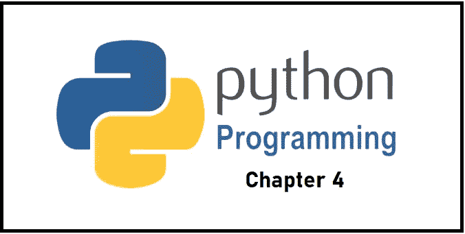

# Python 第 4 章:Python 中的字典

> 原文：<https://levelup.gitconnected.com/python-chapter-3-dictionary-in-python-4ada1d04e78d>



在本文中，我们将学习 Python 中的字典。在编写 Python 代码时，我们学习了它的实现、用途和特性。

## 词典

Python 中的字典是数据值的随机集合，用于将数据值存储为映射，它包含键:值配对。字典中提供了键值来使它变得更好。字典元素在 **{}** 括号内赋值。

```
Dict = {1: 'Hello', 2: 'World', 3: 'Welcome'}
```

**注意:**在 Python 中，字典键区分大小写，这意味着大写字母和小写字母将被区别对待。

## 创建词典

这里，我们将创建具有不同键类型的字典。让我们看看下面的例子。

1.  **带整数键的字典:**

```
Dict = {1: 'Hello', 2: 'World', 3: 'How are you?'}
print(Dict)#Output: 
{1: 'Hello', 2: 'World', 3: 'How are you?'}
```

2.**不同键类型的字典:**

```
# Creating a DictionaryDict = {'Name': 'Dilip', 1: [1, 2, 3, 4]}
print(Dict)#Output:
{'Name': 'Dilip', 1: [1, 2, 3, 4]}
```

## 嵌套词典

嵌套字典只不过是一个字典，其中有多个字典。我们来看看创建后的样子。

```
# Creating a Nested Dictionary
Dict = {1: 'Hello', 2: 'World',
  3:{'A' : 'Welcome', 'B' : 'To', 'C' : 'Blog'}}print(Dict)#Output:
{1: 'Hello', 2: 'World', 3: {'A': 'Welcome', 'B': 'To', 'C': 'Blog'}}
```

**解释:**上面的字典赋值如下。

```
1 => Hello
2 => World
3 => A => Welcome
3 => B => To
3 => C => Blog
```

# 如何向字典中添加元素

在 Python 字典中，可以通过多种方式添加元素。通过定义值和键**，可以一次将一个值添加到字典中，例如 Dict [Key] = 'Price'** 。对当前词典的修订可以使用内置的检查方法来完成。嵌套的键值也可以放在现有的字典中。

**注意:**如果键-值对存在，那么它将被更新，否则它将为字典创建新的对。

**示例:**请查找各种向字典添加元素的示例。

```
# Creating an empty Dictionary
Dict = {}
print("Empty Dictionary: ")
print(Dict)# Adding elements one at a time
Dict[0] = 'Hello'
Dict[2] = 'World'
Dict[3] = 1
print("\nDictionary after adding 3 elements: ")
print(Dict)# Adding set of values
# to a single Key
Dict['Value_set'] = 2, 3, 4
print("\nDictionary after adding 3 elements: ")
print(Dict)# Updating existing Key's Value
Dict[2] = 'Welcome'
print("\nUpdated key value: ")
print(Dict)# Adding Nested Key value to Dictionary
Dict[5] = {'Nested' :{'1' : 'Life', '2' : 'Happy'}}
print("\nAdding a Nested Key: ")
print(Dict)
```

# 如何访问字典的元素

我们可以通过关键字访问字典中的一个元素。让我们看一个例子。

```
# Python program to demonstrate
# accessing a element from a Dictionary# Creating a Dictionary
Dict = {1: 'Hello', 'name': 'World', 3: 'Happy'}# accessing a element using key
print("Accessing a element using key:")
print(Dict['name'])#Output: 
**World**# accessing a element using key
print("Accessing a element using key:")
print(Dict[1])#Output: 
**Hello**
```

# 如何访问嵌套字典的元素

我们可以使用嵌套键来访问嵌套字典的值，这看起来像一个 2D 数组。让我们看一个样品。

```
# Creating a Dictionary
Dict = {'Dict1': {1: 'Hello'},
  'Dict2': {'Name': 'World'}}# Accessing element using key
print(Dict['Dict1'])
print(Dict['Dict1'][1])
print(Dict['Dict2']['Name'])#Output:
{1: 'Hello'}
Hello
World
```

# 字典方法

**clear() —** 从字典中删除所有元素

**copy() —** 返回字典的副本

**get() —** 返回指定键的值

**items() —** 返回包含每个键值对的元组的列表

**keys() —** 返回包含字典关键字的列表

**pop()** —用指定的键删除元素

**popitem() —** 删除最后插入的键值对

**update() —** 用指定的键值对更新字典

**values()** —返回字典中所有值的列表

**使用这些方法的例子:**

```
# demo for all dictionary methods
dict1={1:"Python",2:"Java",3:"KIRBY",4:"PHP"}
#copy() methoddict2=dict1.copy()
print(dict2)#clear() method
dict1.clear()
print(dict1)#get() method
print(dict2.get(1))#items() method
print(dict2.items())#keys() method
print(dict2.keys())#pop() method
dict2.pop(4)
print(dict2)#popitem() method
dict2.popitem()
print(dict2)#update() method
dict2.update({3:"Scala"})
print(dict2)# values() method
print(dict2.values())
```

如果你有兴趣学习 Google Apps 脚本和自动化你的 Google Workspace？一定要试试这本**电子书**上的 [**谷歌应用套件脚本:初学者指南**](https://www.amazon.com/dp/B0BTJC9X5R)

如果您**在 medium platform 上关注并投票支持**更多这样的学习文章，我会很高兴。非常感谢！