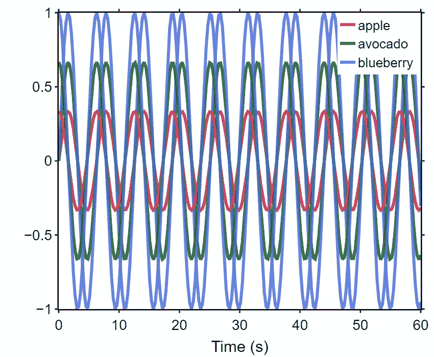
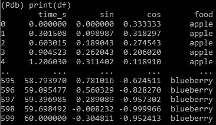
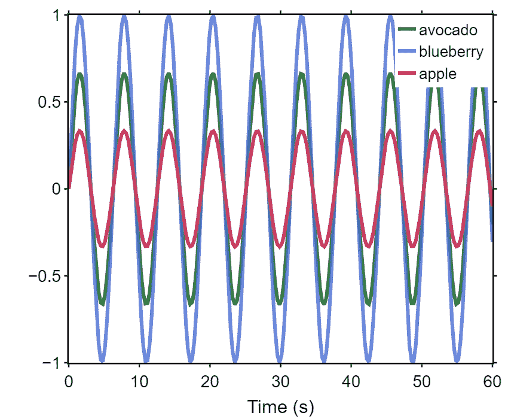
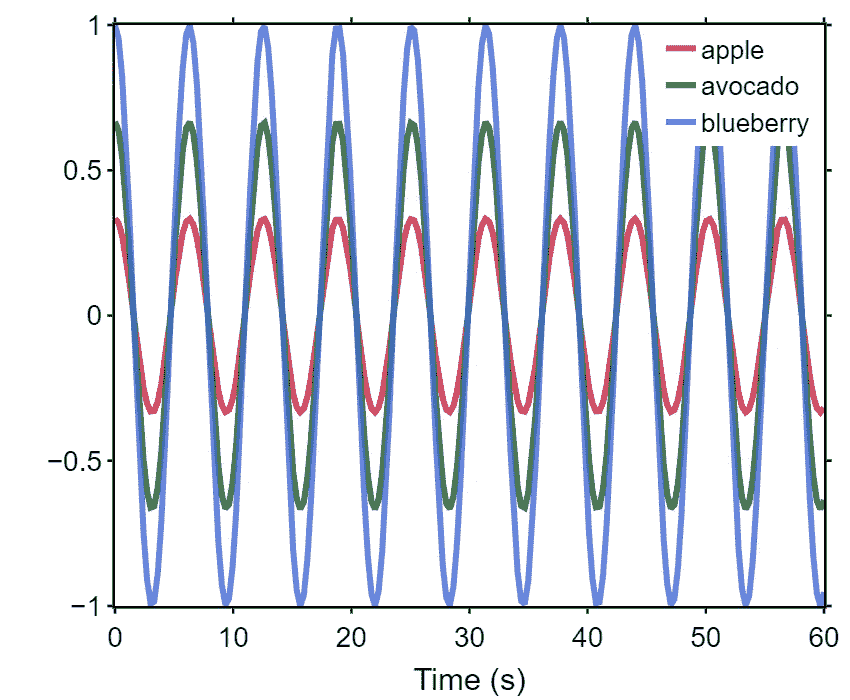

# Python 类标准化 Plotly 图形格式

> 原文：<https://levelup.gitconnected.com/python-classes-to-standardize-plotly-figure-formatting-123fe35c8d2d>



最近，每当我开始为一个新项目分析数据时，我都习惯于**创建一个新的类来生成我所有的数据，以标准化格式**。这个类将包括颜色、标记样式、字体样式、图形大小等。，以确保我从数据集制作的每个图形都具有一致的格式，并且可以快速生成。

这里有一个快速教程，教你如何为自己设置一个！本教程假设你已经在你的电脑上安装了 [Plotly](https://plotly.com/python/getting-started/) 和 [Anaconda](https://www.anaconda.com/products/individual) 。

首先，我将从创建一个类开始，然后演示如何从该类初始化将用于生成不同图形的对象。

**打开一个新文件，命名为“plotter.py”。在这里，我们将编写一个简单的类，它采用一个熊猫数据框和一些可选参数来初始化一个绘图图形。**注意，对于大多数方法的输入参数，我设置了一个默认值。如果你认为你会得到相似类型的数字，这将使事情变得更容易。在本例中，我们将使用包含以下标签的数据框:`apple`、`avocado`和`blueberry`。

```
import plotly.graph_objects as go
from plotly.subplots import make_subplots
import pandas as pd
import numpy as npclass Plotter: """
    The Plotter class produces Plotly figures that are correctly
    formatted for a certain data analysis for project
    """ def __init__(self,df,rows=1,cols=1,legend=dict(x=0.77,y=1)): """
        initialize oject attributes and create figure
        rows = number of rows of plots
        cols = number of cols of plots
        the rows and cols default is 1, but can be changed to add
        subplots
        """ self.df = df
        self.foods = list(set(df['food']))
        self.mode = 'lines' # colors for each item
        self.colors = {'apple': 'crimson',
                       'avocado': 'darkgreen',
                       'blueberry': 'royalblue'
                       } # markers for each food
        self.marker_dict = {'apple': 'square',
                            'avocado': 'circle',
                            'blueberry': 'x'
                            } # misc. figure parameters
        self.params = {'linewidth': 6,
                       'mrkrsize': 10,
                       'opacity': 0.8,
                       'width': 850,
                       'length': 700
                       } # font for figure labels and legend
        self.lab_dict = dict(family='Arial',
                             size=26,
                             color='black'
                             ) # font for number labeling on axes
        self.tick_dict = dict(family='Arial',
                              size=24,
                              color='black'
                              ) # initialize figure as subplots
        self.fig = make_subplots(rows=rows,
                                 cols=cols
                                 ) # set font, borders, size, background color, 
        # and legend  position for figure
        self.fig.update_layout(font=self.lab_dict,
                               margin=dict(r=20,t=20,b=10),
                               autosize=False,
                               width=850,
                               height=700,
                               plot_bgcolor='white',
                               legend=legend
                               )
```

然后，我们向绘图仪类添加一个**方法，该方法向我们初始化的图形**添加轨迹(即绘制数据):

```
 def plot(self,x_col,y_col,row=1,col=1,showlegend=True): """
        plot data on Plotly figure for all foods
        x_col = column from dataframe to plot on x-xaxis
        y_col = column from dataframe to plot on y-xaxis
        row/col = which plot the trace should be added to
        showlegend = boolean; show legend on graph
        """ for food in self.foods: x = self.df[x_col].loc[self.df['food']==food]
            y = self.df[y_col].loc[self.df['food']==food] # add trace to figure
            self.fig.add_trace(go.Scatter(x=x,
                               y=y,
                               showlegend=showlegend,
                               mode=self.mode,
                               name=food,
                               line=dict(
                                    width=self.params['linewidth']
                                         ),
                               opacity=self.params['opacity'],
                               marker=dict(
                                      color=self.colors[food],
                                      symbol=self.marker_dict[food],
                                      size=self.params['mrkrsize'],
                                           )
                                          ),
                               row=row,
                               col=col
                               )
```

接下来，我们可以**将方法添加到绘图仪类，该类以标准化的方式格式化 x 和 y 轴**:

```
 def update_xaxis(self,xlabel='Time',xlim=[0,60],row=1,col=1): """
        format x-axis by adding axis lines, ticks, etc.
        xlabel = label for x-axis (default is Time (s))
        xlim = range for x-axis (default is 0 to 60)
        row/col = which graph to format
        """ self.fig.update_xaxes(title_text=xlabel,
                              range=xlim,
                              showline=True,
                              linecolor= 'black',
                              linewidth=2.4,
                              showticklabels=True,
                              ticks= 'outside',
                              mirror='allticks',
                              tickwidth=2.4,
                              tickcolor='black',
                              tickfont=self.tick_dict,
                              row=row,
                              col=col
                              ) def update_yaxis(self,ylabel='',ylim=[-1,1],row=1,col=1): """
        format y-axis by adding axis lines, ticks, etc.
        ylabel = label for y-axis (default is blank)
        ylim = range for y-axis  (default is -1 to 1)
        row/col = which graph to format
        """ self.fig.update_yaxes(title_text=ylabel,
                              range=ylim,
                              showline= True,
                              linecolor= 'black',
                              linewidth=2.4,
                              showticklabels=True,
                              ticks= 'outside',
                              mirror='allticks',
                              tickwidth=2.4,
                              tickcolor='black',
                              tickfont=self.tick_dict,
                              row=row,
                              col=col
                              )
```

## 现在我们的类已经写好了，问题是“我们如何使用它？”。我们需要从类中创建对象，向图形添加跟踪，然后显示图形。

这可以通过两种方式之一实现:

1.  通过将以下代码添加到包含您的类的脚本的末尾，在脚本中:

```
def main(): """
    generate an example dataframe, 
    then initialize the Plotter object
    """ # generating dataframe
    foods=['apple','avocado','blueberry']
    df=pd.DataFrame() for food in foods:
        time_s = np.linspace(0,60,200)
        sin = np.sin(time_s)*(foods.index(food)+1)/3
        cos = np.cos(time_s)*(foods.index(food)+1)/3
        temp_df = pd.DataFrame(dict(time_s=time_s,
                                    sin=sin,
                                    cos=cos
                                    )
                               ) temp_df['food'] = food
        df = pd.concat([df,temp_df],
                     ignore_index=True
                     ) # initialize Plotter object and format axes 
    fig = Plotter(df)
    fig.update_xaxis()
    fig.update_yaxis()if __name__ == '__main__':
    main()
```

2.将上述代码添加到与 plotter.py 同目录的新文件中，并在新文件的开头导入 pandas、NumPy 和 plotter 类(`from plotter import Plotter`)。然后，我们可以在这个新文件中使用绘图仪类的实例，将绘图仪对象初始化从包含该类的脚本中分离出来；这是我喜欢的帮助组织项目的方式。

无论您在哪里添加/执行上述代码，我们都将得到如下所示的数据框，我们可以用它来测试我们的绘图仪类。



既然我们已经通过编写一个类完成了所有繁重的工作，那么我们只需在`main()`函数的末尾写几行代码，就可以轻松地从我们的数据中得出数字。

首先，我们尝试使用以下代码在我们的数据框架中绘制正弦波:

```
 fig.plot('time_s','sin')
    fig.fig.show()
```



现在，我们可以轻松地更改一行代码，生成相同的曲线图，余弦值在 y 轴上:

```
 fig.plot('time_s','cos')
    fig.fig.show()
```



或者，我们甚至可以写出正弦和余弦曲线:

```
 fig.plot('time_s','sin')
    fig.plot('time_s','cos',showlegend=False)
    fig.fig.show()
```


可以想象，对于更复杂的数据集，这种方法可以扩展到能够快速和标准化地绘制许多不同的变量。此外，使用类可以帮助减少重复代码的数量，并通过创建派生的子类来扩展基类中的功能，从而为您提供更多的灵活性。