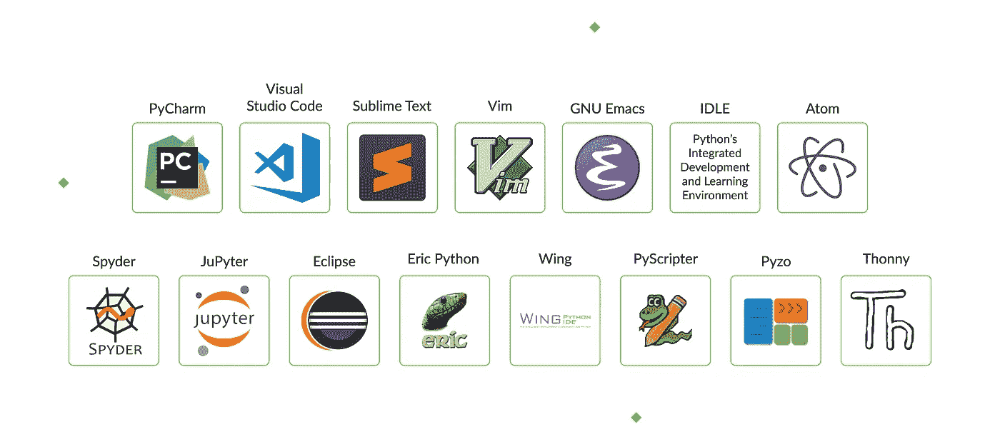

# Python 兼容的 IDE:它是什么，为什么需要它？

> 原文：<https://levelup.gitconnected.com/python-compatible-ides-what-is-it-and-why-do-you-need-it-649abdce5871>

在 Python 中，没有比使用 IDE(集成开发环境)更好的构建方式了。它们不仅使你的工作变得更容易，也更有逻辑性；它们还增强了编码体验和效率。

当然，每个人都知道这个。然而，问题是，在有这么多选择的情况下，如何挑选最适合 Python 开发的环境呢？这经常成为初学者不得不面对的问题。

在本文中，我们将概述在编码人员中流行的 Python 最佳 ide，以及其他一些值得考虑的选项。但是在我们深入研究之前，让我们先解释一下 IDE 是什么意思。

# 什么是 IDE，为什么需要它？

集成开发环境是开发人员用来创建程序的软件包。它旨在通过将密切相关的组件与简单的用户界面结合起来，最大限度地提高程序员的生产力。本质上，它是一个改进创建、测试和调试源代码过程的工具——它使工作变得更容易。

ide 使用的一些工具包括:

有一个看似相似的术语集成开发环境——代码编辑器。我们先来讨论一下这两种工具的区别和共性。

# 什么是代码编辑器？

代码编辑器只是一个文本编辑器，它突出显示代码的语法和格式。高级代码编辑器可以开发和修改代码。

# ide 和代码编辑器的独特功能

ide 和代码编辑器有什么共同的品质？它们使开发人员能够:

*   存储并重新打开脚本
*   在上面运行他们的代码
*   调试
*   突出显示语法。

# Python 开发人员中最流行的 ide

现在您已经对开发工具有了基本的了解，包括它们所拥有的品质，我们可以更仔细地看看几个受欢迎的例子。

# 皮查姆

[下载链接](https://www.jetbrains.com/pycharm/download/)

PyCharm 是由著名的软件开发公司 JetBrains 开发的。当谈到 AI 和 ML 时，它被认为是 Python 的最佳 ide 之一。最重要的是，Pycharm 合并了它的库——如 Matplotlib 和 NumPy——使开发人员能够探索其他工作选项。

**兼容性** : Windows、MacOS、Linux

**顶级插件和特性**:

*   内置开发人员工具
*   远程开发能力
*   实时编辑模式
*   IPython 笔记本。

**优点**:

*   PyCharm 支持 web 开发框架，包括 Pyramid、Flask 和 Django。
*   提供智能代码功能，以便更精确、更快速地修复错误。
*   由于 Docker 和 vagger 连接以及 ssh 终端，允许在远程主机上开发。

**缺点**:

*   界面可能看起来很大。
*   专业版似乎太贵了。

# Visual Studio 代码

[下载链接](https://code.visualstudio.com/Download)

Visual Studio 代码有时会被误认为是 Visual Studio IDE，这在 Python 世界中并不是一个常见的工具。VS Code 是一个完整的代码编辑器，具有很好的特性，许多编码员说它是最好的 IDE 编辑器。

**兼容性** : Windows，Linux，Mac OS。

**顶级插件和功能**:

*   内置 git
*   定制工具的扩展
*   调试断点
*   交互式控制台。

**优点**:

*   它的电子框架允许你在几乎所有的平台上使用 VS 代码。
*   您可以直接从编辑器中调试代码，
*   支持多个键盘快捷键，加快编码速度。

**缺点**:

*   用于调试的有限功能。
*   没有内置模板。

# 崇高的文本

[下载链接](https://www.sublimetext.com/)

Sublime Text 被认为是最好的 Python 编辑器，因为它简单、通用、方便。它被大多数程序员广泛使用，并且跨不同的平台。

**兼容性** : Windows、Linux、Mac OS。

**顶级插件和特性**:

*   轻松导航，实现高性能
*   支持不同的软件包来定制编辑器
*   仅用一个关键字复制公共代码的代码片段
*   即时项目切换和分割编辑。

**优点**:

*   使用不同的标记语言。
*   使用户能够选择他们想要处理的项目。
*   附带了一个关键工具，可以对类和函数进行广泛的索引。
*   为高性能提供强大的 API 和有组织的生态系统。

**缺点**:

*   对初学者来说有点高级
*   它的 git 插件不是很强大。

# VI/Vim

[下载链接](https://www.vim.org/)

在我们的 Python 最佳 IDE 工具列表中，Vim 名列前五。它是一个模态编辑器，将文件查看和文件编辑分开。它比最初的 Vi 前进了一大步，拥有更强大的功能。

**兼容性** : Windows、Linux、Mac OS、IOS、Android、UNIX、AmigaOS、MorphOS。

**顶级插件和特性**:

*   允许您执行 Python 中几乎所有编程任务的脚本。
*   更好的标签导航。
*   内置基本单词补全功能。

**优点**:

*   它有一个键盘接口来提高效率。
*   它支持许多插件(例如，版本控制、文件管理)。
*   可以通过。vimrc 文件(例如，突出显示搜索结果。

**缺点**:

*   界面可能看起来很笨拙；有些开发者觉得用起来不方便。
*   它的模态编辑器可能需要用户花时间来学习。

# GNU Emacs

[下载链接](https://www.gnu.org/software/emacs/emacs.html)

GNU Emacs 还争夺最佳 Python 编辑器的头衔。它通常被描述为一个可扩展的、自我文档化的编辑器，具有移动显示功能。尽管 Emacs 在业界并不完全是新的，但它仍在不断升级以满足开发人员的需求。

**兼容性** : Windows、Linux、Mac OS、IOS、Android、UNIX、AmigaOS、MorphOS。

**顶级插件和功能**:

*   它采用 Lisp 编码语言
*   语法着色
*   Unicode 支持。

**优点**:

*   作为第二语言，Lisp 能让开发者表现得更好。
*   Emacs 兼容许多不同的平台。
*   它支持开发人员可以使用的各种定制脚本。

**缺点**:

*   用户可能需要多花一点时间来学习编辑器复杂的定制过程。
*   它比其他一些 ide 使用起来更复杂。

# 闲置的

[下载链接](https://docs.python.org/3/library/idle.html)

空闲代码编辑器在学生中很受欢迎，因为它是与 Python 一起提供的。它操作简单，通用，支持不同的设备。难怪他们称之为一次性 IDE，因为它有助于在使用更复杂的工具之前学习基础知识。

**兼容性** : Windows、Linux、Mac OS。

**具有特色的顶级插件**:

*   tkinter GUI 工具包
*   多窗口界面
*   配置有对话框、浏览器和其他配置。

**优点**:

*   IDLE 允许用户突出显示错误，自动编码，并准确识别它们。
*   IDLE 有一个更轻的 Python 外壳。
*   其内置的校正功能提高了性能。
*   它使用户能够在编辑器中搜索和替换文件。

**缺点**:

*   IDLE 不允许复制到资料库。
*   脚本不能超过 100 行代码。

# ML、AI 和 BD 的最佳 Python 兼容 ide

Python 是机器学习、人工智能、大数据和相关领域的首选语言之一。我们想专门用一个单独的部分来介绍在这些领域适合 Python 开发的 ide。

# 原子

[下载链接](https://atom.io/)

Atom 是一个开源编辑器，几乎兼容所有编程语言，如 PHP、Java 等。它定期更新，可靠，可以普遍使用。Github 构建了具有强大功能的 Atom，提供了良好的编程体验，包括插件，如用于 SQL 查询的包、Markdown Preview Plus，用于编辑、可视化和呈现 LaTeX 表达式。

# Spyder

[下载链接](https://www.spyder-ide.org/)

Spyder 专为数据科学而生。它是开源的，并与许多平台兼容，这使它成为 IDE 初学者的更好选择。它合并了它的关键库——比如 NumPy、Matplotlib 和 SciPy——以实现完美的开发。

# JuPyter/IPython 笔记本

[下载链接](https://jupyter.org/)

Jupyter 是基于网络的，允许开发者构建和操作脚本或笔记本。相对更简单，更人性化。Jupyter 还使用 Seaborn 和 Matplotlib 进行数据可视化。

您可能还喜欢:

 [## Python 芹菜食谱:小工具，大可能性

### Python 社区中的每个人都至少听说过一次芹菜，甚至可能已经使用过它了…

djangostars.com](https://djangostars.com/blog/the-python-celery-cookbook-small-tool-big-possibilities/?utm_source=levelup.gitconnected.com&utm_medium=medium&utm_campaign=Python-compatible%20IDE&utm_content=you%20may%20also%20like)  [## 配置 Django 设置:最佳实践

### 本文面向使用 Django 框架的工程师。它对配置 Django 有深刻的见解…

djangostars.com](https://djangostars.com/blog/configuring-django-settings-best-practices/?utm_source=levelup.gitconnected.com&utm_medium=medium&utm_campaign=Python-compatible%20IDE&utm_content=you%20may%20also%20like) 

# Python 开发的其他 ide

这里还有几个不太为人所知或不太受欢迎，但仍然值得考虑的 ide。

# Eclipse + PyDev

Eclipse 是一个开源编辑器，也是适用于 Windows 的 Python IDEs 之一。它的扩展和插件集合非常广泛，足以构建几乎任何你想要的东西。与 PyDev 扩展一起，它允许智能调试并提高代码质量。

# 埃里克·派森

[下载链接](https://eric-ide.python-projects.org/)

Eric 是另一个不太受欢迎的 Python IDE，但它仍然是强大而高效的。无论是商业用途还是私人用途，Eric 都提供了适合多种用途的功能。它可以在所有平台上运行。

# 翼

[下载链接](https://wingware.com/)

Wing 是一个著名的 Python IDE，有助于智能编码。凭借其简单易用的编辑器、强大的调试器、远程编码的可能性、错误检查和许多其他功能，它值得您的关注，即使它没有在任何流行排行榜上名列前茅。

# PyScripter

[下载链接](https://sourceforge.net/projects/pyscripter/files/latest/download)

PyScripter 的目标是以其卓越的功能击败其他用于 Windows 的 Python IDEs。它也是一个很棒的用于 Mac 的 Python IDE，其商业版本可用于大多数编程语言。PyScripter 有丰富的特性集，但尽管如此，它还是相当轻量级的。

# Pyzo

[下载链接](https://pyzo.org/start.html)

Pyzo 是一个免费的开源编码工具，可以与任何 Python 解释器一起工作，甚至是 Conda 环境。它的两个突出特点是简单性和交互性。它很容易使用，即使是初学者。

# 托尼

[下载链接](https://thonny.org/)

Thonny 是由塔尔图大学开发的，考虑到了初学者的需求。它很容易开始使用，因为它的界面没有任何复杂或令人分心的功能。对于初学者来说，另一个好处是你可以一步一步地看到 Python 如何评估你的表达式。

# 结论

我们已经回顾了最好的 Python IDEs 和其他工具的丰富集合。决定使用哪种工具是一个方便和一个人的熟练程度的问题。当然，有像 PyCharm 这样的最受欢迎的工具，但是您可以尝试一些其他的工具，看看哪些最适合您。

有些 ide 比较适合新手，有些则比较专业；他们每个人都有其独特的功能和设计。我们整理了这份清单，给你多种选择。

> 这篇关于 [**Python IDE**](https://djangostars.com/blog/python-ide/?utm_source=levelup.gitconnected.com&utm_medium=medium&utm_campaign=Python-compatible%20IDE&utm_content=originally%20posted) 的文章，原载于 [**Django Stars 博客**](https://djangostars.com/blog/python-ide/?utm_source=levelup.gitconnected.com&utm_medium=Python-compatible%20IDE%3A%20What%20is%20It%20and%20Why%20Do%20You%20Need%20It%3F&utm_campaign=https%3A%2F%2Fdjangostars.com%2Fblog%2Fhow-much-it-costs-to-build-a-web-application%2F%3Futm_source%3Dmedium%26utm_med) 。

 [## 学习 Python -最佳 Python 教程(2019) | gitconnected

### Python 是一种动态的通用编程语言，在许多领域都有应用，包括 web 开发、数据科学…

gitconnected.com](https://gitconnected.com/learn/python)