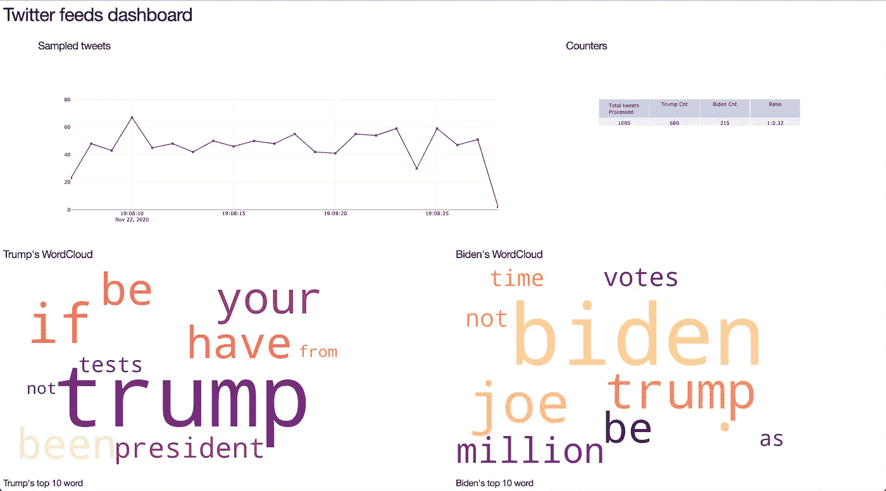
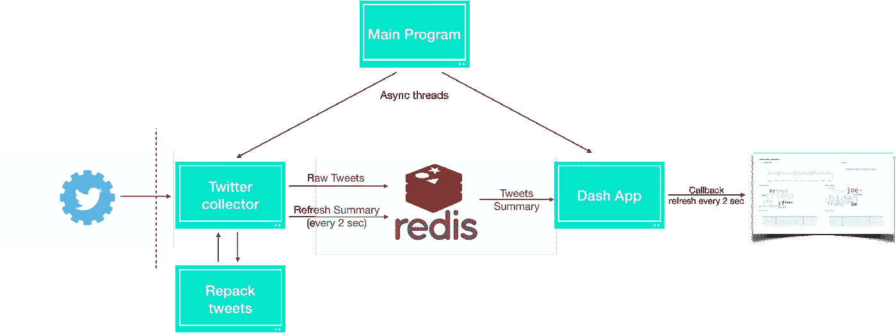
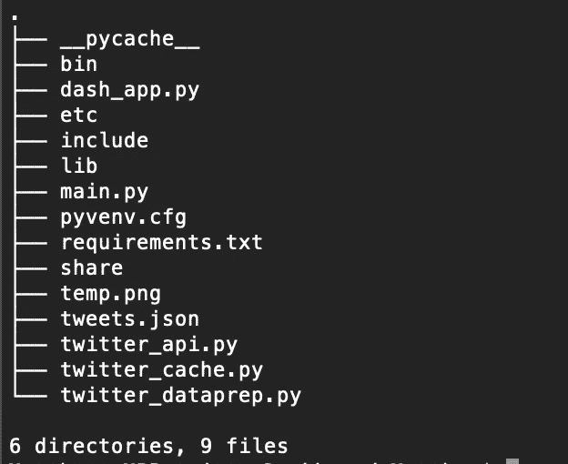
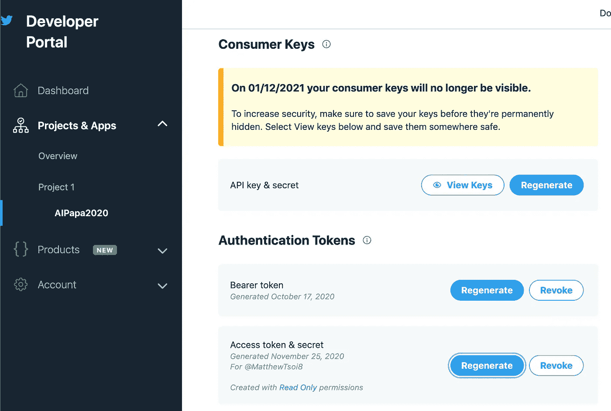
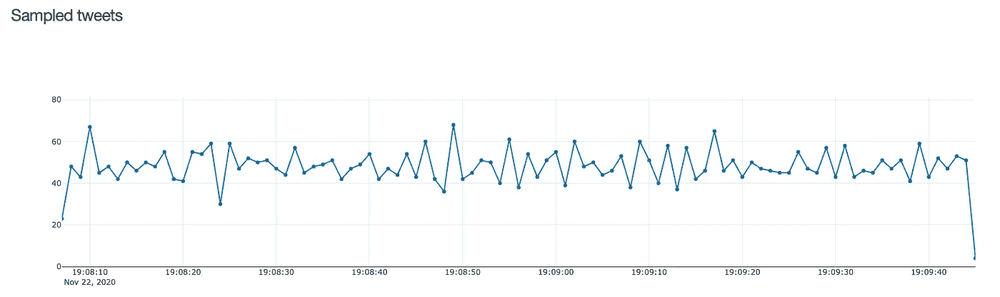
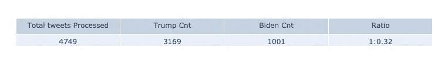

# 来自 Twitter 数据流 API 的 Python 仪表板

> 原文：<https://levelup.gitconnected.com/python-dashboard-from-twitter-data-stream-api-97354c1c34e6>

本文简单介绍了使用 Python 从数据流构建 web 仪表板的解决方案。我们使用 Twitter 数据流 API 从最热门的话题——2020 年美国总统选举中获取推文。

完整的 python 代码可在本文结尾获得。



我们将在整个项目/故事中学习以下内容

*   Twitter 流媒体 API
*   使用 Redis 服务器的数据缓存
*   从 Dash 应用程序和 ploty 构建仪表板

# 解决方案设计



高级解决方案设计

这个解决方案从启动一个应用了过滤器的 Twitter 收集器(通过 Tweepy 流模块)开始。然后，将传入的 JSON 数据重新打包成 Panda 数据帧和几个汇总计数器。

为了将数据流从我们的处理和仪表板 web 前端分离，所有收集的原始/汇总数据都保存在本地内存缓存服务器(Redis)中。

在仪表板端，我们正在构建一个简单的 Dash web 应用程序，它将从 Redis 缓存中检索数据。为了方便数据流属性，我们实现了一个回调函数来刷新 dashboard，以便最终用户可以在新的 tweets 进来时看到视觉保持更新。

项目文件



**Twitter API 和 Tweepy 流监听器**

要获得 Twitter 数据(免费)，你需要用一个有效的 Twitter 账户加入 Twitter 开发者计划。

[](https://developer.twitter.com/en/apply-for-access) [## 申请访问- Twitter 开发者

### 申请准入。Twitter APIs 和工具入门。所有新开发人员必须申请一个开发人员帐户…

developer.twitter.com](https://developer.twitter.com/en/apply-for-access) 

一旦得到 Twitter 的批准，你将能够从开发者门户生成你自己的消费者密钥，API 访问密钥。

你现在可以创建流来获得大约每秒 50 条推文。



Twitter 开发者门户

为了简化连接和流创建，使用一个公共模块 Tweepy 来启动流监听器，以异步检索新的 tweet，on_data 函数用于(1)将传入的 tweets json 存储为文件(2)存储到 dashboard 的内存缓存服务器上

```
class twitter_collector():def __init__(self,cache=’’):##Init stream object# Consumer key authentication(consumer_key,consumer_secret can be collected from our twitter developer profile)auth = OAuthHandler(‘o9nR34wWz2QYKWIX64VzRFgv6’, ‘bfmDRlKnhQsFTfiaq95GdNV4VJqUu20QA9BfYvQvVjlN8MTgOs’)# Access key authentication(access_token,access_token_secret can be collected from our twitter developer profile)auth.set_access_token(‘1278060518096244737-yRVyRQFWvKh3tUXUWvk2tIsNyVTSjT’, ‘etOFJPVTnxfkplTjDvprO0FfIq98vSHSASPmuYFubliXe’)# Set up the API with the authentication handlerapi = API(auth)# Instantiate the cache object for twitter stream#self.cache = tc.twitter_cache()# Instantiate the SListener objectself.listen = SListener(api=api)# Instantiate the Stream objectself.stream = Stream(auth, self.listen)def on_status(self, status):self.output.write(status)self.counter += 1#if self.counter >= 20000:if self.counter >= 1000:self.output.close()self.output = open(‘%s_%s.json’ % (self.fprefix, time.strftime(‘%Y%m%d-%H%M%S’)), ‘w’)self.counter = 0#print(self.counter)df_tweets=pd.DataFrame(dataprep.process_raw(status))#self.cache.add_df_cache(key=str(df_tweets.id.max()),df=df_tweets)self.cache.add_cache(ns=’twitter_cache:raw:’,key=str(df_tweets.id.max()),value=str(df_tweets.to_json(orient=’records’)))return
```

 [## 使用 Tweepy - tweepy 3.9.0 文档进行流式处理

### 在 tweepy 中，Tweepy 的实例。Stream 建立流会话并将消息路由到 StreamListener 实例…

docs.tweepy.org](http://docs.tweepy.org/en/latest/streaming_how_to.html) 

**外部缓存服务— Redis 内存缓存服务**

为了将数据处理从传入的 twitter 流中分离出来，所有的原始 tweets 数据都将存储在一个缓存服务器中——我们在这个项目中使用了 Redis。

我将缓存作为一个简单的类 twitter_cache

```
import redis # import redis module
import pyarrow as pa
import pandas as pd
import time
import jsonclass twitter_cache():
def __init__(self,host=’localhost’,port=6379):
self.r = redis.Redis(host=host, port=port, decode_responses=False)def add_cache(self,ns=’twitter_cache:’,key=’’, value=’’):
self.r.set(ns+key,value)
returndef add_df_cache(self,ns=’twitter_cache:’,key=’’,df=’’):
context = pa.default_serialization_context()
self.r.set(ns+key, context.serialize(df).to_buffer().to_pybytes())def get_cache(self,ns=’twitter_cache:’,key=’’):
return self.r.get(ns+key)def get_df_cache(self,ns=’twitter_cache:df:’,key=’’):
context = pa.default_serialization_context()
if type(key) is bytes:
get_key=key
else:
get_key=ns+key
if self.r.get(get_key):
return context.deserialize(self.r.get(get_key))
else:
return pd.DataFrame()
```

在 Redis 服务器的缓存设计中，您需要使用键值存储概念，或者 Redis 术语中的名称空间进行设计。

对于每个 Tweets 流，我们将原始数据放入名称空间为“twitter_cache:raw”的缓存中。并且处理后的数据将被存储为“twitter_cache_summary”。除了 Python 代码，您还可以使用 redis-cli 在本地检查您的 redis 服务器

[](https://redis.io/commands) [## 命令参考- Redis

### 命令信息命令名[命令名...]获取特定 Redis 命令详细信息的数组

redis.io](https://redis.io/commands) 

**数据可视化层**

一旦我们在 Redis 服务器中存储了所需的数据集，我们现在就可以构建可视化/仪表板了！dash_app.py 包含构建我们的仪表板所需的所有代码。

Dash 是一个快速高效的 python 模块，用于构建基于 web 的仪表板/报告。让我们看一些设计

1.  显示一段时间内推文数量的折线图

```
df_freq=collector.listen.cache.get_df_cache(ns=’twitter_cache:summary:’,key=’tweets_freq’)##Generate line graphdata = plotly.graph_objs.Scatter(x=list(df_freq.index),y=list(df_freq.freq),name=’Scatter’,mode= ‘lines+markers’)
```



2.显示汇总计数器的表格

```
 total_tweets=int(collector.listen.cache.get_cache(ns=’twitter_cache:summary:’,key=’total_tweets’))trump_tweets=int(collector.listen.cache.get_cache(ns=’twitter_cache:summary:’,key=’trump_tweets’))biden_tweets=int(collector.listen.cache.get_cache(ns=’twitter_cache:summary:’,key=’biden_tweets’)) count_tab =go.Figure(data=[go.Table(header=dict(values=['Total tweets Processed', 'Trump Cnt','Biden Cnt', 'Ratio']), \cells=dict(values=[total_tweets,trump_tweets,biden_tweets,'1:'+str(round(biden_tweets/trump_tweets,2))]))])
```



3.词云来说明关键词频率
我们使用词云模块根据特朗普或拜登相关推文中的前 10 个关键词来生成词云，频率反映了关键词的大小和颜色。

```
from wordcloud import WordCloud def gen_wordcloudImage(df=’’):try:wc_dict = dict(zip(df.index.tolist(),df[‘counts’].tolist()))wc=WordCloud(width=900, height=550, max_words=200,background_color=”white”, contour_color=’white’, colormap=”magma”).generate_from_frequencies(wc_dict)wc.to_file(‘temp.png’)output=base64.b64encode(open(‘temp.png’, ‘rb’).read()).decode(‘ascii’)except Exception as e:print(str(e))return output
```


一旦你建立了仪表板，网页将立即显示从 Redis 服务器获得的数据。然而，默认情况下仪表板是静态的，所以我们需要实现回调来刷新数据并推送到仪表板。

```
@app.callback([Output(‘counter-table’, ‘figure’),Output(‘tweets-freq-graph’, ‘figure’),Output(‘wc_table’, ‘figure’),Output(‘wc_table2’,’figure’),Output(‘trump_wc’,’src’),Output(‘biden_wc’,’src’)],[Input(‘graph-update’ , ‘n_intervals’)])def update_metric(n):
```

进一步发展方向

1.  转向云微服务(例如 AWS)
2.  对推文执行进一步的自然语言处理，比如对每个推文的文本细节进行情感分析

感谢您的阅读，您可以在我的 GitHub 资源库中找到完整的 python 代码

编码和构建快乐！

[](https://github.com/MatthewTsoi/AI_Papa/tree/master/twitterDashboard) [## MatthewTsoi/AI_Papa

### 此时您不能执行该操作。您已使用另一个标签页或窗口登录。您已在另一个选项卡中注销，或者…

github.com](https://github.com/MatthewTsoi/AI_Papa/tree/master/twitterDashboard)