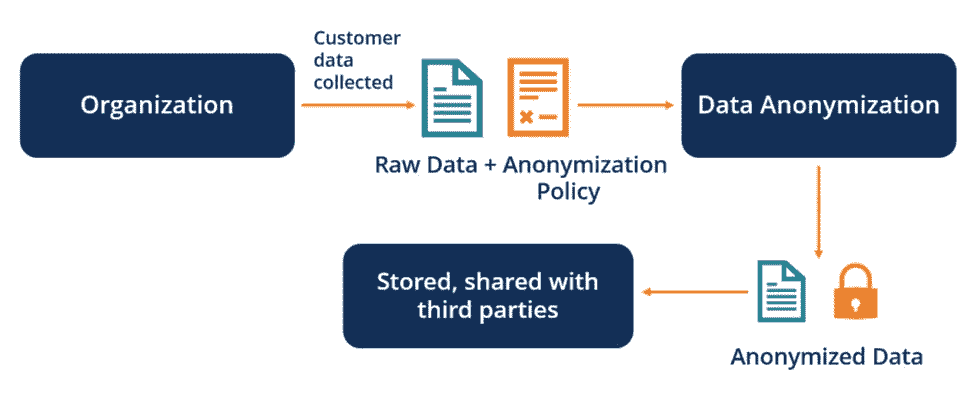
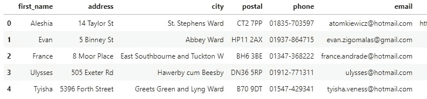
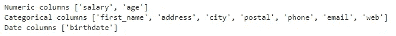
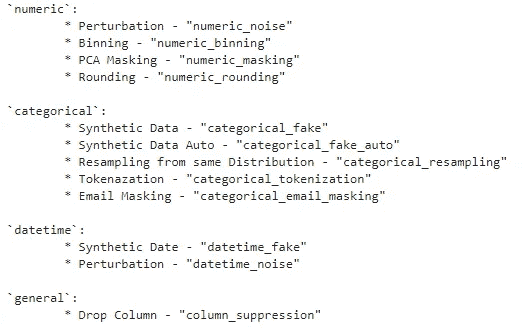
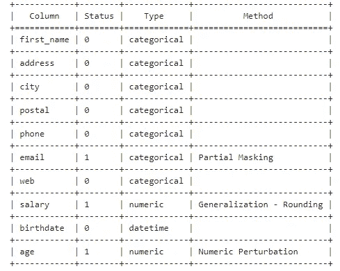
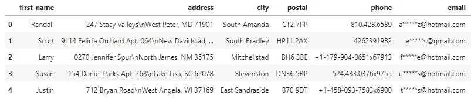

# Python 数据匿名和屏蔽指南

> 原文：<https://levelup.gitconnected.com/python-data-anonymization-masking-guide-de0b0aa0ca82>

## 向世界公开你的私人数据


[https://C1 . wallpaperflare . com/preview/176/830/383/classified-background-blog-business . jpg](https://c1.wallpaperflare.com/preview/176/830/383/classified-background-blog-business.jpg)

我们生活在一个充满数据的世界。而且大部分时间数据都是个人的、敏感的。我们每天都要面对各种各样的数据，通常我们的客户不希望与第三方共享他们的私人数据。但是如果他们想雇一个自由职业者或者外包公司呢？他们如何能够自由地传递数据，同时又不担心潜在的数据泄露？这就是数据匿名/数据屏蔽的用武之地。

简而言之，数据匿名化是一个置换数据的过程，以至于我们再也无法知道数据指的是谁。根据最终目标，我们可能还希望匿名化不会影响数据及其统计属性中可能的洞察力。为了实现这一点，我们必须彻底了解我们的数据，我们正在应用的技术，以及我们希望保留什么属性。



[https://www . wallpaperflare . com/classified-background-blog-business-communication-data-wallpaper-ulp vz](https://www.wallpaperflare.com/classified-background-blog-business-communication-data-wallpaper-ulpvz)

我们为数据匿名化开发了一个简单但功能丰富的 Python 库——anonympy。Anonympy 是一个用于数据匿名和屏蔽的通用工具包，目前，它为表格和图像匿名提供了许多功能。它利用了 pandas 的效率并封装了现有的库，如 Faker。我们的目标是尽可能直观地实现数据匿名和屏蔽。让我们看看它是如何工作的。

## 匿名化数据集

作为一个例子，让我们匿名化一个数据集— [uk-500.csv](https://www.briandunning.com/sample-data/) 。

让我们加载数据集，看看我们有什么样的数据。

```
import pandas as pdurl = r'https://raw.githubusercontent.com/ArtLabss/open-data-anonimizer/0287f675a535101f145cb975baf361a96ff71ed3/examples/files/new.csv'
df = pd.read_csv(url, parse_dates=['birthdate'])
df.head()
```



通过查看这些列，我们看到所有列都包含一些敏感信息。很好，这意味着我们将不得不对所有的列进行匿名化，并且能够展示 anonympy 包的所有功能。

我们先从安装 anonympy 库开始。这可以分两步完成:

> pip 安装匿名pip 安装 cape-privacy-no-deps

在应用任何转换之前，了解列的类型是很重要的。让我们检查一下数据类型，看看有哪些方法可供我们使用。

```
from anonympy.pandas import dfAnonymizer
from anonympy.pandas.utils import available_methodsanonym = dfAnonymizer(df)print('Numeric columns', anonym.numeric_columns)
print('Categorical columns', anonym.categorical_columns)
print('Date columns', anonym.datetime_columns)
```



现在让我们来看看表匿名化有哪些方法。

```
available_methods()
```



使用可用方法的列表，我们现在可以开始应用转换了。让我们给*列添加一些随机噪声，对 ***工资*** 中的值进行四舍五入，并部分屏蔽 ***电子邮件*** 列。*

```
*anonym.numeric_noise('age')  
anonym.numeric_rounding('salary')
anonym.categorical_email_masking('email')*
```

*要查看这些变化，我们可以调用 *to_df()* ，或者调用 *info()* 方法进行简单总结。*

```
*anonym.info()*
```

**

*一个好的选择是用假名字替换 ***first_name*** 列中的名字。为此，我们必须检查 Faker 是否有相应的方法。*

```
*from anonympy.pandas.utils import fake_methods
fake_methods('f') # args: None / 'all' / any letter*
```

*Faker 有一个叫做 *first_name* 的方法，让我们来置换列。*

```
*# if we wanted a different method use a dictionary {column_name:method_name}
# anonym.categorical_fake({'first_name': 'first_name_female'}anonym.categorical_fake('first_name')*
```

*检查其他列名的 *fake_methods* 原来，Faker 还有 ***地址*** 和 ***城市*** 的方法。 ***web*** 列可以用 ***url*** 方法代替， ***phone*** 用 ***phone_number*** 代替。*

```
*# this will change `address` and `city` because column names correspond to the method names
anonym.categorical_fake_auto()
anonym.categorical_fake({'web': 'url', 'phone': 'phone_number'})*
```

*需要匿名的最后一列是 ***生日*** 。因为我们有包含相同信息的 ***age*** 列，所以我们可以使用*column _ suppression*方法删除该列。然而，为了清楚起见，让我们添加一些噪声。*

```
*anonym.datetime_noise('birthdate')*
```

*就是这样。让我们来看看我们新的匿名数据集！*

**

## *摘要*

*数据隐私和保护是数据处理的一个重要部分，应该给予适当的关注。因此，在 ArtLabs，我们决定为这个用例创建一个方便的工具。您可能还想查看我们的图像匿名指南[这里](https://github.com/ArtLabss/open-data-anonymizer)和我们的 Google Colab 表格数据匿名[这里](https://colab.research.google.com/drive/1wg4g4xWTSLvThYHYLKDIKSJEC4ChQHaM?usp=sharing)。我们也欢迎任何对我们的[匿名开源库](https://github.com/ArtLabss/open-data-anonymizer)的贡献！*

*特别感谢[中亚大学计算机科学专业学生、ArtLabs 机器学习实习生 shakhanso Sabzaliev](https://www.linkedin.com/in/shukkkur)对本帖和 anonympy 开源知识库的贡献！*