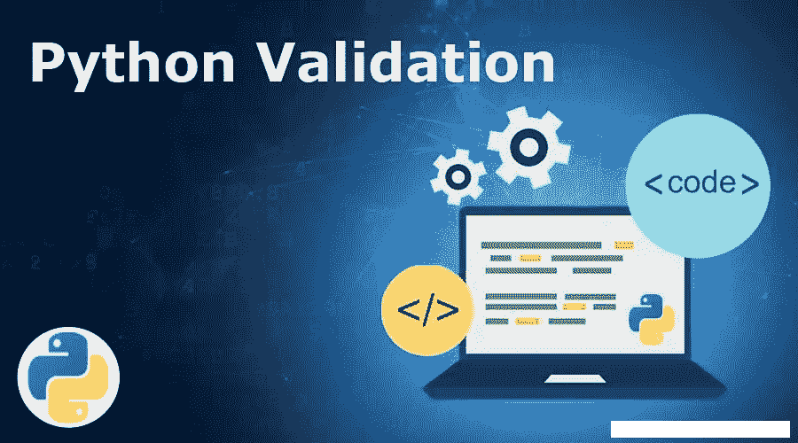
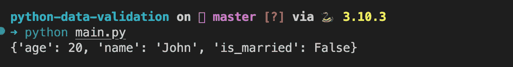
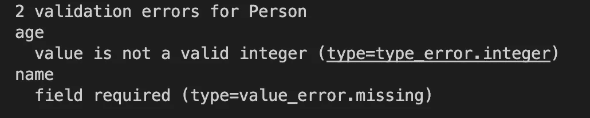

# 使用 pydantic 进行 Python 数据管道数据验证

> 原文：<https://levelup.gitconnected.com/python-data-pipeline-first-and-foremost-step-data-validation-e15017b7ef8d>

本文旨在展示和分享关于如何使用 **pydantic** 来验证和保护您的数据管道的代码片段。让我们开始吧…



# 使用镇静剂

`Pydantic`是一个流行的库，它将我们的数据解析成期望的数据类型。我们可以使用`dataclass`定义我们的数据类型，让`Pydantic`处理数据类型解析。让我们看看如何处理我们的营销数据。

```
pip install pydantic
```

# 简单的例子

我们将从导入 [BaseModel](https://github.com/samuelcolvin/pydantic/blob/abea8232eef0eeeb728824cdec9b445dfbd3192e/pydantic/main.py#L310) 类开始，这是我们所有数据[模型](https://pydantic-docs.helpmanual.io/usage/models/)应该继承的类。我们还将导入 [ValidationError](https://github.com/samuelcolvin/pydantic/blob/master/pydantic/error_wrappers.py#L50) 异常，如果模型中的数据解析和验证失败，我们将使用该异常进行错误处理。

`**from** pydantic **import** BaseModel, ValidationError`

在这之后，我们将定义我们的模型类。为了便于说明，我们将定义一个示例 Person 类，它有几个字段:

*   **年龄**:表示人的年龄的整数。类型提示应该是 **int** 。
*   **姓名**:带有人名的字符串。类型提示应该是 **str** 。
*   **is_married** :布尔值，表示此人是否结婚。类型提示应该是 **bool** 。

正如已经提到的，我们的 **Person** 类应该继承我们已经导入的 **BaseModel** 类。

```
class Person(BaseModel):
    age: int
    name: str
    is_married: bool
```

现在我们已经为我们的**人**定义了模型，我们将定义一个字典，其中包含我们想要根据模型解析和验证的数据。在这个例子中，我们将定义一个包含有效数据的字典。

```
data = {
    'name': 'John',
    'age': 20,
    'is_married': False
}
```

然后我们将创建一个 **Person** 类的对象。我们将传递数据字典的字段作为构造函数的输入。为了使我们的代码更加简洁，我们将使用字典解包操作符(双星号)。

`person **=** Person(******data)`

尽管我们传递的是符合模型规范的数据字典，但是我们需要考虑到，当接收外部数据时，这可能不是真的。因此，如果数据无效，将会引发一个**验证错误**。因此，我们将在 try except 块中包含我们的 **Person** 对象的实例化。

在 except 块中，我们将简单地打印异常。

```
try:
    person = Person(**data)
    # use the data

except ValidationError as e:
    print(e)
```

出于举例的目的，我们现在将通过调用 [dict](https://pydantic-docs.helpmanual.io/usage/exporting_models/#modeldict) 方法将模型对象转换回字典。虽然这个方法可以接收一些可选的输入来定制模型到字典的转换，但是对于这个测试，我们不会传递任何参数，所以我们得到默认的行为。我们将打印生成的词典。

`print(person.dict())`

下面是完整的代码。

```
from pydantic import BaseModel, ValidationError

class Person(BaseModel):
    age: int
    name: str
    is_married: bool

data = {
    'name': 'John',
    'age': 20,
    'is_married': False
}

try:
    person = Person(**data)
    print(person.dict())

except ValidationError as e:
    print(e)
```

要测试代码，只需在您选择的工具中运行它。在我的例子中，我使用的是 VS 代码。

您应该会得到类似于图 1 的结果。可以看到，我们没有得到任何异常，这意味着模型解析和验证没有出现任何问题。正如所料，我们还获得了模型的字典表示。



图 1 从 Person 模型对象获得的字典

我们现在将做一些小的更改，使数据根据我们的模型定义无效:

*   我们将从字典中删除 **name** 属性
*   我们将把**年龄**属性设置为任意字符串

```
data = {
    'age': "test",
    'is_married': False
}
```

如果我们在更改了上面字典的数据变量后再次运行代码，我们应该得到如图 2 所示的输出。可以看出，该异常表明**年龄**不是整数，并且**姓名**缺失。



图 2 Pydantic 抛出的验证错误

在我们的例子中，我们展示了一个非常简单的例子，我们刚刚打印了我们的 **Person** 对象的字典表示。然而，在真实的场景中，我们可能会将该对象用于其他操作。从开发体验的角度来看，如果我们正在使用 IDE(在我的例子中是 VS 代码)，这些模型的使用也给了我们一些好的特性，比如自动完成。这可能看起来是一个小细节，但是当处理大而复杂的代码库时，这种类型的特性比必须找出哪些字段可能存在于 dictionary 对象上要容易得多。

# 结论

`Pydantic`让您轻松

1.  定义数据集的数据类型
2.  解析数据以匹配定义的数据类型
3.  用`ValidationError`捕捉数据类型错误
4.  定义自定义数据类型
5.  使用`[mypy](http://mypy-lang.org/)`捕捉类型错误。

`Pydantic`提供了很多功能。你可以参考它的完整文档[这里](https://pydantic-docs.helpmanual.io/)。

[使用 python 进行数据工程和 ETL 可能会容易得多，只需几个方便的脚本就可以了！](https://medium.com/@caopengau/data-engineering-made-easy-attached-python-scripts-to-head-startyour-etl-tasks-960e766f3ae3)

如果您对数据可视化感兴趣，请随意查看[这篇分步指南，了解如何使用 Apache 超集](https://medium.com/@caopengau/data-visualisation-with-apache-superset-a-step-by-step-guide-e5b0c150f358)创建您的第一个图表。

**行动呼吁**

如果你觉得这个指南有帮助，请鼓掌并跟我来。通过[链接](https://medium.com/@caopengau/membership)加入 medium，获取我和所有其他优秀作家在 medium 上发表的所有优质文章。