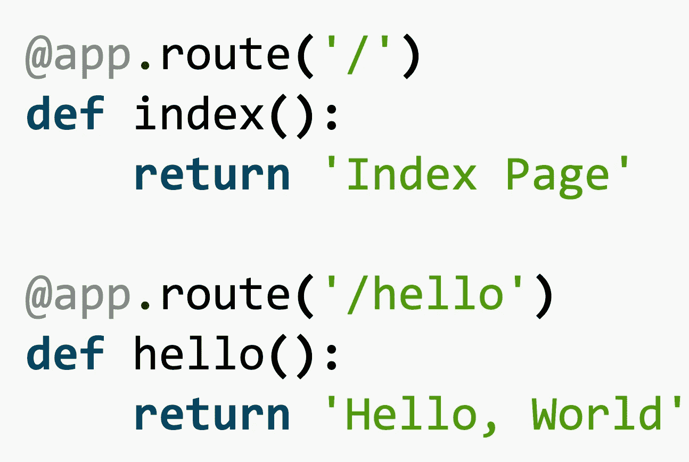

# Python 装饰者

> 原文：<https://levelup.gitconnected.com/python-decorators-b530bff0f3e3>

## 关于如何使用 python decorator 语法进行更简洁编码的教程

Python 附带了许多语法人工制品，使开发人员能够更快地构建应用程序，最重要的是，代码简洁。如果你是程序员，你就知道代码质量和可靠性有多重要！所以在这篇文章中，我将简单介绍一下 python decorators。如果你对更干净有效的编码感兴趣，可以看看我下面的文章。

[](https://towardsdatascience.com/python-generators-393455aa48a3) [## Python 生成器

### 使用 yield 关键字开发 python 生成器函数的教程

towardsdatascience.com](https://towardsdatascience.com/python-generators-393455aa48a3) 

在我们开始使用 python decorators 之前，我们需要理解 python 函数是如何工作的。Python 函数被认为是**一级函数**，这意味着它们可以被当作对象来对待，可以随意传递。

Python 可以在函数中定义函数，称为**内部函数**。一个函数也可以从另一个函数返回(这是在 Python 中实现开关操作符的一种方式)。


马库斯·斯皮斯克在 [Unsplash](https://unsplash.com/s/photos/decorate?utm_source=unsplash&utm_medium=referral&utm_content=creditCopyText) 上拍摄的照片

# 函数作为面向对象对象的应用

## 开关盒实现

Python 字典是一种对象构造，其中对象将被返回给它所引用的键。因为 Python 没有显式的 switch 操作符，所以我们使用`dict`构造来创建一个。请看这个例子。

```
op_switch = {
    'sqr': lambda x: x**2,
    'sqrt': lambda x: x**0.5,
    'abs': lambda x: abs(x)
}
```

我们的开关案例是基于一个字符串来选择**操作**。字典返回一个函数。为了简化代码，我使用了 lambda 函数定义。它们的行为类似于函数的行为(不完全相同！).可以通过以下方式访问它们。

```
>>> switch['sqr'](12)
144
>>> switch['sqrt'](25)
5.0
```

## 将一个函数传递给另一个函数

考虑一种需要包装另一个函数的情况。想象一下，包装函数可以被许多其他函数共享。在我给你讲一个真实的工作例子之前，让我们先来看看这个宠物场景。

假设您需要一个函数来执行函数并返回答案。如果抛出异常，将返回`**None**`。

```
def deco_function(func, *args):
    try:
        return func(*args)
    except:
        print("Error occured")
        return None

def divide(a, b):
    return a/b
```

我们的`deco_function`函数将使用作为`*args`传递的一组参数来执行传递的函数。为了简单起见，我省略了关键字参数。如果我们运行这个，我们将看到我们给定的每个参数的如下输出。

```
>>> deco_function(divide, 10, 2)
5.0
>>> deco_function(divide, 10, 0)
Error occured
```

很漂亮对吧！

> 这种方法的主要问题是包装函数的函数签名必须是众所周知的。我们需要传递函数本身和参数。这在复杂的场景中更难维护！

# Python Decorators 简介

使用 python decorators 语法，可以用更好的语法来修饰上面的相同函数。让我们看看怎么做。

```
def deco_function(func):
    def wrapped(*args):
        """
        This is the wrapper for a function to be fail safe
        """
        try:
            return func(*args)
        except:
            print("Error occured")
            return None
    return wrapped

@deco_function
def divide(a, b):    
    """
    This is a function to divide two numbers
    """
    return a/b
```

在这个例子中，我们用`deco_function`装饰器来装饰`divide`函数。在装饰器中，包装器被放置在传递的函数周围，并返回`wrapper`。这类似于下面的语句。

```
divide = deco_function(divide)
```

然而，我们现在可以自由地忘记 call_function 实现了。这真是太棒了！

## 真实世界的装饰用法！



作者截图取自 [Flask 网站](https://flask.palletsprojects.com/en/1.1.x/quickstart/#routing)

如果你不熟悉装饰用例；让我们来看看 Flask 服务器。

[**Flask 是 python 的服务器实现。**](https://flask.palletsprojects.com/) 截图显示了如何使用 decorators 在 **Flask** 中实现路由。我们只需提及激活该功能的途径。到目前为止，我们还没有讨论如何将参数传递给装饰者。我们将很快讨论这个问题！

## 正确使用装饰符和函数名

需要记住的一点是，包装一个函数会导致对其身份的混淆。这是因为一旦我们用别的东西包装它，函数就不再是它自己了。

```
>>> divide.__name__
wrapped
>>> print(divide.__doc__)This is the wrapper for a function to be fail safe
```

函数的`__name__`属性返回函数名本身，打印`__doc__`返回文档字符串。然而，我们可以看到，这两个属性的值都是从包装函数中获得的，而不是从引用函数中获得的。这在大型软件中会导致严重的混乱。以下是修复方法。

```
**import functools**def deco_function(func):
    **@functools.wraps(func)**
    def wrapped(*args):
        """
        This is the wrapper for a function to be fail safe
        """
        try:
            return func(*args)
        except:
            print("Error occured")
            return None
    return wrapped

@deco_function
def divide(a, b):    
    """
    This is a function to divide two numbers
    """
    return a/b
```

注意**粗体**中的代码。我们导入`**functools**`并装饰我们的包装。这个`functiontools.wraps`装饰器将 **docstring** 和 **name** 属性注入到包装器中，以便我们在打印`__name__`和`__doc__`时获得正确的属性。

```
>>> print(divide.__name__)
divide
>>> print(divide.__doc__)This is a function to divide two numbers
```

## 了解参数和关键字参数的工作原理

Python 接受**有序参数**，后跟**关键字参数**。这可以通过以下方式证明。

```
import functoolsdef print_args(func):
    @functools.wraps(func)
    def wrapped(*args, **kwargs):
        args_arr = [(n, a) for n, a in enumerate(args)]                      
        kwargs_arr = [(k, v) for k, v in kwargs.items()]for k, v in args_arr + kwargs_arr:
            print(k, v)
    return wrapped

@print_args
def test_function(*args, **kwargs):    
    return a/b
```

调用上面的`test_function`函数会得到下面的结果。

```
>>> test_function('name', 'age', height=150, weight=50)
0 name
1 age
height 150
weight 50
```

根据上述观察，必须注意到**自变量**是在**关键字自变量**之前组织的。参数中的顺序必须保持不变，关键字参数中的顺序无关紧要。在包装器中，参数和关键字参数都必须传递给被包装的函数。这确保了包装的更广泛的可用性。

# 有争论的装饰者

现在我们已经清楚地了解了装饰器是如何工作的，让我们看看如何使用带有参数的装饰器。

```
def powered(power):
    def powered_decorator(func):
        def wrapper(*args):
            return func(*args)**power
        return wrapper
    return powered_decorator@powered(2)
def add(*args):
    return sum(args)
```

在上面的例子中，我们有一个带有属性的包装器。简单地说，这个包装器要求将答案提升到由属性指定的幂。下面是几个可以找到参数化装饰器的例子。

1.  验证输入字段、JSON 字符串、文件存在等。
2.  实现开关外壳装饰器

# 装饰者的高级用例

装饰器可以以类似的方式用于类。然而，这里我们可以讨论两种使用装饰者的方法；在一个班级里，也为了一个班级。

## 一个类中的装饰者

在下面的例子中，我在类`Calculator`的函数上使用了装饰器。这有助于我在操作失败时优雅地获取值。

```
import functoolsdef try_safe(func):
    @functools.wraps(func)
    def wrapped(*args):
        try:
            return func(*args)
        except:
            print("Error occured")
            return None
    return wrappedclass Calculator:

    def __init__(self):
        pass

    @try_safe
    def add(self, *args):
        return sum(args)

    @try_safe
    def divide(self, a, b):
        return a/b
```

上面的代码可以如下使用。

```
>>> calc = Calculator()
>>> calc.divide(10, 2)
5.0
```

## 一个类的装饰者

对一个类使用装饰器将在函数的实例化过程中激活装饰器。例如，下面的代码将使用构造函数参数检查对象的创建是否正常。如果操作失败，`None`将代替`Calculator`类中的对象返回。

```
import functoolsdef try_safe(cls):
    @functools.wraps(cls)
    def wrapped(*args):
        try:
            return cls(*args)
        except:
            print("Error occured")
            return None
    return wrapped@try_safe
class Calculator:

    def __init__(self, a, b):
        self.ratio = a/b
```

## 使用 Decorators 为函数注入状态

在包装函数的过程中，可以向函数中注入一个状态。让我们看看下面的例子。

```
import functoolsdef record(func):
    @functools.wraps(func)
    def wrapped(*args):
        wrapped.record += 1
        print(f"Ran for {wrapped.record} time(s)")
        return func(*args)
    wrapped.record = 0
    return wrapped@record
def test():
    print("Running")
```

运行上面的示例会得到下面的输出。

```
>>> test()
Ran for 1 time(s)
Running
>>> test()
Ran for 2 time(s)
Running
>>> test()
Ran for 3 time(s)
Running
```

这在使用 decorators 创建单例时很有用。接下来让我们看看。

## 使用 Python 装饰器的单例

**Singleton** 指的是调用之间共享的实例，不会因为任何原因而重复。简单地说，首先，创建一个实例。在下面创建实例的调用中，将返回现有的实例。

让我们看看如何使用 decorators 实现一个 singleton。

```
import functoolsdef singleton(cls):
    @functools.wraps(cls)
    def wrapped(*args, **kwargs):
        if not wrapped.object:
            wrapped.object = cls(*args, **kwargs)
        return wrapped.object
    wrapped.object = None
    return wrapped@singleton
class SingularObject:
    def __init__(self):
        print("The object is being created")
```

我们可以按如下方式确认功能。

```
>>> first = SingularObject()
The object is being created
>>> second = SingularObject()
>>> second is first
True
```

这些对象引用同一个实例。因此，我们保证不再创建更多的对象。这样一个独生子！

## 制作包装器/装饰器类

到目前为止，我们只考虑了作为包装器或装饰器的函数。然而，在 OOP 程序中，类可能是首选。我们只需对我们的**记录**示例做一些修改就可以实现这一点。让我们看看代码。

```
**import functools**class Record:
    def __init__(self, func):
        **functools.update_wrapper(self, func)**
        self.func = func
        self.record = 0def __call__(self, *args, **kwargs):
        self.record += 1
        print(f"Ran for {self.record} time(s)")
        return self.func(*args, **kwargs)@Record
def test():
    print("Run")
```

注意**粗体**中的部分。我们使用`**functools**`来更新函数属性。我们使用`__call__`重载来定义函数调用的动作。构造函数`__init__`初始化变量，类似于我们在前面的有状态装饰器例子中在包装函数之后所做的。上述示例的输出如下。

```
>>> test()
Ran for 1 time(s)
Run
>>> test()
Ran for 2 time(s)
Run
>>> test()
Ran for 2 time(s)
Run
```

# 结束语

在本文中，我展示了如何使用 decorators 以一种更加简单和干净的方式实现包装器。下面是您可能在下一个项目中使用包装器的几个例子。

1.  例如，在 AWS lambda 函数中实现路由机制
2.  API 缓存机制，您可能希望跟踪最后几次函数调用
3.  物联网应用中的去抖(限制短时间内发生的函数调用)

让我知道你是否能想到任何其他你可能使用过装饰者的创造性应用。我很想听听。

我希望你喜欢这篇文章。干杯！