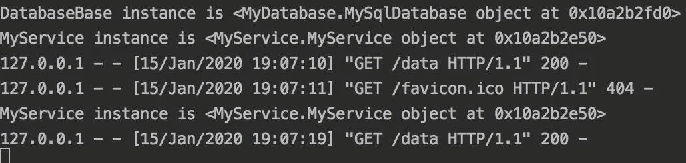
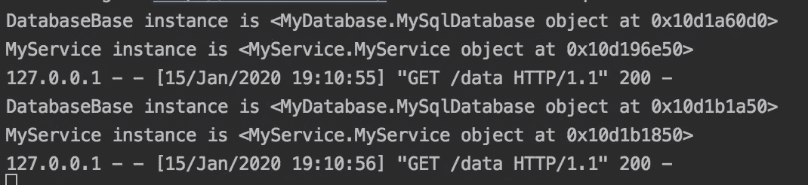

# 使用 flask-injector 的 Python 依赖注入

> 原文：<https://levelup.gitconnected.com/python-dependency-injection-with-flask-injector-50773d451a32>


在 [Unsplash](https://unsplash.com?utm_source=medium&utm_medium=referral) 上由 [Hitesh Choudhary](https://unsplash.com/@hiteshchoudhary?utm_source=medium&utm_medium=referral) 拍摄的照片

Python 的 [flask-injector](https://github.com/alecthomas/flask_injector) 包没有完整的文档，网上关于如何实现它的例子也很少。我没有找到一个好的教程来说明如何在真实的 flask 应用程序中使用 flask-injector 进行依赖注入，所以当我想通了之后，我决定自己写一个。

# 什么是依赖注入？

依赖注入(DI)最初是由 Martin Fowler 作为一种设计模式提出的。他的文章值得一读，但我花了一段时间才完全理解。他分享了一些 Java 代码作为例子。在本教程中，我将向您展示如何为 Python Flask 应用程序实现 DI。

如果您已经知道什么是依赖注入，那么您可以直接跳到安装和实现部分。

依赖注入用于将组件相互连接起来。我们使用组件来确保我们的应用程序有一个干净的架构。每个组件都是一段独立的封装代码，其接口与实现相分离。

但是最终，组件需要相互通信。

理解 DI 的最好方法是将它应用到你目前正在试图解决的问题中。假设您正在构建一个包含与另一个类“有”关系的类。例如，您有一个需要连接到数据库的服务类。

这个 MyService 类在变量“db”中有一个 MySqlDatabase。当初始化 MyService 类的新实例时，创建 MySqlDatabase 类的实例并将其传入。

这个例子被高度简化以展示 DI 是如何工作的。下面是一些没有依赖注入的代码*。*

```
class MyService():
   def __init__(self, db):
      self.db = dbclass MySqlDatabase:        
   def __init__(self, connection_string):
       self.connection_string = connection_string def connect():
       # implementation for a MySQL database connection@app.route('/thing')
my_flask_route():
   database = MySqlDatabase(os.getenv("CONNECTION_STRING"))
   service = MyService(database)
   service.do_the_thing()
```

MyService 类*依赖于 MyDatabase 类*，因此 MyDatabase 类被认为是 MyService 类的*依赖关系*。该路由还依赖于 MyService。该组件也必须手动创建。

为了*将*依赖关系* MySqlDatabase 注入到 MyService 类中，我们必须手动创建 MySqlDatabase 对象，并在每次使用 MyService 类时将其传递给 MyService 构造函数。*

这将会很好的工作；然而，在较大的应用程序中，这会带来一些问题。

*   创建服务的代码现在变得凌乱不堪，可读性不如预期。
*   MySqlDatabase 类现在与 MyService 类紧密耦合。您可能希望使您的代码具有可扩展性，以便将来支持其他数据库类型，如 PostgreSQL 或 MS SQL Server。
*   单元测试比它需要的更复杂。

使用依赖注入模式有助于将接口从实现中分离出来。使用依赖注入，您的代码将如下所示。

```
class MyService():
   def __init__(self, db: MySqlDatabase):
      self.db = dbclass MySqlDatabase:        
   def __init__(self, connection_string):
       self.connection_string = connection_string def connect():
       # implementation for a MySQL database connection@app.route('/thing')
my_flask_route(service: MyService):
    service.do_the_thing()
```

不要担心幕后发生的事情；我一会儿会描述一下。现在我们知道服务*依赖*将*注入*到您的 flask route 中，反过来，数据库类将*注入*到服务类*中。*

更进一步，您可以通过为您的数据库类创建一个抽象基类来使您的代码可扩展。这样，我们可以在以后快速添加对其他数据库的支持，而无需修改当前的组件。

```
from abc import ABC, abstractmethodclass MyService():
   def __init__(self, db: DatabaseBase):
      self.db = dbclass DatabaseBase(ABC):def __init__(self):
        pass @abstractmethod
    def connect(self):
        passclass MySqlDatabase(DatabaseBase):        
   def __init__(self, connection_string):
      super.__init__()      
      self.connection_string = connection_string def connect():
       # implementation for a MySQL database connectionclass PostgreSqlDatabase(DatabaseBase):        
   def __init__(self, connection_string):
      super.__init__()      
      self.connection_string = connection_string def connect():
       # implementation for a PostgreSQL database connection@app.route('/thing')
my_flask_route(service: MyService):
    service.do_the_thing()
```

如您所见，我们现在正在将 DatabaseBase 传递到 MyService 构造函数中。然后，我们可以在运行时传递我们需要的任何数据库类。

这样做可以确保你遵循了面向对象设计的坚实原则。“O”代表开闭原则。如果从一开始就以这种方式设置代码，那么它就可以针对不同类型的数据存储进行扩展。

> 开闭原则声明“对象或实体应该对扩展开放，但对修改关闭。”

# Python 和 Flask 的依赖注入

毫无疑问，你可以用 Python 快速实现你自己的解决方案，或者使用 Python 的[注入器](https://github.com/alecthomas/injector)包，让它为你的 Flask API 工作，但是这需要额外的全局变量。

因为我们通常会尽量避免在应用程序中添加更多的全局变量，所以我选择了 *flask-injector。*

# 安装和实施

如果您还没有为您的项目设置 Python 虚拟环境，现在是时候了。点击阅读如何操作[。](https://medium.com/swlh/how-to-setup-your-python-projects-1eb5108086b1)

接下来，确保您的虚拟环境被激活，并将 flask-injector 安装到您的项目中。

```
source venv/bin/activatepip install flask-injector
```

让我们首先创建我们的模型，就像我们上面做的那样。

创建一个名为 MyDatabase.py 的文件，并添加以下代码。

```
from abc import ABC, abstractmethod class DatabaseBase(ABC):
    def __init__(self):
        pass @abstractmethod
    def connect(self):
        pass @abstractmethod
    def get(self):
        pass class MySqlDatabase(DatabaseBase):
    def __init__(self):
        super().__init__() def connect(self):
        # *TODO: implementation for a MySQL database connection* print("Successfully connected to MySQL database!") def get(self):
        return "success"  # TODO: Query the database here
```

创建一个名为 MyService.py 的文件，并添加以下代码。导入数据库基类并*将*注入到 MyService 构造函数中。注意，注入工作需要 **@inject** 装饰器。

```
from injector import injectfrom MyDatabase import DatabaseBase class MyService:
    **@inject**
    def __init__(self, db: DatabaseBase):
        print(f"DatabaseBase instance is {db}") 
        self.db = db def get_data(self):
        return self.db.get()
```

现在使用 flask-injector 来配置依赖项。configure 函数使用一个绑定器将接口(MyService，Database)绑定到实现(to=MyService，to=MySQLDatabase)。如您所见，scope 变量告诉 flask-injector 何时创建类的新实例。singleton 作用域只为应用程序的每个实例创建一个新实例，并且在应用程序的整个生存期内存在。请求范围为每个对 Flask API 的请求创建一个新实例。

创建一个名为 dependencies.py 的文件，并添加以下代码。

```
from injector import singletonfrom MyDatabase import DatabaseBase, MySqlDatabase
from MyService import MyService def configure(binder):
    binder.bind(MyService, to=MyService, scope=singleton)
    binder.bind(DatabaseBase, to=MySqlDatabase, scope=singleton)
```

太好了，你快到了。

现在，您可以创建您的 Flask 应用程序。

为了简单起见，我只在 API 中添加了一条路线。您可以看到，我们正在从依赖项中导入 configure 函数，这样当我们在底部创建 FlaskInjector 时，可以将它作为一个模块添加。请注意，在声明了所有的*视图*之后，必须实例化 FlaskInjector。

使用以下代码创建一个名为 app.py 的文件。

```
from flask import Flask
from flask_injector import FlaskInjector
from injector import injectfrom MyService import MyService
from dependencies import configureapp = Flask(__name__) @inject
@app.route('/data')
def get_data(service: MyService):
    print(f"MyService instance is {service}")
    return service.get_data() # Setup Flask Injector, this has to happen AFTER routes are added
FlaskInjector(app=app, modules=[configure])
```

在这段代码中，您可以看到 MyService 被直接注入到您的 Flask API 路由中。

最后，运行您的 Flask 应用程序。

```
flask run
```

现在，导航到[http://localhost:5000/data](http://localhost:5000/data)，然后刷新浏览器第二次运行请求。您应该看到，在第一次调用时，创建了数据库对象，然后是服务对象。在第二次调用时，因为我们在 configure 函数中使用了“singleton”作用域，所以相同的服务对象被重用，并且数据库对象不需要再次创建。



两个请求的 MyService 实例是相同的，因为它有一个单独的作用域

如果将每个绑定的范围更改为“请求”，flask-injector 会为每个请求注入一个新实例。更改依赖项文件中的代码。

```
binder.bind(MyService, to=MyService, scope=**request**)
binder.bind(DatabaseBase, to=MySqlDatabase, scope=**request**)
```

重新运行应用程序。然后，给[http://localhost:5000/data](http://localhost:5000/data)打几次电话。现在，您应该可以看到每次创建的每个对象都有一个新的唯一位置。Flask-injector 为每个请求注入一个新实例。如您所见，数据库也是为每个请求创建的。



这一次，MyService 对象每次都有一个惟一的位置，因为它有一个请求范围

注意:当您向类构造函数(__init__)添加参数时，事情会变得更加复杂。在这种情况下，您可以创建一个 provider 方法，告诉 FlaskInjector 您希望如何实例化您的对象(使用必需的参数)。否则，你会得到一个注射器。UnkownProvider 异常。如果发生这种情况，这意味着 flask-injector 无法正确实例化您的对象。在这种情况下，您应该使用模块来绑定您的类。参见[烧瓶注射器文档](https://github.com/alecthomas/flask_injector)了解如何操作。

我希望你发现这是有用的，虽然烧瓶注射器文档不是最好的；一旦你让它工作，它会非常方便。虽然依赖注入在 Python 中不是必需的，但是如果您习惯使用这种模式，那么使用依赖注入是很好的。

在以下位置找到代码:[https://github . com/jperilla/Tutorials/tree/master/dependency-inject-flask](https://github.com/jperilla/Tutorials/tree/master/dependency-inject-flask)

编码快乐！