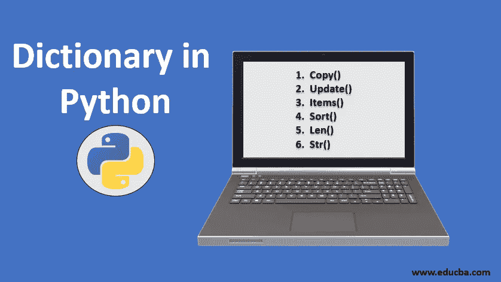

# Python Dict 你需要知道的一切

> 原文：<https://levelup.gitconnected.com/python-dict-everything-you-need-to-know-62837efdbc62>

这篇文章旨在向您展示 Python 中 dict 的所有特性。让我们开始吧…



# 内容概述/摘要

1.  **字典概念和定义**
2.  **字典
    的初始化 3.1 创建一个空字典
    3.2 创建一个非空字典**
3.  **字典操作:
    4.1 添加
    4.2 读取
    4.3 更新
    4.4 删除
    4.5 清除**
4.  **横向字典键值对
    4.1 带键
    4.2 带值
    4.3 带项**
5.  **对字典的操作**

# **1。字典概念和定义**

字典用于在键:值对中存储数据值。

字典是有序的、可改变的并且不允许重复的集合。

字典是用花括号写的，有关键字和值:

```
personDict = {"name": "Alice", "age": 20, "sex": "female"}
```

# 2.**字典的初始化**

## 2.1 **创建一个空字典**

```
emptyDict = {}
```

## **2.2 创建一个非空字典**

```
personDict = {"name": "Alice", "age": 20, "sex": "female"}
```

# **3。字典操作**

## 3.1 增加字典的价值

```
personDict = {}
personDict['height'] = 170
print(personDict['height']) # 170
```

## 3.2 阅读

```
personDict = {'name': 'Alice', 'age': 20, 'sex': "female"}
print(personDict['name']) # Alice
print(personDict['age']) # 20
print(personDict['sex']) # female
```

## 3.3 更新

```
personDict = {'name': 'Alice', 'age': 20, 'sex': "female"}
personDict['age'] = 21
print(personDict) # {'name': 'Alice', 'age': 21, 'sex': 'female', 'height': 170}
```

## 3.4 删除

```
personDict = {'name': 'Alice', 'age': 20, 'sex': "female"}
del personDict['sex']
print(personDict)  # {'name': 'Alice', 'age': 20}
```

## 3.5 清除

```
personDict = {'name': 'Alice', 'age': 20, 'sex': "female"}
personDict.clear() # clear all key-value pairs
print(personDict) # {}
```

# **4。横向字典键值对**

4.1 带钥匙

```
personDict = {'name': 'Alice', 'age': 20, 'sex': "female"}
# Transverse dict key-value pairs with key
for key in personDict:
    print(key, personDict[key])
# name Alice
# age 20
# sex female
```

4.2 价值观

```
personDict = {'name': 'Alice', 'age': 20, 'sex': "female"}
# Transverse dict key-value pairs with value
for value in personDict.values():
    print(value)
# Alice
# 20
# female
```

4.3 带物品

```
personDict = {'name': 'Alice', 'age': 20, 'sex': "female"}

# Transverse dict key-value pairs with key-value pair with tuple
for items in personDict.items():
    print(items)
# ('name', 'Alice')
# ('age', 20)
# ('sex', 'female')

# Transverse dict key-value pairs with key-value pair with tuple de-constructed
for key, value in personDict.items():
    print(key, value)
# name Alice
# age 20
# sex female 
```

**行动呼吁**

如果你觉得这个指南有帮助，请鼓掌并跟我来。通过[链接](https://medium.com/@caopengau/membership)加入 medium，在 medium 上访问我和所有其他优秀作家的所有优质文章。