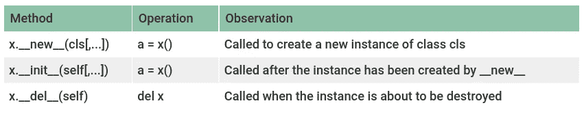
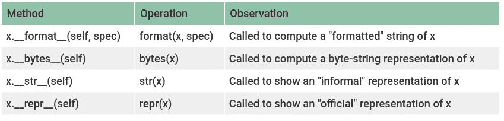
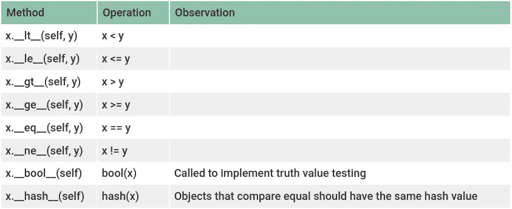
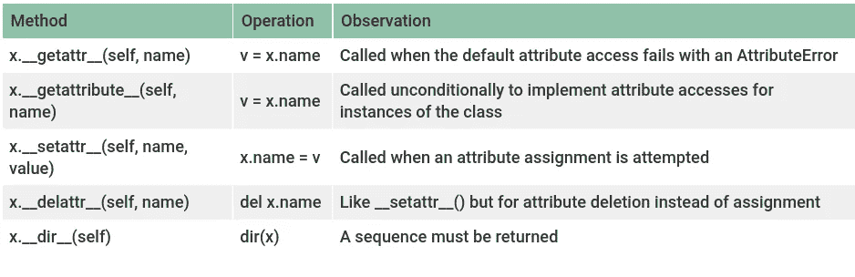
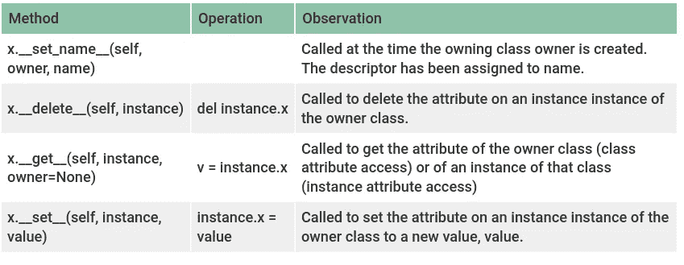
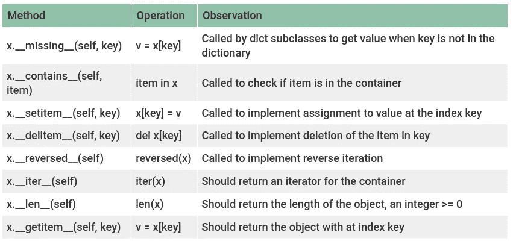
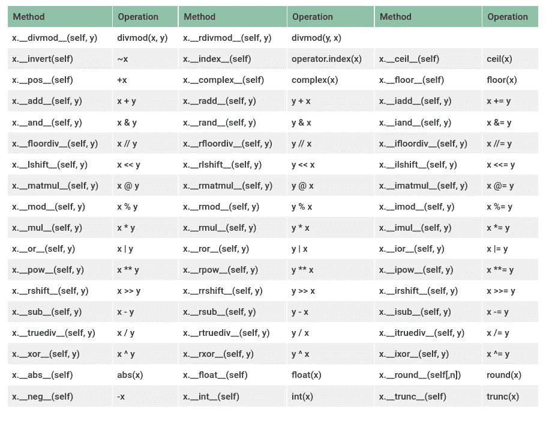
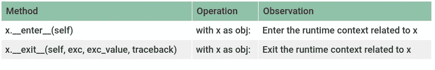
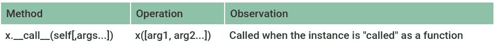

# Python Dunder 方法

> 原文：<https://levelup.gitconnected.com/python-dunder-methods-ea98ceabad15>

## Python 魔术方法使用指南

照片由[克里斯蒂安·埃斯科瓦尔](https://unsplash.com/@cristian1?utm_source=unsplash&utm_medium=referral&utm_content=creditCopyText)在 [Unsplash](/s/photos/magic?utm_source=unsplash&utm_medium=referral&utm_content=creditCopyText) 上拍摄

在 Python 中，通过定义具有特定名称的方法，类可以具有由特殊语法(如算术运算或切片)调用的特殊方法。

这些方法被称为**邓德方法**或**魔法方法**，尽管它们没有任何魔法在里面。它们是 Python 处理*操作符重载*的方法。

它们还用于模拟一些内置类型，并可以用来以更 pythonic 化的方式丰富您的类。

**注意**:本指南基于 Python 3.8。

# 初始化

方法来帮助和更改类初始化行为。

图片作者。

## 评论

*   `__new__`的返回应该是类的一个实例。如果没有返回任何内容，则不调用新实例的`__init__`。
*   `__init__`不应该返回值。如果返回的不是`None`，则引发`TypeError`。
*   操作`del x`不直接调用`x.__del__`。它递减`x`的引用计数，只有当它为零时才真正被调用。
*   在`__del__`期间发生的任何异常都将被忽略，而是向`sys.stderr`打印一条警告。

## 例子

# 表现

用于获取表示类实例的字符串。

图片作者。

## 评论

*   如果一个类声明了`__repr__`而没有声明`__str__`，那么`__repr__`也被用作“非正式”表示，即被`str()`调用。
*   `spec`参数是一个包含所需格式选项描述的字符串，由类来解释。大多数情况下，类要么委托给内置类型之一，要么遵循类似的语法。
*   `__repr__`和`__str__`的主要区别在于目标受众。`__repr__`函数旨在产生机器可读的输出(甚至可以是 Python 表达式)，而`__str__`更像是人类可读的输出(必须是字符串)。

## 例子

# 丰富的比较

一些方法，使一个类的行为像内置类型一样，并使用运算符实现对象之间的直观比较。

图片作者。

## 评论

*   如果没有实现给定参数对的操作，它可能会返回`NotImplemented`错误。
*   按照惯例，它应该返回`False`和`True`。但是这些方法可以返回任何值，如果在布尔上下文(比如`if` 语句)中使用，Python 将对该值调用`bool()`来确定它是真还是假。
*   如果没有定义`__bool__`，Python 调用`__len__`，如果结果不为零，对象被定义为真。
*   如果一个类没有定义`__eq__`，那么它也不应该定义`__hash__`。
*   定义了`__eq__`但没有定义`__hash__`的类会将其`__hash__`隐式设置为`None`。在这种情况下，不可能在可散列集合中使用它们，例如`set`。
*   `__hash__`应该返回一个整数。而`a == b`就是说`hash(a) == hash(b)`。

## 例子

# 属性访问

可以自定义访问属性的含义(使用、分配或删除)。

图片作者。

## 评论

*   如果方法是通过正常机制找到的，`__getattr__`就永远不会被调用。
*   如果类同时定义了`__getattr__`和`__getattribute__`，那么`__getattr__`只有在`__getattribute__`引发`AttributeError`或显式调用它时才会被调用。
*   如果`__setattr__`要赋值给实例属性，就要调用同名的基类方法，比如`object.__setattr__(self, name, value)`或者`self.__dict__[name]=value`。

## 例子

# 描述符

描述符是这样的类，当通过获取、设置或删除进行访问时，也可以改变其他对象。这里的描述符是一个类，它声明了一个或多个这样的方法，并出现在 owner 类的一个属性中。

图片作者。

## 评论

*   描述符并不是孤立的；相反，它们应该由所有者阶层持有。当构建具有属性值相互依赖的面向对象的数据库或类时，描述符会很有用
*   要成为描述符，一个类必须至少实现了`__get__`、`__set__`和`__delete__`中的一个
*   使用`property`装饰器可以实现相同的行为。

## 例子

# 容器方法

可以定义以下方法来实现容器对象。容器通常是*序列*(如列表或元组)或*映射*(如字典)，但也可以表示其他容器。

图片作者。

## 评论

对于方法`__getitem__`、`__setitem__`和`__delitem__`:

*   如果*键*型号不合适，则应升起`TypeError`。
*   如果*键*是一组索引之外的值(对于序列类型)，它应该引发`IndexError`。
*   如果*键*缺失(对于映射类型)，它应该引发`KeyError`。

## 例子

# 数字运算

可以定义以下方法来模拟数字对象。

图片作者。

## 评论

*   增强的算术方法(如`__iadd__`)应该尝试就地进行运算，修改 *self* ，并返回结果(应该是，但不是必须是， *self* )。
*   只有当左操作数不支持相应的运算且操作数类型不同时，才调用反向二进制算术方法(如`__radd__`)。也就是说，在一个表达式`x + y`中，如果`x`没有实现`__add__`而`y`实现了`__radd__`，那么`y.__radd__(x)`被调用。
*   如果`__int__`、`__float__`和`__complex__`未定义，则相应的功能`int()`、`float()`和`complex()`返回到`__index__`。
*   如果`__int__`没有定义，那么函数`int()`返回到`__trunc__`。

## 例子

# 上下文管理器

上下文管理器允许在被`with`语句包装或直接调用时执行设置和清理动作。这可用于保存和恢复状态、锁定和解锁资源，或者关闭文件和连接。

## 评论

*   如果上下文无任何异常退出，所有三个参数`exc`、`exc_value`和`traceback`将为`None`。
*   如果提供了异常，该方法应该返回`True`来抑制它。否则，它将在退出此方法时正常继续。

## 例子

# 可调用对象

允许对象的实例像函数一样存在，也就是说，你可以“调用”它们。

图片作者。

## 评论

*   可以将`__call__`方法声明为任何其他函数，因为您可以声明任意多个参数。
*   当实例必须大量改变其当前状态时，这是有用的，例如在表示平面中的点的类中。

## 例子

# 结论

您可以使用 *dunder* 方法来丰富您的类并模拟 Python 中的内置类型。还可以让一些操作更“pythonic”一点。

但是注意不要过度使用它们。如同任何其他功能一样，必须负责任地使用它。

我希望你喜欢阅读。如果您有任何疑问或建议，请在下面留下评论。你可以在[官方文档](https://docs.python.org/3/reference/datamodel.htm)中获得更多关于这些方法的信息。