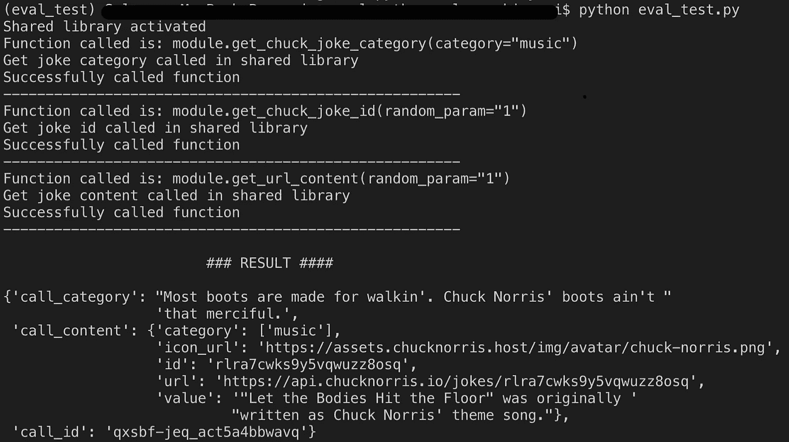

# Python eval 函数-正确和错误的方法

> 原文：<https://levelup.gitconnected.com/python-eval-function-the-right-and-wrong-way-111bc3f78c14>


什么是 eval 函数？

总之，`eval()`将解释任何解析到其中的字符串参数，并将其作为 Python 代码执行。一个简单的例子是将两个数字相加，如下所示，通过 eval 传递的字符串“number + 2”被执行并返回值 3。

```
>> number = 1
>> eval('number + 2') 
3
```

此外，eval 仅适用于表达式。尝试传递语句将导致语法错误，如下例所示。

```
>> eval('number = 1 + 2')
Traceback (most recent call last):
  File "<stdin>", line 1, in <module>
  File "<string>", line 1
    num = 1 + 2
        ^
SyntaxError: invalid syntax
```

## 使用 eval()的方法错误:

由于 eval 运行的方式，您确实希望避免将不可信的源传递到函数中。它可能会被用于有害的方面。查看下面的代码:

```
>>> user_input = input('Enter command:')
Enter command:__import__('os').system('pwd')
eval(user_input)Result: /Users/<local directory>
```

想象一下，将' **pwd** '替换为'**RM-RF *【T4]'这可能会导致服务器出现严重混乱。**

## **我如何正确使用 eval？**

我看过一本书，讲的是使用数据结构减少代码行数的好处。

## 问题

我有五个不同参数的函数对同一个库进行外部调用。我想通过使用数据结构将这些简化为一个单一的函数。

## 解决办法

为了解决这个问题，我将所有的函数名作为一个字符串存储在字典中。然后使用 format 函数——它非常适合字符串格式化和替换，我创建了一个字符串形式的函数调用，包括它的参数。

最后，得到的字符串被解析成 eval，作为函数调用执行。我在下面的 github 资源库中创建了一个原型，展示了我是如何做到这一点的。原型以一种简单易懂的方式展示了这个想法。

> 代码可以在我的 GitHub 页面上找到:https://github.com/solomonakinyemi/using_eval_python

## 用于演示的原型

我创建了一个简单的程序，对 Chuck Norris 笑话 API 进行函数调用。

计划主要分为三个主要部分:

1.  呼叫功能
2.  主要功能
3.  共享库

## 呼叫功能:

call_function 是这个程序的主要焦点。我们在这里做的是在名为“module”的共享库对象中进行解析，它是一个“function_selector”字符串，保存用于从函数名字典中选择特定函数的键，以及保存所选函数所需的所有参数的“param”字典。

我们可以在第 3 行的代码片段中看到可用的函数，它们是:get_chuck_joke_category、get_chuck_joke_id 和 get_url_content

函数字符串是在“function_string”变量中创建的，该变量还包含该函数的参数。一个很好的例子是在第 10 行，我们创建了获取 chuck 类别的函数字符串。我们创建一个类别参数作为“get_chuck_joke_category”函数字符串的一部分。

使用第 17 行上的 eval 执行函数字符串，结果返回到第 17 行上的响应变量。

## 主要功能:

main 函数用于运行程序。我们有一个名为 function_to_call 的列表，它保存了用于选择函数的函数调用键的列表。

此外，我们有一个名为“category_”的列表，它显示了“get_chuck_joke_category”函数可用的不同类别。在这个程序中有三个查克·诺里斯笑话类别可用——电影、体育和音乐。创建了共享库对象的一个实例，我们将在下一节讨论这个实例。

此外，我们有一个简单的`for`循环，用于遍历第 3 行的 function_to_call 列表，该列表包含访问特定函数的键。最后，我们调用上面讨论过的“call_function ”,结果存储在字典中。

## 类库:

类库代表了一个共享库，它基本上使 https GET 请求 Chuck Norris 笑话 API。它保存了我们试图从脚本中访问的函数。

程序输出:



综上所述，我可以理解为什么 eval 是一个不应该轻易使用的函数。此外，我认为 eval 在程序中有一席之地，因为它的创建肯定是有原因的。

使用 eval 时需要注意的事项:

1.  限制传递给它的函数/字符串的范围
2.  仅暴露于已知来源
3.  理解它对你的项目的影响

我很想听听你的意见。最后，有人使用 eval 吗？