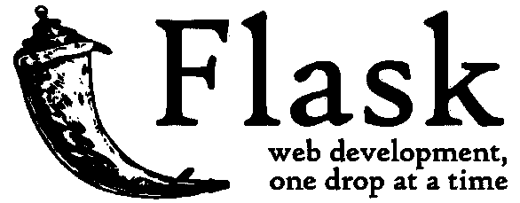
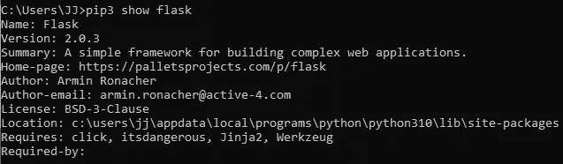
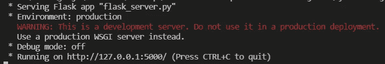
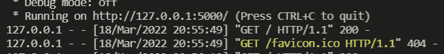
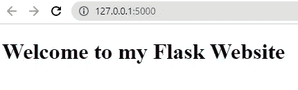

# python Flask——一个强大而灵活的 Web 应用框架

> 原文：<https://levelup.gitconnected.com/python-flask-a-powerful-and-flexible-web-app-framework-crystalizemylearning-mar-2022-6890e39e6c1e>

## Python Flask 库简介



在我过去的一些项目中，多亏了 [Flask](https://flask.palletsprojects.com/en/2.1.x/) ，我能够快速开发原型，甚至在我的一个 chrome 扩展项目中使用 python 代码！
**注意* Chrome 扩展通常只用 Javascript 开发。简单和浅显的学习曲线使 Flask 成为初学者的完美网络框架！**

> 等等！什么是 web 框架，Flask 有多重要？

在本文中，我将分享关于 Python Flask 库的一切。

# Flask 到底是什么？

根据 PyPI 中[烧瓶的官方定义](https://pypi.org/project/Flask/)

> Flask 是一个**轻量级的 WSGI web 应用框架**。它的**旨在使入门变得快速而简单**，**能够扩展到复杂的应用**。它最初是一个围绕 Werkzeug 和 Jinja 的简单包装器，现在已经成为最流行的 Python web 应用程序框架之一。

简单来说，它是一个初学者友好的可扩展的 web 框架。

> **对于初学者来说，web 框架本质上是一个模板，作为你构建 web 应用(即网站)和服务的基础。**

您需要知道的是，有了 Flask 这样的 web 框架，您可以通过使用一组包和库在更短的时间内完成更多的工作，并且减少了工作流程中的许多摩擦！

这几乎就像你有一个预建的乐高玩具，允许你在它的基础上构建一个无缝的产品创建过程。


# 更具体地说，Flask 允许您构建…

*   博客应用
*   反馈表
*   个人网站
*   REST API 解决方案
*   …以及更多！

***你甚至可以使用 Flask 部署机器学习模型！***

在 Chrome 扩展上部署机器学习模型实际上是我在项目中第一次使用 Flask。你可以看看我下面的**机器学习 Chrome 扩展**视频演示。

我希望你喜欢这个演示视频，并且对 Flask 的功能印象深刻！(当然还有机器学习哈哈)
***注*此视频录制于 2020 年，是南洋理工学院(信息技术学院)开放日演示*** 的一部分

> 对于那些不熟悉 Flask 的人来说，在转向更高级的用例之前，坚持使用更简单的用例可能更好。

为了帮助你，让我告诉你如何开始使用 Flask。

# 开始使用 Flask

在本文中，我假设您对 Python 编程有一些基本的了解。

## **从 PyPI 安装**

首先，您需要从 PyPI 安装 Flask 库。

```
pip install flask
```

要验证您已经成功安装了它，您可以使用

```
pip show flask
```



如果您成功安装了 flask 软件包，这应该会出现！

## **该码了！**

接下来，创建一个 python 文件`flask_server.py`，并将这些 python 代码复制到该文件中。

```
# import the flask object
from flask import Flask# define a flask application instance
app = Flask(__name__)# specify a app route ('/') to handle incoming web requests
[@app](http://twitter.com/app).route('/')
def hello():
    # return 'Hello World' as the response for '/' route    
    return 'Hello World'
```

*   正如注释所解释的，我们首先使用`from flask import Flask`导入 Flask 类
*   然后，我们使用`app = Flask(__name__)`定义我们的 Flask 应用程序实例。

> 为什么我们将 __name__ 传入 Flask 对象？简单的回答是，它帮助 Flask 更好地找到资源(即静态和模板文件)。
> 
> 最长的答案是 Flask 类接受“import_name”参数，这是导入的包的名称。然后 Flask 开始识别这个导入包的根路径，并使用这个根路径作为开始扫描静态和模板目录名的基础。迷茫？如果您希望了解更多信息，请参考[这篇文章](https://blog.miguelgrinberg.com/post/why-do-we-pass-name-to-the-flask-class)！

*   接下来，我们为端点('/')创建一个应用程序路由，以便在用户访问我们的 web 应用程序时返回' Hello World '。

## 运行您的 Flask 服务器

太好了！现在我们已经完全设置好了我们的项目，并准备运行我们的 flask 服务器！运行我们的服务器需要做的最后一件事是设置 Flask 环境变量*(计算机可以识别的变量的一个奇特术语)*

**设置环境变量**

我们将需要设置`FLASK_APP`环境变量，以便 Flask 库知道在哪里找到您的应用程序以便使用它。在下面的示例中，您可以选择在 Windows 上使用 PowerShell 或命令提示符。

**PowerShell**

```
# set the environment variable 'FLASK_APP' to our python filename
> $env:FLASK_APP = "flask_server"
```

**CMD**

```
# set the environment variable 'FLASK_APP' to our python filename
> set FLASK_APP=flask_server.py
```

**注意*** 如果你的文件被命名为`app.py`或`wsgi.py`，你不必设置`FLASK_APP`环境变量，因为你的 Flask 应用会被自动检测到。

**跑瓶**

最后，我们可以用一个简单的命令运行 Flask 服务器

```
> flask run
```

就是这样！您的 Flask 服务器现在应该已经启动并运行了。



## **访问您的 Flask 服务器端点**

默认情况下，Flask 在本地主机端口 5000 上运行(IP 地址= 127.0.0.1:5000)。您可以通过在浏览器上访问[HTTP://127 . 0 . 0 . 01:5000/](http://127.0.0.1:5000/)来发出 HTTP 请求，您应该会看到您返回的消息！

浏览器中的

****

****在烧瓶应用程序中****

****

# **恭喜你。您刚刚创建了您的第一个 Flask 应用程序！**

**你做到了！您刚刚创建了一个功能性 flask 应用程序！**

**现在，我确信当前的应用程序远远不能正常工作。但是你现在有一个坚实的基础去工作！Flask 可以用来建立漂亮的网站和创建有价值的解决方案。**

## **进一步探索**

**这里有一个(非常)简单的 Flask 网站模板，如果你感兴趣的话，你可以探索更多！**

****flask_server.py****

```
# import the flask object and render_template
from flask import Flask, render_template# define a flask application instance
app = Flask(__name__)# specify a app route ('/') to handle incoming web requests
[@app](http://twitter.com/app).route('/')
def home():
    # return your html file
    return render_template('index.html')
```

****模板/索引. html****

```
<!DOCTYPE html>
<html>
    <head></head>
    <body>
        <h1> Welcome to my Flask Website</h1>
    </body>
</html>
```

****结果****

****

# **结束语**

**就是这样！我希望你发现这个教程是有用的，甚至可能在你的下一个项目中实现它！**

**我可能会写更多像这样的技术文章，所以我非常高兴听到任何关于我如何提高写作的反馈和想法。**

**和往常一样，[我非常乐意在 LinkedIn 上联系](https://www.linkedin.com/in/lyejiajun/),请随时联系我！我将在下一篇文章中介绍您。**

**干杯！**