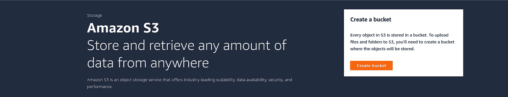
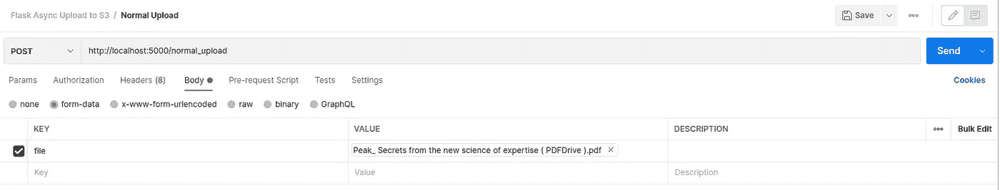

# Python Flask:异步上传到 AWS S3

> 原文：<https://levelup.gitconnected.com/python-flask-asynchronous-upload-to-aws-s3-ad0841358e6f>

使用 threading 和 Celery 将文件上传到 AWS S3 时实现亚秒级响应


照片由[瑞典蓝水](https://unsplash.com/@bluewaterglobe?utm_source=medium&utm_medium=referral)在 [Unsplash](https://unsplash.com?utm_source=medium&utm_medium=referral) 上拍摄

有时，您的客户要求您想办法上传一个相对较大的文件，但尽管您不能立即知道上传过程的结果，但仍然相对较快。

再看另一个场景，有时您可能需要对存储在 CSV 或 Excel 文件中的文件或数据进行预处理，在它们到达您的数据湖或数据库之前，需要完成几个步骤。

通常，上传(或额外处理)数据需要时间，我很确定用户等待这个过程完成是很奇怪的。如果是这样的话，那么异步上传会给你带来很多好处。

在本文中，我们将研究几种同步和异步上传文件的方法。让我们直入主题吧！

# 准备

在进一步编写代码之前，让我们先准备好启动项目所需的所有东西。

首先，确保您有 AWS 访问密钥和秘密访问密钥。因为这是上传我们的文件到 S3 桶的关键。

之后，我们需要创建一个 S3 桶。到你的 AWS 控制台，搜索 S3，然后点击“创建桶”。现在，您可以填写存储桶名称(它必须是唯一的名称)和区域(让您和您的用户知道)，出于本教程的考虑，我们将授予公众对我们的 S3 存储桶的读取权限。



作者形象

接下来，转到您新创建的 bucket，并转到 Permissions 选项卡。然后，使用以下 JSON 添加/编辑存储桶策略:

记得把`BUCKET_NAME`改成自己的桶名。

为了存储敏感数据，我们将使用`.env`。因此，在项目的根目录下创建`.env`。

将您的 AWS 访问密钥和秘密访问密钥放在那里，同时附上 S3 存储桶名称和 S3 存储桶基本 URL。通常，您的 S3 存储桶基本 URL 会是这样的格式:`https://<BUCKET_NAME>.s3.<REGION>.amazonaws.com`，例如`[https://mybucket.s3.ap-southeast-1.amazonaws.com](https://flaskasyncbucket.s3.ap-southeast-1.amazonaws.com)`。

最后，为了确保我们可以在本地机器上运行 Celery，我们需要 Docker 和 docker-compose。如果你没有安装这些，那么你可以按照这个文件[https://docs.docker.com/engine/install/](https://docs.docker.com/engine/install/)

# 编码时间

在上一节中，我们创建了 S3 存储桶，并授予了公共读取权限。还确保我们安装了 Docker 引擎和 docker-compose，以及 AWS 访问密钥和秘密访问密钥。

在这一节中，我们将通过首先创建一个虚拟环境来开始构建我们的项目。运行以下命令创建一个虚拟环境:

```
python -m venv venv
```

然后通过运行以下命令激活虚拟环境:

```
# Mac OS / Linux
source venv/bin/activate# Windows
venv\Scripts\activate
```

现在，安装所需的依赖项:

```
pip install flask Flask-SQLAlchemy boto3 celery
```

对于配置，让我们创建一个名为`config.py`的文件，并将代码放在那里:

这里，我们创建了一个 Config 类来存储所有必需的信息(包括敏感数据)，并创建了一个 Celery 实例来定义 Celery 的任务。

由于我们实际上是将文件上传到 S3 存储桶，并且我们需要知道这些文件存储在哪里，因此我们需要一个数据库来存储目标文件的 URL。为此，创建一个名为`models.py`的文件，内容如下:

这里，我们定义了一个名为 File 的模型实体，带有字段`id`、`name`、`url`和`upload_status`。对于上传状态，它是一个枚举，所以它只能在四个值之间，`PENDING`、`PROCESSING`、`COMPLETE`和`ERROR`。这个状态很重要，因为我们将异步上传我们的文件，所以用户不需要等到上传过程完成，但他/她可以立即检查上传状态。

现在是上传功能。创建`file.py`并将它放在那里:

对上述代码片段的解释:

*   我们总共有四个功能，与上传文件相关。第一个是`rename_file`，顾名思义，这个函数会通过结合原始文件名和当前时间戳来重命名我们想要上传的文件，同时也保证一个用户在第一时间提供正确的文件名。
*   对于`process_file_to_stream`，我们需要这个函数将文件类型对象转换成字节流，因为我们不能直接将文件类型对象的参数给线程或 Celery 任务中的可调用函数。实际上，还有另一种方法可以做到这一点，即临时存储该文件，然后将其上传到 S3 存储桶。还要注意有一个参数`to_utf8`，如果我们想要使用 Celery 上传文件，就会用到这个参数，因为不可能向 Celery 的任务发送字节(基本上是因为发送到 Celery 的任务的所有数据都必须是 JSON 可序列化的)。
*   `upload_file`是将文件上传到 S3 桶的正常同步方式。我们不需要将其转换成字节流，我们可以使用`boto3`的`upload_fileobj`函数直接上传。
*   在`upload_file_from_stream`中，我们将字节或 utf8 字符串转换成一个文件类型的对象。然后我们就可以用`upload_fileobj`正常上传了。

在开始测试我们的项目之前，我们需要通过端点打开所有定义的函数。让我们创建一个名为`routes.py`的 Python 文件:

对上述代码片段的解释:

*   这是不言自明的，对吗？😊
*   `normal_upload`:此端点使用同步上传功能。因此用户需要等到上传过程完成。
*   `async_upload`:这个端点使用线程来处理上传过程。因此，该函数将立即返回，而不必等到进程完成。注意，在第 51 行，我们创建了一个线程实例，并为它提供了一个可调用函数，以及运行该可调用函数所需的参数。在`__async_upload`定义中，我们使用应用程序上下文，因此我们可以与应用程序或数据库交互。
*   `celery_upload`:该端点需要定义 Celery 的任务。我们现在就去做。

让我们定义一下在`celery_upload`中使用的芹菜的任务:

很简单，对吧？首先，使用`file_id`获取一个文件实体，并使用`upload_file_from_stream`上传文件(以包含字节流、文件名、内容类型等的文件字典的形式)。然后，如果一切正常，提交完成状态，如果发生异常，提交错误状态。

最后，在`app.py`中组合所有这些代码。这是我们项目的切入点。

一切就绪后，现在我们可以测试我们的项目了。但是首先，如果我们想测试芹菜上传端点，我们需要 Dockerfile 和 docker-compose。

创建`Dockerfile`和`docker-compose.yaml`:

# 健全性检查

让我们通过运行来运行我们的项目:

```
docker-compose up
```

这个命令将创建三个容器，应用程序、Redis 实例和 celery worker。

进入[http://localhost:5000/normal _ upload](http://localhost:5000/normal_upload)测试正常上传。为表单数据提供键`file`和要上传的文件的值。



你可以对`/async_upload`和`/celery_upload`做同样的事情。

完成上传请求需要多长时间？在我的情况下，如果没有非常快的互联网连接，使用普通上传需要 5 秒钟上传一个 10MB 的 PDF 文件，使用异步上传不到 100 毫秒，使用芹菜上传需要 100-200 毫秒。你呢？

免责声明，上述数字肯定不是基准测试的具体证据。因此，要做出这样的声明，最好进行负载测试。如果您对负载测试感兴趣，我可以为您提供很好的资源:

[](https://medium.com/nerd-for-tech/load-testing-using-locust-io-f3e6e247c74e) [## 使用 Locust.io 进行负载测试

### 在我们的应用程序或服务运行后，有一段时间我们想知道性能和负载…

medium.com](https://medium.com/nerd-for-tech/load-testing-using-locust-io-f3e6e247c74e) [](/load-testing-with-k6-48488c7946bb) [## 使用 k6 进行负载测试

### 仅使用一种工具的一系列负载测试功能

levelup.gitconnected.com](/load-testing-with-k6-48488c7946bb) 

# 结论

我们已经看到了如何使用几种方法将文件上传到 AWS S3 bucket，普通上传、使用线程上传和使用 Celery 上传。一般来说，我们可以根据需要暂停线程和作业队列的使用，在这种情况下，当用户上传文件时实现亚秒级响应。

如果您想要预处理上传的文件，也可以使用此场景，例如为图像制作不同大小的多个副本，以及为您的数据科学项目清理数据点。

以下是本文的编码材料:

[](https://github.com/agusrichard/flask-workbook/tree/master/async-upload-to-s3) [## flask-workbook/async-upload-to-S3 at master agusrichard/flask-workbook

### 用 Flask 学习 Web 开发项目。为 agusrichard/flask-workbook 开发做出贡献，创建一个…

github.com](https://github.com/agusrichard/flask-workbook/tree/master/async-upload-to-s3) 

感谢您的阅读和快乐编码！