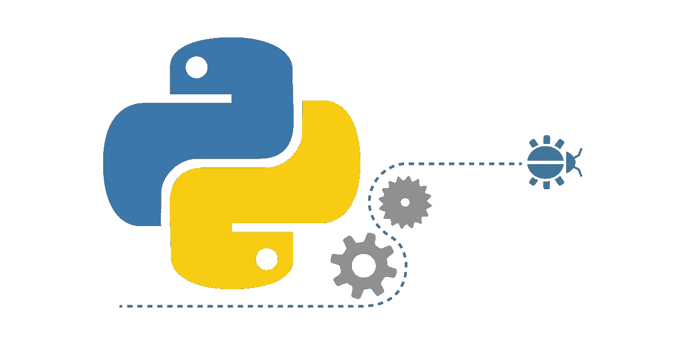
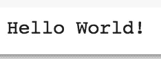
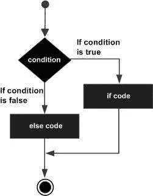

# 完全初学者的 Python 快速入门

> 原文：<https://levelup.gitconnected.com/python-for-absolute-beginners-a-quick-primer-c7db94a5d0e>

## 关于 Python 的快速入门，让您接触数据科学



1989 年，目前在 Dropbox(之前在谷歌)工作的荷兰程序员[吉多·范·罗苏姆](https://en.wikipedia.org/wiki/Guido_van_Rossum)发明了 Python。直到最近，它才成为一种流行语言。由于它在机器学习项目中的采用和许多库的可用性，它的受欢迎程度呈指数级上升。

为了在数据探索、提取、分析和可视化方面出类拔萃，Python 是每个数据科学家都应该掌握的基本技能。

好的一点是，学起来并不难。事实上，Python 是最容易学习和使用的语言之一，前提是您熟悉任何编程语言的基本构件。

在本帖中，我们提供了一种快速掌握 Python 的简单方法。我们假设没有预先的编程知识。因此，这是绝对的初学者。在本教程中，我们将介绍诸如变量、函数、循环、条件等构建模块，以帮助您熟悉编程的基础知识。在这篇文章的最后，我们将介绍 Python 中一些流行且强大的数据结构，它们可以帮助您高效地存储和处理数据。

Python 是一种解释型语言。(仅供参考，C/C++都是编译语言。)
一旦你写了代码，编译器会从文件的顶部开始一行一行地执行。

如何编写和运行本教程中的程序？—你可以将这些代码复制并粘贴到免费的 Python 笔记本中，例如 [Google Colab](https://colab.research.google.com) 。这是一个现成的 Python 环境，你可以把它当作你的游乐场。另一种选择是安装 python，并通过在终端或命令提示符下键入`python`来使用交互式 shell。


自己写代码！

我们相信边做边学。因此，我们强烈建议您尝试一下代码片段，以便更好地掌握它们。复制它们，修改它们，添加更多的行，这样做你理解和记忆更多。

Python 最流行的版本有哪些？— Python 有两个主要版本:2 和 3。我们鼓励您使用版本 3，因为它已经存在了一段时间，并且支持大多数 Python 库。

别兜圈子了。让我们开始吧。

## 第一个程序

第一个 Python 程序

第 1 行和第 2 行是 Python 注释。Python 注释前面写有一个`#`符号。编译器不执行注释；它们供您参考，以便您可以在以后理解您的代码，也供他人理解。

第 3 行是第一个程序的真正内容。它告诉计算机打印“你好，世界！”到你的电脑屏幕上。当您运行上述程序时，您将看到以下输出:



第一个程序的输出

`print`是 Python 定义的*内置函数*。我们将使用`print`和许多其他的 Python 内置函数来使我们的生活变得更容易。

## 编程风格

在我们继续深入之前，我们想让您体验一下如何用 Python 编写程序。编写 Python 代码有三种主要方式。

1.  无社会组织的
2.  程序的
3.  面向对象

在*非结构化编程*中，你把代码写成一个大的整体文件。不鼓励对大型程序使用这种写作风格，因为它很难管理。然而，对于小代码片段，就像我们在本教程中要做的，这是一种方便的编写程序的方式。

在*过程化编程*中，我们将代码分组为称为函数的功能单元。这里涉及到两个步骤:

*   **定义**(写)该功能
*   **调用**(调用)该功能

您只需编写一次函数，就可以调用任意多次来执行它。在这篇文章中，我们将主要使用非结构化和过程化的编码风格。

在*面向对象编程*中，你识别蓝图并为每个蓝图创建所谓的类。我们将在以后的文章中探索 Python 中的面向对象编程。

如果上面的描述听起来很复杂，也不用担心。这只是搭建舞台。随着我们继续深入，你会更好地理解它。

## 变量

变量是内存中的占位符，可以存储不同的数据。

在基本数据类型中，您可以有数字(例如整数或浮点)或字符串变量。根据变量的类型(即字符串或数字)，Python 会分配不同的内存量。

与 C、C++或 Java 等编程语言不同，创建变量时不需要指定数据类型；Python 会自动为您推断类型。因此，Python 被称为一种*动态类型的*语言。知道一些像这样的行话来打动别人是很好的:)

假设你已经在电脑上安装了 Python 3，你可以通过输入`python`打开一个 shell(在 Windows 命令提示符和 MAC/Unix 中，终端)来执行交互式编码。

它会带你到这里。[因为我已经安装了多个版本的 python，所以我通过键入 python3.6 来调用 Python 3]

```
$ python3.6
Python 3.6.1 (v3.6.1:69c0db5050, Mar 21 2017, 01:21:04) 
[GCC 4.2.1 (Apple Inc. build 5666) (dot 3)] on darwin
Type "help", "copyright", "credits" or "license" for more information.
>>>
```

现在让我们用这个外壳来探索变量。(您可以使用 Python 笔记本代替)

```
#integer variable
>>> x = 25
>>> print(x)
25
```

变量 x 存储值 25。由于 25 是一个整数，Python 推断变量 x 的类型是 integer(简称 int)。

```
#string variable
>>> name = "Alice"
>>> print(name)
Alice
```

名为 name 的变量存储值“Alice”。由于“Alice”是一个字符串，Python 推断变量“name”是字符串类型。

```
#assigning multiple times
>>> x = 25
>>> x = 10
>>> print(x)
10
```

当您多次分配变量值时，旧值会被新值替换。在上面的例子中，值 25 被替换为 10。x 始终只有一个占位符值。

## 数字和字符串

除了整数，Python 还支持其他数值数据类型，比如浮点数。举个例子，

```
#floating point numbers
>>> z = 1.53
>>> print(z)
1.53
```

数字变量支持标准的数学运算，如加、减、乘、除和取模。

```
# Numerical operations
>>> a = 10
>>> b = 20 #addition
>>> print(a+b)
30 #subtraction
>>> print(a-b)
-10 #division
>>> print(a/b)
0.5 #modulus
>>> print(b%a)
0
```

你如何做 a 和 b 的乘法？

假设我们有另一个变量 c，它的值是 30。如何在一条语句中将三个变量值相加？

现在让我们来看看弦乐。

```
#define string variable firstname and assign value "Tim"
>>> firstname = "Tim" #print string
>>> print(firstname)
Tim #print the first character of the string variable
>>> print(firstname[0])
T#print the second character of the string variable
>>> print(firstname[1])
i #print the length of the string
>>> print(len(firstname))
3#print the first and second characters
>>> print(firstname[0:2])
Ti #print the second and third characters
>>> print(firstname[1:3])
im
```

注意，字符串的作用类似于字符的*数组*。数组是一种可以保存多个相同类型值的数据结构。

在本例中，`firstname`是一个字符数组。它包含三个字符:T、I 和 m。注意，索引从 0 开始(不是 1！).所以，数组中的第一个元素是`firstname[0]`。

更多字符串操作:

```
#string concatenation (combining strings)
>>> lastname = "Cook"
>>> fullname = firstname + " " + lastname
>>> print(fullname)
Tim Cook
```

注意，`fullname`变量是三个字符串的串联——两个变量`firstname`和`lastname`以及一个常量字符串“”。

问:如果我们从上面的`fullname`变量中移除常量字符串会发生什么？

定义一个变量来存储“Hello World！”。如何从这个变量中只打印“Hello ”?

## 功能

函数是一个有组织的代码块，可以通过简单地调用它的名字来反复使用。不管您是否了解，我们已经使用了 Python 自带的一些内置函数。

`print()` —打印函数，接受一个参数，它只打印传递给屏幕的参数。例如 print(firstname) —它打印 firstname 变量的值。

`len()` — len 函数，接受一个参数，一个列表/数组，它输出列表中元素的数量。记住字符串是一个数组，len 函数返回字符串中的字符数。例如 len(firstname) —它返回名字字符串的长度。

函数的语法:

```
def function_name(arguments):
    <function body>
```

`def`是一个关键字，表示您正在定义一个函数。

function _ name——由您定义，通常名称反映了函数的功能。例如，函数`calculate_tax`很可能具有计算税收的业务逻辑。

自变量—这些是输入参数；一个函数可以有零个或多个参数。例如`len()`带 1 个实参。

function _ body——这些是常规的 python 语句——注意，它们应该来自函数名，以便 Python 知道代码属于该函数。

一个函数可能会也可能不会返回一个值。例如，`len()`函数返回输入参数的长度，而`print()`函数不返回任何内容；它只是将输入参数打印到屏幕上。

上面的代码定义了一个名为`add`的简单函数。它需要两个参数`x`和`y`。

在函数体(第 3 行)中，我们计算两个输入参数的和。由于这是一个数学运算，该函数需要数字输入参数。

在第 4 行，我们返回计算出的值。注意`return`是 Python 的保留字，专门用于从函数中返回值。

在第 7 行，我们通过传递 10 和 20 作为输入参数来使用函数。

第 8 行打印 30 的结果。

在第 11 行，我们通过传递不同的参数 5 和 9 来重用该函数。这一次，它打印 14 个。

问:你能写一个名为`sub`的函数，它接受两个参数并返回两个参数的差吗？

如前所述，我们想重申一个事实，函数不一定总是返回值。

在 python 交互式提示符下调用上面的函数:

```
>>>foo()
This function does not return any value
```

注意，它只是在屏幕上打印一些东西。屏幕上的打印不返回。函数中应该有一个 return 语句，以便从函数中返回一些内容。

## 情况

使用条件时，您需要在两个代码路径之间做出决定。



if-else 控制块

如上图所示，如果条件为`true`，Python 执行“if 代码”块，否则执行“else 代码”块。

上面的代码片段还使用了我们已经学过的另一种语言结构——函数。

所以我们有:

```
function
   |
   |________ if-else block inside the function
```

你能猜到如果你打电话会发生什么吗，`test_condition(1)`？

```
>>>test_condition(1)
SUCCESS
```

上面的函数有一个 if-else 代码块。如果 x 等于 1，则打印“成功”，否则打印“失败”。

该条件被称为布尔表达式。这是因为它评估为`True`或`False`。

如果`True`，则执行 if-block。

如果`False`，则执行 else-block。

如果调用`test_condition(5)`会发生什么？

是的，你猜对了，它打印失败了。

```
>>>test_condition(5)
FAILED
```

一些示例条件(布尔表达式) :

`x == y` →检查 x 值是否等于 y 值

`x > y` →检查 x 是否大于 y

`name == “Tim”` →检查姓名是否等于 Tim

`len(name) == 5` →检查名称字符串变量的长度是否为 5

写一个布尔表达式来检查 x 是否小于 y。

## 环

在 Python 程序中，通常代码是从上到下顺序执行的。但是，如果要重复运行一段代码，就需要使用循环。

有两种主要的循环:

*   `While`循环
*   `For`回路

让我们每个人都试一试

**While 循环**:其语法如下:

```
while (condition):
    code-block
```

当`condition`为`True`时，代码块被重复执行。

让我们看一个例子:

```
x = 0
while x < 5:
    x = x + 1
    print(x)
```

你能猜出上面代码片段的输出吗？

循环的条件是 x < 5 — as long as x is less than 5, the condition is True and hence Python executes the code block inside the while loop.

When the control first enters the while loop, x is 0, the condition is satisfied. The first line in the while code block, increments the value of x by 1 (so it become 1). Then it prints x (which is 1).

Now the control goes back to the beginning of the while loop. Python evaluates the condition. Now x is 1\. Since 1 is less than 5, the condition is satisfied.

Next, it again increments the value by 1 — so now x is 2.

It then prints value 2.

…

It continues like this. At some point, inside the while loop, x gets incremented to 5\. It prints 5 inside the loop. Then, it goes back to the top of the while loop. Now x is 5, 5 is not less than 5, the condition is not satisfied and Python does not execute the while loop anymore.

So, the output is:

```
1
2
3
4
5
```

Can you guess the output of the following code?

```
x = 10
while x > 0:
    print(x)
    x = x - 2
```

Hint: It prints 5 numbers.

**:**

还有一种流行的循环类型叫做“for-loop”。for 循环的语法如下:

```
for <a collection value> in <some collection>:
    code-block
```

如果你不理解上面写的内容，不要担心，让我们通过一个例子来理解它。

在此之前，我想向大家介绍一下 Python 的内置函数范围。`range()`创建一个数字序列。让我们看一些例子。

```
range(1, 5)
```

这将创建 1、2、3 和 4 的序列(请注意，5 被排除在外)。

另一个例子:

```
range(0, 10, 2)
```

第三个参数是步长。默认步长为 1。这将打印 0、2、4、6 和 8。

我们可以用它来编写我们之前用 for 循环编写的 while 循环。

```
for x in range(1, 6):
    print(x)
```

对于第二个 while 循环示例:

```
for x in range(10, 0, -2):
    print(x)
```

在 Python 中，for 循环经常被用来做更酷的事情。我们将在本教程的后面探索一些。

## 图书馆

库提供了开箱即用的功能。事实上，Python 最近变得如此流行主要是因为大量库的可用性。你说出你想做的事情——我打赌有一个 Python 库可以让你的生活变得更容易。

例如，假设您想要读取命令行参数。有一个名为`sys`的标准库可以帮助你做到这一点。

首先，你需要把这个库`import`到你的程序中，然后使用它的函数。假设您正在创建一个名为`first.py`的文件，并希望打印作为第一个命令行参数传递的内容。

```
import sysfirst_argument = sys.argv[1]
print(first_argument)
```

现在，您按如下方式运行该程序:

```
python first.py Hello
```

`sys.argv[1]`存储第一个参数的值，即“Hello”。所以，你的程序会在屏幕上打印 Hello。

随着你对 python 的熟悉，你会和很多 Python 库成为朋友，比如`pandas`、`matplotlib`、`numpy`、`scikit-learn`等等。

现在让我们写一个程序来接受两个命令行参数:`second.py`

```
import sys
first_argument = sys.argv[1]
second_argument = sys.argv[2]
print("{} {}".format(first_argument, second_argument))
```

现在，您正在运行如下代码:

```
python second.py Hello World!
```

对输出有什么猜测吗？是的，你是对的；上面印着“你好，世界！”在屏幕上。第一个参数是“Hello”，第二个参数是“World！”。

## 数据结构:列表

Python 列表包含一个值列表，可以是不同的类型。例如，整数和字符串值一起。创建列表后，您可以添加或删除列表中的项目。

示例:

```
# A list with values
names = ["Alice", "Bob", "Eve", "Tim", "Malory"]
```

您可以创建一个空列表，如下所示:

```
names = list()
```

追加到列表，将新项目添加到列表的末尾。

```
names.append("Thomas")
names.append("Mary")
print(names)
```

输出是:

```
["Thomas", "Mary"]
```

遍历列表:

```
names = ["Thomas", "Mary", "Tim"]
for name in names:
    print("Student: {}".format(name))
```

输出是:

```
Student: Thomas
Student: Mary
Student: Tim
```

注意我们是如何编写 for 循环的。循环选择每一项，并将其分配给名为“name”的变量，您可以在循环中使用该变量来编写您的业务逻辑(在本例中，只是在屏幕上打印)。

另一个例子:

```
# A list of numbers
ages = [25, 30, 22, 26, 32, 35, 31, 22, 27]
```

我们如何计算平均年龄？

我们需要将所有值相加，然后除以条目数。我们可以从`len(ages)`函数中得到条目的数量。

```
count = len(ages)
sum = 0
for age in ages:
    sum = sum + age
avg = sum / count
print("Average age is {}".format(avg))
```

输出是

```
Average age is 27.77777777777778
```

让我用下面的代码片段(同上，但是有行号)来解释这里发生了什么。

第 1 行:我们定义了一个名为 ages 的列表，并用所有年龄值进行初始化。

第 2 行:计算年龄列表中条目的数量，并存储在名为`count`的变量中。`len`是一个内置的 Python 函数。

第 3 行:将名为`sum`的变量初始化为零。我们将使用这个变量来合计所有的年龄值。

第 4 行:对于循环头代码——我们从 ages 中挑选每个条目，并将其分配给名为`age`的变量。

第 5 行:在每次迭代中将`age`的当前值加到变量`sum`中

第 6 行:现在我们在 for 循环之外。我们只是取平均值。

第 7 行:将平均值打印到屏幕上。

你能写一个 for 循环来找出最大年龄吗？

## 数据结构:集合

Python `Set`与 List 非常相似，除了一个集合只能保存唯一的值，不像 List 那样有重复值。

```
# set with initial values
coin_sides = {"Head", "Tail"}# an empty set
colors = set()
```

并排设置和列出:

```
>>> myset = set()
>>> mylist = list()>>> myset.add("Apple")
>>> mylist.append("Apple")>>> print(myset)
{'Apple'}>>> print(mylist)
['Apple']
```

如果我们再把“苹果”加到两个上面会怎么样？有什么猜测吗？

```
>>> myset.add("Apple")
>>> mylist.append("Apple")
>>> print(myset)
{'Apple'}
>>> print(mylist)
['Apple', 'Apple']
```

是的，您明白了——set 只保存每个不同值的一个副本，而 list 保存所有的副本。

```
>>> myset.add("Orange")
>>> mylist.append("Orage")
>>> print(myset)
{'Orange', 'Apple'}
>>> print(mylist)
['Apple', 'Apple', 'Orage']
```

循环与循环列表的方式非常相似:

```
for fruit in myset:
    print(fruit)
```

输出是:

```
Orange
Apple
```

## 数据结构:字典

Python `dictionary`是另一种流行的数据结构，它允许您存储键值对。

```
students = {"Alice":10, "Tim": 5}
```

`students`是一本有两个词条的 Python 字典。键是“爱丽丝”和“蒂姆”，值是 10 和 5。

创建字典的另一种方法是:

```
students = dict()
students["Alice"] = 10
students["Tim"] = 5
```

如何迭代字典:

```
for key, value in students.items():
   print("Key = {} Value = {}".format(key, value))
```

您将获得以下输出:

```
Key = Alice Value = 10
Key = Tim Value = 5
```

迭代字典的另一种方法(注意，与上面的方法相比，这种方法效率较低，所以不推荐)

```
for key in students:
   print("Key = {} Value = {}".format(key, students[key]))
```

您会得到与上面相同的输出。

## 文件输入输出

作为一名数据科学家，您经常读写文件。我们现在要展示基本的文件操作。

假设我们有一个名为“data.csv”的文件，它包含以下逗号分隔的值:

```
Alice,10
Tim,5
Mary,8
```

第 1 行:打开名为“data.csv”的文件进行读取(“r”表示读取)

第 3 行:遍历文件中的每一行——每一行都被复制到名为“Line”的变量中

第 4 行:`split`行变量中的值被“，”—这创建了一个两个元素的数组；我们将该数组存储在名为 values 的变量中

第 5 行:我们打印这两个值

第 7 行:我们关闭文件。

输出如下所示:

```
Name = Alice Age = 10
Name = Tim Age = 5
Name = Mary Age = 8
```

下面是使用关键字“with”编写相同代码的另一种方法。注意，在这种情况下，我们没有调用 close()。

现在让我们写入一个文件。比方说，我们想把下面的内容写到一个文件中。

```
Apple
Orange
Grape
```

第 1 行:我们把要写的内容保存在一个名为 fruits 的列表中。

第 3 行:打开名为“fruits.txt”的文件进行写入。“w”代表写作。

第 5 行:遍历水果列表中的每个水果。

第 6 行:写出每种水果。请注意，我们在每次写入时都添加了一个新的行字符“\n ”,以确保每个水果都写入一个新行。

第 8 行:写完之后，在循环之外，我们关闭文件。

今天到此为止。我们希望你喜欢我们的文章，并学习了 python 的基础知识。

为了掌握 Python(或任何其他编程语言)，练习编写自己的代码是很重要的。

有了这些基础知识，我们希望您能够理解互联网上的大量代码片段。

编码快乐！

## 参考

*   [StackOverflow](https://stackoverflow.com/)
*   [教程要点](https://www.tutorialspoint.com/python/python_variable_types.htm)
*   [W3C 学校](https://www.w3schools.com/python/default.asp)
*   [gitconnected](https://gitconnected.com/learn/python)

[](https://levelup.gitconnected.com/)[](https://gitconnected.com/learn/python) [## 学习 Python -最佳 Python 教程(2019) | gitconnected

### 77 大 Python 教程。课程由开发者提交并投票，让你找到最好的 Python…

gitconnected.com](https://gitconnected.com/learn/python)