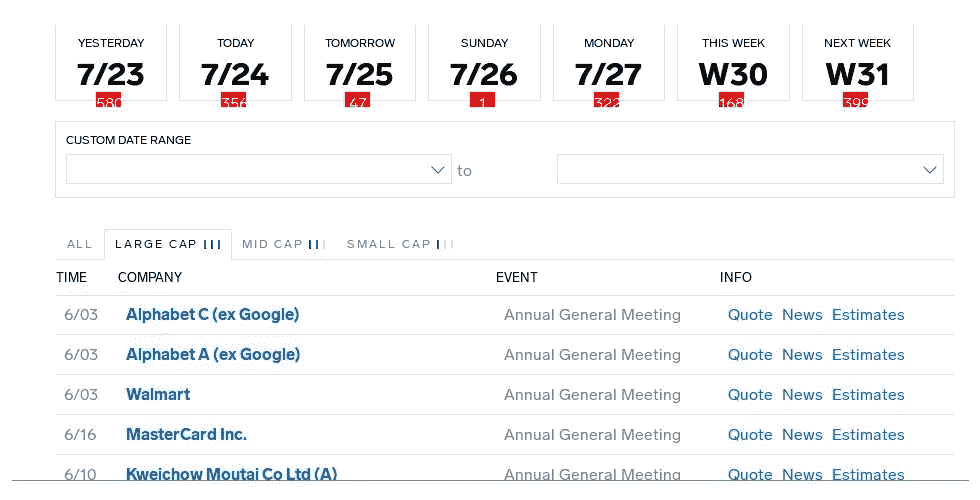
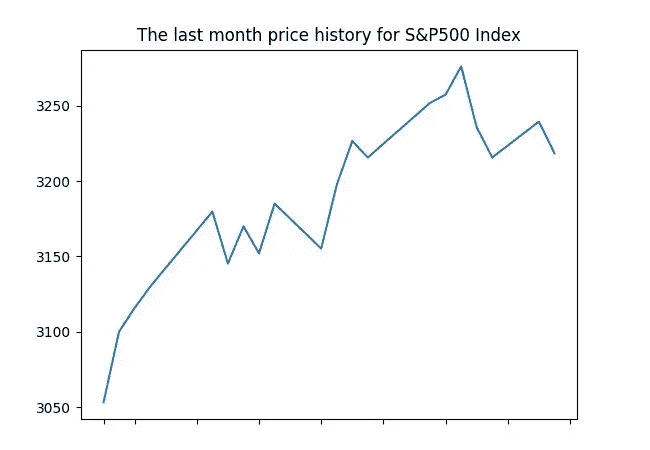
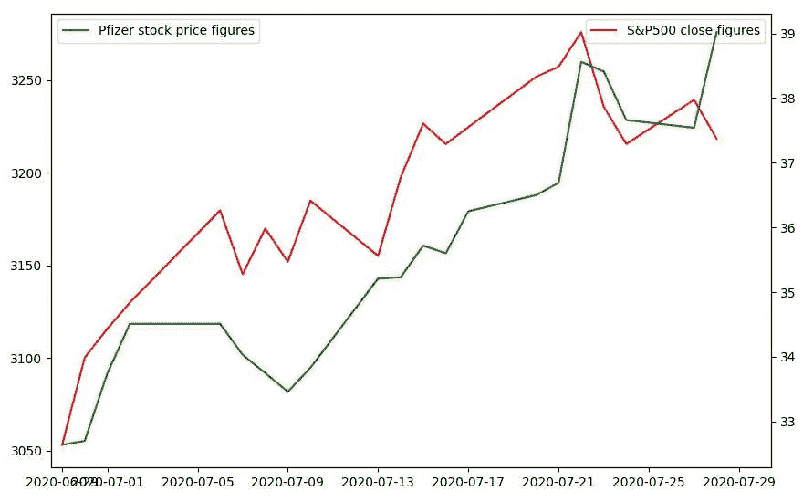
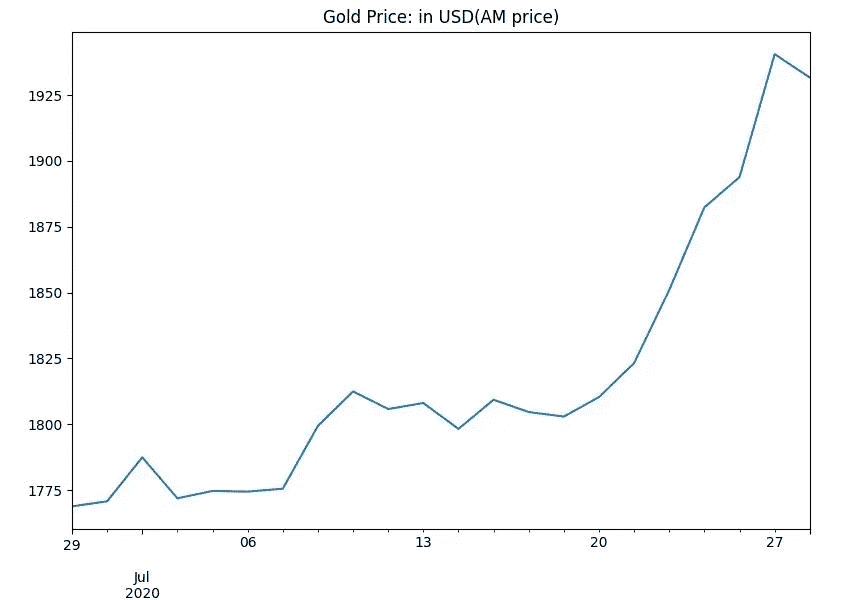
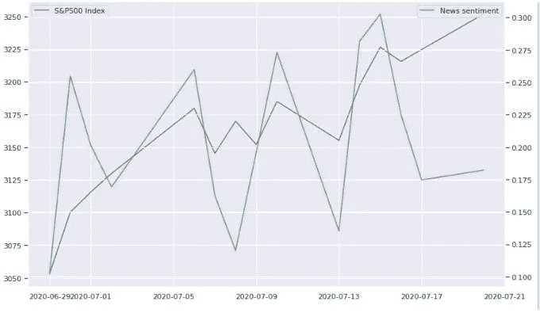

# Python For Finance:使用脚本提高您的股票交易性能

> 原文：<https://levelup.gitconnected.com/python-for-finance-improve-your-stock-trading-performance-with-scripting-d3f32b7ac124>


照片由伊戈尔·沙巴林拍摄

> 如果你在寻找提高股票投资技巧的方法，你肯定会发现“做一些研究”是其中之一。

是否买入、卖出或持有股票的决定通常是基于情绪做出的，这绝对不是最佳策略。为了做出平衡的选择，你需要通过权衡任何可能的决定的利弊来提高你的逻辑并减少你的情绪。做出明智决策的能力可以帮助你在竞争中领先。本文使用 Python 脚本语言，快速概述了一些可以用来提高股票投资技能的技巧。

# 什么时候买？

对于那些参与股票交易的人来说，这可能是最重要的问题之一。众所周知，股票最显著的价格波动通常发生在与公司相关的事件的前一天、当天和第二天，例如公司的年度股东大会或季度收益报告。

为了实现这里提出的想法，你需要有一个收益日历，包括已知公司最重要事件的信息。你会在 https://markets.businessinsider.com/earnings-calendar 找到一个。下面的屏幕截图包括您应该在浏览器中看到的收益日历片段:



值得注意的是，股票可能会对不在收益日历中但对公司有意义的事件做出反应。例如，可能是更换首席执行官或大型收购等。通常，这类事件不会不被媒体注意到。因此，分析新闻报道可以直接或间接地表明市场的预期。我们将在本文后面的检查新闻报道部分触及金融新闻情绪分析。

# 探索股票数据

如果您已经浏览了上一节介绍的收益日历中的事件列表，您可能已经选择了上个月的某个事件，与某个公司相关。比方说，辉瑞公司的 Q2 2020 年收益计划于 7 月 28 日公布。所以，现在让我们研究一下这家公司 7 月 27 日和 7 月 28 日的股价，看看股票是否对这一事件做出了反应。

使用 Python，可以使用像 Yahoo Finance API 这样的 API 来实现对某个公司的股票价格进行操作。

```
import yfinance as yf
pfe = yf.Ticker('PFE')
hist = pfe.history(period="5d") 
pfe_close = hist[['Close']]
pfe_close.sort_values(by = 'Date', ascending=False).head(2)Close
Date 
2020–07–28 39.02
2020–07–27 37.54
```

正如你所看到的，股票在一天内增长了大约 4%。

# 你的投资真的有利可图吗？

乍一看，这个问题的答案似乎非常明显:如果你成功地卖出了高于买入的价格，那么这个操作可以被认为是有利可图的。然而在现实生活中，没有人使用这样简单的逻辑。如果你得到的利润和你投资其他股票的利润差不多，会怎么样？你还能认为你的投资有利可图吗？或许，如果一项投资能让你获得比 S&P500 指数更高的回报，它就可以被认为是有利可图的。

# 与 S&P500 指数核对

因此，检查与 S&P500 指数是一个很好的方法来衡量你的股票业务的盈利能力。首先，你如何获得指数数字？下面的代码解决了这个问题，获得了上个月的 S&P500 数据:

```
import pandas_datareader.data as pdr
from datetime import date, timedelta, datetime
end = date.today()
start = datetime(year=end.year, month=end.month-1, day=end.day ) 
spx_index = pdr.get_data_stooq('^SPX', start, end)
```

要在图上查看 S&P500 指数上个月的数字，可以生成如下图:

```
import matplotlib.pyplot as plt
plt.title(‘The last month price history for S&P500 Index’)
plt.plot(spx_index[‘Close’]) 
plt.show()
```



现在让我们来看看 S&P500 指数的变化与同一时期(上个月)辉瑞股价的变化之间的关系:

```
import yfinance as yf
pfe = yf.Ticker('PFE')
hist = pfe.history(period="1mo") 
pfe_close = hist[['Close']]
```

为方便起见，将这些图合并成一个数据帧会很有趣:

```
stock_vs_snp = pfe_close.join(spx_index[‘Close’], how=’left’, lsuffix='_stock', rsuffix='_index').dropna()
stock_vs_snp.sort_values(by = 'Date', ascending=False).head(5)Close_stock Close_index
Date 
2020–07–28 39.02 3218.44
2020–07–27 37.54 3239.41
2020–07–24 37.66 3215.63
2020–07–23 38.41 3235.66
2020–07–22 38.56 3276.02
```

下面的图显示股票价格的增长与指数相当:

```
import matplotlib.pyplot as plt
import seaborn as snsax=sns.lineplot(data=stock_vs_snp['Close_index'], color="r",label='S&P500 close figures')
ax2 = plt.twinx()
sns.lineplot(data=stock_vs_snp['Close_stock'], color="g", ax=ax2, label='Pfizer stock price figures')
plt.show()
```



关于 S&P500 指数的更全面的讨论，你可能也想看看这篇文章。

# 股票还是黄金？

使用标准普尔 500 和道琼斯指数并不是衡量股票投资盈利能力的唯一方法。黄金是另一种选择。通过 Quandl 库，你可以查询伦敦的黄金价格，这是全球公认的国际黄金定价标准。

```
import quandl
from datetime import date, timedelta, datetime
end = date.today()
start = datetime(year=end.year, month=end.month-1, day=end.day ) 
london_fixing_gold_price = quandl.get("LBMA/GOLD",start_date=start, end_date=end, authtoken=<your auth token>)import matplotlib.pyplot as plt
london_fixing_gold_price[‘USD (AM)’].plot(title="Gold Price: in USD(AM price)") 
plt.show();
```



你可以按照上一节中对 S&P500 指数所做的那样，在上图中绘制股票曲线。

# 与新闻报道核对

情感分析是一种文本处理技术。说到投资，你可能会分析金融新闻文章的情绪，试图预测市场走势。作为 Python 用户，您可以利用 News API()，该 API 允许您根据自己的请求获取最相关的新闻文章，例如，“stock”获取关于股票的文章，或者“Apple”获取关于某家公司的文章。

一旦你获得了一组相关的文章，你就可以自动计算出他们的情绪是积极的、消极的还是中性的。由于情绪是用数字表达的，你可以将它与 S&P500 指数进行比较，以了解它与真实市场的关系。



实现细节可以在这篇综合[文章](https://medium.com/@realmistic/use-your-computer-to-make-informed-decisions-in-stock-trading-practical-introduction-part-3-7c520cf32d39)中找到。另外，如果你对 Python 脚本的自然语言处理技术感兴趣，可以看看这个[库](https://github.com/nlptechbook/examples)。

# 结论

然而，正如在开始时提到的，本文提供了一些技巧的快速概述，您可以使用 Python 脚本语言来提高您的股票投资技能。如果你想看更详细的讨论，我会推荐你看看这个[系列](https://medium.com/@realmistic/use-your-computer-to-make-informed-decisions-in-stock-trading-practical-introduction-part-2-832e6f67f590)。