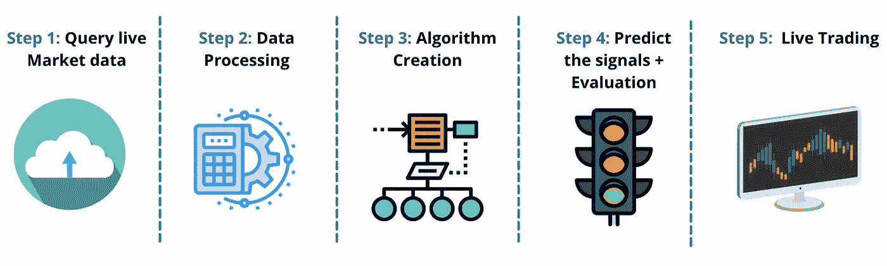
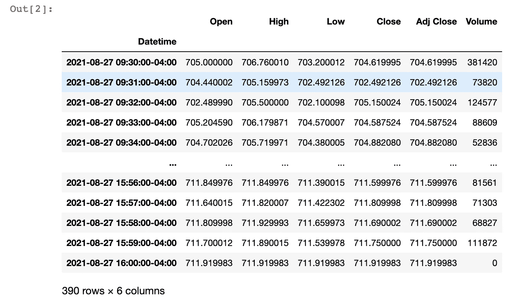
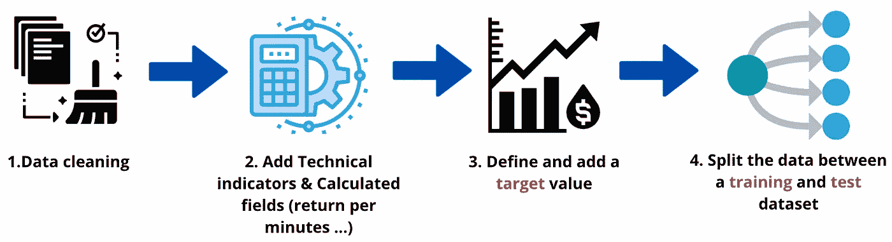
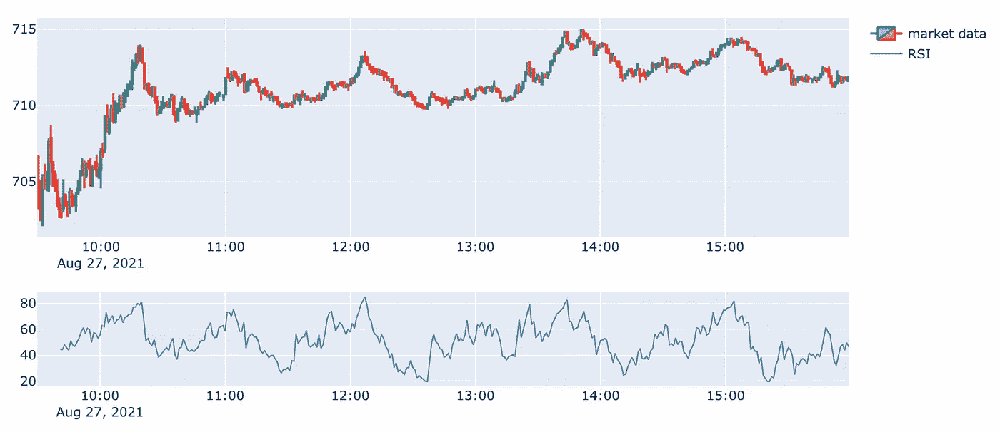

# Python 交易——我如何使用分类算法轻松将我的胜率提高了 22.4%

> 原文：<https://levelup.gitconnected.com/python-for-trading-how-i-used-classification-algorithms-to-easily-enhance-my-winning-rate-by-22-4-6269167fbf93>

## 面向交易者和加密的 Python 故事时间

## 网飞使用了一个错误的机器学习算法，以增加我的技术分析的稳健性，并像高频交易者一样交易。


由于文章的长度和内容的密度，我选择将这篇文章分成两部分。第二部将在 5 天后上映。在第一部分中，我们将经历开发该算法所需的前两个步骤。尽情享受吧！

从数学角度来说，他的文章会比平时更先进一点。如果你是这个领域的新手，在这篇文章的结尾，除了获得完整的解释、代码和细节，你将能够对分类算法是如何工作的有一个总体的了解。

在过去的几个月里，我在[媒体](https://lhessani-sajid.medium.com/)上或通过对冲基金信件发表了一系列文章，内容是关于我在交易库中使用的一些算法。

今天，算法将会更加复杂。然而，如果你从编码开始，或者你渴望了解更多关于这个领域的知识，那将是一个令人兴奋的挑战。

如果按部就班，在算法交易和数据科学方面会更强。

*在本文的最后，你会看到一个发布在*[*Youtube*](https://www.youtube.com/c/AlgorithmicTradingbySajid)*上的视频教程(在那里你会有进一步的解释)，以及一个下载相关 Python 脚本的链接。*

## 开始前

所以在开始之前…

如果你想更进一步，看看更多的例子，你可以浏览下面的文章:

[](https://medium.com/analytics-vidhya/python-i-have-tested-a-trading-mathematical-technic-in-realtime-658a80381151) [## Python:我已经测试了实时交易数学技术。

### 我用 Python 实时测试了一个著名的预测市场的数学技术的实现…

medium.com](https://medium.com/analytics-vidhya/python-i-have-tested-a-trading-mathematical-technic-in-realtime-658a80381151) [](/how-i-tripled-my-return-on-bitcoin-using-mathematics-algorithms-and-python-347edd9b5625) [## 我如何利用数学、算法和 Python 让我的比特币回报率翻了三倍

### 利用黄金线算法，我预测了比特币、Ripple、以太坊和 Dogecoin 的价格演变。完整的 Python 代码…

levelup.gitconnected.com](/how-i-tripled-my-return-on-bitcoin-using-mathematics-algorithms-and-python-347edd9b5625) 

两篇文章都涵盖了一些有趣且健壮的算法，您可以通过一个真实的交易例子来轻松预测市场走势。第一个基于美国市场(SP500 +随机股票)，第二个基于加密货币。

今天提出的算法的附加价值不是产生一种预测市场的新方法，而是**保护**和**放大**当前的技术分析。

# 分类算法和 SVM

本文将介绍的算法是 SVM，称为“支持向量机”。SVM 结合了上世纪 90 年代由 Vladimir Vapnik 和 T2 alexe Tchervonenkis 发明的统计技术，属于分类算法家族。

在实现之前，让我们回顾一下关于分类和 SVM 的一些理论…

## 什么是分类算法？

分类是一种机器学习方法，包括给每个数据点分配一个标签。这包括获取输入并将其运行到分类技术或分类器中，以将其映射到离散的类或类别中。

下面是一个简短的例子:


上面是一个二元分类的例子

这是一个初级二元分类的例子。红色代表高水平，蓝色代表低水平。分类画了一条叫做**的线，一个超平面**(数学上来说:一个函数)来分开两个簇。

分类算法的目标是检测定义数量的具有相同模式的聚类，以预测输出。

在我们的日常生活中，分类算法应用于各个领域，最常见的有**医疗诊断**、**垃圾信息**、**欺诈检测**、**笔迹**、**识别**、**客户**、**细分**、**风险**、**评估**等。

现在，让我们问问自己如何使用这些数学方法来帮助我们的交易决策？

如果你看一下科学文献，五种主要的方法通常被用来将分类应用到现实生活中:

*   k-最近邻算法(KNN)，
*   使用决策树的随机森林，
*   **支持向量机(SVM)**
*   人工神经网络(ANN)，
*   朴素贝叶斯分类。

与我们的案例相关的方法是 SVM。根据文献记载，这种方法越来越多地用于交易领域。根据 google scholar 的数据，自去年以来，引用量增加了 125%以上。

在实现我们的方法之前，让我们看看这种方法是如何工作的，以及与上面提到的分类的主要区别。

## 差异 SVM 与二元/多元分类

多项式次数是我们将使用的算法(SVM 算法)和通常的分类技术之间的显著差异。

下面我们通过一个图来介绍一下区别:


在上面的第三张图中，线性边界不会将消极结果与积极结果分开。在这种情况下，我们将不得不使用非线性决策边界来进行分类。

SVM 分类将通过使用三次方程、二次方程甚至一个 **sigmoid** 方程来优化与边界的距离。支持向量机将选择一条**最优线，最大化边界和任一类中最近点**之间的距离。

这就是为什么在学术界，支持向量机有时被称为最大间隔分类器。

这个例子表明，我们可以通过将复杂的参数拟合到相对简单的 sigmoid 函数来构建更复杂的决策边界。通过使用高阶多项式项，我们可以得到复杂的决策边界，如上图所示。

如果你想了解更多信息，你可以点击这个[链接](https://quantra.quantinsti.com/course/introduction-to-machine-learning-for-trading/?ref=sajidlhessani)。

既然我们已经讨论了背后的数学直觉，让我们开始测试，看看它是如何帮助预测市场的。

> 如果您想以同样的速度编码，需要预先安装一些配置和软件包。

再者，如果你太心急，想知道如何快速实施这个策略，可以直接看本文末尾的录音。我正在现场应用这个策略，你可以自己看看结果:)。

我记录了自己对理论、代码的解释，并给出了开发过程中的额外提示。可以自己在家涂。

# 编码

本部分旨在帮助您逐步开发该算法。如果对代码不感兴趣，可以跳转到结果或者交易机器人的链接。

## 先决条件:

首先，如果你想跟踪我的进度，在开始之前，你需要在你的机器上安装一个 **Python 3** 版本和以下软件包:

*   **熊猫**
*   **NumPy**
*   **y 金融**
*   **Scikit-learn**
*   **Ta-Lib**
*   **密谋** ( *非强制，但对密谋*有价值)

如果这些软件包中的任何一个尚未安装，您可以使用 pip 命令，如下所示。

```
pip install yfinance
pip install plotly
pip install -U scikit-learn
```

对于 Mac 用户:

```
pip install yfinance
pip install plotly
pip install -U numpy scipy scikit-learn
```

一旦您确保安装了以下软件包，我们就可以讨论我们的数据管道和模型了。

## 数据管道和建模:

既然我们已经确认上面的包已经安装在我们的机器中，我们就可以定义数据处理了。

数据模型将分为 5 个不同的步骤。



**首先**，我们将使用**雅虎金融 API** 查询实时加密货币的数据。

**秒**，定义一段时间，为我们计算的字段创建新列，并每秒更新这些值。

**第三个**，现场画这个图，检查我们的信号是否准确。

*在这篇文章中，我不会过多讨论代码和 API 的细节；阅读下面的文章，你可以找到更多关于如何获得实时市场数据的信息:*

[](https://towardsdatascience.com/python-how-to-get-live-market-data-less-than-0-1-second-lag-c85ee280ed93) [## Python:如何获取实时市场数据(滞后小于 0.1 秒)。

### 这篇文章会有点特别。我将测试雅虎财经 Python API 的最新版本…

towardsdatascience.com](https://towardsdatascience.com/python-how-to-get-live-market-data-less-than-0-1-second-lag-c85ee280ed93) 

现在我们已经有了一个清晰的模型计划，我们可以开始编码了！

> ***如果你已经有了使用 Python 的经验，可以跳到第二步。第一步包括导入包和输入数据。***

# 步骤 1:导入所需的包和市场数据。

第一步将包括导入必要的包和我们的初始条目数据。

首先，您将使用以下代码行导入先前安装的软件包:

一旦我们设置好了，并且没有出现错误，让我们继续下一步。

既然库已经导入，我们现在可以导入我们的初始条目数据了。

## 导入市场数据

既然已经上传了所需的不同包。我们将使用**特斯拉**来测试我们的假设。

因此，我们将使用 ***雅虎金融 API*** 调用实时市场数据。

供您参考，雅虎财经 API 将需要 3 个强制参数(更多信息请见上面的文章)，顺序如下:

*   跑马灯 *(1)*
*   *开始日期+结束日期*或期间 *(2)*
*   区间 *(3)*

对于我们的例子，股票代码*(参数 1)* 将是 **TSLA** 。此外，我们将为我们的测试选择一个时间段*(参数 2)* 来获取最新的数据，而不是定义一个开始和结束日期。我们将设置 1 分钟的时间间隔*(参数 3)* ，作为日内交易者。*(你甚至可以选择更短的时间，但一分钟是最佳的)*

*快速提醒一下，特斯拉的股票代号是****TSLA****。*

要调用您的数据，您必须使用以下结构:


以上描述了获取我们感兴趣的市场数据的结构。

现在我们有了结构，让我们运行代码。

下载市场数据的代码行

下面是您应该得到的输出示例:



输出样本

现在我们已经下载并存储了数据，我们可以快速查看数据在图表上的样子，并开始数据处理:


所以一切看起来都很好；我们可以进行第二步:)。

# 第二步:数据处理

数据处理部分将分 4 步工作:



首先，我们需要清理数据，删除零和 NA 值。然后，索引我们的价值观，并添加市场指标。第三，设置一个目标值(我们会在第二篇文章中谈到“目标值”的概念)来评估我们的模型。第四，将数据集分为训练集和测试集。

## 1.数据清理

在开始开发我们的算法之前，需要做一些数据准备。事实上，如果你希望你的算法运行良好，数据的质量是至关重要的。不幸的是，当你进行实时交易时，雅虎财经表格中有时会出现一个小错误。

API 提供的数据总体上是干净的，但是一个变量就可能导致 ***问题*** 。

需要清理的一栏是**交易量**。

事实上，因为时间很短，在我们的数据集中的某个点，Yahoo Finance 显示的交易量为 0。如果我们让它保持原样，它可能会产生离群值，这会破坏算法。

如果你想解决这个问题，我们开始吧:

上面的命令将删除交易量为零的线

## 索引值并添加额外的变量

现在我们有了一个干净的数据集，是时候给你的算法额外的变量来帮助他理解市场了。

我们将添加计算字段，如技术指标和其他有影响的变量，如每分钟的回报，相关系数，移动平均线，前几分钟的信息…

> 在下面的部分中，我只保留了经过敏感性测试后最有趣和最有影响的变量。在第一部分中，将仅涵盖 RSI。另一个变量将在第二篇文章中讨论。

我们将与 SVM 算法相结合的技术指标是 RSI。

对于不熟悉交易的人来说，RSI(相对强弱指数)是一个众所周知的基于动量策略的交易指标。

它将分析市场变化并给出相对强弱指数(RSI)。这是背后的数学原理:


**n** 代表时间段数。

然而，今天，不需要手动开发数学计算。我们将通过使用 Ta-Lib 库来走捷径。我们需要定义的唯一因素是**时间段和**时间段的数量。

**我们将为我们的日交易光学**选择的时间段**是 1 分钟**，时间段**是 14 个**。

为此，我们执行下面的代码行，开始吧:

让我们想象一下！(完整的可视化代码在下面的视频教程中)



一切都好。

看到交易指标的买和卖之间的模式是很有趣的。

在使用 RSI 的基础上，我们将添加额外的变量，使算法更健壮，受离群值的影响更小。

这些变量将在第二部分讨论。第二部分将于 2021 年 9 月 7 日星期三**出版。**所以，想在 [**上订阅**](https://lhessani-sajid.medium.com/) 或 [**Youtube**](https://www.youtube.com/c/AlgorithmicTradingbySajid) 来获取更新。

我爱你们所有人。我希望你喜欢这第一部分；第二部分会更加精彩。

# 在下一篇文章中…

第二部分，我们将开发我们的机器学习，并运行我们的 AI 机器人进行交易！

下面，您可以获得最终结果的示例:


你可以访问下面的完整视频教程，如果你想在家里开发它，还有进一步的解释:

**教程视频**

# 结论

在第一篇文章的结尾，我们已经讨论了以下要点:

*   分类算法背后的直觉
*   如何导入市场数据
*   快速浏览 RSI
*   对市场运动最有影响的一些因素

下一篇文章将在未来几天发布；我不想让它太沉重而无法阅读，只是想订阅不要错过它。我希望你喜欢这篇文章，再见。

快乐编码，

赛义德

# 为了更进一步:

## 推荐内容

如果你想在这个领域更进一步，我可以推荐以下两个课程:

[金融市场的机器学习和深度学习](https://quantra.quantinsti.com/learning-track/machine-learning-deep-learning-in-financial-markets/?ref=sajidlhessani)

[人人算法交易](https://quantra.quantinsti.com/learning-track/algorithmic-trading-for-everyone/?ref=sajidlhessani)

[用机器学习回归交易](https://quantra.quantinsti.com/course/trading-with-machine-learning-regression/?ref=sajidlhessani)

## 需要一对一的教训

如果你需要一个特定的一对一课程来开始学习算法交易和数据科学:

[](https://www.superprof.co.uk/data-scientist-working-banking-and-capital-market-youtube-channel-algorithmic-trading-sajid.html) [## 赛义德-伦敦，大伦敦:在银行和资本市场工作的数据科学家。Youtube…

### 我向学生提出的附加值是基于现实生活中的项目。目标是从初学者到…

www.superprof.co.uk](https://www.superprof.co.uk/data-scientist-working-banking-and-capital-market-youtube-channel-algorithmic-trading-sajid.html) 

## 跟随我的自动交易机器人。

下面是我的交易机器人的一个例子，用来获取加密市场上的每日实时信号:

[](https://t.me/joinchat/lIRlxve7ik1mMGNk) [## Cryptop

### 林克-https://t.me/joinchat/IIQwifpza3BjZTE0

t.me](https://t.me/joinchat/lIRlxve7ik1mMGNk) 

# 完整的 Python 代码—第 1/2 部分