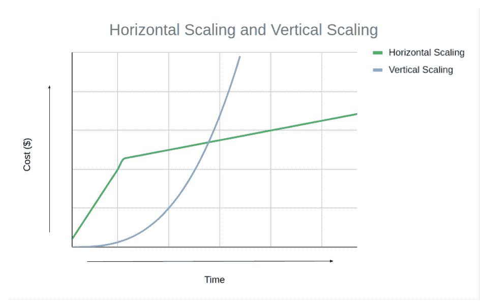

# Python 有一个可伸缩性缺陷

> 原文：<https://levelup.gitconnected.com/python-has-a-fatal-flaw-e4bf0462d366>

在当今的技术领域，扩展应用程序是必要的。

应用程序的用户群会呈指数级增长，因此开发应用程序的目的是在这种情况下每分钟处理越来越多的请求。

凯利·西克玛在 [Unsplash](https://unsplash.com?utm_source=medium&utm_medium=referral) 上的照片

在讨论可伸缩性之前，我们需要熟悉一些计算机科学概念。

来说说他们吧！

## 什么是过程？

进程是程序/应用程序的运行实例。

一个程序可以同时运行多个实例(进程)。

同一程序和其他程序的不同进程由计算机的操作系统管理。

任务管理器中显示的进程(作者图片)

## 什么是线程？

*   线程表示在进程上下文中执行的实际处理器指令。
*   每个进程至少有一个线程执行它的指令。

## 什么是**多线程？**

*   当多个线程协同工作时，在一个进程的上下文中并行执行指令
*   进程中的线程共享状态信息、内存和许多其他属性。

照片由[夏羽·加尼翁](https://unsplash.com/@metriics?utm_source=medium&utm_medium=referral)在 [Unsplash](https://unsplash.com?utm_source=medium&utm_medium=referral) 上拍摄

# 缩放应用

让我们来谈谈不同的应用扩展设计。

## 级别 1:单线程应用程序

这是应用程序进程使用单线程运行的时候。

## 级别 2:多线程应用程序

这是指应用程序进程可以利用计算机 CPU 处理器中的不同内核，并行运行多个线程。

这样做是为了提高计算效率/减少执行时间。

这构成了**垂直扩展**的基础，下一步可以添加更多更快的处理器/执行内核。

但这有局限性。您无法升级到不断增长的处理能力，这将变得非常昂贵！

水平与垂直扩展的成本(来源:[https://www . MongoDB . com/basics/水平与垂直扩展](https://www.mongodb.com/basics/horizontal-vs-vertical-scaling))

## 级别 3:分布式应用程序

这包括使用通过网络连接的多个计算机系统(服务器)。

如果您不熟悉分布式系统，请查看下面的这篇文章:

 [## 每个开发人员都必须知道的 100 个基本系统设计概念(第 1 部分)

### 设计高效、容错和可扩展系统的首选清单

levelup.gitconnected.com](/100-essential-systems-design-concepts-that-every-developer-must-know-part-1-1318c2c402ca) 

# Python 应用中的多线程

让我们编写一个名为`countdown`的函数并执行它。

这个函数完成执行需要 1.946 秒。

让我们使用多线程，再次执行这个函数。

人们会认为运行速度会提高一倍，因为我们使用了两个线程来执行这个函数。

令人惊讶的是，这并不像我们预期的那样工作！

你知道为什么吗？

原因是 **Python GIL(全局解释器锁)**。

先说说它是从哪里来的。

# CPython

**CPython** 是 Python 的默认且最广泛使用的参考实现。

是用 C 和 Python 写的。

CPython 的作用是在解释之前将 Python 代码编译成[字节码](https://en.wikipedia.org/wiki/Bytecode)。

CPython 在每个 CPython 解释器进程上使用 GIL。

克里斯·里德在 [Unsplash](https://unsplash.com?utm_source=medium&utm_medium=referral) 上拍摄的照片

# 但是，GIL 是什么？

GIL 或全局解释器锁是一个**互斥锁**。

这是避免**竞态条件的一种方法。**

它确保在 Python 解释器进程的执行过程中，任何时候只有一个线程可以处理 Python [字节码](https://en.wikipedia.org/wiki/Bytecode)。

[飞:D](https://unsplash.com/@flyd2069?utm_source=medium&utm_medium=referral) 在 [Unsplash](https://unsplash.com?utm_source=medium&utm_medium=referral) 上拍照

# 这会导致什么问题？

应用程序可以处理两种类型的操作:

*   CPU 限制
*   输入输出绑定

**CPU 限制的操作**计算量很大，并且受限于处理器的完成能力。
比如复杂的数学运算都是 CPU 绑定的。

另一方面，**待完成的 I/O 绑定操作**受限于等待输入/输出操作所花费的时间。
比如数据库和网络操作。

当应用程序使用分布在多个内核上的 CPU 密集型操作时，GIL 在 CPython 中对抗多线程。

尽管如此，多线程仍然是 I/O 绑定操作的一种可能性。

在 Python 先驱 Dave Beazley 的博客[中可以找到一个很好的可视化例子。](https://dabeaz.blogspot.com/2010/01/python-gil-visualized.html)

图注(来源:[https://dabe az . blogspot . com/2010/01/python-Gil-visualized . html](https://dabeaz.blogspot.com/2010/01/python-gil-visualized.html))

在具有单个处理核心的机器上运行的 2 个 CPU 绑定的线程(来源:[https://dabe az . blogspot . com/2010/01/python-Gil-visualized . html](https://dabeaz.blogspot.com/2010/01/python-gil-visualized.html)

他谈到了一个应用程序，该应用程序在一台具有单个处理核心的计算机上运行两个 CPU 绑定的线程。

这很有效，两个线程同时执行。

当同一个双线程应用程序在一台具有两个处理内核的计算机上运行时，由于 GIL 的存在，会发生一些奇怪的事情。

在具有两个处理核心的机器上运行的两个 CPU 绑定线程(来源:[https://dabe az . blogspot . com/2010/01/python-Gil-visualized . html](https://dabeaz.blogspot.com/2010/01/python-gil-visualized.html))

在上图中，红色区域显示了由于另一个内核上的另一个线程占用了一个处理器的线程而无法运行的时间。

有趣的是，GIL 也让多线程的 I/O 操作变慢了。

多线程，一个 I/O 绑定，另一个 CPU 绑定(来源:[https://dabe az . blogspot . com/2010/01/python-Gil-visualized . html](https://dabeaz.blogspot.com/2010/01/python-gil-visualized.html))

在上文中，请注意，I/O 绑定操作在从 CPU 绑定操作获取 GIL 以执行其处理时面临困难。

这个问题后来得到了解决，如下文所述:

 [## 返工 GIL

### 你好，在过去的几天里，我一直致力于 GIL 的实验性重写。因为工作已经…

mail.python.org](https://mail.python.org/pipermail/python-dev/2009-October/093321.html) 

# 那为什么用 GIL 呢？

GIL 的发展是因为它提供了许多优势:

*   这很容易实现，同时确保线程安全并避免竞争情况
*   它提高了单线程应用程序的速度
*   它允许 Python 与许多非线程安全的 C 库轻松集成

由于许多 Python 包和模块都是在牢记 GIL 的情况下开发的，因此很难在不破坏它们的情况下移除 GIL。

[Boitumelo Phetla](https://unsplash.com/@writecodenow?utm_source=medium&utm_medium=referral) 在 [Unsplash](https://unsplash.com?utm_source=medium&utm_medium=referral) 上拍摄的照片

# 解决方法

*   一个可能的解决方案是使用另一个不使用 GIL 的 Python 参考实现。
    这样的例子有 [Jython](https://wiki.python.org/moin/Jython) (运行在 Java 上)和 [IronPython](https://wiki.python.org/moin/IronPython) (运行在 Java 上)。NET CLR 和 Mono)。
*   另一种方法是使用多个进程而不是多线程来扩展应用程序(使用 Python `multiprocessing`包)
*   最后，最终的解决方案可能是从 CPython 中移除 GIL(通常称为“***gile 切除术*** ”)。
    由于移除 GIL 时给出的许多硬性要求，此操作尚未完成。

您可以在此阅读相关要求:

 [## GlobalInterpreterLock-Python Wiki

### 在 CPython 中，全局解释器锁或 GIL 是一个互斥体，它保护对 Python 对象的访问，防止多个…

wiki.python.org](https://wiki.python.org/moin/GlobalInterpreterLock) 

您也可以查看下面的库的`gilectomy`分支，了解更多关于这项工作的更新。

 [## GitHub-Larry Hastings/gile 切除术:CPython 的 gile 切除术分支。在 git 中使用“git 切除术”分支。阅读…

### CPython 直肠切除术支。在 git 中使用“git 切除术”分支。阅读下面重要的简短自述文件！- GitHub …

github.com](https://github.com/larryhastings/gilectomy) 

约翰·施诺布里奇在 [Unsplash](https://unsplash.com?utm_source=medium&utm_medium=referral) 上拍摄的照片

# 其他资源

 [## 初始化、终结和线程- Python 3.10.7 文档

### 在嵌入 Python 的应用中，必须在使用任何其他 Python/C API 函数之前调用该函数；与……

docs.python.org](https://docs.python.org/3/c-api/init.html#thread-state-and-the-global-interpreter-lock)  [## 什么是 Python 全局解释器锁(GIL)？-真正的蟒蛇

### Python 的全局解释器锁或 GIL，简单来说就是一个互斥体(或锁)，只允许一个线程持有…

realpython.com](https://realpython.com/python-gil/)  [## 全局解释器锁-维基百科

### 全局解释器锁(GIL)是计算机语言解释器中使用的一种机制，用于同步…

en.wikipedia.org](https://en.wikipedia.org/wiki/Global_interpreter_lock)  [## CPython -维基百科

### CPython 是 Python 编程语言的参考实现。用 C 和 Python 编写的 CPython 是…

en.wikipedia.org](https://en.wikipedia.org/wiki/CPython) 

*本文到此为止！非常感谢你的阅读！*

 [## 通过我的推荐链接加入 Medium-Ashish Bama nia 博士

### 阅读 Ashish Bamania 博士(以及 Medium 上成千上万的其他作家)的每一个故事。您的会员费直接…

bamania-ashish.medium.co](https://bamania-ashish.medium.com/membership) 

# 分级编码

感谢您成为我们社区的一员！在你离开之前:

*   👏为故事鼓掌，跟着作者走👉
*   📰查看[级编码出版物](https://levelup.gitconnected.com/?utm_source=pub&utm_medium=post)中的更多内容
*   🔔关注我们:[推特](https://twitter.com/gitconnected) | [LinkedIn](https://www.linkedin.com/company/gitconnected) | [时事通讯](https://newsletter.levelup.dev)

🚀👉 [**将像你这样的开发人员安置在顶级创业公司和科技公司**](https://jobs.levelup.dev/talent/welcome?referral=true)