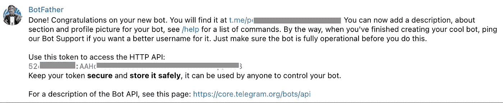
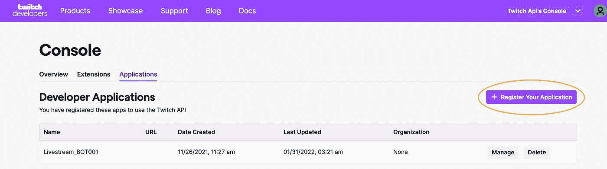
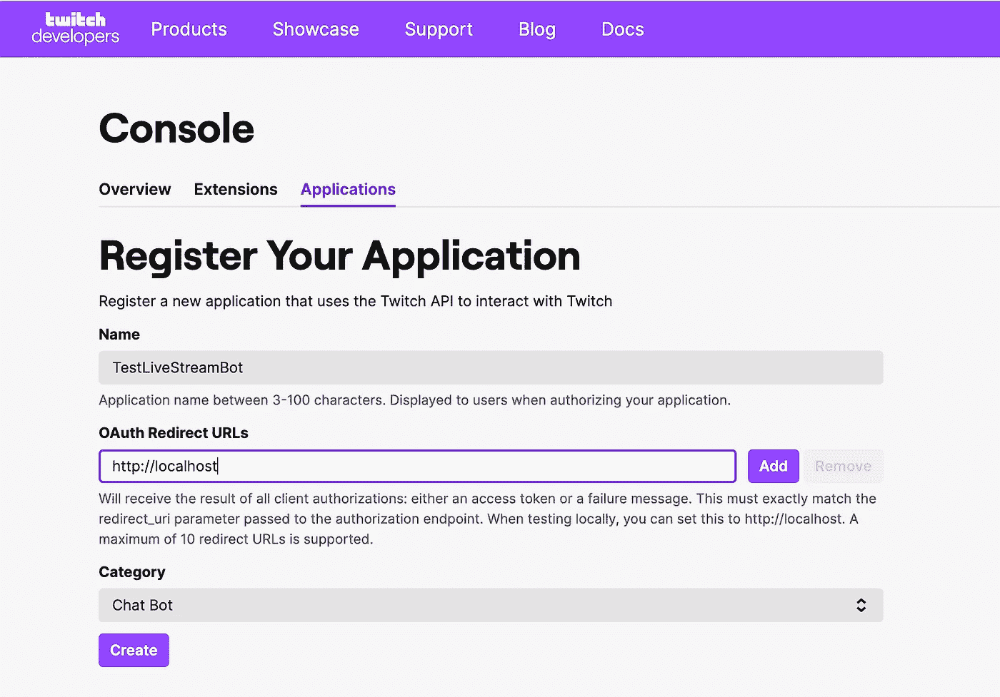
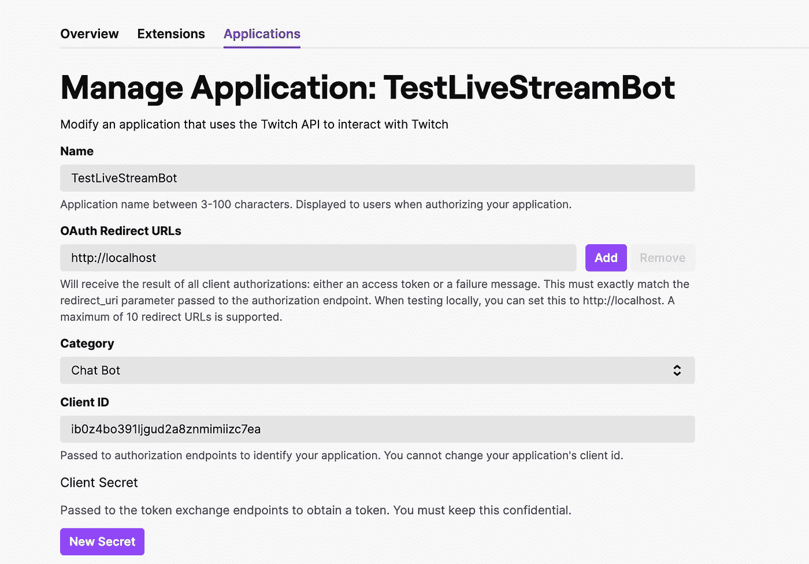
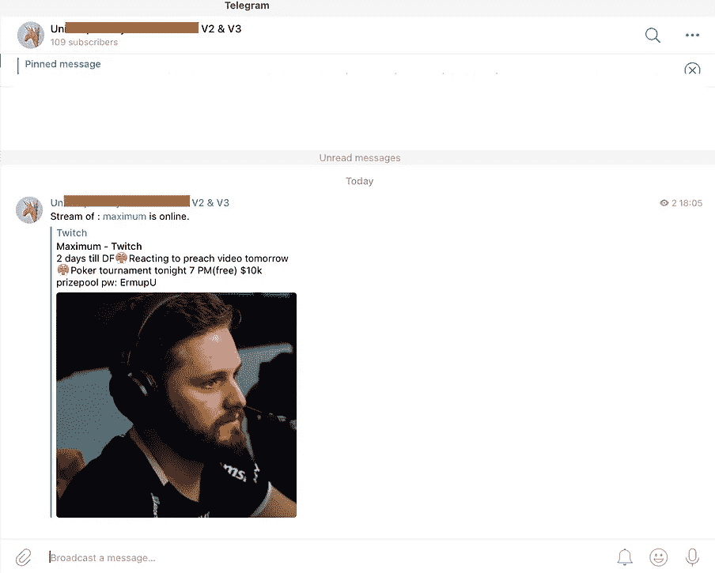
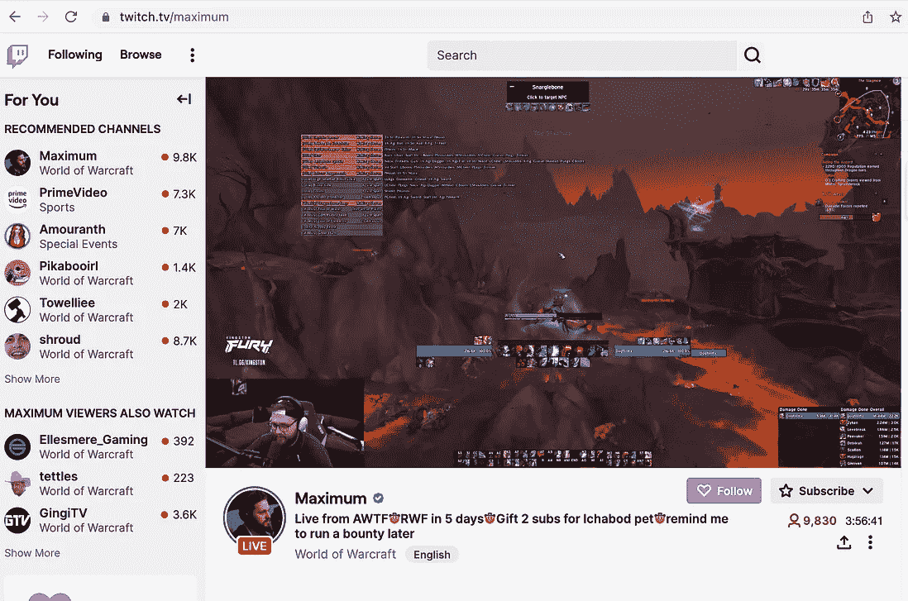

# Python:如何在 Twitch 流上线时获得电报通知

> 原文：<https://levelup.gitconnected.com/python-how-to-get-a-telegram-notification-when-a-twitch-stream-goes-live-a76f4249315d>


[来源](https://www.youtube.com/watch?v=0Tk1bDbTv9w)

任何人都希望构建一个 Python 机器人，当你的 Twitch.tv 流在线时，它可以通过电报发送通知。

## 1.首先，你需要在你的电脑上安装[Python](https://www.digitalocean.com/community/tutorials/install-python-windows-10)。

## 2.Twitch & Telegram API 认证凭证

接下来，您需要在 [**Telegram 上创建一个新的 bot，并获取它的 API**](https://core.telegram.org/bots/tutorial) 令牌，您将使用它来访问 Telegram API 并发送消息。

要获得电报机器人的机器人令牌，您需要使用电报上的机器人父亲机器人创建一个新的机器人。为此，请按照下列步骤操作:


[来源](https://www.sohamkamani.com/nodejs/telegram-bot/)

**电报:**

通过在电报搜索栏中搜索“@BotFather”，在 Telegram 上打开与 **BotFather** bot 的对话。**输入“/new bot”**创建一个新的机器人。按照提示为您的机器人选择名称和用户名。**用户名必须以“bot”**结尾(如“my_new_bot”)。



[https://core.telegram.org/bots/tutorial](https://core.telegram.org/bots/tutorial)

一旦创建了机器人，机器人父亲将为您提供一个令牌。这个令牌用于认证你的机器人，并授权它访问电报 API。复制令牌并在你的 bot 代码中使用它来认证和访问 API。请记住，bot 令牌是敏感信息，应该被视为密码。不要与任何人分享你的机器人令牌。

然后，您需要**检索您刚刚在 Telegram 上创建的频道的聊天 ID** 。这个 ID 是一个唯一的标识符，当人们想要将 Telegram 与他们自己的应用程序或服务集成时使用。

使用您的通道名称和访问令牌，通过 Bot API 向该通道发送消息。[https://API . telegram . org/bot 11234485678:aaeljxyzhcbiizu 7 VB _ fgghmk 2 tfvr 54n/sendMessage？chat _ id = @ test channel&text = 123](https://api.telegram.org/bot11234485678:AAElJxyzHCbiiZu7Vb_fGGhmk2tbFVr54n/sendMessage?chat_id=@TestChannel&text=123)

```
{"ok":true,
 "result":{
 "message_id":191,
 "sender_chat":{
  "id":-1001527664788,
  "title":"Test Channel Name",
  "username":"TestChannel","type":"channel"
 },
 "chat":{
  "id":-1001527664788,
  "title":"",
  "username":"TestChannel","type":"channel"
  },
 "date":1670434355,
 "text":"123"
 }
}
```

您可以在聊天/id 下找到频道 id。仅供参考:所有访问令牌 id 都是示例，不能用作构建应用程序时的身份验证。


**抽搐:**

您还需要在 Twitch 上创建一个新的应用程序，并获取其 API 凭据，您将使用这些凭据来访问 Twitch API 并检索用户信息。

要获得 Twitch 机器人的客户端秘密，您需要使用 Twitch 开发人员控制台创建一个新的机器人。为此，请按照下列步骤操作:

*   前往 [Twitch 开发者控制台](https://dev.twitch.tv/console/apps.)



【https://dev.twitch.tv/console/apps】T4。

*   如果出现提示，请使用您的 Twitch 帐户登录。
*   单击“注册您的应用程序”按钮。



*   输入机器人的名称和描述，并选择“聊天机器人”作为应用程序类别。
*   点击“创建”。



[https://dev . twitch . TV/console/apps/IB 0 z 4 bo 391 LJ gud 2 a 8 znmimiizc 7 ea](https://dev.twitch.tv/console/apps/ib0z4bo391ljgud2a8znmimiizc7ea)

*   创建机器人后，单击应用程序列表中的机器人以查看其详细信息。在应用程序详细信息页面，您将通过生成“新密码”找到客户端密码。
*   复制客户端秘密，并在您的 bot 代码中使用它来验证和访问 Twitch API。

请记住，客户端密码是敏感信息，应该被视为密码。不要与任何人分享你的机器人的客户端秘密。

## 3.Python 代码

一旦获得了必要的 API 令牌和凭证，就可以开始为 bot 编写 Python 代码了。

这个脚本首先导入必要的库，这些库分别提供对 Telegram 和 Twitch APIs 的访问。

```
# 1\. Start by importing the necessary libraries and setting up the API clients for Telegram and Twitch.
import os
import requests
import json
import threading
from datetime import date 
```

接下来，您需要编写代码来检索您感兴趣的 Twitch 用户的信息。您可以使用 Twitch API 来获取用户当前的流媒体状态和其他信息。

```
#2\. Function that checks whether stream is online
def is_TwitchOnline():
    try:
        # Twitch API parameters
        twitchclient_id="ib0z4bo391ljgud2a8znmimiizc7ea"
        twitchsecret="y7v31nbp22o6c0g############"

        # The Twitch user you are interested in for example
        # https://www.twitch.tv/maximum  --> userStream='maximum'
        userStream='############'

        # URL to request OAuth Token
        tokenurl = 'https://id.twitch.tv/oauth2/token?client_id=' + twitchclient_id + \
                   '&client_secret=' + twitchsecret+'&grant_type=client_credentials'

        response = requests.post(tokenurl)
        response.raise_for_status()
        OAuth_Token = response.json()["access_token"]

        # Connection to Twitch
        response = requests.get('https://api.twitch.tv/helix/streams?user_login=' + \
                   userStream, headers={'Authorization': 'Bearer ' + \
                   OAuth_Token,'Client-Id': twitchclient_id})
        var=json.loads(response.content)

        # Dummy variable stored in text file for status update
        cwd = os.getcwd()
        filename= cwd + '/StreamTwitch_01Bot.txt'
        if (os.path.exists(filename) == False):
            f = open(filename, "w")
            f.write("FALSE")
            f.close()
        else:
            print("File Exists")    

        f = open(filename)
        boolean_online = f.read()
        f.close()

        # Twitch var data returns wether the stream just went live
        if var['data'] and boolean_online.upper()=='FALSE':
            message='Stream of : ['+str(userStream)+'](https://www.twitch.tv/'+str(userStream)+') is online. \n'

            telegram_bot_sendtext(message)
            f = open(filename, "w")
            f.write("TRUE")
            f.close()

        # Twitch var data returns wether the stream just went off-line    
        if not var['data'] and boolean_online.upper()=='TRUE':
            telegram_bot_sendtext(user_login.upper()+' is offline')
            f = open(filename, "w")
            f.write("FALSE")
            f.close()

    except Exception as e: 
        print(e)

    return "Done"
```

一旦检索到 Twitch 用户的必要信息，就可以使用 Telegram API 向 Telegram 上指定的聊天或频道发送消息。如果用户正在流式传输，脚本将使用`telegram_bot_sendtext()`方法向指定的电报聊天发送一条消息。该消息包括用户名和到流的链接。

```
# 3\. Function that sends a notification to telegram when stream is on/off-line
def telegram_bot_sendtext(bot_message):

    # Fake examples of authorization tokens
    bot_token = '11234485678:AAElJxyzHCbiiZu8Vb_fGGhmk2tbFVr54n'
    bot_chatID = '-1001527664780'

    send_text = 'https://api.telegram.org/bot' + bot_token + '/sendMessage?chat_id=' + \
              bot_chatID + '&parse_mode=Markdown&text=' + bot_message

    response = requests.get(send_text)

    return response.json()
```

最后，您需要为您的 bot 添加一个调度组件，以便它可以定期检查 Twitch 用户的流状态，并根据需要向 Telegram 发送更新。这可以使用 Python 库来完成，比如`threading`。

```
# 4 Running a check every 30seconds to see whether the Twitch stream is online
def main():
    timertime=30
    is_TwitchOnline()

    # 30sec timer
    threading.Timer(timertime, main).start()

# Run the main function
if __name__ == "__main__":
    main()
```



左:电报信道消息提醒用户该流是实时的

左上是 Telegram 提醒频道用户 streamer 在线的截图。

这只是一个简单的例子，展示了如何使用 Python、Telegram 和 Twitch APIs 来构建一个机器人，当 Twitch 用户打开时，它会向 Telegram 发送一条消息。根据您的特定需求和您想要包含的功能，实现细节可能会有所不同。

**完整代码概述(** [**github 链接此处**](https://github.com/Eloise1988/TWITCH) **):**

[https://gist . github . com/eloise 1988/699d 5436 BC 04 a1 f 769 e 08 e 74 ce 2 be 1 b 9](https://gist.github.com/Eloise1988/699d5436bc04a1f769e08e74ce2be1b9)

## 4.更进一步

如果您希望在服务器上 24/7 运行 python 代码，您可以安排一个 [crontab 作业来确保代码始终启动并运行](https://www.howtogeek.com/101288/how-to-schedule-tasks-on-linux-an-introduction-to-crontab-files/)。Crontab 是一个用于在类 Unix 操作系统上调度任务的工具。下面是一个 crontab 条目的示例，它将运行一个名为`is_python_up.sh`的脚本，该脚本将每 5 分钟检查一次机器人是否仍在后台运行。

```
*/5 * * * * /path/to/is_python_up.sh
```

您可以使用 crontab 安排任何命令或脚本在特定时间运行。例如，您可以使用它来自动删除旧的日志文件或通过电子邮件发送每日报告。要了解关于 crontab 以及如何使用它的更多信息，您可以参考您的操作系统的文档。

## 关于这种媒介:

本出版物的一部分已由[chat.openai.com/chat](https://chat.openai.com/chat)生成。

作为 OpenAI 训练的大型语言模型， [Chat](https://chat.openai.com/chat) 根据给定的输入协助生成类似人类的文本。它使用先进的机器学习算法和大量数据来生成连贯、相关和引人入胜的响应。

总的来说，它的功能是帮助用户完成各种与语言相关的任务，它帮助我缩短了一半的制作时间。