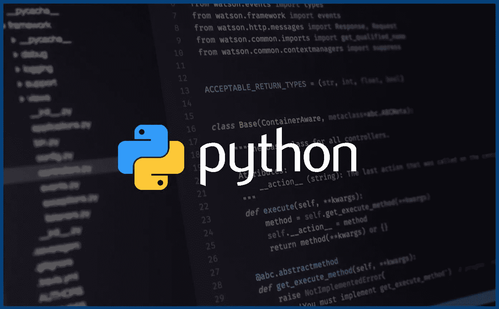

# python——如何实现异步执行

> 原文：<https://levelup.gitconnected.com/python-how-to-implement-asynchronously-execution-b2132eab23e1>

最近工作中接触了多线程/异步实现，想分享一下经验。



# 串联实施

让我向您展示系列实现的示例。

*   **Main.py**

```
import sub
from datetime import datetime, timedeltadef main(sec):
    sub.wait(sec)
    return Trueprint(datetime.today())for i in range(0,2):
    result = main(5)
    print(result)print(datetime.today())
```

*   **sub py**

```
import timedef wait(sec):
    time.sleep(sec)
```

执行结果如下:

```
$ python main.py2020-06-28 16:58:12.163089
True
True
2020-06-28 16:58:22.173504
```

当然整个实现需要 10 秒。然而，如果你不需要等待来自“def main(sec)”的结果，我们该如何实现呢？我们可以使用“并发.未来”模块。

# 并发.未来

什么是“并发.未来”？我们可以参考文档。

```
The [concurrent.futures](https://docs.python.org/3/library/concurrent.futures.html#module-concurrent.futures) module provides a high-level interface for asynchronously executing callables.The asynchronous execution can be performed with threads, using [ThreadPoolExecutor](https://docs.python.org/3/library/concurrent.futures.html#concurrent.futures.ThreadPoolExecutor), or separate processes, using [ProcessPoolExecutor](https://docs.python.org/3/library/concurrent.futures.html#concurrent.futures.ProcessPoolExecutor). Both implement the same interface, which is defined by the abstract [Executor](https://docs.python.org/3/library/concurrent.futures.html#concurrent.futures.Executor) class.
```

我们需要多线程，所以让我用“ThreadPoolExecutor”。

首先，需要调用 ThreadPoolExecutor 实例。您可以使用参数设置线程数量。默认值为 5。

```
executor = ThreadPoolExecutor(max_workers=2)
```

如何异步调用函数？使用“submit”方法，并设置要用参数调用的函数名。你也可以得到一个返回值。

```
result = executor.submit(main, 5)
```

如果你想在异步调用的函数执行后得到一个返回值，实现如下:

```
future_results = []future_result = executor.submit(main, 5)
future_results.append(future_result)for future_result in future_results:
    print(future_result.result())
```

# 异步实现

仅此而已！！让我给你看完整的代码。

*   **Main.py**

```
import sub
from datetime import datetime, timedelta
from concurrent.futures import ThreadPoolExecutordef main(sec):
    sub.wait(sec)
    return Trueprint(datetime.today())executor = ThreadPoolExecutor(max_workers=5)
future_results = []for i in range(0,2):
    future_result = executor.submit(main, 5)
    future_results.append(future_result)print(datetime.today())for future_result in future_results:
    print(future_result.result())
```

*   **subpy**

```
import timedef wait(sec):
    time.sleep(sec)
```

执行结果如下:

```
$ python main.py2020-06-28 17:23:19.522269
2020-06-28 17:23:19.523261
True
True
```

您可以看到 2nd "print(datetime.today())"没有等待主函数结束，也在稍后获得返回值！！

感谢阅读！！