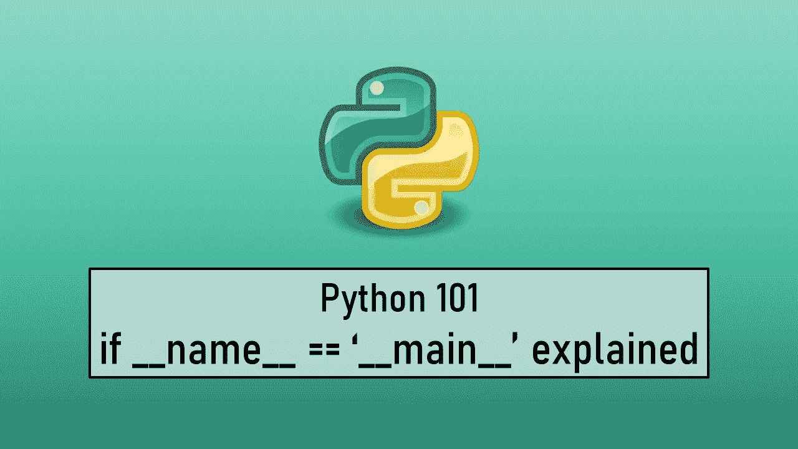

# Python if __name__ = '__main__ '解释

> 原文：<https://levelup.gitconnected.com/python-if-name-main-explained-b07d0aa5bd9>

## Python 基础



在我们深入研究手头的问题之前，让我们看几个例子来理解 Python 在我们运行代码时做了什么。当一个 Python 脚本被执行时， **Python 解释器**在幕后**设置一些全局环境变量**，然后**执行文件**中存在的所有代码。对于导入到脚本中的模块也是如此。

Python 解释器在执行代码时设置的环境变量之一是 **__name__** 。所有特殊变量都以双下划线开始和结束，被称为 **Dunder** 或 **Magic** 变量。

> 如果有人想知道为什么他们被称为 Dunder，那是因为 Dunder 是分数下面的 D 的缩写

当我们执行一个脚本时， **__name__** 变量的值被设置为 **__main__。**对于导入的模块， **__name__** 变量的值被设置为模块的**名称。让我们来看看实际情况。**

```
**# app.py** def function1():
    print(“Hello from Function 1”)
    print(f”File name : {__name__}”)function1()**# Output** Hello from Function 1
File name : __main__
```

让我们创建一个模块，并将该模块导入到我们的主程序中，并检查 __main__ 的值

```
**# other.py**
def function2():
    print("Hello from Function 2")
    print(f"File Name : {__name__}")**# app.py**
from module import function2def function1():
    print("Hello from Function 1")
    print(f"File name : {__name__}")function1()
function2()**# Output**
Hello from Function 1
File name : __main__
Hello from Function 2
File Name : other
```

我们可以看到，对于导入的模块，__name__ 变量的值被设置为模块的名称，而对于主脚本，它被设置为 __main__。没有意外，到目前为止，一切都和我们预期的一样。

现在，如果我们在模块中留下一个函数调用或任何其他全局作用域语句，将由我们的主程序导入，会发生什么

```
**# other.py**
def function2():
    print("Hello from Function 2")
    print(f"File Name : {__name__}")function2()
print("Even I am reachable")**# app.py**
from module import function2def function1():
    print("Hello from Function 1")
    print(f"File name : {__name__}")function1()**# Output**
Hello from Function 2
File Name : other
Even I am reachable
Hello from Function 1
File name : __main__
```

我们可以看到，即使我们没有在主程序(app.py)中调用导入的函数(function2 ),该函数仍然被执行。甚至模块中的 print()语句也被调用。

如果我们回忆一下文章开头讨论的内容，仔细看看输出，我们就会明白这是因为导入的模块的所有内容也是由 Python 执行的。

回到手头的主要问题，几乎所有 Python 脚本中都有的 **__name__ == '__main__'** 结构是什么？简单来说，这是一个**保护声明**，其主要目的是防止上述情况发生。

让我们知道，我们可以使用到目前为止我们已经收集到的保护声明和知识来修复这个问题

```
**# other.py**
def function2():
    print("Hello from Function 2")
    print(f"File Name : {__name__}")if __name__ == "__main__":
    function2()
    print("I am not reachable")**# app.py**
from module import function2def function1():
    print("Hello from Function 1")
    print(f"File name : {__name__}")if __name__ == '__main__':
    function1()**# Output**
Hello from Function 1
File name : __main__
```

正如我们所看到的，导入模块中 guard 语句后面的所有代码都没有执行，这是因为导入模块的 __name__ 的值不等于 __main__ 的值。而在主脚本中 __name__ 的值确实是 __main__ 并且调用了 function1()。

通过这种方式，Python 让我们能够灵活地将代码作为独立脚本或模块运行，同时让我们能够防止代码的某些部分被执行。我们还可以在 guard 语句中添加一个 else 语句，以便在导入模块时执行一些其他操作。

> 在我们的代码中包含 guard 语句是最好的做法，即使我们不打算把它作为一个模块使用。所以在你的代码中要包含一个保护代码，尤其是现在我们已经知道它是如何工作的了。

 [## __main__ -顶级代码环境- Python 3.10.4 文档

### 在 Python 中，特殊名称用于两个重要的构造:程序的顶级环境的名称…

docs.python.org](https://docs.python.org/3/library/__main__.html) [](https://stackoverflow.com/questions/419163/what-does-if-name-main-do) [## if __name__ == "__main__ ":做什么？

### 这是样板代码，防止用户在无意中意外调用脚本。这里是…

stackoverflow.com](https://stackoverflow.com/questions/419163/what-does-if-name-main-do)