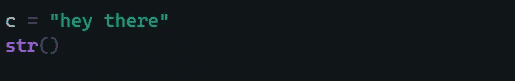

# 一篇文章中的 Python 面向忙碌的开发人员

> 原文：<https://levelup.gitconnected.com/python-in-one-article-for-busy-developers-809dd777acb0>

Python 是一种解释型编程语言，以其类似“英语”的可读语法而闻名。它由吉多·范·罗苏姆开发并于 1991 年发布。虽然这个名字不是以**蛇**品种**命名的，但**的灵感来自 20 世纪 70 年代的喜剧系列*巨蟒剧团的《飞行马戏团》。*

> [为什么叫 Python？当他开始实现 Python 的时候，吉多·范·罗苏姆也在阅读“蒙蒂·Python 的飞行马戏团”的出版脚本，这是一部 1970 年代的 BBC 喜剧系列片。Van Rossum **认为他需要一个简短、独特、略带神秘的名字，所以他决定给这种语言起名叫 Python** 。](https://docs.python.org/3/faq/general.html)

# 装置

要安装 python，请访问 python 的[官方网站](https://www.python.org/downloads/)。遵循特定操作系统的说明，并安装最新的 python 解释器。Python 有两个主要版本，即 python2 和 python3。Python3 是 Python 的最新版本，python2 和 python3 有重大变化。

> 🖋安装注意事项请务必遵循 python3 的安装细节。

如果你有 Linux 或者 Mac，你可能已经安装了 python。

# **开始使用**

安装完成后，打开您的终端，在终端上键入`python`。这将在 **REPL** 模式*下打开 python 解释器(参见评估打印循环)。*

在这里你可以执行 python 代码，解释器一个接一个地执行代码。继续输入`print("Hello World!")`,您应该会得到如图所示的输出。

太好了！完成这些后，你的系统上就有了 python，你也学会了一个重要的函数`print()`。如果您想尝试一些东西，这很好，但是对于大型应用程序，您需要在某些 python 文件中组织您的代码。继续打开您最喜欢的代码编辑器。几个选择是 VSCode，Pycharm，Atom，Sublime，Notepad++等。

要创建一个 python 文件，只需创建一个扩展名为`.py`的文件。

打开该文件，并将以下代码添加到您创建的文件中。

不要忘记保存文件，在保存文件后，打开终端，导航到正确的文件夹，键入命令`python <your_file_name>.py`，在我的情况下是`python hello.py`。您应该得到这样的输出:

# 标准输入和标准输出

在主机上打印东西真的很容易。您只需要用`print()`函数在控制台(STDOUT)上打印一些*值*。这个*值*可以是任何东西，你可以打印一条消息，你可以打印变量来调试你的代码，等等。

要获取用户的输入，使用`input()`功能。使用它，我们可以从用户那里获取输入，并将其存储在一个变量中。您还可以在`input()`函数中传递一个字符串，向用户提供一些关于要输入的数据的消息。

> 🖋注意:用户输入的值存储在变量`name`中。这个变量属于`string`类型。在接下来的几节中，我们将更多地讨论变量和数据类型。

# 变量

编程中的变量可以看作是一个可以存储数据的盒子。当涉及变量时，有两件重要的事情，即它们有一个名字*(你的盒子有名字来识别它们)*和它们只存储特定类型的数据*(你的盒子可能只包含一种类型的东西)。*这里让我们把重点放在名称部分。下面的代码帮助您创建新的变量。

这里`var`是变量名，它可以存储任何类型的值。现在你的变量名可以是任何东西，除了 python 保留的几个*关键字*，[这些关键字在 python 中有一定的含义。](https://www.w3schools.com/python/python_ref_keywords.asp)

# 数据类型

在上一节中，我经常使用这个术语类型，这可能会提出一个问题，那是什么意思？Type 指定变量可以存储哪种数据。

Python 是一种*动态*类型语言，这意味着变量的*数据类型*是由解释器在运行时推断出来的。 [Python 支持许多数据类型](https://www.upgrad.com/blog/top-7-data-types-of-python-python-data-types/)，但有几个重要的是:

*   编号:`int()`和`float()`
*   琴弦:`str()`
*   数组:`list()`
*   字典:`dict()`

1.  `int()` : Int 在变量中存储一个数字，但该数字是一个整数，不包含浮点。您也可以使用`int()`功能创建一个新的整数

2.`float()` : Float 用浮点数存储数字(十进制数)。您也可以使用`float()`功能创建一个新的浮点数。

3.`str()`:字符串存储单个字符或字符集合。这些字符可以是从 A 到 Z、0 到 9、特殊字符等任何字符。

4.`list()` : List 是一种可以存储元素集合的数据类型。[要操作这个](https://www.w3schools.com/python/python_ref_list.asp) `[list](https://www.w3schools.com/python/python_ref_list.asp)` [python 有一堆不同的方法可以使用。](https://www.w3schools.com/python/python_ref_list.asp)

5.`dict()` : Dictionary 是一种能够以*键*、*值*对的形式存储数据的数据类型。如果你知道 JavaScript，它在 JavaScript 中被称为*对象*。在其他一些编程语言中，它也被称为*散列表*。您可以像`print(dictionary['key'])`一样访问这些*值*

# 条件式

条件句是计算机程序设计中的一个基本程序块。当**某事发生**或**某事未发生**时，它帮助你做 ***某事* g** 或**某事。******

if 的这个语法是`if <some_condition>:`。现在在*冒号之后，*print 语句被写在新的一行上，但是在它前面有 4 个空格。这告诉解释器代码属于`if`块。Python 利用 ***缩进*** 的这种思想，去掉了你在 Java、C、C++等语言中看到的花括号“{}”。在这段代码中，我们检查 *a > b* 如果是，则执行`if`块内的代码，反之，如果是 a < b，则执行`else` 块内的代码

您还可以包含一个代表 *else if 的`elif`块。*只有当 a 等于 b 时，这里的代码才会执行。

# 环

循环在编程中是用来反复做某件事的。

`for`循环的语法是`for <variable> in [range](https://www.w3schools.com/python/ref_func_range.asp)(<Lower_limit>, <Upper_limit>):`。下限是循环开始的数字，默认值为 0(可以选择给出下限)。上限是循环将执行到的数字，不包括该数字。注意这里 python 也使用了 ***缩进*** 来执行 for 循环内部的代码。

如果你想遍历一个数组，python 支持一种更简单的方法。

和其他编程语言一样，python 也支持两种类型的循环，即`for`和`while`循环，`while`循环的语法是 as，`while <condition>:`

# 功能

函数基本上是由开发人员为他们将反复使用的特定函数编写的块。用 python 创建函数的语法很简单`def fun_name(params):`

再次注意，python 使用了 ***缩进*** 来跟踪它应该做的事情。`params1`和`params2`被称为传递给函数的参数。`return`给出一些需要计算的值。

创建/定义函数后，下一步是调用/执行/使用函数。调用函数的语法是`fun_name(params=5)`。

从上面的图片代码。值 5 和 6 将分别传递给`params1`和`params2`。

# 结论

非常感谢你能坚持到最后。我希望你能从这篇文章中学到一些东西。我很确定我已经错过了很多概念，但是这篇文章变得很长，因此我试着只关注核心概念。在这个 [github repo](https://github.com/nerdylabs/Python-in-one-article) 中，你可以找到所有的代码以及更多关于 python 语言语法的讨论。更简洁的 python 教程请参考[这段视频](https://www.youtube.com/watch?v=rfscVS0vtbw)。我已经在 [github repo](https://github.com/nerdylabs/Python-in-one-article) 中简要讨论了面向对象编程，但是要更深入地理解，请参考[这个视频](https://www.youtube.com/watch?v=Ej_02ICOIgs)。

[2022 年完成 python 开发者:零到精通](https://www.udemy.com/course/complete-python-developer-zero-to-mastery/)是关于 Python 的更详细的深度课程。这是一门很棒的课程，如果你有时间，我会向你推荐。

如果你喜欢阅读自助、计算机科学、Python、机器学习、人工智能、JavaScript 和 Web 开发，请关注我的媒体。

再次感谢你！希望在下一篇文章中能很快见到你。在此之前，只要连接到互联网并开始学习😃❕❗快乐学习😎❕❗