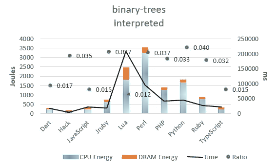

# 巨蟒正在毁灭地球

> 原文：<https://levelup.gitconnected.com/python-is-destroying-the-planet-951e83f22748>

## 意见

## Python 造成的最大损害


joo Pedro Salles 在 [Unsplash](https://unsplash.com?utm_source=medium&utm_medium=referral) 上拍摄的照片

先别用棍子打我。

我知道你们中的许多人来这里争论，事实上这是这篇文章的全部目的——为建设性的讨论敞开大门。

在我深究细节之前，让我先洗掉这个“*这太荒唐了！*“此时此刻，你最有可能想到的是。

我将要构建的案例超出了我自己的观点，许多计算机科学家确实表达了他们对这个话题的担忧。

事实是:我喜欢 Python！

每当我与人辩论编程语言时，我都站在 Python 一边。

尽管有缺点，我一直坚信 Python 的价值主张——可读性、可维护性、社区性——很难被超越。

然而，当我进入兔子洞时，新的隐藏的缺点开始浮出水面。我再也不能视而不见的缺点。

其中一个问题是可持续性。

人们谈论可持续汽车、可持续垃圾和可持续住房，但很少有人谈论可持续软件。

我再也受不了了。

所以，我会试试看。

# **一点背景——可持续性**

可持续性是一个复杂的话题，也是一个难以准确定义的术语。尽管如此，大多数人似乎都同意的最重要的定义是[可持续性](https://en.wikipedia.org/wiki/Sustainability)阐明了在地球上尽可能长时间共存的能力。

可持续发展是社会、经济和环境目标的交汇点。


[来源](https://commons.wikimedia.org/wiki/File:11625_2018_627_Fig1_HTML.webp)

在这种特殊情况下，我们将关注可持续发展的环境方面。

不必把这变成一个关于环境问题的讲座(显然，有更重要的东西要塞进这篇短文)，让我们来谈谈能源消耗。

# 今天的软件

随着无线设备的日益普及，今天比以往任何时候都更需要以节能的心态进行编码。

手机、电脑、平板电脑和科技产品都是由电力驱动并消耗能源的。嵌入到这些设备中的应用程序会驱动能耗，能耗较低的软件称为高能效软件。

当你的手机过热时，那是因为你正在运行某个应用程序。过多的热量反过来会耗尽你的电池，迫使你给手机充电。

你给手机充电越多，手机消耗的能量就越多。同样，你给手机充电越少越好——对电池和环境都是如此。

# 节能软件

有一个问题让每一个有节能意识的程序员都很痒。那就是:

> 设计的更快的程序节能吗？

这个问题的答案相当复杂。

有些人说，一个更快的程序往往更节能，因为它会更快地休息。

[其他人](https://www.digikey.com/en/blog/compact-code-and-energy-efficient-software#:~:text=Thus%20a%20faster%20program%20may,that%20of%20its%20execution%20time.)采用数学方法，认为情况并不总是这样，因为:

> e(能量)= P(功率)x T(时间)

所以一个消耗更多能量的程序不一定是节能的。我们稍后将对此进行扩展。

# **软件中的能量对比**

比较软件性能是一项非常复杂的任务。

可以使用不同的编程语言和不同的框架来实现软件。此外，不同的算法可以产生相同的软件。

编程语言在历史上一直是能源领域的默认标准。但是，通过优化编译器/解释器、改进框架/库，还是有可能使一种编程语言比另一种更有效...

尽管如此，我们还是会沿着编程语言这条路走下去，因为:

*   首先，已有成熟的技术(例如，英特尔的 RAPL 运行平均功率限制能源报告，高通特雷普恩…)可以提供较为准确的能耗测量。
*   第二，我们可以受益于软件性能基准程序，如计算机语言基准游戏(CLBG)来进行程序选择。

**能量消耗:**

能源消耗很难计算。

令人欣慰的是，我们可以整合成熟的能耗报告界面 [RAPL](https://www.intel.com/content/www/us/en/developer/articles/technical/software-security-guidance/advisory-guidance/running-average-power-limit-energy-reporting.html) 来计算能源足迹。

然而，有一个警告。RAPL 仅受英特尔芯片组支持。因此，如果您没有运行英特尔 CPU，并且渴望在您的本地机器上进行这些测试，您可以查看其他能耗报告界面(例如，高通的 Trepn Power Profiler)。

也就是说，为了在 Python 中美化 RAPL，我们可以使用 pyRAPL 库。Java 有 JRAPL，C 有 RAPL。

Python 脚本如下所示:

```
import pyRAPL

pyRAPL.setup() 

@pyRAPL.measure
def doSomething():
    # Instructions to be evaluated.

doSomething()
```

**时间:**

为了计算时间，我们使用一个简单的脚本来测量程序执行的时间。

既然有多种手段来实现这一点，就不必深究了。我将把它放在一个简单的脚本下面作为参考:

```
from time import time...
while (i < N):
   start = time()
   ...
   # insert program here
   ...
   end = time()
   ...# Calculate average taken time
...
```

**功率:**

很难直接获得功率，因为它的单位(W)更多的是一个理论上的量词。

因此，按照认为消耗的能量(J) =时间(S) x 功率(W)的思想，我们可以很容易地计算出每种编程语言消耗的功率。

# 计算机语言基准游戏

难题的最后一块是挑选一个跨不同编程语言实现相似的程序。

这个想法是，选择一个程序，在一种语言中是优化的，而在其他语言中是算法上有缺陷的，这将使比较有偏差，从而扼杀实验的健壮性。

为了躲开这颗子弹，我们将借用计算机语言基准游戏(CLBG)中提出的基准问题。

[CLBG](https://benchmarksgame-team.pages.debian.net/benchmarksgame/index.html) 是一个开源项目，帮助测量不同编程语言的性能。它提供了一系列针对不同编程语言优化的计算机化问题，以确保准确的性能比较。

为了这个简短的阅读，我将对一个程序进行测试。那就是 [*二叉树*](https://benchmarksgame-team.pages.debian.net/benchmarksgame/performance/binarytrees.html) *。请随意检查其他算法问题。*

# 斗牛中的最后一剑

所有这些加在一起，计算能量(E)、时间(ms)和功率(W)得出以下数字。


来自[来源](https://dl.acm.org/doi/10.1145/3136014.3136031)，由作者修改

正如你所看到的，Python 不幸地位于排名的底部。它在功耗和运行时间上表现不佳。事实上，就功能而言，Python 的性能甚至比 Lua 和 Perl 都差。只是它们明显慢了一些。因此，它们的高能耗。

将编程语言缩小到解释型语言，我们将上面的数字填充到一个图表中，使它们更具表现力。



[来源](https://dl.acm.org/doi/10.1145/3136014.3136031)

我们注意到 Python 是 CPU 能耗第三差的语言，排在 Lua 和 Perl 之前。

相比之下，C 语言在能耗方面统治着编程语言，这使得它成为绿色软件的一个有吸引力的赌注。

第二和第三的位置分别属于 C++和 Rust，这在一定程度上支持了 Rust 在软件社区中受到的巨大吸引力。

# Python 和可持续发展

在本次分析中，我们采用的代表可持续发展的主要指标是能耗(E)。

能量是热的一种形式，当电流流过电阻时就会表现出来。作为一名电气工程专业的学生，我发现用焦耳表示的能量(E)是代表可持续性的最佳候选值，因为它是固体废物的副产品。

也就是说，我可以把“Perl 正在毁灭地球”或“Lua 正在毁灭地球”作为标题，因为与 Python 相比，它们的能耗更高。

然而，两者都没有 Python 使用的多。

Python 在行业中大量使用，尤其是在人工智能、机器学习方面。事实上，包括 Google 和 Meta 在内的科技巨头都在推动 Python 的使用。

谷歌有一句座右铭,是这样的:

> “Python 在我们可以的地方，C++在我们必须的地方”

这是可以理解的，因为 Python 具有相对较低的准入门槛，简化了项目交付，并减少了维护开销。这使得公司可以更专注于核心问题，而不是实现细节。

然而，我们应该认识到 Python 本身并不是一种环境友好的编程语言。它的能源足迹平均比 C、C++和 Rust 高出约 40 倍。

这就引出了一个问题:

C 和 C++难以使用是可以理解的。Rust 会成为绿色软件领域的主要竞争者吗？

时间会证明一切。

# 最后的想法

在本文中，我们还没有触及汇编等低级编程语言。就能量而言，这些编程语言当然甚至可以超过 C，但是它们的用例仍然非常少。

因此，它们在这项研究中的分量微不足道。

综合考虑所有因素，我们得出了关于能源和编程语言以及这两者如何与可持续性交织在一起的有趣结果。

在过去，这些结果可能是左耳进右耳出，因为…谁关心可持续性？

然而，在现代，人们越来越意识到可持续性。除此之外，能源危机对各国的打击也相当严重，这将不可避免地影响我们的行事方式。

顺便提一下，针对 Python 的可持续性案例与针对比特币的一直存在的案例相似。

Python 和比特币我都喜欢。所以让自己振作起来写这篇文章有点困难。

# 参考资料:

[](https://dl.acm.org/doi/10.1145/3136014.3136031) [## 跨编程语言的能效:能量、时间和内存是如何关联的？|…

### 本文对 27 个著名软件的运行时间、内存使用和能耗进行了研究

dl.acm.org](https://dl.acm.org/doi/10.1145/3136014.3136031) [](https://dl.acm.org/doi/10.1145/3125374.3125382) [## 迈向编程语言的绿色排名

### 在本文中，我们定义了编程语言中的能效等级。我们考虑一组计算…

dl.acm.org](https://dl.acm.org/doi/10.1145/3125374.3125382) 

**免责声明:**

*尽管本文观点属于作者，但统计数据不属于作者。参考资料部分详细说明了来源。*

*如果你欣赏这种努力，可以考虑通过 Medium 的小费(如下)或通过以下* [*链接*](https://ayarmohammed96.medium.com/membership) *订阅 Medium 来支持作者。*

[](https://ayarmohammed96.medium.com/membership) [## 通过我的推荐链接加入媒体-穆罕默德·阿亚尔

### 阅读默罕默德·阿亚尔(以及媒体上成千上万的其他作家)的每一个故事。您的会员费直接支持…

ayarmohammed96.medium.com](https://ayarmohammed96.medium.com/membership) 

虽然作者从推荐链接中获得一小笔佣金，但这是免费的。