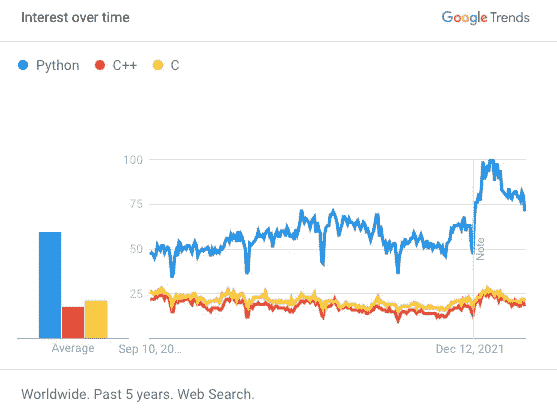

# Python 是出了名的慢。现在它的创造者想让它快一倍

> 原文：<https://levelup.gitconnected.com/python-is-notoriously-slow-now-its-creators-want-to-make-it-twice-as-fast-acb41ad81f0a>

## 如果他们成功了，Python 可能会有一个光明的未来

Python 可能很快会加速。作者图片

  P   ython 慢。这是有史以来最慢的编程语言之一。如果像 C、C++、Rust 这样的语言是野兔，那么 Python 连刺猬都不是。蟒蛇是一种又大又老的蜗牛。

我说这些不是为了羞辱 Python。大多数开发人员不关心他们的代码是在 12 毫秒内执行还是在 56 毫秒内执行。这个时差不会让他们吃午饭迟到。

流行度统计证明了这种对 Python 速度的疏忽。在 TIOBE 指数中，Python 和 C 或 C++的受欢迎程度相当。根据 PYPL 指数，Python 的受欢迎程度是 C 或 C++的四倍。根据 Google Trends，Python 的受欢迎程度大约是其竞争对手的三倍:

随着时间的推移，对 Python、C++和 C 产生了兴趣。来源:[谷歌趋势](https://trends.google.com/trends/explore?date=today%205-y&q=%2Fm%2F05z1_,%2Fm%2F0jgqg,%2Fm%2F01t6b)

在 StackOverflow 上，人们问的关于 Python 的问题是 C++的五倍，是 C 的八倍。

大多数开发人员不太关心运行时速度，他们更关心编码的容易程度。在一个下午写一段代码，然后在接下来的几个小时里出去喝一杯啤酒，这比花整个晚上构建一个完美的解决方案更容易，这个解决方案可能第二天早上只需要几秒钟就可以运行。

此外，Python 并没有考虑速度。它被概念化为一种[脚本语言](https://python-course.eu/python-tutorial/history-and-philosophy-of-python.php)，而不是一种支持[大规模机器学习部署](https://www.askpython.com/python/examples/handling-large-datasets-machine-learning)以及其他应用的语言。

当然，Python 已经很好地融入了它的角色。今天，它是学术界、数据科学和机器学习事实上的标准，甚至在网络和应用程序开发人员中也很流行。你仍然可以用 Python 写简单的脚本，但是现在它支持更多的用途。

尽管 Python 功能多样且易于使用，但就速度而言，它还没有真正长大。大多数开发人员可能不太关心速度；然而，我们当中那些正在训练和部署大型机器学习模型的人(我！)，或者那些在网站中嵌入了复杂 Python 脚本的人(没人喜欢等着网站加载！)在乎速度。

而且关心速度的开发者比例开始增长。软件项目每年都在变大，它们需要处理的数据量增长得更快。

Python 的缓慢正在成为一个瓶颈。

因此，毫不奇怪，该媒体充满了如何加速 Python 代码的建议。它们也是很棒的作品。请看[这里](https://towardsdatascience.com/6-bad-manners-makes-your-python-program-slower-15b6fce62927)、这里[这里](https://python.plainenglish.io/5-ways-to-make-your-python-code-faster-463a3c946534)、这里[这里](https://towardsdatascience.com/ten-tricks-to-speed-up-your-python-codes-c38abdb89f18)和这里[这里](/how-to-make-your-python-code-run-10x-times-faster-5690f5d4d7aa)的例子。

但事实是，这些建议只能让你到此为止。我完全同意应该使用内置函数，只导入需要的模型，避免 while 循环等等。然而，一旦你实现了所有这些技巧，你就会发现 Python 本身的局限性。

这些限制是巨大的。

这个难题可能促使 Python 的最初创造者和 20 年的仁慈独裁者吉多·范·罗苏姆在 2021 年美国 PyCon 语言峰会上解决这些问题。他的幻灯片可以在 GitHub 上找到。

与他的合作者马克·香农和埃里克·斯诺一起，他的目标是将 Python 的速度提高 5 倍。他们计划通过四个步骤来实现这一点，使 Python 从 3.10 到 3.13 的每个版本都快 50%。

在现实中，这是发挥了一点点慢。Python 3.10 比 3.9 版本大约快 10%。在写这篇文章的时候，Python 3.11 已经发布了它的 alpha 版本，它比 Python 3.10 快了大约 14%的速度[。](https://towardsdatascience.com/python-is-about-to-become-64-faster-python-3-10-vs-python-3-11-benchmark-3a6abcc25b90)

这与最初宣布的 50%并不十分接近。话又说回来，软件往往比表面上看起来要复杂得多。

另一方面，3.11 版本带有[其他重要特性](https://towardsdatascience.com/python-3-11-f62708eed569)。最让我兴奋的是改进的错误消息。Python 核心开发者可能已经从 Rust 那里学到了一些东西。

虽然速度的提高可能很小，但它确实表明核心开发人员正在努力。他们并不只是吹嘘他们关于速度的声明。

范·罗森公司承认他们“远不能确定他们会达到 2 倍。”也就是说，根据我的个人经验，即使执行速度提高 10 %,也能决定你是否能按时吃午饭。

从长远来看，这是否足以维持 Python 作为一种语言的统治地位，还有待观察。我的直觉是，我们将需要比 10%更大的减速带来保持 Python 在未来十年的统治地位。

但是更大的减速带意味着更大的奇迹。

奇迹往往是特别困难的编码项目。

*成为* [*中等会员*](https://arijoury.medium.com/membership) *对我的内容拥有完全访问权限。*

# 分级编码

感谢您成为我们社区的一员！在你离开之前:

*   👏为故事鼓掌，跟着作者走👉
*   📰查看[升级编码出版物](https://levelup.gitconnected.com/?utm_source=pub&utm_medium=post)中的更多内容
*   🔔关注我们:[Twitter](https://twitter.com/gitconnected)|[LinkedIn](https://www.linkedin.com/company/gitconnected)|[时事通讯](https://newsletter.levelup.dev)

🚀👉 [**加入升级达人集体，找到一份惊艳的工作**](https://jobs.levelup.dev/talent/welcome?referral=true)