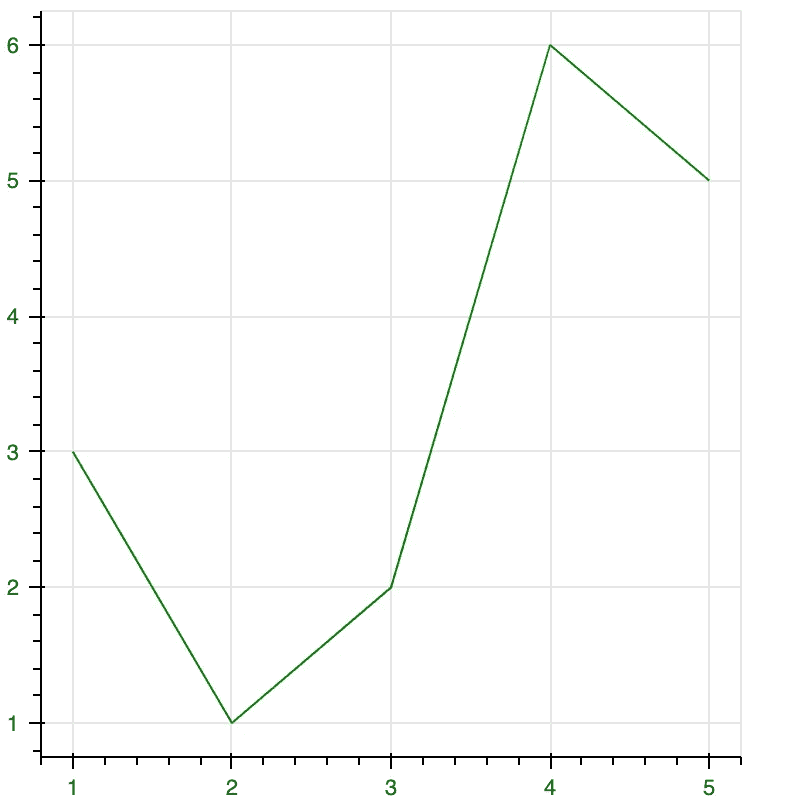

# 你可能不知道的 Python 库

> 原文：<https://levelup.gitconnected.com/python-libraries-that-you-probably-do-not-know-about-42c289052072>

## 必须知道很多人不知道的 python 库


由 [Valentin Salja](https://unsplash.com/@valentinsalja?utm_source=medium&utm_medium=referral) 在 [Unsplash](https://unsplash.com?utm_source=medium&utm_medium=referral) 上拍摄的照片

在本文中，我提出了一些很多人不知道的鲜为人知的 Python 库。这些库非常擅长执行特定的任务。因此，多接触他们是有好处的。

我们开始吧！

# 1.模式

这个 Python 库`Pattern`是一个开源库，用于自然语言处理、web 挖掘和基于机器学习的数据分析任务。这个库的主要焦点是它对用户的易用性。

该库可以执行各种任务，例如从各种来源执行**文本处理**、**数据挖掘**和**数据提取**。这个库的语法非常简单。因此，属于科学和非科学背景的用户可以很容易地使用它。

## 安装方法:

```
pip install pattern
```

## 示例:

```
**from** pattern.en **import** sentimentprint(sentiment("Avengers is an excellent movie to watch. I really love it"))Output:
(0.75, 0.8)
```

情感评分和主观性已作为输出返回。

给定句子的情感得分是 **0.75，**这意味着它是一个高度肯定的句子。主观性 **0.8** 表示给出的句子是用户的个人观点。

# 2.Eli5

`Eli5`是一个有用的 Python 库，用于调试和检查机器学习分类器，解释那些分类器的预测。它支持各种机器学习包和框架，如`Keras`、`scikit-learn`、`LightGBM`、`XGBoost`、`CatBoost`等。

使用这个库有两种方式来理解机器学习模型:

1.  通过分析模型权重来了解模型的`global` 性能。
2.  通过分析单个样本预测来了解模型的`local`性能。

## 安装方法:

```
pip install eli5
```

# 3.CatBoost

在 Python 中，`CatBoost`是 Yandex 开发的开源机器学习算法。CatBoost 由两个词组成， **Cat** egory 和 **Boost** ing。

该库可用于处理不同的 **Cat** egories 数据，如图像、文本、音频和其他分类数据。 **Boost** 表示该库基于梯度 boosting 库，工作原理与 XGBoost 等其他 boosting 算法相同。

这个库的好处是提供**高精度**无需参数调优，同时还提供 **GPU 支持**加速训练。

## 安装方法:

```
pip install catboost
```

## 示例:

```
**import** numpy **as** np
**from** catboost **import** CatBoost, Pool# read the dataset  
train_data = np.random.randint(0, 100, size=(100, 10)) 
train_labels = np.random.randint(0, 2, size=(100)) 
test_data = np.random.randint(0, 100, size=(50, 10)) train_pool = Pool(train_data, train_labels)  
test_pool = Pool(test_data) # specify training parameters
param = {'iterations':5} 
model = CatBoost(param) # training the model 
model.fit(train_pool) # make the prediction
pred_class = model.predict(test_pool, prediction_type='Class') pred_proba = model.predict(test_pool, prediction_type='Probability')
```

这就是我们如何使用这个算法来做预测。

# 4.散景

`Bokeh`是 Python 中的数据可视化库，用于创建交互式图表、绘图和图形。这个库的输出和可视化可以在各种媒体中使用，比如 Notebook、HTML、Flask 和基于 Django 的 web 应用程序。

通过 Boken，我们可以创建各种可视化，从简单的绘图到复杂和高端的仪表板。它还让我们无需编写 JavaScript 代码就能创建 JavaScript 支持的可视化效果。

## 安装方法:

```
pip install bokeh
```

## 示例:

```
**from** bokeh.plotting **import** figure, output_notebook, show# output to notebook
output_notebook()# creating figure
fig **=** figure(plot_width **=** 400, plot_height **=** 400)# add a line
fig.line([1, 2, 3, 4, 5], [3, 1, 2, 6, 5], color **=** "green")# displaying the result
show(fig)
```

**输出:**



作者图片

使用散景进行可视化非常简单明了。

# 5.统计模型

这个`StatsModels`库是数据统计分析最有用的模块之一。这个库允许用户执行统计测试和研究数据。

这个库是建立在 Numpy 和 Scipy 库之上的。如果您想要执行数据的统计分析和估计统计模型，这个库是一个很好的工具。

## 安装方法:

```
pip install statsmodels
```

## 示例:

```
**import** numpy **as** np
**import** statsmodels.api **as** sm# Generate artificial data (2 regressors + constant)
nobs = 100
X = np.random.random((nobs, 2))
X = sm.add_constant(X)beta = [1, .1, .5]
e = np.random.random(nobs)
y = np.dot(X, beta) + e # Fit regression model
results = sm.OLS(y, X).fit()# Inspect the results
print(results.summary())
```

**输出:**


# 6.空间

`spaCy`是 Python 中的一个开源库，用于分析和处理自然语言处理的数据。正如在 **Cython** 中所写的，它有许多内置的功能。它有用户友好的 API，使用起来非常简单。

## 安装方法:

```
pip install -U pip setuptools wheelpip install spacy
```

## 示例:

我们将通过词性标注的例子来了解 spaCy 的实际应用。词性标注是自然语言处理中的一项常见任务。

```
import spacy 
nlp = spacy.load('en_core_web_sm')text = "It’s official: Apple is the first U.S. public company to reach a $1 trillion market value"# Processing the text
doc = nlp(text)for token in doc:
    # Print the token and its part-of-speech tag        print(token.text, "-->", token.pos_)
```

## 输出:

```
Apple --> PROPN 
is --> AUX 
the --> DET 
first --> ADJ 
U.S. --> PROPN 
public --> ADJ 
company --> NOUN 
to --> PART 
reach --> VERB 
a --> DET 
$ --> SYM 
1 --> NUM 
trillion --> NUM 
market --> NOUN 
value --> NOUN
```

# 结论

这就是这篇文章的全部内容。在本文中，我们讨论了一些不太流行但在执行特定任务时很有用的 Python 库。

对于那些不太熟悉 python 编程及其库，但想执行特定任务的人来说，这些库也很方便。因为这些库的语法很简单，所以对他们来说很方便。

感谢阅读！

> *在你走之前……*

如果你喜欢这篇文章，并想继续关注更多**精彩文章的**——请考虑使用我的推荐链接[https://pralabhsaxena.medium.com/membership](https://pralabhsaxena.medium.com/membership)成为一名中级会员。

另外，你可以在这里免费订阅我的时事通讯: [Pralabh 的时事通讯](https://pralabhsaxena.medium.com/subscribe)。