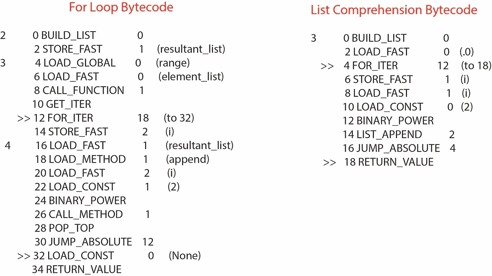
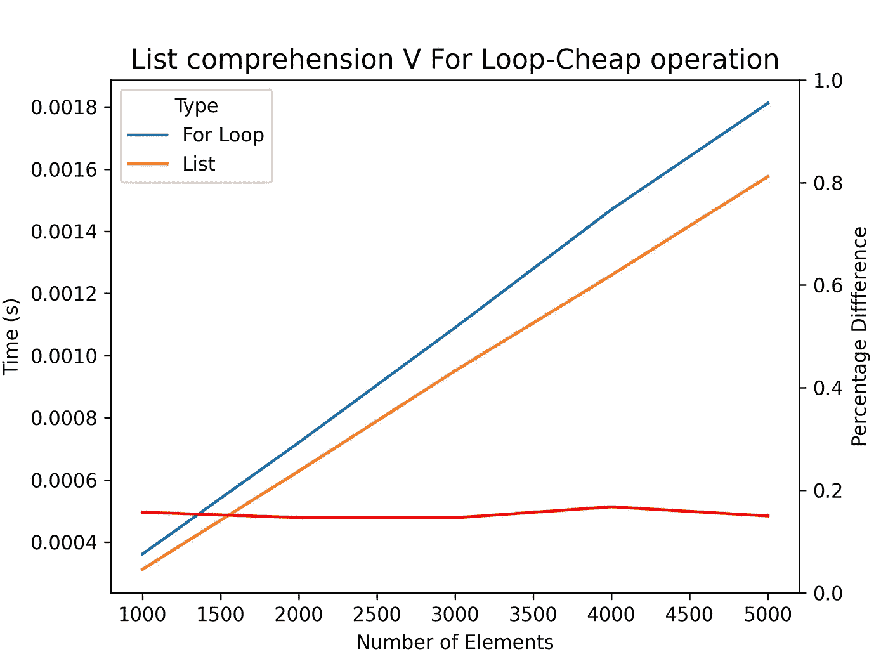
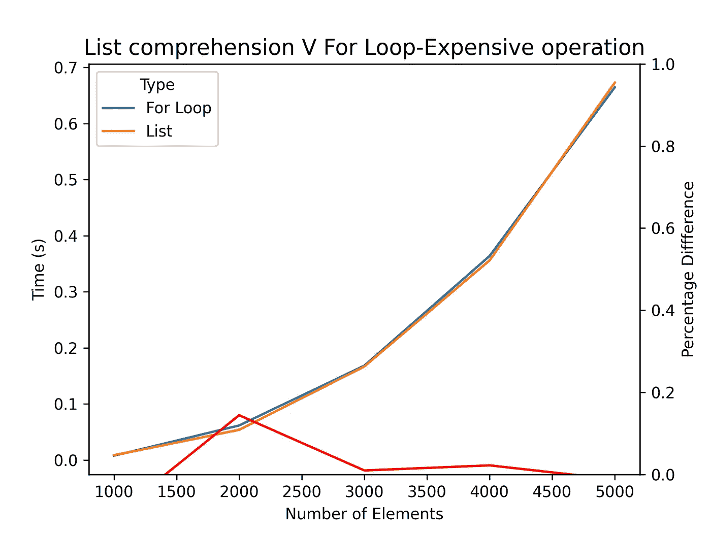
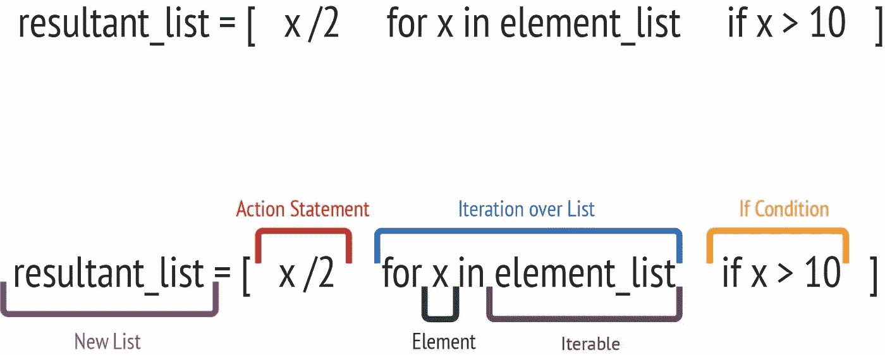

# Python 列表理解—掌握核心概念

> 原文：<https://levelup.gitconnected.com/python-list-comprehension-mastering-core-concepts-f2d2b11292bf>

## 学习如何、为什么以及何时使用列表理解

列表理解是从可重复项创建新列表的“Pythonic 式”方法。成为 Python 语言意味着认同 Python 编程语言的创始哲学。


韦德·兰伯特在 [Unsplash](https://unsplash.com/s/photos/speed?utm_source=unsplash&utm_medium=referral&utm_content=creditCopyText) 上的照片

今天你将学习:

*   为什么使用列表理解？
*   为什么列表理解比循环理解快？
*   循环 v 表理解的时间比较
*   创建您自己的语句的基础
*   常见和不常见的列表理解用例

## **为什么要用列表理解？**

最初，当 for 循环可以做同样的工作时，你可能会质疑理解列表的必要性。然而，在计算时间很关键的情况下，列表理解是最重要的。使用列表理解语句创建新列表总是更快。加速的速度将取决于操作的潜在复杂性，我们将在下一节中对此进行研究。

## 为什么列表理解更快？

列表理解和 for 循环实现之间性能差异的原因在于 Python 解释器中的底层字节码。

我实现了两个函数，每个函数都遍历一系列值，并对每个值求平方。一个函数实现为 for 循环，另一个实现为列表理解。

我已经使用了 *dis* python 包来获取这两个函数的底层字节码。在 for 循环实现中，当一个元素被添加到列表中时(指令 32)，解释器必须在每次迭代中暂停该函数。然而，在列表理解实现中，(指令 14)，追加元素而不需要挂起函数。



图 for 循环的字节码和 iterable 中平方值的列表理解实现。

这就是两种实现之间性能差异的来源。这并不是说 list comprehension 执行底层操作比 for 循环实现更快，它只是构造列表更快。在有大量元素需要迭代的情况下，这可以节省大量时间。

## 循环 v 表理解的时间比较

已经进行了两个实验来量化两种实现之间的差异。

1.  记录遍历一系列值并将每个值提高到 2 的幂所用的时间。
2.  记录遍历一系列值并对每个值进行自乘所花费的时间。

第一个实验是将值提升到一个常数的幂，这被认为是在我们的实验框架中执行的计算上廉价的操作，我们期望随着百分比的更多时间被专用于构建列表，列表理解将显著更快。第二个实验中执行的操作在计算上更昂贵，因此我们不期望列表理解和 for 循环之间的差异像第一个实验中那样显著。

图 2 显示了实验 1 的结果。该图清楚地显示了列表理解比循环实现快 20%左右。在基本水平上，我们可以认为这意味着总计算时间的 20%花在了构造列表上。



图 2——对于 python 中被认为可以快速执行的相同操作，常规 for 循环和列表理解所用时间的比较。(图片由作者提供)

图 3 显示了实验 2 的结果。该图支持我们的假设，即虽然列表理解通常更快，但两者之间的差异会减少，因为更多的总计算时间花费在应用于每个元素的操作上，而不是列表的构造上。这两种实现之间的平均差异现在是 6%。和以前一样，我们可以认为这意味着现在只有 6%的总时间花在了构建列表上。



图 3——相同函数的常规 for 循环和列表理解所用时间的比较(图片由作者提供)

本节应该说明，当有大量的元素需要迭代，并且应用于每个元素的操作相对便宜时，列表理解是最有效的。

## 列表理解语句的组成部分

在这一节中，我将分解组成列表理解语句的组件，虽然这不会涵盖所有可以应用于列表理解的复杂性，但它将涵盖常见用例中使用的主要组件。



图 1——突出列表理解陈述中的不同组成部分。

*   新列表—这是从理解陈述中产生的列表。
*   元素—列表的成员
*   Iterable-要循环的 iterable
*   列表迭代——语句的这一部分与 for 循环中的第一行相同，目的相同——迭代 iterable 中的所有元素。
*   If 条件—如果列表中的当前元素满足 If 条件，则将应用操作语句，然后将其追加到结果列表中。
*   Action 语句—我们希望应用于列表中每个元素的效果或更改。在这个例子中，我将元素一分为二，但是任何范围的操作都可以应用于该元素。

这些是实现你自己的列表理解语句所需要的核心组件。

## 常见列表理解用例

在这一节中，我将给出一个列表理解语句的常见示例。我还将在 for 循环中给出等价的代码，以帮助理解语句的目标。

*示例 1—对元素应用多个条件。*

```
# List Comprehension implementationresultant_list = [x for x in list if x > 10 and x %2 == 0]# For loop implementationresultant_list = []
for x in list:
    if x > 10 and x%2 == 0:
        resultant_list.append(x)
```

这个例子可以扩展到考虑多个条件，并对列表中的元素应用多个操作。

## **生僻列表理解用例**

在这一部分，我将给出一些不常见的列表理解语句的例子。

*示例 1—将一个列表展平成一个单一列表*

```
# List Comprehension implementationflat_list = [item for sublist in umbrella_list for item in sublist]# For loop implementationflat_list = []
for sublist in umbrella_list:
    for item in sublist:
        flat_list.append(item)
```

*示例 2—对 2D 列表中的每个元素应用运算*

```
# List Comprehension implementationresultant_list = [[x+1 for element in sublist] for sublist in list]# For loop implementationresultant_list = []
for sublistin list:
    for element in sublist:
        element+=1
```

*示例 3——根据单一列表创建矩阵。*

```
# List Comprehension implementationresultant_list = [[j for j in range(5)] for i in range(5)]# For Loop implementationresulatant_list = []
for i in range(5):
    sublist=[]
    for j in range(5):
        sub_list.append(j) resultant_list.append(sub_list)
```

## **结论**

列表理解通常被认为是对 iterable 中的元素应用函数的一种更快的方法，然而，这种加速的原因经常被误解。在这篇文章中，你已经了解了为什么列表理解更快，并且看到了列表理解有效和无效的情况。

现在，您应该能够将所学到的知识应用到项目中，以减少计算时间，提高可读性和简洁性。

## 你可能也喜欢…

[](https://markfriel.medium.com/slideslive-the-platform-making-academic-research-available-to-all-1913201e1e07) [## slides live——向所有人开放学术研究的平台

### 对抗冒名顶替综合症，深化知识，实现抱负。

markfriel.medium.com](https://markfriel.medium.com/slideslive-the-platform-making-academic-research-available-to-all-1913201e1e07)