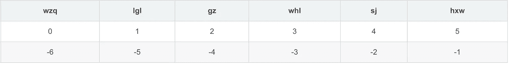

# Python 列表:你需要知道的一切

> 原文：<https://levelup.gitconnected.com/python-list-everything-you-need-to-know-b7ad87866cf>

本文旨在向您展示 Python 中列表的所有特性。

# 内容概述/摘要

1.  列表
    1.1 的初始化使用[ ]
    1.2 初始化使用`list()`，转换为列表
2.  访问列表
    2.1 索引
    2.2 切片
    2.3 横向列表元素用`for`循环
    2.4 检查存在用`in`2.5 更新列表元素
    2.6 串联/合并列表`+`，重复`*`
    2.7 嵌套列表
    2.8 比较列表`operator.eq`
3.  原生方法
    3.1 输出`print()`
    3.2 元素数量`len()`
    3.3 返回变量类型`type()`
    3.4 转换为列表`list()`
    3.5 最大和最小元素`max()` `min()`
    3.6 删除`del()`
4.  列表方法
    4.1 添加元素`append()` `insert()` `extend()`
    4.2 频率`count()`
    4.3 定位元素`index()`
    4.4 按顺序排序`sort()`
    4.5 复制列表`copy()`
    4.6 颠倒顺序`reverse()`
    4.7 删除元素`pop()` `remove()` `clear()`


# 1.列表初始化

## 1.1 用[ ]初始化

```
emptyList = [] # Create empty list
nonEmptyList = ["google", "facebook", "Random"] # Create non-empty list
```

## 1.2 使用`list()`，将其他类型的数据转换为列表

```
this_list = list(('apple', 'banana', 'cherry')) # ['apple', 'banana', 'cherry']
another_list = list({"hello", "Hi", "Good"}) # ["hello", "Hi", "Good"]
string_list = list("let's go") # ['l', 'e', 't', ''', 's', ' ', 'g', 'o']
```

# 2.存取表

## 2.1 索引

正向索引和反向索引

```
list_name = ['wzq', 'lgl', 'gz', 'whl', 'sj', 'hxw']
print(list_name[0]) # wzq, forward index, 0, 1, 2...
print(list_name[-1]) # hxw, inverted index, -1, -2, -3...
```



## 2.2 切片

```
list_name = ['wzq', 'lgl', 'gz', 'whl', 'sj', 'hxw']
print(list_name[1:5:2]) # ['lgl', 'whl']
print(list_name[-6:-1:3]) # ['wzq', 'whl']
```

## 2.3 带`for`循环的横向列表元素

```
fruit_list = ['apple', 'pear', 'cherry']
for i in fruit_list:
    print(i)
```

```
apple
pear
cherry
```

## 2.4 检查是否存在

使用`in`关键字

```
fruit_list = ['apple', 'pear', 'cherry']
print('apple' in fruit_list) # True
```

## 2.5 更新列表元素

修改/替换索引处的现有元素

```
fruit_list = ['apple', 'pear', 'cherry']
fruit_list[2] = 'banana'
print(fruit_list) # ['apple', 'pear', 'banana']
```

## 2.6 用+连接/组合列表，用*复制

```
x = [1, 2, 3]
y = [4, 5, 6]
print(x + y) # [1,2,3,4,5,6]
```

```
x = ['Hello']
print(x * 5) # ['Hello', 'Hello', 'Hello', 'Hello', 'Hello']
```

## 2.7 嵌套列表

```
x = [1, 2, 3]
y = ['a', 'b', 'c']
z = [x, y]
print(z) # [[1, 2, 3], ['a', 'b', 'c']]
```

## 2.8 比较列表

带模块`operator`

```
import operator

a = [1, 2]
b = [2, 3]
c = [2, 3]
print("Result comparing a, b:", operator.eq(a, b)) # False
print("Result comparing b, c:", operator.eq(b, c)) # True
```

# 3.本地方法

## 3.1 输出`print()`

我们已经用了很多次了

```
my_list = ['pink', True, 1.78, 65]
print(my_list) # ['pink', True, 1.78, 65]
```

## 3.2 元件数量`len()`

查找列表中元素的数量

```
fruit_list = ['apple', 'banana', 'cherry']
print(len(fruit_list)) # 3
```

## 3.3 返回变量类型`type()`

查找变量的类型(字符串，整型，布尔型，列表，集合，字典)

```
info_list = ['name', 'gender', 'age', 'height', 'weight']
print(type(info_list)) # <class 'list'>
```

## 3.4 转换为列表`list()`

*   要列出的字符串

```
str1 = 'Hello'
print(list(str1)) # ['H', 'e', 'l', 'l', 'o']
```

*   要列出的元组

```
tuple1 = ('Hello', 'Python')
print(list(tuple1)) # ['Hello', 'Python']
```

*   目录列表

```
dict1 = {'Hello': 'Python', 'name': 'pink'}
print(list(dict1)) # ['Hello', 'name']
```

*   设置为列表

```
set1 = {'Hello', 'Python', 'name', 'pink'}
print(list(set1)) # ['Python', 'name', 'pink', 'Hello']
```

*   要列出的范围

```
myRange = range(1, 6)
print(list(myRange)) # [1, 2, 3, 4, 5]
```

## 3.5 最大和最小元素

使用`max()`、`min()`

```
list1 = [4, 6, 2, 0, -5]
print(max(list1)) # 6
print(min(list1)) # -5

list2 = ['a', 'z', 'A', 'Z']
print(max(list2)) # z
print(min(list2)) # A
```

## 3.6 删除`del()`

*   删除索引处的单个元素

```
list_to_be_deleted = ['Baidu', 'Alibaba', 'Tencent', 'Bytedance']
del list_to_be_deleted[1]
print(list_to_be_deleted) # ['Baidu', 'Tencent', 'Bytedance']
```

*   删除整个列表

```
list_to_be_deleted = ['Baidu', 'Alibaba', 'Tencent', 'Bytedance']
del list_to_be_deleted 
print(list_to_be_deleted) # NameError: name 'list_to_be_deleted' is not defined
```

# 4.列出方法

## 4.1 添加元素 append()、insert()、extend()

*   将元素添加到列表末尾`append()`

```
fruit_list = ['apple', 'banana', 'cherry']
fruit_list.append('pear')
print(fruit_list) # ['apple', 'banana', 'cherry', 'pear']
```

*   将列表添加到另一列表

```
x = [1, 2, 3]
y = ['A', 'B', 'C']
x.append(y)
print(x) # [1, 2, 3, ['A', 'B', 'C']]
```

*   在索引位置插入元素`insert(<index position>, <new element>)`

```
fruits = ['apple', 'banana', 'cherry']
fruits.insert(1, "orange")
print(fruits) # ['apple', 'orange', 'banana', 'cherry']
```

*   将列表插入到另一个列表的索引位置

```
x = [1, 2, 3]
y = ['a', 'c']
x.insert(0, y)
print(x) # [['a', 'c'], 1, 2, 3]
```

*   从另一个 iterables `extend()`中添加多个元素，如字符串、元组、列表

```
abcList = ['A', 'B', 'C']
hello = 'Hello'
abcList.extend(hello)
print(abcList) # ['A', 'B', 'C', 'H', 'e', 'l', 'l', 'o']
```

```
abcList = ['A', 'B', 'C']
num123 = [1, 2, 3]
abcList.extend(num123)
print(abcList) # ['A', 'B', 'C', 1, 2, 3]
```

```
abcList = ['A', 'B', 'C']
tuple123 = (1, 2, 3)
abcList.extend(tuple123)
print(abcList) # ['A', 'B', 'C', 1, 2, 3]
```

```
abcList = ['A', 'B', 'C']
myDict = {'name': 'pink', 'gender': True}
abcList.extend(myDict)
print(abcList) # ['A', 'B', 'C', 'name', 'gender']
```

```
abcList = ['A', 'B', 'C']
set123 = {1, 2, 3}
abcList.extend(set123)
print(abcList) # ['A', 'B', 'C', 1, 2, 3]
```

```
abcList = ['A', 'B', 'C']
myRange = range(4)
abcList.extend(myRange)
print(abcList) # ['A', 'B', 'C', 1, 2, 3]
```

## 4.2 频率计数()

一个元素在列表中出现的次数

```
num = [1, 9, 7, 9]
print(num.count(9)) # 2
```

## 4.3 定位元件索引()

查找给定元素第一次出现的索引。

```
num = [4, 55, 32, 16, 32]
print(num.index(32)) # 2
```

## 4.4 使用 sort()对元素进行排序

*   默认使用字母顺序

```
words = ['Gender', 'Age', 'Height']
words.sort()
print(words) # ['Age', 'Gender', 'Height']
```

*   倒序

```
words = ['Gender', 'Age', 'Height']
words.sort(reverse=True)
print(words) # ['Height', 'Gender', 'Age']
```

*   使用特定值(字符串长度)排序

```
def getLen(e):
    return len(e)

words = ['a', 'bb', 'ccc', 'dddd', '']

words.sort(key=getLen) # same as words.sort(key=len)
print(words) # ['', 'a', 'bb', 'ccc', 'dddd']
```

*   用特定的键/值对字典列表进行排序

```
def getSortKey(e):
    return e['year']

words = [
    {'car': 'a', 'year': 1963},
    {'car': 'b', 'year': 2010},
    {'car': 'c', 'year': 2019}
]

words.sort(key=getSortKey)
print(words) # [{'car': 'a', 'year': 1963}, {'car': 'b', 'year': 2010}, {'car': 'c', 'year': 2019}]
```

*   使用反向和特定的排序关键字

```
words = ['aa', 'b', 'ccc', 'dddd']

words.sort(reverse=True, key=len)
print(words) # ['dddd', 'ccc', 'aa', 'b']
```

*   使用特定元素进行排序

```
def takeSecond(elem):
    return elem[1]

randomListOfTuple = [(2, 2), (3, 4), (4, 1), (1, 3)]

randomListOfTuple.sort(key=takeSecond)

print('Sorted randomListOfTuple', random) 
# Sorted randomListOfTuple: [(4, 1), (2, 2), (1, 3), (3, 4)]
```

## 4.5 复制列表复制()

复制一个列表，类似于表达式`a[:]`

```
fruits = ['apple', 'banana', 'cherry', 'orange']
x = fruits.copy()
print(x) # ['apple', 'banana', 'cherry', 'orange']
```

或者使用本地列表转换进行复制

```
list1 = ['apple', 'banana', 'cherry']
list_2 = list(list1)
```

## 4.6 颠倒顺序颠倒()

```
fruits = ['apple', 'banana', 'cherry']
fruits.reverse()
print(fruits) # ['cherry', 'banana', 'apple']
```

## 4.7 删除元素 pop()、remove()、clear()

*   `pop()`默认情况下删除最后一个元素

```
fruits = ['apple', 'banana', 'cherry']
fruits.pop()
print(fruits) # ['apple', 'banana']
```

*   `pop(index)`将元素定位于特定索引

```
fruits = ['apple', 'banana', 'cherry']
fruits.pop(1)
print(fruits) # ['apple', 'cherry']
```

*   `remove()`删除第一个匹配元素

```
num = [1, 3, 2, 8, 3]
num.remove(3)
print(num) # [1, 2, 8, 3]
```

*   `clear()`清空列表

```
word = ['A', 'B', 'C']
word.clear()
print(word) # []
```

**行动呼吁**

如果你觉得这个指南有帮助，请鼓掌并跟我来。通过[链接](https://medium.com/@caopengau/membership)加入 medium，获取我和所有其他优秀作家在 medium 上发表的所有优质文章。