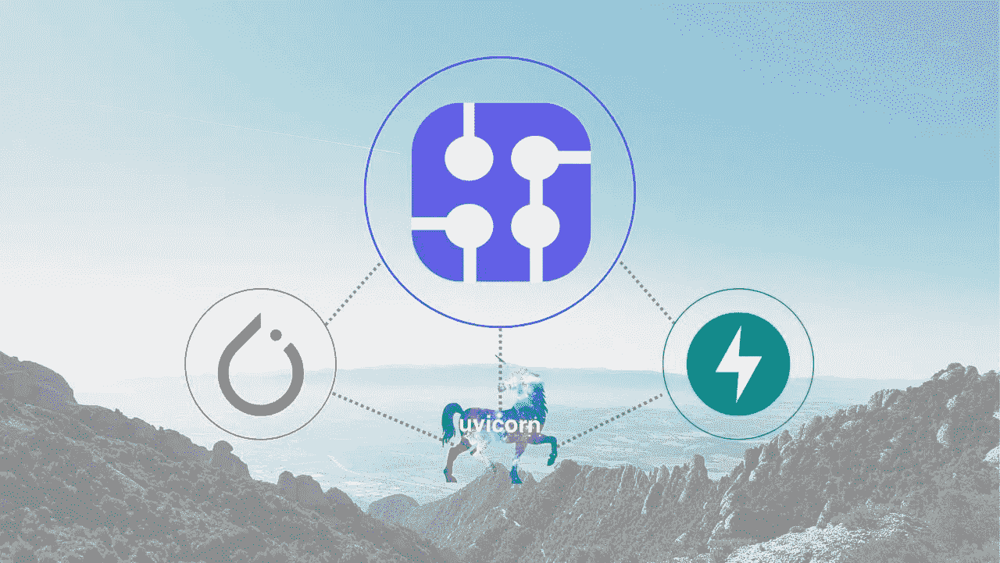
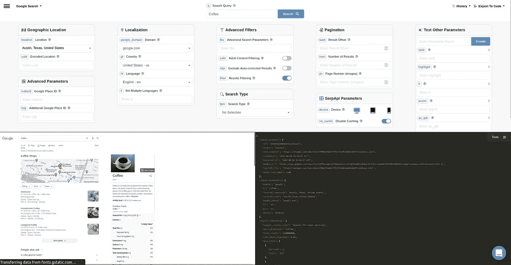
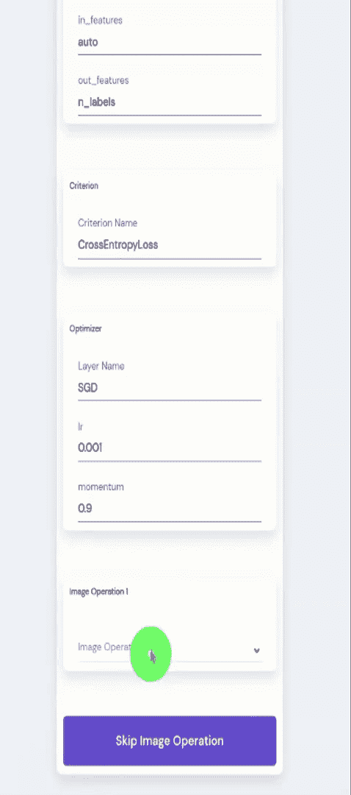
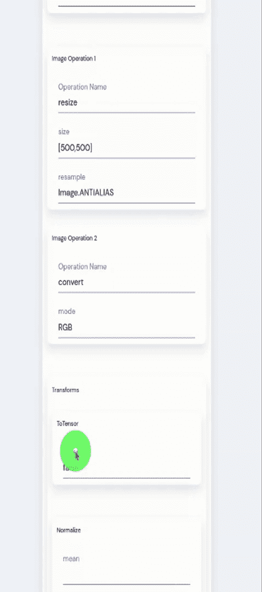
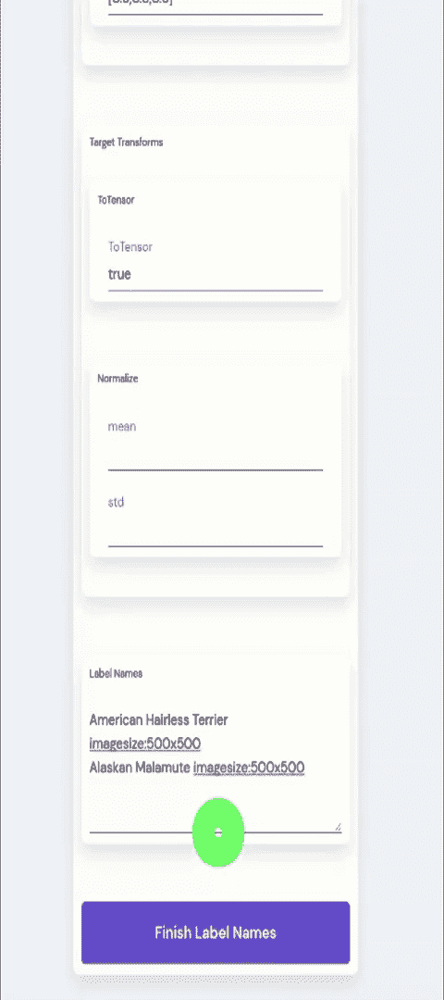
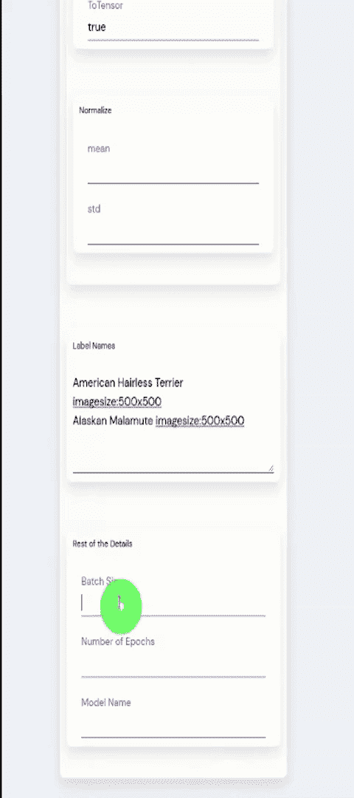
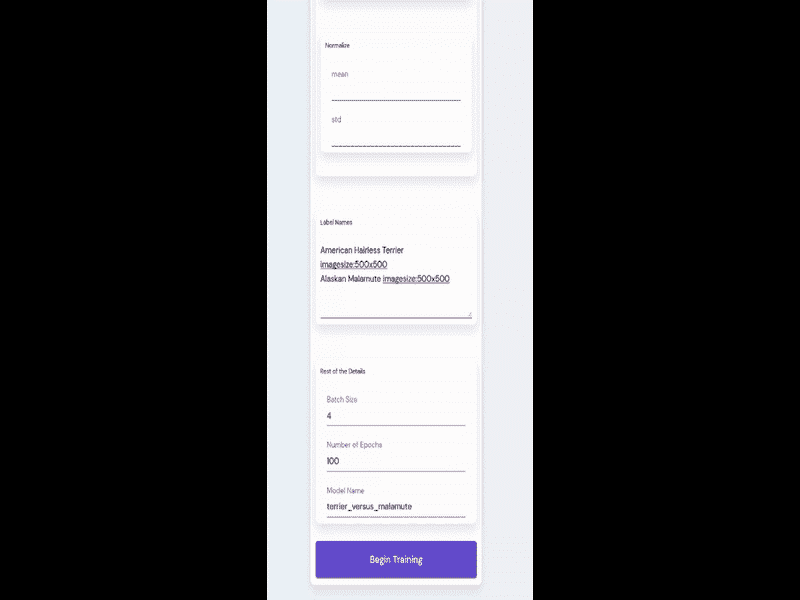

# Python 机器学习

> 原文：<https://levelup.gitconnected.com/python-machine-learning-31ad9a0bbf53>

这是与用于训练神经网络的机器学习模型和数据集的自动创建相关的系列博客帖子的一部分。如果你对这个故事的背景或之前的 Python 代码感兴趣，你可以滚动到文章的底部，获得以前博客文章的链接。你也可以前往[使用 SERP 数据建立机器学习模型](https://serpapi.com/use-cases/machine-learning-and-artificial-intelligence)页面，清楚地了解你可以创建什么样的自动化机器学习模型，或者如何改进你的数据科学项目。

在前几周，我制作了一个教程，介绍如何使用自动化 API 自动创建用于机器学习模型训练的深度学习算法。本周我将以一种易于理解的可视化方式一步一步地创建神经网络。

# Python 对机器学习有好处吗？

Python 支持常用的机器学习库，如 Keras、Pytorch、Tensorflow、Tensorflow 2、Scikit-Learn，以及支持数据科学的 Python 库 Scipy、Numpy、Matplotlib、Pandas 等。从神经网络的创建到机器学习过程的可视化，Python for Machine Learning 是机器学习学习者的基础之一，具有各种开放源代码、教程和现实世界的应用程序。

最重要的是，Python 是一种非常棒的编程语言，可以用来制作简单或大规模的 API。各种各样的 Python 库也为接触计算机科学的不同分支创造了独特的机会。一个做数据分析的数据科学家，一个做 python 编程的程序员，从零开始的学习者可以在同一个项目中相遇，并且没有太多麻烦地共享各种指标和信息。

在本教程的范围内，我们正在训练一个图像分类器机器学习算法。对于新读者，我们使用了 [SerpApi 的 Google Images Scraper API](https://serpapi.com/images-results) 来获得宽度为 500、高度为 500 的美国狗物种的图像，并且还指定了一个 dog `chips`参数，允许只选择狗的图像。使用 SERP 数据是减少花费在预处理上的时间的一个很好的方法，并且可以用更少的噪音进行预测。您可以[注册申领免费积分](https://serpapi.com/users/sign_up)。

# Python 中的机器学习难吗？

**Python** 很容易。**机器学习**可以轻松搞定 **Python** 。相对来说，**机器学习模型**在 **Python** 中更容易开发。它还支持具有**机器学习算法**的丰富库，用于**自然语言处理**、**数据可视化**、 **SERP** 和**预处理**。

为了让 Python 变得更简单，本周我创建了一个逐步表格，帮助你创建机器学习的神经网络。在我看来，Python 有潜力解决机器学习的难题。如果我们允许对机器学习感兴趣的人以一种适合的方式进行创造，更容易掌握，并且在深度学习算法创建的每一步都有有限的细节；并允许失败和成功的能力，进行大规模的交叉验证，这将不可避免地导致更好地掌握机器学习。当然，我必须添加不同类型的方法来输入培训过程的细节。对我个人来说，为了训练一个分类器，我不想一个接一个地采取五个步骤来创建线性回归。我更喜欢一个我可以操作的 JSON，或者一个线性回归的每个超参数都在一个地方让我可以轻松填充的表单，就像 [SerpApi 的游乐场](https://serpapi.com/playground):

我只是一个学习者，也不是机器学习方面的专家。但那是我的偏好。事不宜迟，让我们深入表单。

# 机器学习模型

我已经创建了一种方法，可以通过 Python 类名使用以前定制的机器学习算法，或者通过逐层创建您的神经网络来创建定制算法。如果选择类名，图层创建将不会显示。因此，我们现在将选择自定义方法:

# 神经网络的构建模块

您可以为您的神经网络选择层的类型，定义超参数，并决定是否要添加一个新层。目前只有我们将在本教程中使用的图层可用。但它应该能很好地说明创建机器学习算法是如何工作的。

在未来，我计划支持创建流行的机器学习算法所需的图层类型和超参数，如 KNN(K-最近邻)、K-均值聚类、SVM(支持向量机)，或分层聚类、随机森林、决策树、逻辑回归和各种其他分类算法以及回归算法。

您也可以使用预定义的关键字，如`auto`来获取图层的通道内尺寸或特征内尺寸，或者使用`n_labels`来使用标签尺寸。特别是，在处理维数减少时，试图手动计算一些超参数可能会造成障碍。目前并不支持所有的计算。但是在处理机器学习时，它应该给用户一个如何降低复杂性的清晰思路。

# 标准

到目前为止，我只支持 Python 的 Pytorch 库的 CrossEntropyLoss 函数，没有任何调整。我将名称 Criterion 称为代表更广泛的术语。Criterion 通常指的是负责找到你可以从机器学习训练过程中获得的最小损失的函数。误差函数是指负责显示机器学习模型的预测和现实世界值之间的差异的函数。目标函数是您希望最大化或最小化的函数，以便获得更好的预测。成本函数或损失函数指的是目标函数的最小化，意味着人工智能的预测和现实世界的例子之间的损失最小化。对于所有这些负责我们评估一个训练过程是否成功的算法，我们将使用命名标准。

# 【计算机】优化程序

我们在这个机器学习过程中使用的 Python 的 Pytorch 库支持多种类型的优化器，具有很好的定制选项。优化器指的是负责调整神经网络之间的权重以便找到预测的良好拟合的函数。学习率是优化器的一个基本超参数，对于机器学习训练过程至关重要，该过程负责在每次预测时应该进行多大的学习跳跃。当它太高时，结果将是奇怪和不正确的。通常情况下，在二进制选择的情况下，即使学习率很高，你的正确预测率也不到 50%。如果学习率太低，你的训练过程就不会达到标准的绝对最小值。这将导致训练较差的神经网络。这里的动量表示做出正确预测时学习率变化的动量。

# 图像预处理

虽然我们不需要调整大小，Python PIL 库需要在反走样之前调整图像的大小(到它自己的大小)。您可以将数组写入文本框，它会将自身转换为 Python 字典中负责后台训练的数组。将图像重采样为 RGB 可以帮助我们使用 RGBA(红-绿-蓝-alpha，其中 alpha 表示不透明度)图像转换为 RGB，以便将它们的矢量维数减少到 3，从而使用它们。这些类型的操作可能会对数据集的效用或利用率产生重大影响。您也可以完全跳过图像操作。

# 转换

变换是调整机器学习计算所需的图像张量化的部分。到目前为止，我只支持 Python 的 Pytorch 库的 toTensor 和 Normalize 函数。就像图像操作一样，您可以使用文本格式的数组来表示标准化过程的平均值和标准值。你也可以在机器学习训练过程中对目标进行变换，以获得更好的表示。

# 标签名称

在之前的几周，我们已经实现了一种通过 SerpApi 的 Google Images Scraper API 自动收集预处理和标记数据的方法，使用了 SerpApi 的 Python 库，在 Python 中调用了 [Google 搜索结果。我们将抓取的图像存储在本地 N1QL Couchbase 服务器中，以便实现未来的异步流程。N1QL 是一个很好的数据模型，可以以 JSON 的形式发挥 SQL 的威力。我们将图像及其标签名称存储在服务器中，并在机器学习训练或测试过程就绪时自动获取它们。目前，标签名称代表在](https://github.com/serpapi/google-search-results-python) [SerpApi 的谷歌图像抓取 API](https://serpapi.com/images-results) 上进行的查询，每行一个查询。未来，我们将在训练前自动收集数据集中的缺失查询。

# 批量大小、时期、型号名称

使用我们的命令创建 Python 字典的表单的其余部分由批量大小、时期数和模型名组成。批量大小表示在每个深度学习训练会话中应该获取多少图像。时期数代表每个单独的机器学习训练过程应该重复多少次。模型名称是已训练的机器学习模型将被保存在其上的文件的名称。由于我们使用的是 Python 的 Pytorch 库，它将保存在。pt 格式。

# 异步机器学习

当我们按下开始训练按钮时，我们会发送一个异步请求，使用所需的机器学习训练参数来训练端点，机器学习训练在使用 Python 的 FastAPI 的后台进行。与此同时，我们可能会创建另一个深度学习模型，一旦这个模型完成，它会自动创建一个具有所需名称的模型文件。

这对于比较机器学习模型的参数变化是有用的，以便掌握最佳的机器学习训练过程应该是什么样的。在接下来的几周里，我们将添加一个新页面，其中包含来自培训流程的实时可视化数据，并在同一图表上对不同的培训流程进行交叉验证。这些图表还将包括不同流程的指标，以及训练数据集。

我使用 FastAPI 的 Python 后台进程来实现这一点:

我不会分享实际页面的详细代码，以及它是如何制作的。原因很简单。我没有使用 React，继续使用硬编码方法。我不认为这是个好例子。在我发布开源库之后，它将是公开的。

# 结论

我感谢读者的关注，感谢 SerpApi 的聪明人让我的写作成为可能，也感谢本周我打算展示的[密码本](https://codepen.io/havardob/pen/eYJPwdb)的作者。如果读者能在他们找到的任何平台(Linkedin、Medium、Tealfeed 等)上关注这个系列，我将不胜感激。).在接下来的几周里，我们将讨论培训和测试过程的可视化，在存储服务器中存储机器学习培训数据，利用无监督学习，强化学习，并进一步掌握监督学习模型，使用 Kaggle 数据集的能力。