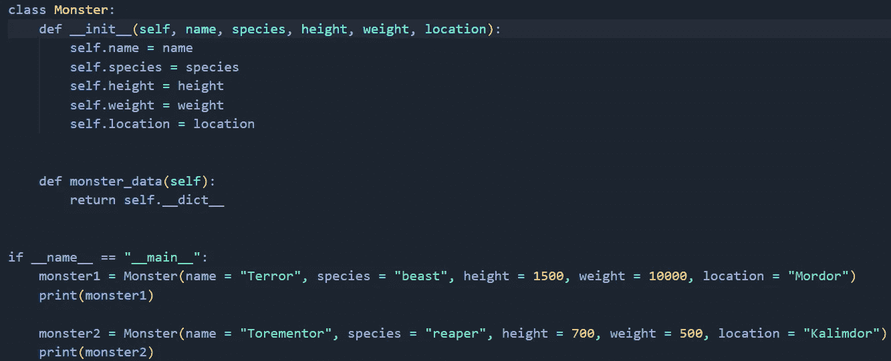
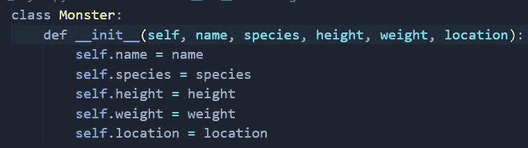
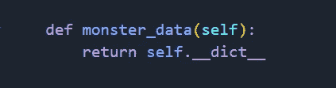
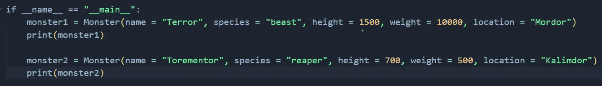
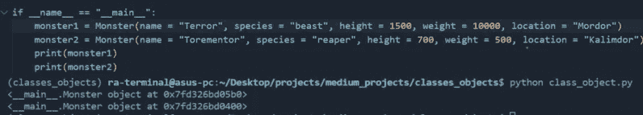
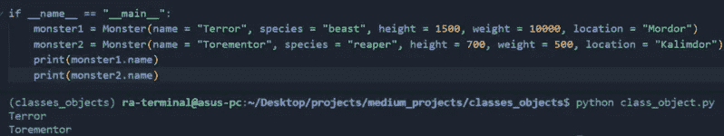
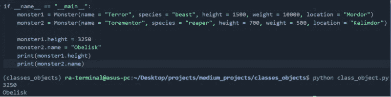
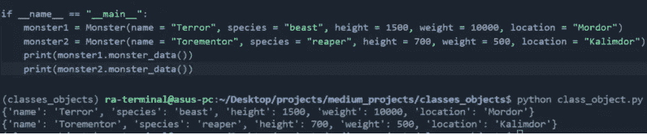

# Python:面向对象编程第 1 部分

> 原文：<https://levelup.gitconnected.com/python-object-oriented-programming-part-1-e9ea12ba1936>

## 为什么数据开发人员需要去上课！

当试图随着时间复制一个过程时，使用类和对象是非常重要的。当试图重复做某件事时，它会大大减少工作量。这里我们将讨论类、对象/实例，以及构造类的基本组件的重要性。

[图片](https://unsplash.com/photos/1-aA2Fadydc)由[肯尼·埃里森](https://unsplash.com/@neonbrand)拍摄

## **目录:**

*   什么是类？
*   访问/更新类对象。
*   为什么使用类？
*   结论。

## **什么是类？**

类是面向对象编程的基石。将类视为创建新实例/对象的蓝图。在一个类中，你会有一个变量和函数的列表，它们也被称为属性和方法。一个类由 init 函数、self、属性、对象/实例和该类的方法组成。

作者图片

*   **_ _ init _ _ 函数和属性:**
    也称为构造函数，这是你初始化你的对象变量的地方也称为属性。把这个想成你如何定义你的对象，或者是什么把这个对象分类成它是什么。例如，如果我们有一个怪物类，我们会用名字、身高、体重和位置来标识一个怪物。

作者图片

*   **方法:**
    调用与类相关的函数。

作者图片

*   **什么是对象/实例？**
    你可以在调用你的类时创建你的第一个对象/实例，用正确的值填充所有的参数，并将它们设置为一个变量名。在这种情况下，我们通过将变量名设置为 Monster 类并在其中定义构造函数要求的必需变量来创建我们的`monster1`和`monster2`对象。

作者图片

*   **self:**
    用于在对象第一次创建时，将所有的属性和方法存储到 self 中。您对对象变量所做的任何更改都将在您进行更改的过程中针对该特定对象在 self 中进行更新。所以对于每个方法，你只需要传递 self。你可以在上面例子中的`monster_data`方法中看到这一点。不用在方法参数中列出姓名、身高、体重和位置，您可以只列出 self，这样`monster_data`就可以访问该类的所有属性。

## **访问/更新类对象:**

当你创建一个类对象时，它被存储在内存中的某个地方。当您尝试按原样打印对象变量名时，它会返回模块名(main)、对象属于哪个类(monster)以及该对象在内存中的存储位置(0x7fd326bd05b0)。

作者图片

**如何访问类对象属性:** 如果你想访问你的对象属性，你需要做的就是调用你的对象并包含`.{attributename}`符号。请记住不要在属性名中包含`{}`。

作者图片

**如何更新类对象属性:** 要更新你的类属性，你只需要调用你的对象属性，并输入一个新值来替换之前的值。

作者图片

**如何访问类对象方法:**

如果你想访问存储在你的类中的对象方法，你只需要包括方法名和表示方法调用的`()`。

作者图片

## **为什么要使用类？**

目标是通过使用类来帮助您避免重复编写相同的代码来做相同的事情，从而简化软件开发过程。类很方便，因为它们确保了可重用性、更好的代码组织、更好的可读性、结构、对象的状态(有点像我们之前讨论的每个对象如何拥有自己的属性集)、封装和继承。

## 结论:

类，动态编程，面向对象编程不管你想叫它什么都可能是一门令人望而生畏的课程。组成一个类的有很多活动的部分，但是一旦你掌握了它，你会发现好处远远大于困难。这并不是说一直都需要类，就像如果你运行一个简单的数据处理脚本，你可以对它采用函数式编程方法。每个概念都有自己的位置。

相关内容:

*   [Python:面向对象编程第二部分](/python-object-oriented-programming-part-2-f8d17757efa8)