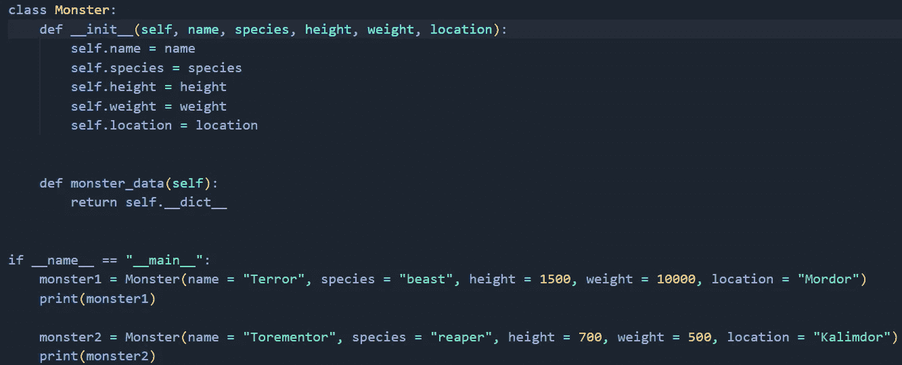
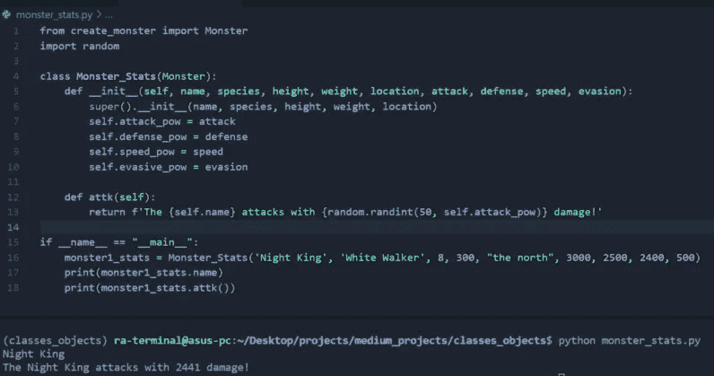
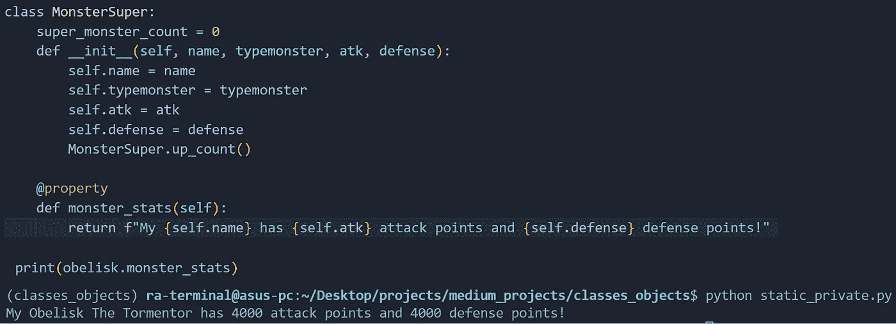
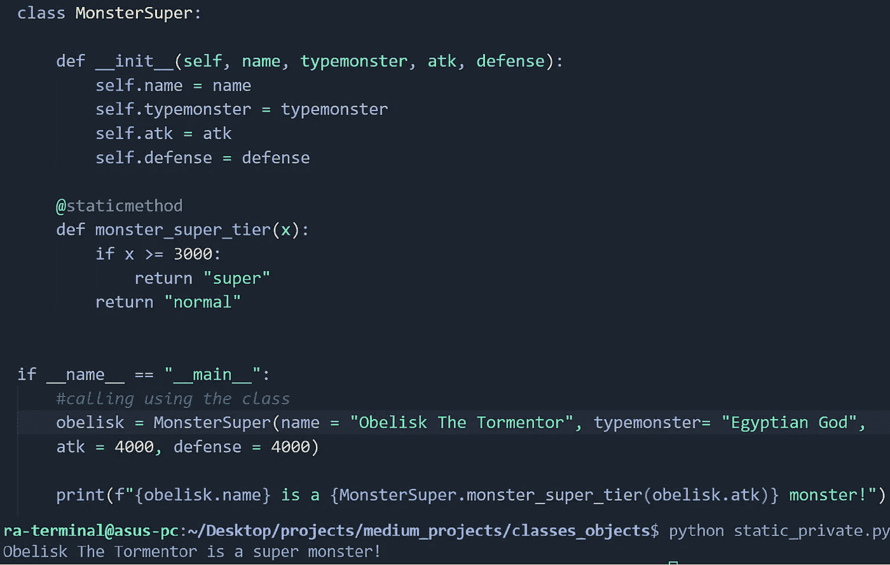
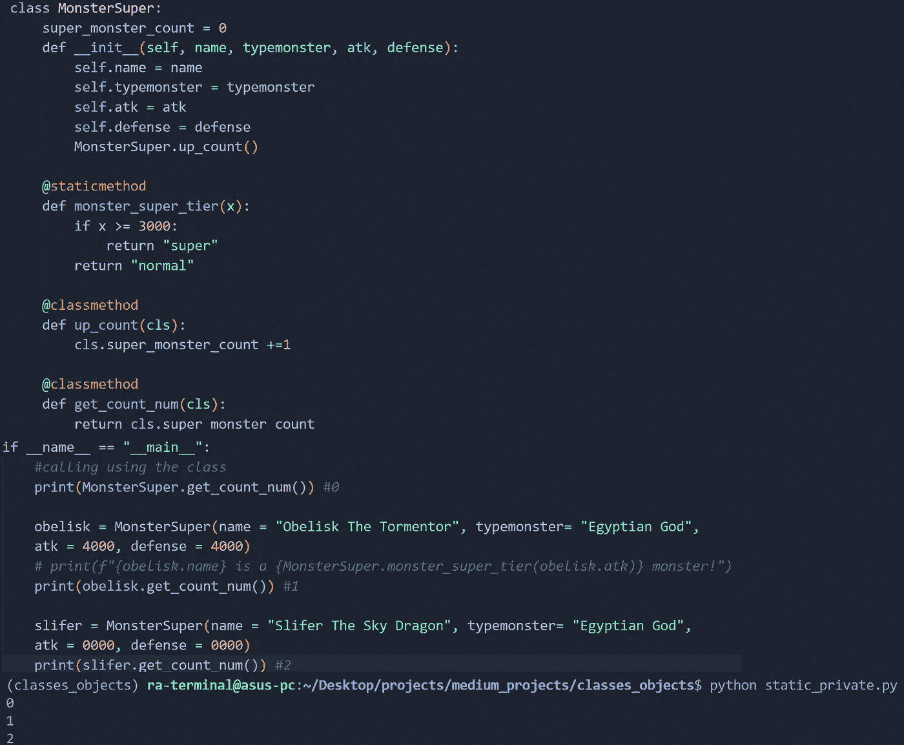
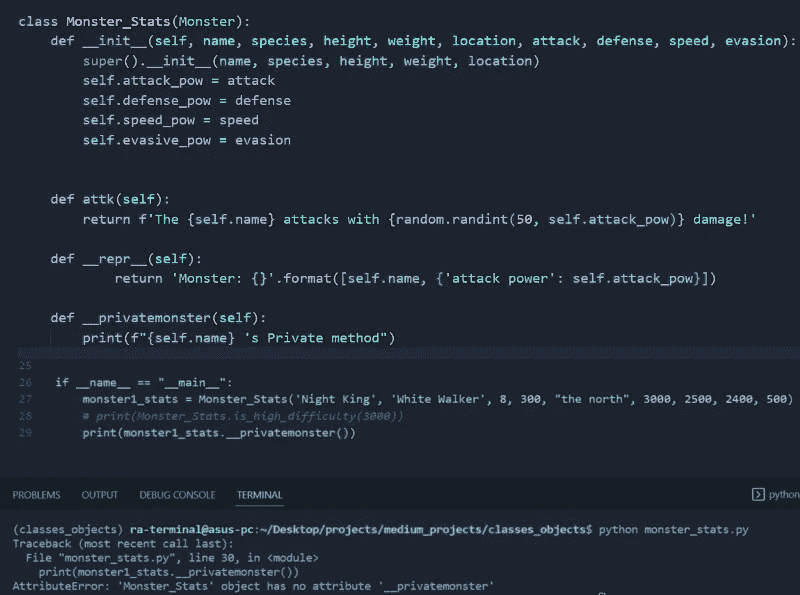
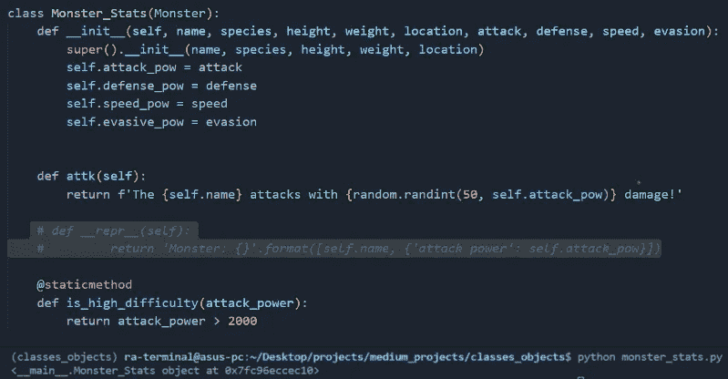
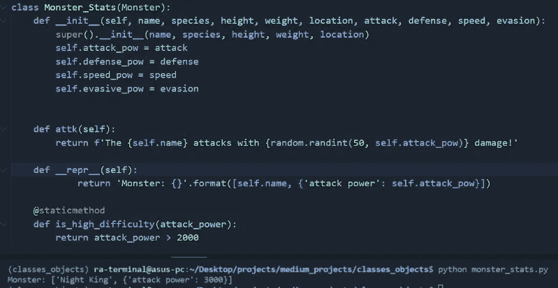

# Python:面向对象编程第 2 部分

> 原文：<https://levelup.gitconnected.com/python-object-oriented-programming-part-2-f8d17757efa8>

## 让我们讨论继承、静态/类方法、封装

之前我们谈到了什么是类和对象，它们是如何使用的，以及为什么我们应该使用它们。本文将介绍更多的概念，这些概念在处理继承、属性修饰、静态/类方法、超类和私有/公共方法等类时非常重要。

[图片](https://unsplash.com/photos/YJdCZba0TYE)由[迪伦·吉利斯](https://unsplash.com/@dylandgillis)拍摄

## 目录:

*   继承/超类
*   属性、静态和类方法
*   包装
*   魔术/邓德方法
*   结论

## 继承和超类:

既然我们已经介绍了如何创建和设置类、__init__、属性和方法，

作者图片

让我们来谈谈继承。如果我们想创建一个新的职业来帮助我们的怪物职业获得一些统计数据，这样它就可以肆虐了。现在是实现子类的好时机。这个想法是，它可以从父类 Monster 继承所有的属性和方法，并在我们的 Monster_Stats 子类中访问它们。现在当我们创建我们的 Monster_Class 对象时，定义我们的 Monster 的背景信息(名字、物种、身高、体重和位置)所需的所有属性都将由我们的 Monster 类的构造函数初始化。

作者图片

—首先，我们从我们的`create_monster.py`模块导入我们的 Monster 类。

—在这里，我们像任何普通的类一样定义我们的子类，增加了一些额外的东西。我们仍然在 Monster_Stats 子类的参数中添加来自我们的父 Monster 类的属性。

—现在，当我们用它的统计数据创建新的怪物对象时，它将使用我们的怪物父类 init 来初始化名称、物种、高度、重量和位置。

—因此，本质上，一旦我们使用 Monster 类创建了 Monster 对象，我们就使用 MonsterStats 类为该 Monster 对象提供统计信息。

## 属性、静态方法和类方法:

**属性方法:**
属性装饰器在你的类中的方法之上用一个`@property`来表示。它允许您像访问类属性一样访问这些方法。

作者图片

—这里我们有 MonsterSuper 类中的 monster_stats 方法，它显示攻击和防御能力。

—如果我们要在没有`@property`装饰器的情况下打印它，那么我们将不得不像这样编写这个调用，`print(obelisk.monster_stats())`，因为它声明了一个方法，但是添加`@property`装饰器允许我们像访问类属性一样访问这个方法。

**静态方法:** 静态方法用`@staticmethod`装饰器表示，位于指定方法之上。它们被绑定到类而不是实例对象，也不需要使用实例对象。静态方法可以通过类本身来访问。但是它们是有限的，因为它们不能访问那个类的类属性，或者那个类的类对象，因为我们没有自己的或者访问那些类属性的权限。简单地说，静态方法对它所在的类一无所知，只使用给它的参数。把它想象成一个普通的 python 函数，就在一个类内部。要调用它，必须首先使用类名，然后使用静态方法本身。

作者图片

—这里我们有 MonsterSuper 类，我们在其中确定怪物的状态。

—在 MonsterSuper 类中，我们有 monster_super_tier 静态方法。这种方法是用来根据我们的怪物的攻击力来确定它们是否在“超级等级”中。不是最详细的例子，但我赤裸裸的。这里我们使用方尖碑的攻击力作为输入，因此得到了他确实在超级怪物等级的回报。

—我们使用 MonsterSuper 类调用 monster_super_tier 静态方法，而不是我们的类对象 Obelisk。

**类方法(cls):**
用`@classmethod`装饰符表示的类方法，在指定方法的顶部，允许你在所有对象中更新你的类变量的默认值。就像实例方法接收实例作为初始参数一样，类方法接收类作为第一个参数。这方面的一个例子是，如果我们想在超级怪物被创造出来的时候记录它们的数量。我们可以使用类和类对象来访问这些方法。

作者图片

—这里的 super_monster_count 是一个属于 MonsterSuper 类的变量。

—在我们的 __init__ 方法中，当我们创建新的 monster 对象时，我们调用`up_count`方法来增加计数。

—我们调用类方法`get_count_num`三次。我们第一次调用类本身来访问这个类方法。第二次和第三次我们使用我们的 obelisk 和 slifer 类对象来访问类方法。因此，我们有 0，1，2 分别代表 MonsterSuper 类，方尖碑，和 slifer。

## 封装:

允许您对类属性/方法进行限制，以防止数据被修改。它阻止改变的方法是只允许 objects 变量被 class 方法单独改变。这意味着属性不能通过改变类外的值来改变，就像你通常更新一个对象的属性一样。

**私有成员:** 私有成员是私有属性和/或方法，只能在类内部访问和更新。建议不要在类操作之外使用这些变量。这可以防止意外修改您不想修改的数据，也是隐藏您不想公开的类的内部功能的好方法。您可以通过在声明方法名之前使用 _ 来指明在一个类中哪些方法应该是私有的，就像这样，`__methodname`(确保在方法名之前使用双下划线)。

作者图片

—这里我们试图访问我们类中的私有 monster 方法，但是 Python 抛出了一个错误，因为我们的`__privatemonster`方法是一个私有方法。

**公共成员:** 表示普通类中使用的公共属性和方法结构，在这里也可以在类外访问它们。

## **魔法/邓德方法:**

方法名的两端都有下划线，就像我们的`__init__`方法。如你所见，邓德代表双下划线。通常用于重载类中的运算符。

作者图片

—正如您所看到的，当我们打印出对象而没有在类中初始化 __repr__ 函数时，python 只打印对象在内存中的位置。

作者图片

—当打印初始化了 __repr__ 函数的函数时，我们只能根据 __repr__ 函数的构建方式获得实际的可读返回。在这种情况下得到怪物的名字和它的攻击力。

## 结论:

使用子类、封装、静态/类和私有/公共方法增加了额外的复杂性，但是允许用户/团队创建可以更有效地扩展的生产级代码。是的，同样的应用程序可以用函数式编程方法来开发，但是这会增加开发时间，看起来更加混乱，更加没有条理，并且会给你的应用程序增加更多的代码行。我知道我用了一些权力的游戏和 Yugioh 作为我的“怪物”例子的灵感，但我想让事情变得更有趣一点，并作为对创作者高桥和希，瑞普的敬意。希望你们喜欢这些内容。请鼓掌，分享，评论，关注，快乐编码！

**相关内容:**

*   [Python:面向对象编程第 1 部分](/python-object-oriented-programming-part-1-e9ea12ba1936)