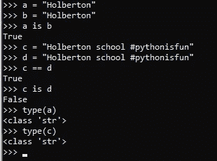
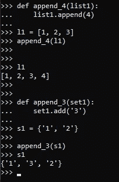
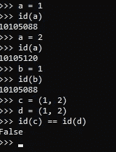
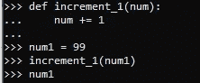
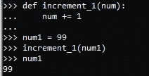
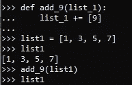
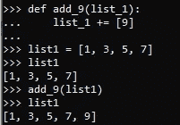

# Python 对象:引擎盖下

> 原文：<https://levelup.gitconnected.com/python-objects-under-the-hood-1b9c4a9cf41d>

图片鸣谢 pixabay.com:[https://pix abay . com/illustrations/python-python-logo-4785225/](https://pixabay.com/illustrations/python-python-logo-4785225/)

**简介:**
Python 是一种面向对象的编程语言，顾名思义，是一种基于对象和类的编程方法。这与其他方法形成了对比，其他方法在数据片段之间有着松散的联系。知道这一点很重要，因为在大多数 OOP 语言中，一切都是对象，这对于数据如何在程序中处理和传递有许多含义。

**ID 和 Type:** ID 和 Type 都是 python 中内置的函数，提供传递给它们的对象的信息，特别是它们各自的唯一标识和数据类型。例如，如果你有一个名为' a '的变量，并将其设置为等于另一个名为' b '的对象，它们将具有相同的标识，因为它们指向同一个对象。这就是所谓的别名，因为你并没有真正地创建一个新的对象，只是为同一个对象取了另一个名字。由于 python 内部的优化，只要对象是相同的，即使值是独立设置的，也会发生这种情况。利用 id 函数提供的信息特别有用，因为如果两个对象具有相同的 id，它们就是同一个对象，改变其中一个也会改变另一个。请注意，“is”检查两个对象是否具有相同的 id，而“==”检查两个对象是否具有相同的内容。

**可变对象:**
您可能在浏览文档或 StackOverflow 时遇到过‘可变’或‘不可变’这两个词。这些描述应用于数据类型时，用于指示数据在创建后是否可以更改。这种区别很重要，因为可变数据类型(如列表、字典和集合)与不可变数据类型(如元组、字符串和整型)的处理和存储方式不同。考虑下面的函数，这些函数展示了可变数据类型是如何被改变的，即使是在另一个函数中:

**不可变对象:**
可变对象的对立面是不可变对象，创建后不能改变。不可变对象的例子包括诸如字符串、整型、浮点型和布尔型等数据类型。这对后台处理的数据意味着什么？每当一个对象被创建时，它在内存中被分配一个位置，如它的 ID 所示。请注意，当下面的 a 从 1 变为 2 时，它并没有改变不可变对象；它创造了一个全新的物体。重新分配指向该对象的变量不会删除该对象，因为它仍然存在于内存中，您只是失去了对它的绑定。

通常，一旦所有绑定丢失，原始对象将被删除，但是，由于 NSMALLPOSINTS 和 NSMALLNEGINTS 最常用的整数的值范围分别为 0–256 和-5–0。这些对象在 python 脚本运行的任何时候都会被预加载，然后创建一个新的变量可以指向同一个对象，因为它仍然存在于内存中。然而，情况并不总是如此，例如元组。其他预先分配的整数，例如在某个范围内，也会显示类似的效果。关于元组，值得注意的一个特别有趣的地方是，尽管它们是不可变的数据类型，但它们可以保存可以在元组中更改的可变数据类型。冻结集也是如此。

**这有什么关系？:**
可变性和不可变性各有优缺点。可变对象可以根据需要进行更改和适应，这有其优点和缺点。可变对象的最大好处是，在任何需要改变的时候，不必复制新的实例。以一个简单的游戏为例，它有一个代表统计数据的列表。列表中的属性可能会因为游戏中的各种效果而频繁改变，如果需要的话，简单地改变列表中的值要比任何时候做一个新的列表要快得多。

另一方面，不可变对象通过它们的稳定性提供了好处。一般来说，不可变对象更容易构造、测试和使用，因为不需要考虑任何变化，所以需要准备更少的测试用例来发现异常。不可变对象还防止了由同时被多个对象引用而导致的副作用。以上面的视频游戏为例，如果一个值是一个永远不会改变的已知常数，让它成为不可变的将允许它更快地被引用，并减少可能发生错误的点。从本质上讲，当函数围绕它们的好处设计时，不可变对象只是使程序员的生活更简单。

**参数是如何传递给函数的，这对可变和不可变对象意味着什么？:** 理解这一点特别重要，因为 python 编译器根据发送的数据是可变的还是不可变的来处理函数参数。以下面的函数为例:

在看答案之前，花点时间想想变量 num1 包含了什么。

当变量 num1 被初始设置时，它包含整数值 99。它被传递给函数 increment_1，该函数只是将值增加 1。这里出现问题是因为整数，如前所述，是不可变的。因为不可变对象不能被改变，所以当它增加 1 时，反而创建整数的副本，并且不改变参数之外的原始 num1。

让我们看一个类似的例子，这次使用的是可变数据类型 lists。

这里也是一样，在继续阅读之前，想一想函数执行后 list1 应该包含什么。

因为 list1 是一个列表，一个可变的数据类型，而不是在更改时创建副本，所以原始对象被更改，导致下面的结果:

关于 python 如何处理数据的讨论到此结束，我希望这是有帮助的。