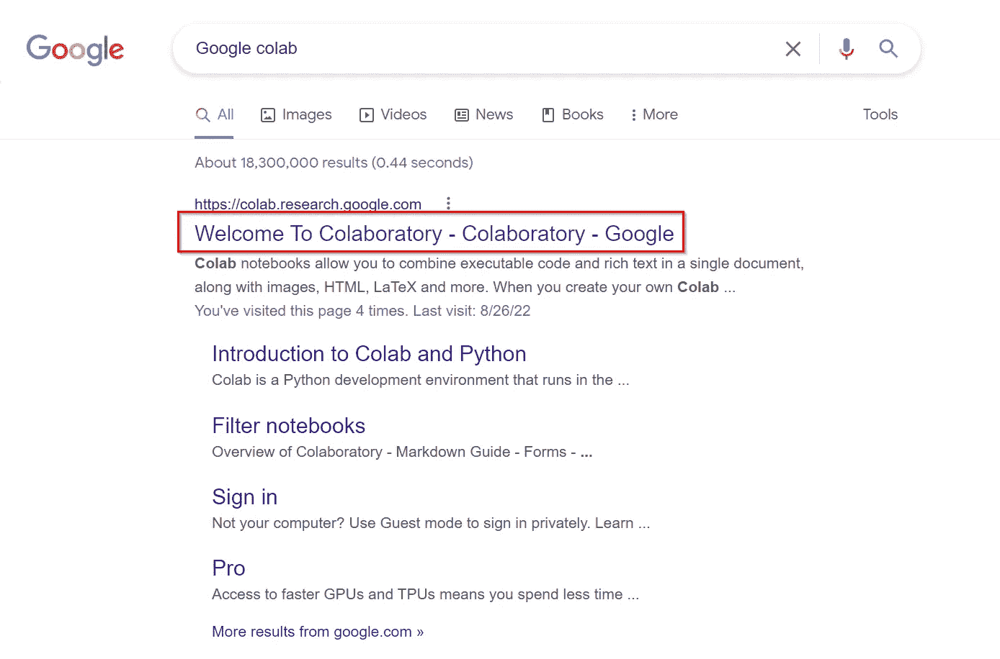
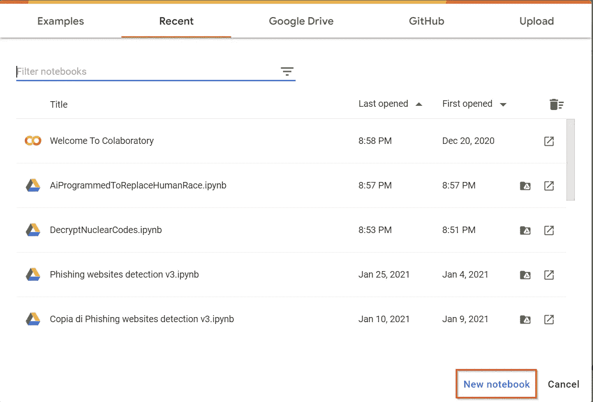
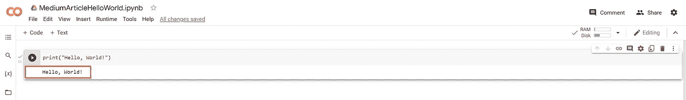
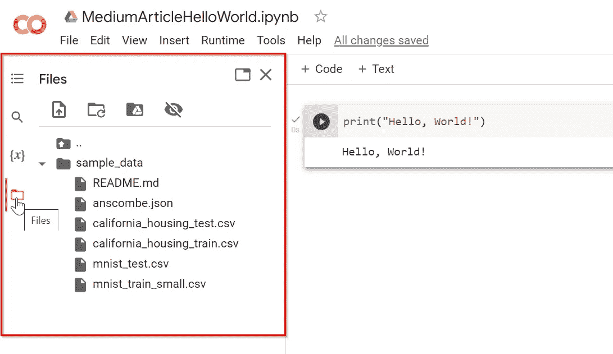
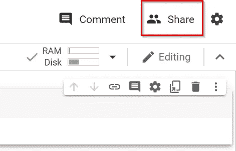
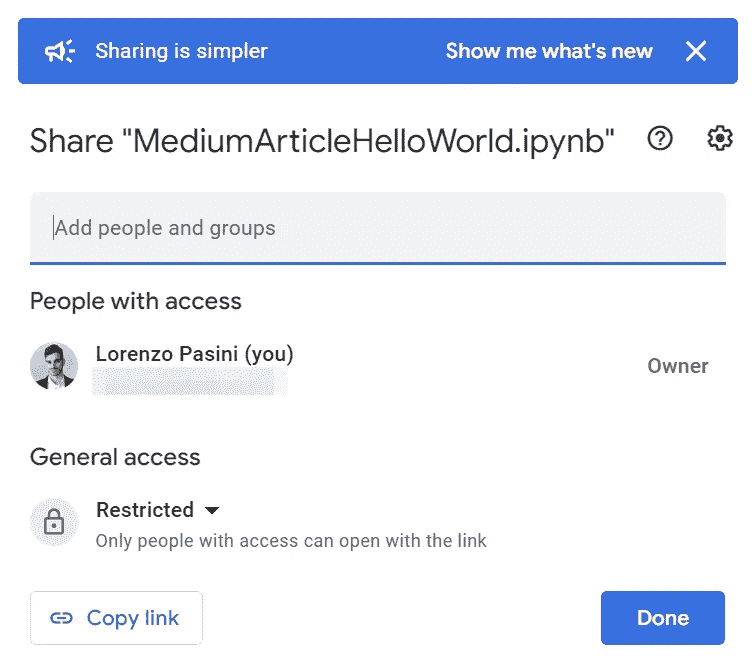
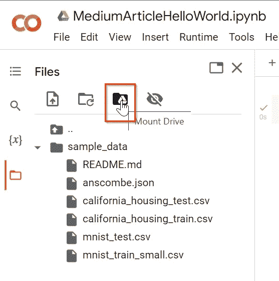

# Google Colab 上的 Python 很方便

> 原文：<https://levelup.gitconnected.com/python-on-google-colab-is-convenient-f5d3980a0ee0>

如果您正在考虑更换您的旧笔记本电脑来运行用 Python 编写的机器学习脚本，请等待并阅读本文(即使您不打算更换您的笔记本电脑)

由[鲁拜图·阿扎德](https://unsplash.com/@rubaitulazad?utm_source=medium&utm_medium=referral)在 [Unsplash](https://unsplash.com?utm_source=medium&utm_medium=referral) 上拍摄的照片

在我大学的最后一年，我以前的笔记本电脑已经用了 10 年了。因为我的旧笔记本电脑无法启动，所以我推迟了 40 分钟参加 web 编程考试。如果您目前使用的是经济型笔记本电脑，或者您只是想要一种方便的 Python 编程方式，那么您可以使用 Google Colab。

如何用两个字解释 Google Colab？在你的浏览器中想象一个编程环境来用 Python 开发软件。

在谷歌上搜索“谷歌实验室”或点击以下链接[https://colab.research.google.com/](https://colab.research.google.com/)(你可以用你的 Gmail 账户登录)。

Google colab 的结果页面

点击“新建笔记本”按钮

在 Google 协同实验室中创建新笔记本

免费版本有一些限制，但是您仍然拥有一台功能完整的机器，可以在其中运行 Python 脚本。

只需写下类似`print("Hello, World!")`的内容，然后按下播放按钮，你就会看到你的函数的结果。

你好，世界！在谷歌联合实验室

请注意，您有一台可以运行 Python 脚本的真实机器。
事实上，如果你检查右上角的边框，你会看到内存和磁盘的使用情况。

RAM 和磁盘使用情况

在左侧，您会看到“文件”按钮，通过它您可以访问您环境中的文件系统。

Google 协作文件

如果你想分享你的代码，你可以点击右上角的“分享”按钮。

共享按钮

Google Colaboratory 将提示谷歌共享文件和文档的常用方式。

谷歌共享

## 额外提示:安装你的 Google Drive 文件系统

你可以点击“安装驱动器”图标，谷歌合作实验室会给你一段代码来访问你的谷歌驱动器文件系统。

Mount Drive 谷歌联合实验室

## 结论

使用 Python Colaboratory，您可以轻松、方便地编写 Python 代码，并且只需点击几下鼠标就可以共享您的代码。
还有其他不错的功能(例如，使用 [TensorFlow](https://colab.research.google.com/github/tensorflow/docs/blob/master/site/en/tutorials/quickstart/beginner.ipynb) 的可能性)。

仅此而已。

感谢您花时间阅读我的文章。

## 资源

[谷歌合作实验室](https://colab.research.google.com/)
[指南张量流](https://colab.research.google.com/github/tensorflow/docs/blob/master/site/en/tutorials/quickstart/beginner.ipynb)