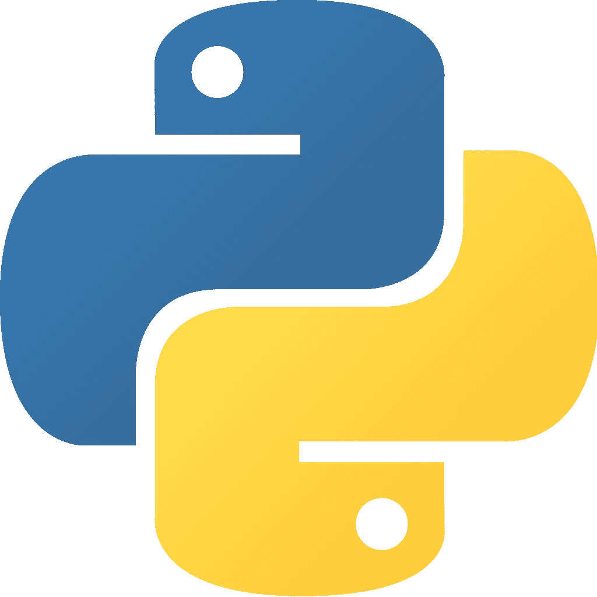
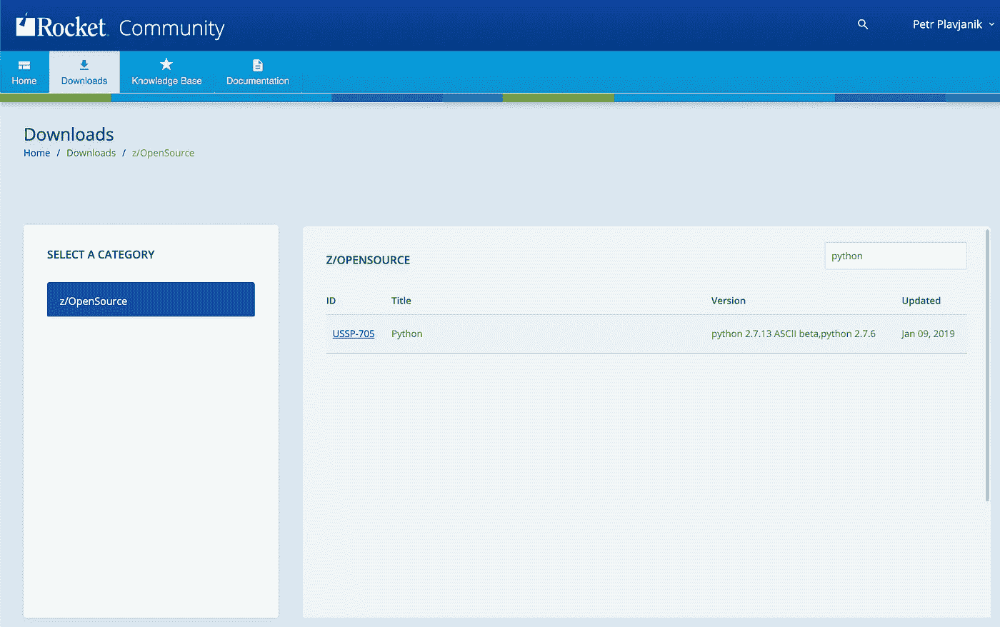
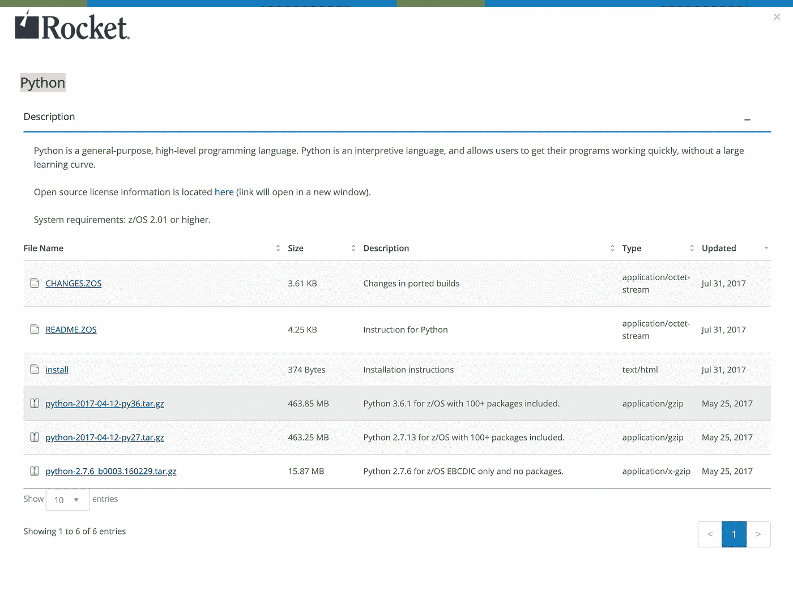

# z/OS 上的 Python

> 原文：<https://levelup.gitconnected.com/python-on-z-os-2c1db244a6bb>

Python 已经流行了很长时间，在最近几年，它的流行程度达到了顶级水平。它通常用于 web 应用程序开发、自动化、数据分析和机器学习。过去几年，它可以在大型机和 z/OS 上很好地运行，将来我们会在 z/OS 上看到更多的 Python。

这篇博客提供了如何将 Rocket Python 安装到 z/OS 以及如何使用 IBM 的 Python 和 Anaconda 的 IzODA 发行版的说明。



Python 徽标

# 为 z/OS 安装 Rocket Python 3.6

Rocket 已经在 2015 年第一次移植了 Python，在 2018 年最后一次更新了 z/OS 端口。你可以在[https://www . Rocket software . com/product-categories/mainframe/Python-for-zos](https://www.rocketsoftware.com/product-categories/mainframe/python-for-zos)了解更多关于 Rocket 和 Python 端口的信息。

## 下载软件包

转到[https://my.rocketsoftware.com/RocketCommunity#/downloads](https://my.rocketsoftware.com/RocketCommunity#/downloads)。登录或注册火箭社区。搜索`python`下载`python-2017–04–12-py36.tar.gz`搜索`gzip`下载`gzip-1.9-edc_b002.180703.tar`。搜索`bash`，下载`bash-4.3_b018.170518.tar.gz`。



下载—火箭社区



用于 z/OS 的 Python 3.6.1

## 为 Rocket 软件开源创建 zFS 文件系统

您将需要大约 4 GB 的空间。建议为它分配一个新的 zFS 文件系统。您可以使用以下作业模板，用您的作业卡替换`${jobcard}`和`${prefix}`变量，用 zFS 文件系统替换数据集的前缀。

在 z/OS 上创建 zFS 文件系统的 JCL

您可以使用 Zowe CLI 轻松提交这个 JCL:

```
curl -O [https://gist.githubusercontent.com/plavjanik/fbf4fbf4318a1b7a44ac0381a1a39717/raw/19cc8feabd757549e719bb6c1e49b1dc9f6d9986/create_zfs.jcl](https://gist.githubusercontent.com/plavjanik/fbf4fbf4318a1b7a44ac0381a1a39717/raw/19cc8feabd757549e719bb6c1e49b1dc9f6d9986/create_zfs.jcl)
```

在您喜欢的文本编辑器中编辑文件并替换变量。然后你就可以提交了:

```
zowe zos-jobs submit local-file create_zfs.jcl
```

试试 Zowe CLI 吧！它允许您在工作站上与 z/OS 作业、数据集、z/OS UNIX 文件等进行交互。

[](https://medium.com/zowe/getting-started-with-zowe-cli-7a29420c6be7) [## Zowe CLI 入门

### Zowe CLI 用于 z/OS，就像 AWS CLI 用于 AWS 一样。这是一个客户端 CLI，允许访问所有基础架构…

medium.com](https://medium.com/zowe/getting-started-with-zowe-cli-7a29420c6be7) 

作业完成后，您需要挂载文件系统。通过 ssh 或 Putty 登录到您的 z/OS 系统。发出以下命令(需要替换`${rocket_home}`和`${prefix}`变量):

```
export ROCKET_HOME=***${rocket_home}***
mkdir ${ROCKET_HOME}
/usr/sbin/mount -o aggrgrow -f $***{prefix}***.ZFS ${ROCKET_HOME} 
cd ${ROCKET_HOME}
mkdir download
```

现在，您需要回到工作站终端，将包复制到 zFS:

```
zowe zos-files upload file-to-uss --binary gzip-1.9-edc_b002.180703.tar ${ROCKET_HOME}/download/gzip-1.9-edc_b002.180703.tarzowe zos-files upload file-to-uss --binary bash-4.3_b018.170518.tar.gz ${ROCKET_HOME}/download/bash-4.3_b018.170518.tar.gzzowe zos-files upload file-to-uss --binary python-2017-04-12-py36.tar.gz ${ROCKET_HOME}/download/python-2017-04-12-py36.tar.gz
```

返回到 z/OS shell 会话并解压缩这些包:

```
tar -C ${ROCKET_HOME} -xovf ${ROCKET_HOME}/download/gzip-1.9-edc_b002.180703.tar${ROCKET_HOME}/bin/gunzip --stdout ${ROCKET_HOME}/download/bash-4.3_b018.170518.tar.gz | tar xoUXf -${ROCKET_HOME}/bin/gunzip --stdout ${ROCKET_HOME}/download/python-2017-04-12-py36.tar.gz | tar xoUXf -
```

现在是分配正确访问权限的时候了:

```
chmod -R 755 ${ROCKET_HOME}/bin/*
```

在读取这些工具之前，我们需要设置环境变量。它们需要打开自动转换。

以下是推荐的设置:

推荐。Rocket Python 3.6 的配置文件设置

您需要将它们放在 zFS 中的一个目录中:

```
curl -O [https://gist.githubusercontent.com/plavjanik/542a2c31515ce3ad1fe046048586971b/raw/3a2be28b664479e85f9ecf603db2015485059779/rocket_python_env.sh](https://gist.githubusercontent.com/plavjanik/542a2c31515ce3ad1fe046048586971b/raw/3a2be28b664479e85f9ecf603db2015485059779/rocket_python_env.sh)# edit rocket_python_env.sh and replace ***${rocket_home}***zowe zos-files upload file-to-uss rocket_python_env.sh ***${rocket_home}***/rocket_python_env.sh
```

然后，您可以通过以下方式在 z/OS shell 中激活它:

```
. ${ROCKET_HOME}/rocket_python_env.sh
```

如果您想在每次会话中激活这条线路，您可以将它放到您的`~/.profile`中。

最后一步是完成 Python 的安装:

```
export BASH_PREFIX=${ROCKET_HOME}/bin
export PERLpyth_PREFIX=${ROCKET_HOME}/bin
export RELEASE_NAME=python-2017-04-12
export RELEASE_TYPE=py36
export RELEASE_DIR=${ROCKET_HOME}/${RELEASE_NAME}-${RELEASE_TYPE}
export PKGS_BASE=${RELEASE_DIR}/pkgs
cd ${PY_RELEASE_DIR}/python36; bin/install_all_packages
```

如果一切正常，删除包:

```
rm -Rf download
```

Python 已安装，您可以验证其版本:

```
$ pythonPython 3.6.1 (default, Apr  7 2017, 13:59:34) [C] on zos
Type "help", "copyright", "credits" or "license" for more information.
```

# IzODA

如何在 z/OS 上获得 Python 的另一个选择是从 IBM 获得 IzODA。[IBM Open Data Analytics for z/OS(IzODA)](https://www.ibm.com/us-en/marketplace/open-data-analytics-for-zos?cm_mc_uid=&cm_mc_sid_50200000=)是开源和专有技术的集合，允许数据科学家和应用程序开发人员分析和可视化托管在 [IBM Z 上的大量数据。](https://www.ibm.com/it-infrastructure/z)

你可以在 https://izoda.github.io/[找到更多细节。](https://izoda.github.io/)

它包括 Python 3.6.1 + 442 包，适用于 Anaconda Cloud—[https://anaconda.org/izoda](https://anaconda.org/izoda)的 z/OS 平台。

IBM 使用 CBPDO 或者 SystemPac 或 ServerPac 方法将它分发给它的客户。

默认安装路径是`/usr/lpp/IBM/izoda/`。

您需要设置环境变量来正确运行它:

```
# Python Anaconda from IzODA
export ANACONDA_HOME=/usr/lpp/IBM/izoda/anaconda
export PYTHON_HOME="$ANACONDA_HOME"
export LIBPATH="$PYTHON_HOME/lib:$LIBPATH"
export FFI_LIB="$PYTHON_HOME/lib/ffi"
export PATH="$ANACONDA_HOME/bin:$PATH"
export _BPXK_AUTOCVT="ON"export _CEE_RUNOPTS="FILETAG(AUTOCVT,AUTOTAG),POSIX(ON)"
```

然后就可以在 z/OS 上使用 Python 了！

```
$ python
Python 3.6.1 (heads/v3.6.1-anaconda:7960479, Aug 25 2017, 14:12:10) [C] on zos
Type "help", "copyright", "credits" or "license" for more 
information.
```

在 Anaconda 中，你需要使用`conda`命令来安装新的软件包。

# 简单 HTTP 服务器

我们将使用 Flask 框架创建一个非常简单的 HTTP 服务器。

只有一个文件`app.py`:

```
from flask import Flask, requestapp = Flask(__name__)[@app](http://twitter.com/app).route('/greeting')
def hello():
    name = request.args.get('name')
    return f"Hello, {name}!"
```

可以使用一个命令启动它:

```
FLASK_APP=app python -m flask run --port=11055
```

# **结束语**

有两种方法可以将 Python 3.6.1 和许多包一起移植到 z/OS 系统中。

您已经看到了如何安装它、设置环境以及创建一个非常简单的 HTTP 服务器。

如果您对如何使用 Python 进行大型机工作感兴趣，请参阅以下故事:

[](https://medium.com/@kalebporter/writing-python-3-extensions-in-c-c-with-z-os-support-d057af3b90ba) [## 用 C/C++编写 Python 3 扩展(支持 z/OS)

### 样板代码和 z/OS 技巧，用于构建和测试您自己的 C/C++ Python 扩展。

medium.com](https://medium.com/@kalebporter/writing-python-3-extensions-in-c-c-with-z-os-support-d057af3b90ba) [](https://medium.com/@kalebporter/z-os-job-management-with-python-6f740144636) [## 使用 Python 进行 z/OS 作业管理

### 使用 Z Open Automation Utilities 中的最新作业功能创建一个 Flask 应用程序，用于 z/OS 作业管理。

medium.com](https://medium.com/@kalebporter/z-os-job-management-with-python-6f740144636) [](https://medium.com/@kalebporter/flask-on-z-os-with-dataset-example-3f3ed26c455b) [## z/OS 上的 Flask(带有数据集示例)

### z/OS 上的一个简单 Flask 示例，使用 Z Open Automation Utilities 从我们的浏览器中查看数据集。

medium.com](https://medium.com/@kalebporter/flask-on-z-os-with-dataset-example-3f3ed26c455b)