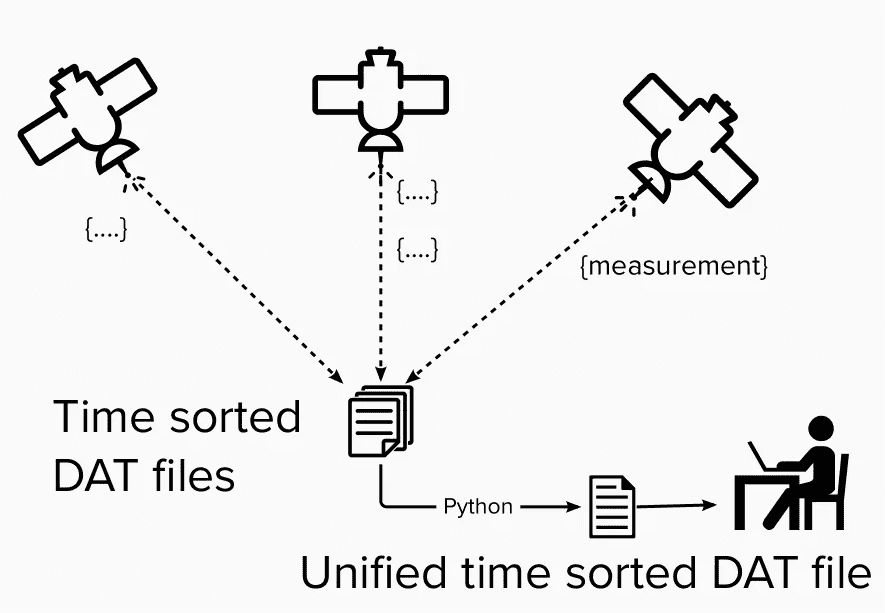
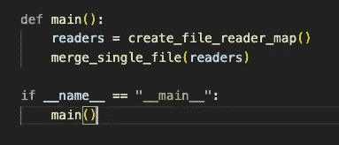
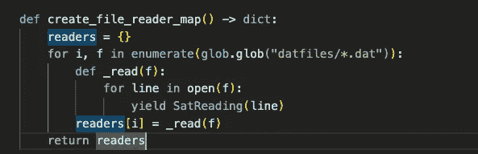
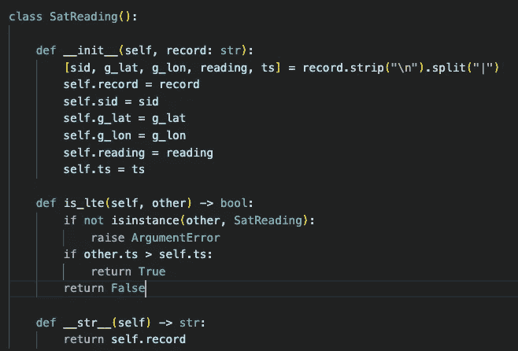
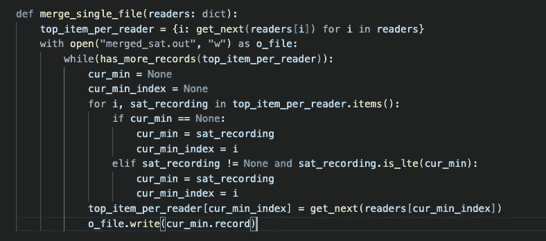
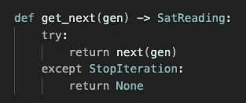
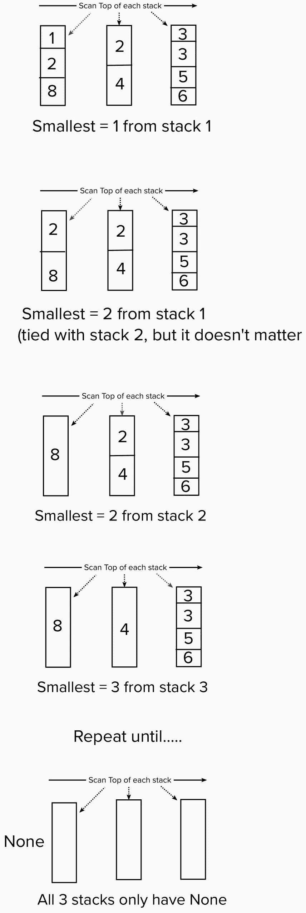
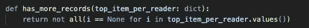

# Python:对预先分类的假卫星遥测数据进行优化分类。

> 原文：<https://levelup.gitconnected.com/python-optimized-sort-over-pre-sorted-fake-satellite-telemetry-data-9259b193d39e>

让我们学习一点 Python，并在高效解决现实世界问题的同时这样做。

作为一名数据专业人员，我们将了解一些算法解决问题的知识如何在工作中派上用场。害怕不是因为我要一步一步地走完这个过程。每一行代码都会有解释。

你可以在这里看到带有示例数据的完整代码:[https://github . com/bfemiano/misc _ scripts/tree/main/python/sorted _ sat _ data _ reader](https://github.com/bfemiano/misc_scripts/tree/main/python/sorted_sat_data_reader)

让我们从一个假设的真实场景的问题描述开始。

假设我们舰队中的几颗不同的卫星都已经将它们每天从机载仪器上获得的深空遥测读数传回了你的笔记本电脑。

当读数通过线路传来时，每个记录被及时写入卫星 id (sid)的平面 DAT 文件。



从头到尾阅读每颗卫星的 DAT 文件将显示记录，因为它们是按时间排序顺序收集的。

样本:`sid_1_2022_06_01.dat`

```
sid   |  galactic lat | galactic lon | reading | timestamp1     | 121.17424181 | -21.57288557  | <bin>   | 2022-06-01T12-00-00
1     | 121.17424181 | -21.57287732  | <bin>   | 2022-06-01T13-12-01
```

现在我们开始我们的挑战。

假设我们有几个不同的 DAT 文件传入每个卫星，为了我们的研究目的**，我们希望有一个单一的每日文件，包含所有卫星按时间顺序的所有读数**。

此外，假设这些文件可能是大文件，那么我们希望避免将它们全部加载到内存中，以便调用 python `sorted()`函数。

你可能会想，我们一定有办法利用每个卫星的 DAT 文件已经按时间顺序排序的事实。你是对的！

首先让我们定义我们的`main`函数



它所做的只是将工作委托给两个函数`create_file_reader_map()`，然后将得到的读者集合发送到`merge_single_file()`



`create_file_reader_map`创建一个文件句柄生成器的索引字典，我们可以用它从不同的文件读入程序内存。

`glob`模块提供了一种简便的方法来获取。匹配. dat 扩展名的/datfiles 子目录。然后对于每条发现的路径`f`，我们称之为`_read(f)`，它返回的是`f`的每个封闭值的唯一生成器。`yield`表示`_read()`将成为发电机功能。我们可以使用它在每次调用时返回一个值，并冻结文件的迭代，直到我们再次调用生成器。我们马上就会看到如何利用这一点。

我们生成的对象类型将是自定义类型，我们定义为`SatReading.`



构造函数将只接受一个字符串，它在构造函数参数列表中变成`record`。

`: str`给编译器一个类型安全提示，在这个位置发送的参数必须是一个字符串。

我们做的第一件事是从`record`中移除换行符，并沿着管道`|`的边界分割它。Python 将允许我们在一行中将数组解包为命名变量。

接下来，构造函数为拆分数组中的每个字段设置`self`属性。(我们以后可能会出于某种原因使用它们)。

我们还定义了`is_lte()`，它是`is_less_than_or_equal`的简写，用于比较其他`SatReading`实例。这个函数很简单。如果对方时间戳>是自己的时间戳，则返回 True。否则返回 False。如果由于某种原因传入`is_lte`的对象不属于`SatRecording`类型，抛出一个参数错误。我们可以使用`-> bool`给编译器一个类型提示，该函数将返回一个布尔值。

当我们这样做的时候，让我们也定义一下神奇的方法`__str__`，这样如果我们想把我们的`SatRecording`实例表示为字符串，我们可以发出信号，只打印最初作为参数传入的`self.record`字符串。

`self`参数告诉编译器这是每个`SatRecording`对象可用的实例方法。

至此，我们已经编写了构建索引生成器字典的代码，每次调用它时，它都会从底层文件句柄中读取一条记录。现在，让我们使用它在所有排序的输入文件中按照时间顺序高效地构建一个输出文件。



`merge_single_file()`为我们的文件读取生成器字典接受一个`dict`参数。

它做的第一件事是创建另一个字典`top_item_per_reader`，他唯一的工作是保存一个从文件句柄读取的索引当前值的映射。最初对于每个读者来说，这只是第一个要素。我们可以使用列表理解来创建`i: get_next(readers[i])`，其中`get_next()`调用我们的生成器。

下面是`get_next()`的样子:



很简单。它通过生成器调用 Python 内置的`next()`并返回当前值。如果抛出`StopIteration`异常，返回`None`。捕捉这个异常是创建一个独立函数而不是直接调用`next()`的唯一原因。这使得合并中的代码更容易阅读。

我们还需要使用`with`操作符来打开一个输出文件的文件句柄，我们可以将结果流式传输到该文件中。我们将其命名为`merged_sat.out`。我们必须提供`'w’`来告诉 open 这是一个写操作。

为了实现该算法，我们需要在遍历文件内容时跟踪最早的时间顺序条目。这就是`cur_min`和`cur_min_index`的用武之地。如果`cur_min`是`None`，那么我们知道我们刚刚开始对我们的五个句柄进行当前的`for`扫描，所以现在将最小值设置为第一个`sat_recording`。当我们看到其他代表各自文件头的`sat_reading`对象时，我们可以使用为`SatRecording`创建的实例方法`is_lte`来确定`sat_object`是否小于或等于`cur_min`。我们还必须检查`sat_recording = None`是否已经到达文件阅读器的末尾。

在每一轮`for`迭代结束时，让我们在所有仍有记录的文件中取最早观察到的`SatRecording`，并将其`record`属性写入我们的输出文件。

还有更关键的一步。对于我们从中读取记录的文件，我们需要将文件句柄前进到下一条记录。这将更新`top_item_per_reader`,以具有该文件句柄的新的当前最早的时间顺序条目。这对我们的算法起作用是至关重要的。

```
top_item_per_reader[cur_min_index] = get_next(readers[cur_min_index])
```

为了清楚起见，这里用简单的数字代替日期时间字符串，直观地展示了这种算法的执行情况。



每个阅读器的每个顶部项目值= `None`一次，然后我们将每个单独的 dat 文件中的每个记录写入我们的统一 dat 文件。我们现在可以退出程序了。



以下是`has_more_records`的工作方式。它查看顶部项目的地图，并检查是否所有项目都不存在。如果是，则返回 True。

另一种解释这个函数的方法是“非全无”。基于`return not all(i == None)`

只要至少有一个值不是 None，该函数将返回 True。这意味着我们仍然有值要跨不同的文件生成器读取。

我们做到了！

这个解决方案有一些很好的特性。

1.  灵活适应任意数量的 dat 文件，并能容忍每个文件都有不同数量的记录。
2.  随着文件数量的增加，只需要很少的固定空间。对于每个文件句柄，我们每次在程序内存中只有一个记录。
3.  当我们重复读取每个文件句柄时，总的 O(n)线性最坏情况时间复杂度。这比内置`sorted()`的 O(n log n)最坏情况性能要好得多
4.  我们可以迭代地将记录流式传输到输出文件中，而不必将所有内容都缓存在程序内存中。

对于给定的输入 dat 文件:

sat1.dat:

```
1|1.0|1.0|foo1|2022-02-06T12-01-00
1|2.0|2.0|foo2|2022-02-06T12-03-00
1|3.0|3.0|foo3|2022-02-06T12-05-00
```

sat2.dat:

```
2|1.0|1.0|foo1|2022-02-06T12-02-00
2|2.0|2.0|foo2|2022-02-06T12-04-00
2|3.0|3.0|foo3|2022-02-06T12-06-00
```

我们得到了一个统一的输出文件，它保持了全局时间排序的顺序:

```
1|1.0|1.0|foo1|2022-02-06T12-01-00
2|1.0|1.0|foo1|2022-02-06T12-02-00
1|2.0|2.0|foo2|2022-02-06T12-03-00
2|2.0|2.0|foo2|2022-02-06T12-04-00
1|3.0|3.0|foo3|2022-02-06T12-05-00
2|3.0|3.0|foo3|2022-02-06T12-06-00
```