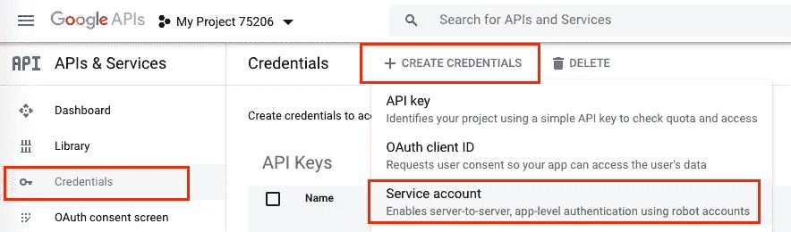

# Python +熊猫+谷歌电子表格

> 原文：<https://levelup.gitconnected.com/python-pandas-google-spreadsheet-476bd6a77f2b>

如何阅读，更新和创建谷歌电子表格，并建立一个数据框架熊猫。


# 索引

1.  在谷歌开发者中创建一个项目。
2.  主动 API 谷歌表和谷歌驱动。
3.  认证密钥:本地或服务
4.  创建电子表格。
5.  脚本 Python +熊猫。


# 在 Google 开发者中创建一个项目

为了使用 Google Sheets API 资源，我们需要创建一个项目。

没有那个项目，什么都做不了。

链接:[https://console.developers.google.com/project](https://console.developers.google.com/project)

1.  创建一个项目。


2.为项目设置一个名称。


# 谷歌工作表 API

现在我们启动 API 来与项目交换工作表，然后选择一种类型的 API:公共的或私有的。

1.  在搜索栏中找到“Google Sheets API”。


2.设置“启用”选项。


3.回到主页，选择“OAuth 同意屏幕”。


4.我们需要定义选择什么类型的 API 公共的允许任何人访问你的 API，私有的只有拥有代码的用户才能访问。

在本例中，选择了公共 API。


5.选择类型后，必须设置 API 的名称。
*还有其他选项；对于这个例子，没有必要设置它。*


6.启用 Google Drive API。


创建和更新电子表格是必要的。

> **到目前为止我们已经:**
> 
> *在谷歌开发者中创建了一个项目。
> 
> *激活 API 表并定义 API 类型。
> 
> 我们已经创建了项目的基础。


# 键

认证—我们需要生成密钥来访问电子表格。有两种钥匙。

**1 — OAuth 客户端 ID:**

> 需要用户的同意，所以应用程序只能访问用户的数据。

推荐用于验证和开发本地应用程序。

**2 —服务账户:**

> 启用服务器到服务器功能，即使用机器人帐户的应用程序级身份验证。

建议用于自动身份验证，通常在生产应用程序中使用(身份验证不再是本地的)。我们为这些情况创建了一个特定的访问键。

## 创建本地密钥

1.  在凭证中，选择“+创建凭证”和 OAuth 客户端 Id。


2.选择将被认证的设备的一个选项，在我们的例子中是:桌面应用。


生成的密钥访问令牌。

3.下载密钥。


。json 文件

## 创建远程密钥

1.  在凭证中选择“+创建凭证”和服务帐户。



2.为您的密钥设置一个名称。


**其余步骤不是强制的，所以我们可以省略。**

3.已成功创建密钥。


现在来生成。json 文件，单击键的名称，我们到达键部分。

1.  请确保使用您选择的正确密钥，并创建一个新密钥。


2.选择文件类型， **.json.**


3.密钥将保存在您的计算机上。


4.将生成的电子邮件保存在密钥中，以便可以在电子表格中访问它。


# 工作表

这里没有含糊之处—我们已经创建了电子表格，因此我们需要注意两点:

**为电子表格键:** 该键标识代码，是代码运行所必需的。这个函数对于识别代码的操作是必要的。


电子表格键

**访问远程邮件键:** 您必须使用远程键授予访问邮件键的权限。


# 计算机编程语言

要创建 Python 代码，您可以通过这三个例子来了解整个过程是如何工作的。确保你的项目文件夹中有认证密钥。

要执行这些示例，必须安装以下库:

```
!pip install --upgrade google-api-python-client google-auth-httplib2 google-auth-oauthlib!pip install gspread!pip install pandas
```

**第一个示例—读取电子表格本地键。基于 google 代码，我们修改了返回一个熊猫数据帧。
[更多详情见谷歌代码](https://developers.google.com/sheets/api/quickstart/python)。**

对于第一次身份验证，Google 服务将创建一个 token.pickle 文件，第二次将不再需要该文件。

**第二个示例—读取电子表格遥控键。** 这个例子需要一个服务密钥。重写读取函数只是为了便于认证和理解该过程。

从这一点开始，将不再需要令牌 pickle 文件。
看看代码是如何被轻易识别的。

**第三个示例—读取、更新和创建电子表格(服务密钥)。**

到目前为止，我们已经了解了身份验证模型(位置和服务)是如何工作的。

在这个脚本中，代码被抽象为四个函数:
**认证—** 认证可以用 API 创建。
**阅读—** 可以阅读特定的电子表格。
**更新—** 特定的页签已被更新。此选项卡必须已在使用中。
**创建并插入数据—****新的电子表格已创建，数据帧已插入。分享将访问新电子表格的电子邮件是很重要的。由于服务电子邮件已经过身份验证，因此不得共享。这是访问电子表格的方式。**

## **感谢阅读这篇文章。**

## **作者可以接受反馈。**

## **跟着他上 [LikedIn](https://www.linkedin.com/in/lucasmbribeiro/) 或者 [Github](https://github.com/lucasmbribeiro) 。**