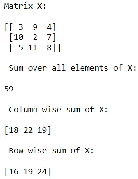

# Python 启动机器学习之旅的先决条件

> 原文：<https://levelup.gitconnected.com/python-prerequisites-to-kick-start-your-machine-learning-journey-bd5d4fbf936f>


约书亚·雷德科普在 [unsplash](https://unsplash.com/) 上的照片

欢迎阅读 python 先决条件的图解指南。这篇文章全面概述了 Python 编程语言的特性，您需要掌握这些特性才能开始基本的机器学习之旅。本指南包括列表、元组、字典、for 循环、if 语句、NumPy 和 MatPlotLib。

# **1。变量**

在 Python 中，我们将所有的数据片段——数字、字符、字符串等——存储为对象，并使用变量引用这些对象。作为一个简单的例子，我们可以使用赋值操作符给一个变量值赋值，这是一个“等号”:

```
x = 1
y = 2
z = x + y
print(z) 
```

请注意，我们可以使用某些值进行赋值——例如在变量 x 中赋值 1，在变量 y 中赋值 2——我们还可以给其他变量赋值——例如变量 z 中 x 和 y 的和。

# **2。收藏**

Python 集合允许我们将多个数据对象放在一个我们可以访问或处理的对象中。有各种各样的内置集合，我们将讨论其中的三种:列表、元组和字典。稍后，我们将介绍另一种数据收集方法，它使用一个名为 NumPy 的库中的数组。

**A .列表**

该列表包含一系列对象，通常用方括号表示，对象之间用逗号分隔，顺序如下:

```
list = ['A', 'B', 'C', 'D']
```

以上，*列表中的*包含了字符的顺序。但是，该列表包括各种对象的项目:

```
varied_list = ['a', 2, 'b', 3.14] # a list with elements of char, integer, and float typesnested_list = ['hello', 'Harsh', [1.618, 42]] # a list within a list!
```

列表允许所谓的索引，其中可以找到列表的特定项目。例如，假设您想要获取上面 varied_list 的第二个元素。

```
second_element = varied_list[1]
print(second_element)
```

Python 是所谓的零索引编程语言。这仅仅意味着列表或其他数据集合中的“第一”项使用“0”(零)而不是“1”来显示。这就是为什么，在上面，我们使用完整的索引“1”而不是“2”来捕获第二个 varied_list 项，正如一些人可能在单个引用语言(如 Matlab)中预期的那样。

python 索引的另一个特性是方便使用负索引。正如我们上面讨论的，python 列表的“第一”项由“0”索引表示；因此，将列表中的最后一项视为由“-1”索引可能是很自然的。参见以下负指数的例子:

```
last_element = list[-1] #to print the last element of list
print(last_element)last_element_2 = list[len(list)-1] #to print also the last element of list
print(last_element_2)second_to_last_element = list[-2] #to print second to last element of list
print(second_to_last_element)
```

与索引类似的是列表切片，可以到达列表的合并部分。冒号(:)用于制作切片，数字描述了切片的开始和结束位置。下面，我们展示了当一个人从列表的开头或结尾切片时，片段值的开头或结尾可以被省略。此外，请注意，幻灯片开始指南包含在作品中，但不包含幻灯片结束指示器。

```
NFL_list = ["Charger", "Bronco", "Raider", "Chief", "Panther", "Falcon", "Cowboy", "Eagle"]AFC_west_list = NFL_list[:4] # Slice to grab list indices 0, 1, 2, 3 -- "Charger", "Bronco", "Raider", "Chief"
print(AFC_west_list)NFC_south_list = NFL_list[4:6] # Slice list indices 4, 5 -- "Panther", "Falcon"
print(NFC_south_list)NFC_east_list = NFL_list[6:] # Slice list indices 6, 7 -- "Cowboy", "Eagle"
print(NFC_east_list)
```

**B .元组**

tuple 是一个 Python 集合，与 list 非常相似，只是有一些细微的区别。首先，使用圆括号而不是方括号来显示元组:

```
x = 2
y = 3
coordinates = (x, y)
```

上面的动态坐标是包含变量 x 和 y 的元组。选择这个例子再次显示元组的一般使用与列表之间的差异。在某种意义上，列表通常用于包含相同值的项目，而元组通常用于包含相应的单元属性。例如，如上所述，将点链接视为单个单元是有意义的。作为另一个例子，考虑下面的元组和日期列表:

```
year1 = 2022
month1 = "May"
day1 = 15
date1 = (month1, day1, year1)
year2 = 2021
month2 = "June"
day2 = 17
date2 = (month2, day2, year2)
years_list = [year1, year2]
```

请注意，我们已经将一个日期的属性收集到一个元组中:这些信息片段都定义了一个“单元”。相反，在年份列表中，我们在代码片段中收集了不同的年份:列表值是相同的(它们都是年份)，但是它们没有定义相同的单位。

我在这里画出的元组和列表之间的区别是大多数 Python 程序员做的，但不是严格执行的区别(即，如果你破坏这个程序集，你不会发现错误！).元组和列表的另一个微妙变化包括所谓的变量的 Python 可变性。可变性是如此复杂，以至于我们不需要在我们的 Python 指南中讨论它，但是如果感兴趣的人愿意，我们鼓励他们进一步阅读它！

**C .字典**

既然已经看到了括号(用于元组)和方括号(用于列表)，您可能想知道花括号是做什么用的。答案:Python 字典。Python 字典的描述性特征是它有键和相关值。定义字典时，可以使用颜色(:)来实现这种组织，如下所示:

```
book_dictionary = {"Title": "Ulysses", "Author": "James Joyce", "Year": 1818}print(book_dictionary["Author"])
```

此外，book_dictionary 的关键字是“标题”、“作者”和“年份”，这些关键字中的每一个都有相应的值。请注意，键值对由逗号分隔。使用这些键，我们可以按名称访问字典剪辑，而不需要知道我们想要的段落的索引，就像列表和元组那样。例如，上面我们可能会发现尤利西斯的作者使用“作者”键，而不是使用索引。事实上，与列表或元组不同，字典中项的顺序并不重要，并且字典不能使用数字来标识，当我们尝试使用整数到达字典中的第二项时，我们会看到如下情况:

```
print(book_dictionary[1])
```


作者图片

# **3。控制流程**

像许多流行的编程语言一样，Python 提供了几种方法来控制系统内的执行流。这里，我们将介绍循环和条件语句。

同时，让您了解 Python 语言的一个独特特性很重要:缩进。像 C 这样的语言使用花括号在循环或条件中包含代码语句，而 Python 通过缩进显示这些语句。这个特性增加了 Python 代码的可读性，正如您将在下面的例子中看到的。

**A. For-Loops**

循环语句允许重复执行代码。例如，假设我们要将零(0)和十(10)之间的所有数字相加，不包括十。是的，我们可以在一行中完成，但是我们也可以使用循环一次添加一个值。以下是附带的简单链接代码:

```
sum = 0
for i in range(10):
    sum = sum + i
print(sum)
alternative_sum = 0+1+2+3+4+5+6+7+8+9
print(alternative_sum==sum)
```


图片来自作者

内置的 range()函数产生一个值序列，我们对其进行循环，注意范围(10)不包括 10 本身。除了使用 range()函数遍历数字之外，我们还可以对列出的项目进行排序，如下所示:

```
ingredients = ["flour", "sugar", "eggs", "oil", "soda"]
for ingredient in ingredients:
print(ingredient)
```


图片来自作者

此外，for 循环运行在成分列表的顶部，这些项目的每个循环内部称为一个成分。使用单数/复数名词来管理这个迭代是一个标准的 Python 主题，但是您不需要在您的程序中使用它。

**B .条件句**

通常在编写程序时，人们会希望只执行满足某些条件的代码的某些部分，例如，当变量具有某个值时。这是使用条件语句完成的:if、elif、else。

```
for i in range(10):
    if i % 2 == 0: # % -- modulus operator -- returns the remainder after division
        print("{} is even".format(i))
    else:
        print("{} is odd".format(i)) 
```


图片来自作者

```
# Example of elif 
# Print the meteorological season for each month 
print("In the Northern Hemisphere: \n")
month_integer = [1, 2, 3, 4, 5, 6, 7, 8, 9, 10, 11, 12] # i.e., January is 1, February is 2, etc...
for month in month_integer:
    if month < 3:
        print("Month {} is in Winter".format(month))
    elif month < 6:
        print("Month {} is in Spring".format(month))
    elif month < 9:
        print("Month {} is in Summer".format(month))
    elif month < 12:
        print("Month {} is in Fall".format(month))
    else: # This will put 12 (i.e., December) into Winter
        print("Month {} is in Winter".format(month))
```


图片来自作者

# **4。列表理解**

Python 允许理解列表，其中列表元素被组织在单行代码中。例如，假设您想将整数值列表中的每一项加 1。您可以使用如下清单来实现这一点:

```
even_list = [2, 4, 6, 8]
odd_list = [even+1 for even in even_list]
print(odd_list)
```


图片来自作者

注意上面对列表补偿和 for 循环的理解之间的相似性；Python 有一个列表补偿，它是一个紧凑的“python 式”方法，用于执行可以在循环中执行的任务。

# **5。NumPy 库**

NumPy 的库为 Python 提供了广泛的科学计算技能。其核心是 Array 对象，它提供了一种不同的方式来排列相同类型的值。Numpy 布局允许剪切和索引，类似于列表。最重要的是，Numpy 有大量的数学函数，可以转换数组并在数组之间执行计算。对于熟悉 MatLab 的人来说，这些活动应该会让人联想到多个矩阵函数。

```
import numpy as npx = np.array([2, 4, 6]) # create a rank 1 array
A = np.array([[1, 2, 3], [4, 5, 6]]) # create a rank 2 array
B = np.array([[1, 2, 3], [4, 5, 6]])print("Matrix A: \n")
print(A)print("\nMatrix B: \n")
print(B)
```


图片来自作者

```
# Indexing/Slicing examples
print(A[0, :]) # index the first "row" and all columns
print(A[1, 2]) # index the second row, third column entry
print(A[:, 1]) # index entire second column 
```


图片来自作者

```
# Arithmetic Examples
C = A * 2 # multiplies every elemnt of A by two
D = A * B # elementwise multiplication rather than matrix multiplication
E = np.transpose(B)
F = np.matmul(A, E) # performs matrix multiplication -- could also use np.dot()
G = np.matmul(A, x) # performs matrix-vector multiplication -- again could also use np.dot()print("\n Matrix E (the transpose of B): \n")
print(E)print("\n Matrix F (result of matrix multiplication A x E): \n")
print(F)print("\n Matrix G (result of matrix-vector multiplication A*x): \n")
print(G)
```


图片来自作者

```
# Broadcasting Examples
H = A * x # "broadcasts" x for element-wise multiplication with the rows of A
print(H)
J = B + x # broadcasts for addition, again across rows
print(J)
```


图片来自作者

```
# max operation examplesX = np.array([[3, 9, 4], [10, 2, 7], [5, 11, 8]])
all_max = np.max(X) # gets the maximum value of matrix X
column_max = np.max(X, axis=0) # gets the maximum in each column -- returns a rank-1 array [10, 11, 8]
row_max = np.max(X, axis=1) # gets the maximum in each row -- returns a rank-1 array [9, 10, 11]# In addition to max, can similarly do min. Numpy also has argmax to return indices of maximal values
column_argmax = np.argmax(X, axis=0) # note that the "index" here is actually the row the maximum occurs for each columnprint("Matrix X: \n")
print(X)
print("\n Maximum value in X: \n")
print(all_max)
print("\n Column-wise max of X: \n")
print(column_max)
print("\n Indices of column max: \n")
print(column_argmax)
print("\n Row-wise max of X: \n")
print(row_max)
```


图片来自作者

```
# Sum operation examples
# These work similarly to the max operations -- use the axis argument to denote if summing over rows or columnstotal_sum = np.sum(X)
column_sum = np.sum(X, axis=0)
row_sum = np.sum(X, axis=1)print("Matrix X: \n")
print(X)
print("\n Sum over all elements of X: \n")
print(total_sum)
print("\n Column-wise sum of X: \n")
print(column_sum)
print("\n Row-wise sum of X: \n")
print(row_sum)
```



图片来自作者

```
# Matrix reshapingX = np.arange(16) # makes a rank-1 array of integers from 0 to 15
X_square = np.reshape(X, (4, 4)) # reshape X into a 4 x 4 matrix
X_rank_3 = np.reshape(X, (2, 2, 4)) # reshape X to be 2 x 2 x 4 --a rank-3 array
                                    # consider as two rank-2 arrays with 2 rows and 4 columns
print("Rank-1 array X: \n")
print(X)
print("\n Reshaped into a square matrix: \n")
print(X_square)
print("\n Reshaped into a rank-3 array with dimensions 2 x 2 x 4: \n")
print(X_rank_3)
```


图片来自作者

# **6。绘图**

你要做的大部分绘图都在 Matplotlib 库中，尤其是在 pyplot 模块中。顾名思义，plot 函数用于编辑二维数据，如下所示:

```
import numpy as np
import matplotlib.pyplot as plt# let’s start with parabola
# Compute the parabola’s x and y coordinates
x = np.arange(-4, 4, 0.1)
y = np.square(x)# matplotlib for the plot
plt.plot(x, y, ‘b’) # color blue for the line
plt.xlabel(‘X-Axis Values’)
plt.ylabel(‘Y-Axis Values’)
plt.title(‘First Plot: A Parabola’)
plt.show() # display the plot
```


作者图片

你会遇到的 Matplotlib 的另一个函数是用于显示图像的 imshow。请记住，图像可以被视为数组，元素显示图像的像素值。举个简单的例子，下面是单位矩阵:

```
import numpy as np
import matplotlib.pyplot as pltX = np.identity(5)
identity_matrix_image = plt.imshow(X, cmap=”Greys_r”)
plt.show()
```


作者图片

```
# plotting a random matrix, with a different colormap
A = np.random.randn(5, 5)
random_matrix_image = plt.imshow(A)
plt.show()
```


作者图片

一旦你理解了这句话，你就已经完成了激动人心的机器学习之旅的所有 python 先决条件。

以下是您今天的成就总结:

1.  **变量**
2.  **集合:列表、元组、字典**
3.  **控制循环:For-loops，if-elif-else 条件**
4.  **列出补偿**
5.  **Numpy**
6.  **绘图**

# 分级编码

感谢您成为我们社区的一员！[订阅我们的 YouTube 频道](https://www.youtube.com/channel/UC3v9kBR_ab4UHXXdknz8Fbg?sub_confirmation=1)或者加入 [**Skilled.dev 编码面试课程**](https://skilled.dev/) 。

[](https://skilled.dev) [## 编写面试问题+获得开发工作

### 掌握编码面试的过程

技术开发](https://skilled.dev)