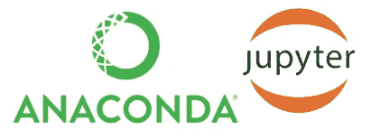
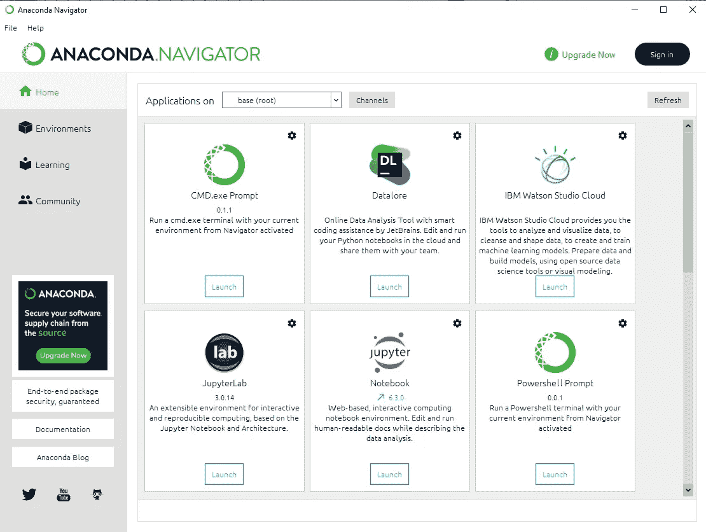
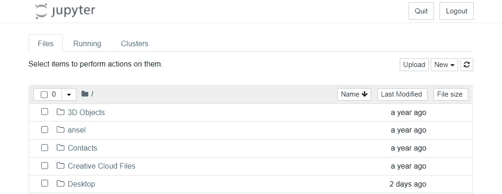
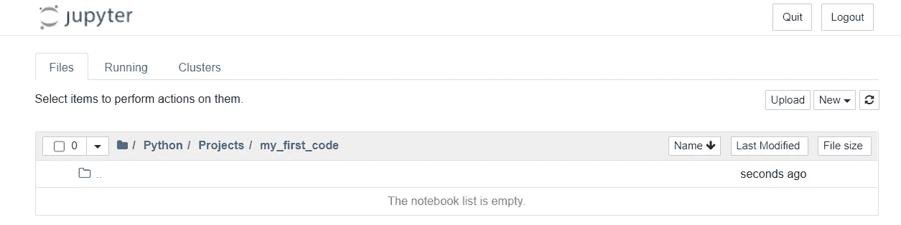
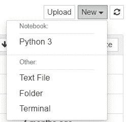
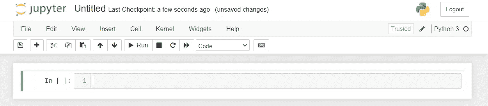
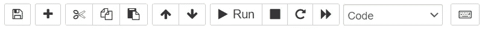
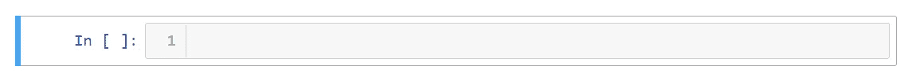
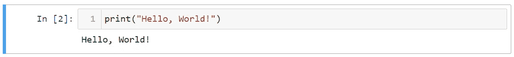

# 面向绝对初学者的 Python 编程

> 原文：<https://levelup.gitconnected.com/python-programming-for-the-absolute-beginner-8dd2465a5022>

创建您的第一个 Python 代码的分步指南！


图像由[按 foto](https://www.freepik.com/photos/hand-computer)

# 直截了当

计算机编程新手？你来对地方了。

本文将通过一个安装指南、一个理解正在发生的事情的编码类比的目标以及一个创建您的第一个 Python 代码的逐步指南来帮助您开始使用 Python！

# **什么是 Python 编程？**

*仅供参考，这与蛇无关。🐍*

Python 是一种开源的高级编程语言，模仿英语，使编码更直观。

就编码语言而言，它被认为是初学者友好的编程语言，优先考虑可读性，这使得它更容易理解和使用；与其他编程语言相比。

它最初是由 Guido Van Rossum 在 20 世纪 80 年代末开发的，已经存在了几十年了！

> 有趣的事实:Python 是以英国喜剧团体 Monty Python 命名的

# **那么，为什么现在这么流行呢？**

首先，Python 非常通用，在许多行业和应用程序中有无限的用途。仅举几个例子，常见的用途是数据科学、人工智能(AI)、机器学习、数据分析、网页抓取、游戏等等。


图片来自[故事集](https://www.freepik.com/stories)

另一个原因是 Python 是一种开源语言，有一个强大的社区在不断开发它，包括围绕机器学习、数据探索和清理、人工智能等构建的大量资源和库！所有人都可以非常容易地接触到它；只需下载并安装。

# 您需要什么来开始

在本指南中，我们将使用 Python 3(版本)安装 **Anaconda** 和 **Jupyter Notebook** ，因为它很简单。更多详情如下:



[**Anaconda**](https://www.anaconda.com/) 是设置你的电脑创建 Python 和 R(另一种编程语言)项目的简化方法之一。它包括数以千计的开源包和库。

[**Jupyter Notebook**](https://jupyter.org/)是一个基于网络的环境，用于在类似单元格的结构中创建笔记本、代码和数据。基于网络意味着它可以在你的网络浏览器中打开，比如谷歌 Chrome、Safari、微软 Edge 等。

Jupyter Notebook 是学习、练习和创建 Python 项目的绝佳起点。

> 专业提示:Jupyter 笔记本在谷歌 Chrome 中效果最好。
> 
> 对不起其他浏览器平台的粉丝。

# **安装💻**

首先，我们需要准备我们的电脑。下面是下载安装 [*Anaconda*](https://docs.anaconda.com/anaconda/install/index.html) 的链接。


[安装指南](https://docs.anaconda.com/anaconda/install/index.html)

请按照安装说明进行操作，并下载与您的操作系统(OS)相匹配的版本。

> 下面是 Anaconda 应用程序窗口的一个例子，可能会因版本和操作系统而异。



如果你注意到了， **Jupyter 笔记本**和 **Anaconda** 一起出现，所以我们准备出发了！

# 编码的目标

在我们进入任何编码之前，让我分享一下我对编码的看法。


计算机的核心是一堆 0 和 1，代表“关”和“开”。这在人类语言中是没有意义的。

```
00000000  7f 45 4c 46 01 01 01 00  00 00 00 00 00 00 00 00  
00000010  02 00 03 00 01 00 00 00  80 80 04 08 34 00 00 00  
00000020  c8 00 00 00 00 00 00 00  34 00 20 00 02 00 28 00  
00000030  04 00 03 00 01 00 00 00  00 00 00 00 00 80 04 08  
00000040  00 80 04 08 9d 00 00 00  9d 00 00 00 05 00 00 00  
00000050  00 10 00 00 01 00 00 00  a0 00 00 00 a0 90 04 08  
00000060  a0 90 04 08 0e 00 00 00  0e 00 00 00 06 00 00 00  
00000070  00 10 00 00 00 00 00 00  00 00 00 00 00 00 00 00  
00000080  ba 0e 00 00 00 b9 a0 90  04 08 bb 01 00 00 00 b8  
00000090  04 00 00 00 cd 80 b8 01  00 00 00 cd 80 00 00 00  
000000a0  48 65 6c 6c 6f 2c 20 77  6f 72 6c 64 21 0a 00 2e
```

编码，或者有时称为计算机编程，是我们与计算机交流的方式。通过学习编写代码，你可以以更快的方式告诉计算机做什么或如何表现。

> 仅供参考:上面的代码和下面的一样，但是用的是 Python！

```
print("Hello World!")
```

在 Python 编码之旅的最开始，很容易被诸如“我需要的基本技能是什么？”，“我从哪里开始？”，“我需要学习什么？”，等等。


> 编码的时候想想你的目标。当你的目标明确了，方向也就明确了。

我五岁的时候，父母给我买了几套乐高玩具。我花了一些时间来学习如何遵循说明，我非常喜欢建造它们。

过了一段时间，我积累了一个装满各种零件的巨大盒子，了解了将零件组装在一起的方法，在很短的时间内，我知道我可以制作我想要的东西。

本质上，这就是我们用 Python 编码所做的事情。学习每个部分的基础知识，以及如何将它们组合在一起。Python 中充满了可供我们支配的资源，代码是组成部分，我们可以将它们放在一起构建我们想要的东西。

在 Python 中，有各种用途的资源:数据科学、机器学习、数据分析等。

为自己定义一个明确的目标，学习如何掌握每一部分来实现你的目标。

编码的时候想想你的目标。当你的目标明确了，方向也就明确了。

# 我的第一个代码

好了，现在我们准备开始了。

## 步骤 1 —打开 Jupyter 笔记本

首先，让我们打开之前安装的 **Anaconda Navigator** 。


接下来，点击“启动”找到并打开 **Jupyter 笔记本**。

**Jupyter Notebook** 应该在默认的网络浏览器中打开，看起来应该类似于下图。



该页面有三个选项卡:

*   **文件:**文件导航页面&文件夹
*   **正在运行:**表示当前正在运行的文件。我们可以终止从该选项卡运行的文件。
*   **集群:**在本地机器上运行笔记本，通过设置合适的端口号连接到集群上的笔记本。不要担心这个，现在忽略这个标签。

默认情况下，**文件**选项卡列出了用户主文件目录中的文档&文件夹。这基本上是一个文件浏览器，在这里你可以浏览你的文件夹并找到文件。


> 保持文件和文件夹的井井有条是一项重要的实践，它将帮助你在需要时快速找到文件。

作为 Python 学习之旅的一部分，我建议为您的文件和与 Python 相关的文件夹创建一个指定的文件夹。

**📂Python >📂项目>📂我的名字代码**

使用可识别的名称，这有助于你马上知道它是什么。保持文件和文件夹的井井有条是一项重要的实践，它将帮助你在需要时快速找到文件。🏃🏻‍♂️

## 步骤 2-创建您的第一个 Python 笔记本。



从**文件**选项卡，导航到您想要创建&的文件夹，保存 Python 笔记本。



选择 Python 3 来创建笔记本

接下来，创建一个 Python 笔记本，点击右边的**新建**按钮，选择 **Python 3** 。



新笔记本！

一个新的选项卡将会打开，您应该能够看到上面的内容。这是你的新笔记本！点击页面顶部的**无标题**重命名笔记本。对于这个例子，我将我的**代码重命名为**。

## **快速注释:**



Jupyter 笔记本中的按钮菜单

请注意页面顶部的按钮菜单。在我们编写代码的时候，我们会经常用到它。

## 步骤 3-第一个 Python 代码:导入库

好了，我们准备编码了！



在 **Jupyter 笔记本**中，这些矩形框中的每一个都被称为**单元格**。这是我们输入代码的地方，我们可以单独运行单元格。

通常，我们从为代码导入必要的 [**库**](https://docs.python.org/3/library/) 开始。

> **什么是库？**
> Python 库是预制的代码，我们可以将其加载到我们的程序中，并充分利用这些代码

单词 **import** 是一个特殊的关键字，它内置了特殊的代码，允许我们将库加载到程序中。让我们试一试吧！

> 专业提示:Jupyter 笔记本中的特殊关键字显示为**绿色文本**，让你知道它是特殊的

```
**import** this
```

在第一个单元格中，键入上面看到的内容，然后按下按钮 run 运行代码

> 亲提示:使用下面的快捷键*运行*
> 
> windows ~ Ctrl+Enter
> Mac ~ command+return

我们编写的这段代码将库 **this** 加载到我们的程序中，它显示了 Python 的 ***禅，解释了放入 Python 的哲学。***

```
The Zen of Python, by Tim Peters

Beautiful is better than ugly.
Explicit is better than implicit.
Simple is better than complex.
Complex is better than complicated.
Flat is better than nested.
Sparse is better than dense.
Readability counts.
Special cases aren't special enough to break the rules.
Although practicality beats purity.
Errors should never pass silently.
Unless explicitly silenced.
In the face of ambiguity, refuse the temptation to guess.
There should be one-- and preferably only one --obvious way to do it.
Although that way may not be obvious at first unless you're Dutch.
Now is better than never.
Although never is often better than *right* now.
If the implementation is hard to explain, it's a bad idea.
If the implementation is easy to explain, it may be a good idea.
Namespaces are one honking great idea -- let's do more of those!
```

恭喜你！您刚刚用 Python 创建了第一行代码！

## 步骤 4——让我们编写更多的代码！

准备好下一个代码了吗？太好了！

单击按钮菜单中的➕创建新的单元格。

```
**print(**"Hello, World!"**)**
```

键入上面的代码，然后运行



不错！现在，让我们看看这段代码中发生了什么。注意 **print** 是绿色文本，这意味着它是一个特殊的关键字！更具体地说，这是非常有用和通用的 **Python print()函数**。它允许我们在屏幕上显示文本。

接下来，注意一下**括号**？→ ( )

基本上， **print()函数**将显示键入括号中的内容；电脑会把内容打印成文本。

最后，键入引号" "的每个字母都被计算机理解为一个**字符串**。

什么是字符串？只是我们在键盘上输入的字母和数字。

> 技术定义:
> 在 Python 中，字符串是表示 Unicode 字符的字节数组。

# 下一步是什么？

感谢您到目前为止的帮助，并且知道本指南旨在帮助您在 Python 之旅中介绍一个 ***起点*** ，对于初学者来说还远远不够。


需要学习的东西太多了，下面只是几个需要深入学习的步骤:

*   理解基本的 Python 语法
*   数据类型和结构
*   条件语句和循环
*   还有更多！

掌握编码需要*一致性*、*练习、努力、*和*时间*。找一个能在这个旅程中指引你的导师。

# 跟我来。

我希望这篇文章对你有帮助！

我正在深入研究 Python、SQL、机器学习、AR、VR 和可视化，目标是确定最佳实践、提高效率并不断提升！

在这里整理我的想法/笔记，希望它能让媒体社区的每个人受益！

请关注我，这样我就知道我的故事正在帮助人们，如果您有任何问题，请随时与我联系！感激不尽！