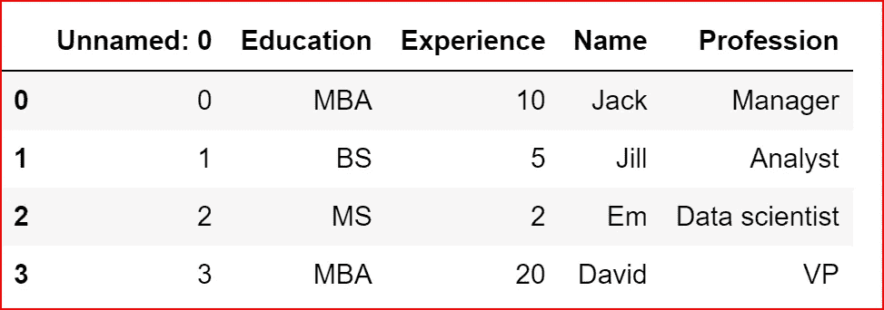
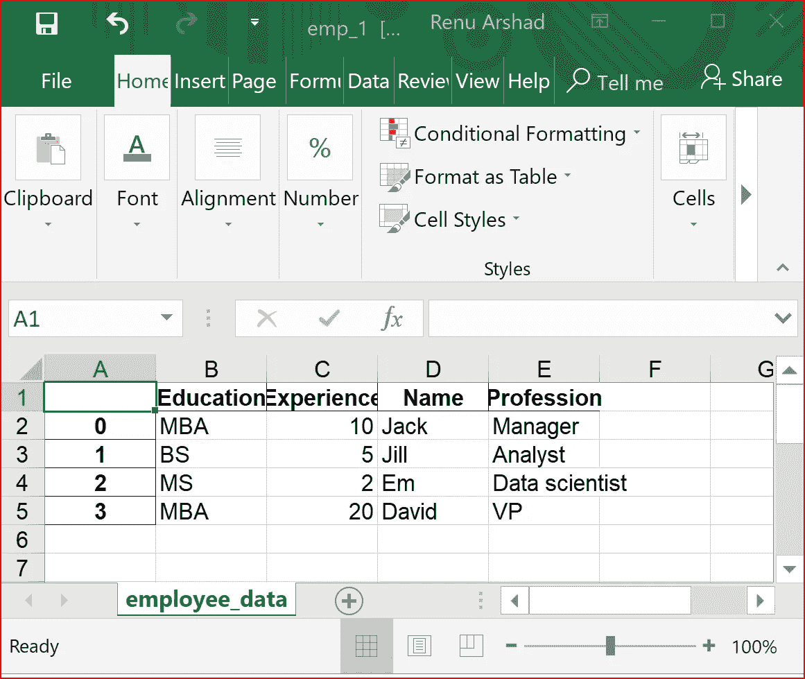
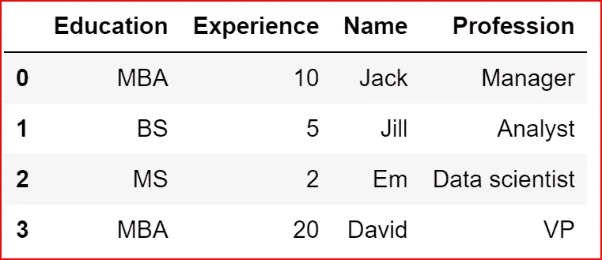

# Python 从文件中读取和写入数据

> 原文：<https://levelup.gitconnected.com/python-reading-and-writing-data-from-files-d3b70441416e>

*先决条件:任何编程语言和不同文件格式存储数据的基础知识。我们将探讨如何从 csv、excel、JSON、html 和 xml 等不同文件中读取数据。*

**Jupyter 笔记本可以在这里找到**[](https://github.com/arshren/Reading-Files/blob/master/Python%20-%20Reading%20Files%20.ipynb)

**作为机器学习的第一步，我们需要知道从文件中读取数据进行数据分析。我们可以接收数据的不同类型的文件格式可以是:**

*   **CSV —逗号分隔文件**
*   **XLS — Excel 文件**
*   **JSON —以 JSON 格式存储的数据**
*   **HTML —超文本标记语言文件**

**我们将首先从 Python 的内置文件对象开始，然后深入研究如何使用 pandas 库读取不同类型的文件。**

**让我们从创建一个文件开始，将数据写入文件，然后读取文件。此外，我们不要忘记关闭文件。**

# **使用 Python 的 File 对象的文件操作**

**我们将使用一个 file 对象，我们将向它传递两个参数——filename 和我们希望对文件进行操作的模式——就像您希望打开文件进行读取、写入或追加一样。**

*****【打开(文件名，模式)*****

**不同的模式有**

*   ****w** :文件将以只写模式打开。如果文件以“w”模式打开，并且文件已经存在，则现有文件的内容将被覆盖**
*   ****r** :文件将以只读模式打开。这是默认模式**
*   ****a** :文件将以追加模式打开，数据将被写入文件末尾**
*   ****r+** :文件将以读写模式打开**

****文件类型—文本和二进制****

**默认情况下，文件以文本模式打开，这允许您以文本字符串的形式读写数据。**

**如果你想在二进制模式下打开文件，那么在模式后面加上“ **b** ”。**

****以只写模式打开文件****

**以只写模式打开“file_1.txt”。如果文件不存在，它将创建一个，如果文件已经存在，其内容将被覆盖。总是确保关闭文件**

```
file = open("file_1.txt", "w")
file.write("This a test write\n")
file.close()
```

**既然我们已经写入了数据，我们将读取文件的内容。**

****以只读模式读取文件****

**readline()从文件中读取一行**

```
file = open("file_1.txt", "r")
str1 = file.readline()
print(str1)
file.close()***This a test write***
```

****在追加模式下写入文件****

```
file = open("file_1.txt", "a")
file.write("This should be written at the end of the file\n")
file.close()
```

****以“r+”模式打开文件并读取其所有内容****

```
file = open("file_1.txt", "r+")
for str1 in file.readlines():
    print(str1)
file.close()***This a test write

This should be written at the end of the file***
```

****用** `**with**` **语句**读取文件**

**`**with**` 是一种更简洁的处理文件对象的方式，因为它处理异常。`**with**` 语句自动打开和关闭文件，因此您无需记住关闭文件。**

```
with open("file_1.txt") as file:
    print(file.readlines())***['This a test write\n', 'This should be written at the end of the file\n']***
```

**我们也可以使用带语句的`the`将数据写入文件。由于我们使用了“w”模式，现有文件内容将被覆盖。**

```
with open("file_1.txt", "w") as file:
    file.write("This is a with statement")

with open("file_1.txt", "r") as file:    
    print(file.readlines())***['This is a with statement']***
```

***我们现在将使用 pandas 库来读取一个逗号分隔值(csv)文件。***

# **写入 csv 文件和从 csv 文件读取**

**我们将首先在名为 data 的字典中创建一些数据**

```
data ={"Name":['Jack', 'Jill', 'Em', 'David'],
           "Profession":['Manager', 'Analyst', 'Data scientist', 'VP'],
           "Experience":[10,5,2,20],
           "Education":['MBA', 'BS', 'MS','MBA']}
data***{'Education': ['MBA', 'BS', 'MS', 'MBA'],
 'Experience': [10, 5, 2, 20],
 'Name': ['Jack', 'Jill', 'Em', 'David'],
 'Profession': ['Manager', 'Analyst', 'Data scientist', 'VP']}*** 
```

**我们将从字典中创建一个数据帧“df”，然后将数据帧中的数据写入一个 csv 文件——“EMP . CSV”。**

**为了创建一个数据框架，我们需要首先导入 pandas 库。**

```
import pandas as pd
df = pd.DataFrame(data)df.to_csv("emp.csv")
```

**csv 文件将在您的默认 Jupyter 目录中创建。要知道默认目录，使用 **pwd** (打印工作目录和)就可以找到新文件“emp.csv”**

```
pwd
```

**现在我们已经将数据写入了 csv 文件，让我们从 emp.csv 文件中读取数据**

```
csv_data = pd.read_csv("emp.csv")
csv_data
```

****

**CSV _ data—EMP . CSV 文件中的数据**

**csv_data 的数据类型是数据帧。所以我们可以使用所有的数据帧操作。**

```
type(csv_data)***pandas.core.frame.DataFrame***
```

**了解更多关于[数据框](https://medium.com/@arshren/python-data-structures-dataframe-888fef6872bf)和[字典](https://medium.com/@arshren/python-data-structures-dictionary-9b746b94b421)的信息。**

# **写入 excel 文件和从 excel 文件读取**

**在这里，我们将使用相同的 df 数据帧将数据写入 excel 文件中的工作表名“employee_name”**

```
df.to_excel("emp_1.xls",sheet_name ="employee_data")
```

****

**工作表名称为 employee_data 的 Excel 文件**

**现在让我们将 excel 文件 emp1.xls 工作表名称“employee_data”中的数据读入数据框架 xls_data。**

```
xls_data = pd.read_excel("emp_1.xls", sheetname="employee_data")
xls_data
```

****

**数据帧 xls_data**

# **将数据写入 JSON 文件**

**这里，我们将使用相同的数据帧 df 写入 json 文件**

```
df.to_json('emp.json')
```

**emp.json 文件的内容**

*****{ "学历":{"0":"MBA "，" 1":"BS "，" 2":"MS "，" 3":"MBA"}，"经历":{"0":10，" 1":5，" 2":2，" 3":20}，"姓名":{"0":"Jack "，" 1":"Jill "，" 2":"Em "，" 3":"David"}，"职业":{"0 ":"经理"，" 1 ":"分析师"，" 2 ":"数据科学家"，" 3:" " VP " }。*****

**现在我们已经将数据写入了 json 文件，让我们来读取数据**

```
emp= pd.read_json("emp.json")
emp
```

****

**通过读取 json 文件创建的 DataFrame emp**

**如果您有一个 json 对象，那么我们可以使用 **json.loads()** 将内容放入一个列表，然后使用列表的所有操作进行数据操作。**

**阅读此处以操作[列表](https://medium.com/@arshren/python-data-structures-list-9131e7386c8d)**

```
area_json ="""
{ "office": 
    {"medical": [
      { "room-number": 100,
        "use": "reception",
        "sq-ft": 50,
        "price": 75
      },
      { "room-number": 101,
        "use": "waiting",
        "sq-ft": 250,
        "price": 75
      },
      { "room-number": 102,
        "use": "examination",
        "sq-ft": 125,
        "price": 150
      },
      { "room-number": 103,
        "use": "examination",
        "sq-ft": 125,
        "price": 150
      },
      { "room-number": 104,
        "use": "office",
        "sq-ft": 150,
        "price": 100
      }
    ]},
    "parking": {
      "location": "premium",
      "style": "covered",
      "price": 750
    }
} 
"""
home_data = json.loads(area_json)
home_data***{'office': {'medical': [{'price': 75,
    'room-number': 100,
    'sq-ft': 50,
    'use': 'reception'},
   {'price': 75, 'room-number': 101, 'sq-ft': 250, 'use': 'waiting'},
   {'price': 150, 'room-number': 102, 'sq-ft': 125, 'use': 'examination'},
   {'price': 150, 'room-number': 103, 'sq-ft': 125, 'use': 'examination'},
   {'price': 100, 'room-number': 104, 'sq-ft': 150, 'use': 'office'}]},
 'parking': {'location': 'premium', 'price': 750, 'style': 'covered'}}***
```

**我们也可以使用 python 数据并转储到 json 对象中。**

**这里我们将使用我们之前创建的数据字典，并作为 json 数据转储。**

```
json_data = json.dumps(data)
json_data***'{"Name": ["Jack", "Jill", "Em", "David"], "Profession": ["Manager", "Analyst", "Data scientist", "VP"], "Experience": [10, 5, 2, 20], "Education": ["MBA", "BS", "MS", "MBA"]}'***
```

# **从 URL 检索数据**

**我们将使用两个库来从 URL 中检索数据— **request** 和 **beautifulsoup** 。我们还会用`**re**` 来使用正则表达式。**

```
import requests
import re
from bs4 import BeautifulSoup
```

**我们将使用我在 medium 上发表的一篇文章中的一个 url 来检索文本。我们使用`**get**` 的方法请求库下载页面。`response`现在会有网页的内容。**

```
url = "[https://medium.com/@arshren/power-of-habit-how-to-accomplishing-big-goals-by-making-small-changes-5872a788fcb8](https://medium.com/@arshren/power-of-habit-how-to-accomplishing-big-goals-by-making-small-changes-5872a788fcb8)"
response = requests.get(url)
```

**`response.content`将包含 html 页面的内容。**

**我们将使用`Beautifulsoup`构造函数并传递我们在 response.content 中的 html 内容**

```
soup = BeautifulSoup(response.content,'html.parser')
```

**我们现在将使用`find`方法提取标题，然后使用`get_text`提取标题。**

**然后，我们在 html 页面中找到所有“p”标签，其 class 属性包含类似“graf graf — p”的文本。这里我们使用正则表达式，因为我们想找到 p 标签的类属性，其值类似于“graf graf-p”**

```
title  = soup.find('title').get_text()
any_data = soup.find_all('p', class_=re.compile("graf graf--p"))
```

**我们现在将遍历`any_data`，这是 bs4 的结果集**

```
print(title)for p in any_data:
   print(p.get_text())***Power of Habit — How to accomplish big goals by making small changes
Photo by Vidar Nordli-Mathisen on Unsplash
You might have heard that a 1000 mile journey begins one step at a time. I also used to be temporarily inspired by such quotes. But a few days would pass, and I would find it had slipped my mind.
Are you wanting to change things in your life?
Are you stuck in the same old circumstances and feel a need to change?
Do you want to meet a happy version of yourself in future?
Then read on…***
```