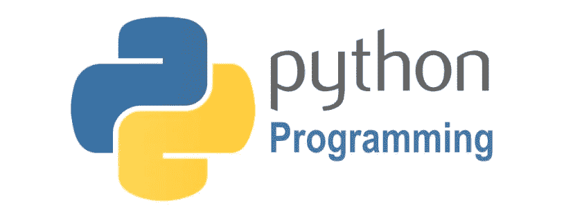
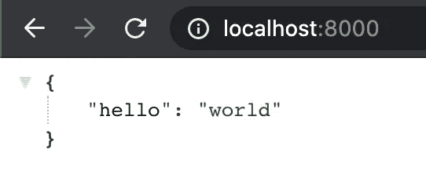
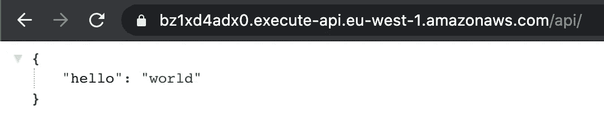

# Python 无服务器框架——AWS Chalice for Lambda

> 原文：<https://levelup.gitconnected.com/python-serverless-framework-aws-chalice-cc5fa7b70318>

## Chalice 是一个用 Python 编写无服务器应用程序的框架，允许您快速创建和部署使用 AWS Lambda 的应用程序



我假设你已经熟悉了 AWS Lambda T1 和 T2 API Gateway T3 以及它们是如何工作的。如果没有，我推荐阅读我最受欢迎的一篇文章《 [React.js API 调用 AWS Lambda、API Gateway 和处理 CORS](https://codeburst.io/react-js-api-calls-to-aws-lambda-api-gateway-and-dealing-with-cors-89fb897eb04d) 》。在高层次上，它允许您“无服务器”地部署应用程序。这实际上可能听起来有误导性，因为涉及到服务器，但它是“无服务器”的，因为你不需要担心它们。您只需为应用程序功能的执行时间付费。 [AWS Lambda](https://console.aws.amazon.com/lambda) 原生支持 [Java](http://docs.aws.amazon.com/lambda/latest/dg/java-lambda.html) ， [Go](https://docs.aws.amazon.com/lambda/latest/dg/go-programming-model.html) ， [PowerShell](https://docs.aws.amazon.com/lambda/latest/dg/powershell-programming-model.html) ， [Node.js](http://docs.aws.amazon.com/lambda/latest/dg/authoring-function-in-nodejs.html) ， [C#](http://docs.aws.amazon.com/lambda/latest/dg/current-supported-versions.html) ， [Python](http://docs.aws.amazon.com/lambda/latest/dg/python-lambda.html) 和 [Ruby](https://docs.aws.amazon.com/lambda/latest/dg/lambda-runtimes.html) 代码，并提供一个运行时 API，允许你使用任何额外的编程语言来创作你的函数。我个人没有遇到任何人使用除了 [Node.js](http://docs.aws.amazon.com/lambda/latest/dg/authoring-function-in-nodejs.html) 或 [Python](http://docs.aws.amazon.com/lambda/latest/dg/python-lambda.html) 之外的任何东西来实现他们的功能。我以前的文章都使用了 [Node.js](http://docs.aws.amazon.com/lambda/latest/dg/authoring-function-in-nodejs.html) 作为例子，但是我认为添加一个 [Python](http://docs.aws.amazon.com/lambda/latest/dg/python-lambda.html) 例子也是值得的。如果你正在使用 [Python](http://docs.aws.amazon.com/lambda/latest/dg/python-lambda.html) 作为你的函数，有一个非常好的 Python 无服务器框架叫做“AWS Chalice”。如果你熟悉用于 [Python](http://docs.aws.amazon.com/lambda/latest/dg/python-lambda.html) 的 [Flask](https://flask.palletsprojects.com/) 框架，它就是基于此的。

# 让我们开始吧…

## AWS API

您将需要安装 [AWS CLI](https://docs.aws.amazon.com/cli) ，为了做到这一点，第一步您需要在 [IAM](https://console.aws.amazon.com/iam) 中进行几个步骤，这将需要一个 root 或管理员帐户。

在 [IAM](https://console.aws.amazon.com/iam) 中，点击**组**，然后**新建组**。添加一个名为“ **Administrators** ”的新组(如果尚不存在)，并附加一个名为“ **AdministratorAccess** ”的策略。通过打开组并点击“**用户**”选项卡下的“**将用户添加到组**”，将您的用户添加到“**管理员**”组。

在 [IAM](https://console.aws.amazon.com/iam) 中，点击“**用户**”，打开你的用户账户(现在应该是“**管理员**”组的一部分)，点击“**安全凭证**”选项卡。如果你有一个访问键设置并记住了细节，那就太好了。如果您没有访问密钥或放错了详细信息，只需创建一个新的。务必记下**“访问密钥 ID** ”和**秘密访问密钥**。在我的情况下，我删除了现有的关键，我放错了细节。

下一步是在您的系统上安装 [AWS CLI](https://docs.aws.amazon.com/cli) 。我有一台 Mac 电脑，所以[按照这里的步骤操作](https://docs.aws.amazon.com/cli/latest/userguide/install-cliv2-mac.html#cliv2-mac-install-cmd)。或者，如果您使用 Docker、Linux 或 Windows，请[遵循这里的步骤](https://docs.aws.amazon.com/cli/latest/userguide/install-cliv2.html)。

如果您使用的是 Mac，步骤如下(您将需要 sudo 访问):

```
% **curl "https://awscli.amazonaws.com/AWSCLIV2.pkg" -o "AWSCLIV2.pkg"**
% **sudo installer -pkg AWSCLIV2.pkg -target /**
```

要确认安装完成，您可以确认您安装了最新的 AWS CLI，在我的例子中是 2.0.61。如果您想随时升级 AWS CLI 版本，只需再次运行上述两个命令。

```
% **aws --version**
aws-cli/2.0.61 Python/3.7.4 Darwin/19.6.0 exe/x86_64
```

然后，您将需要配置您的 AWS CLI。

```
% **aws configure**
AWS Access Key ID [None]: **YOUR_IAM_ACCESS_KEY**
AWS Secret Access Key [None]: **YOUR_IAM_SECRET_KEY**
Default region name [None]: eu-west-1
Default output format [None]: json
```

在我的 Mac 上，这在我的主目录中创建了一个名为**的隐藏目录。aws** 里面哪两个文件，**配置**和**凭证**。

## **Python 虚拟环境**

您需要创建一个 Python 虚拟环境，这是使用 Python 时的最佳实践。“**遗留方式**是使用 Python 包管理器(PIP)安装名为“ **virtualenv** 的包。它仍然有其用途，因为它允许您创建 Python 2 和 Python 3 虚拟环境，这可能很方便。前几天，我需要安装一个旧的 Python 包，它只能与 Python 2 库一起工作，但我安装了 Python 3，所以我为它创建了虚拟环境，瞧，它工作了！

这就是你如何使用“ **virtualenv** ”创建一个虚拟环境。

```
% **pip install virtualenv**% **virtualenv --python=/usr/bin/python venv27** *OR*% **virtualenv -p /usr/bin/python venv27**% **source env27/bin/activate**
(venv27) % **python --version**
Python 2.7.16(venv27) % **deactivate** <--    to exit the virtual environment
%
```

从 Python 3 开始，您现在可以使用带有“ **venv** ”模块的原生 Python 创建轻量级虚拟环境。你不再需要安装“ **virtualenv** ”这很棒。这只是意味着您将使用可执行版本创建一个虚拟环境。

```
% **python3.8 -m venv venv** % **source env/bin/activate** (venv) % **python --version**
Python 3.8.6(venv) % **deactivate** <--    to exit the virtual environment
%
```

## 圣杯

初始化 Python 虚拟环境。我在 Mac 上安装了 Python 3.8，所以我会使用它。

```
% **cd ~**
% **python3.8 -m venv venv** % **source venv/bin/activate**
(venv) %
```

确保 Python 包管理器(PIP)是最新的。

```
(venv) % **venv/bin/python3.8 -m pip install --upgrade pip**
```

使用 PIP 安装圣杯。

```
(venv) % **pip3.8 install chalice**
```

创建我们的名为“ **mediumtutorial** 的圣杯项目。

```
(venv) % **chalice new-project** ___  _  _    _    _     ___  ___  ___
  / __|| || |  /_\  | |   |_ _|/ __|| __|
 | (__ | __ | / _ \ | |__  | || (__ | _|
  \___||_||_|/_/ \_\|____||___|\___||___|The python serverless microframework for AWS allows
you to quickly create and deploy applications using
Amazon API Gateway and AWS Lambda.Please enter the project name: **mediumtutorial**
```

四处看看…

```
(venv) % **cd mediumtutorial**
(venv) mediumtutorial % **tree**
.
|____requirements.txt
|____.gitignore
|____app.py
|____.chalice
| |____config.json
```

顺便说一句，你可能想知道我是如何在 Mac 上使用“ **tree** ”的。[我发现了这个非常方便的别名](https://osxdaily.com/2016/09/09/view-folder-tree-terminal-mac-os-tree-equivalent/)，它给出了与 Linux 类似的输出。我一直在用它，我想它可能对你有用。

就把这个加到你的“ **~/”里吧。zshrc** ”。

```
alias tree="find . -print | sed -e 's;[^/]*/;|____;g;s;____|; |;g'"
```

默认的“ **app.py** ”是你的标准“ **hello world** ”应用。

让我们构建、运行并尝试一下…

```
(venv) mediumtutorial % **chalice local**    
Serving on [http://127.0.0.1:8000](http://127.0.0.1:8000)
Restarting local dev server.
Serving on [http://127.0.0.1:8000](http://127.0.0.1:8000)
```



```
(venv) mediumtutorial % **chalice local **   
Serving on [http://127.0.0.1:8000](http://127.0.0.1:8000)
Restarting local dev server.
Serving on [http://127.0.0.1:8000](http://127.0.0.1:8000)
127.0.0.1 - - [01/Nov/2020 22:18:10] "GET / HTTP/1.1" 200 -
127.0.0.1 - - [01/Nov/2020 22:18:10] "GET /favicon.ico HTTP/1.1" 403 -
```

在另一个终端窗口中，当 Chalice web 服务器仍在运行时，您也可以像这样测试它…

```
% **curl** [**http://localhost:8000**](http://localhost:8000)
{"hello":"world"}%
```

这是令人印象深刻的疯狂部分！

```
(venv) mediumtutorial % **chalice deploy**
Creating deployment package.
Creating IAM role: mediumtutorial-dev
Creating lambda function: mediumtutorial-dev
Creating Rest API
Resources deployed:
  - Lambda ARN: arn:aws:lambda:eu-west-1:<removed>:function:mediumtutorial-dev
  - Rest API URL: [**https://bz1xd4adx0.execute-api.eu-west-1.amazonaws.com/api/**](https://bz1xd4adx0.execute-api.eu-west-1.amazonaws.com/api/)
(venv) %
```

…这样，您就可以在几毫秒内部署带有 API 网关的 Lambda 函数！



```
(venv) mediumtutorial % **curl** [**https://bz1xd4adx0.execute-api.eu-west-1.amazonaws.com/api/**](https://bz1xd4adx0.execute-api.eu-west-1.amazonaws.com/api/)
{"hello":"world"}%
```

移除它也同样简单…

```
(venv) mediumtutorial % **chalice delete**
Deleting Rest API: bz1xd4adx0
Deleting function: arn:aws:lambda:eu-west-1:<removed>:function:mediumtutorial-dev
Deleting IAM role: mediumtutorial-dev
```

我希望你觉得这篇文章有趣并且有用。如果您想随时了解情况，请不要忘记关注我，注册我的[电子邮件通知](https://whittle.medium.com/subscribe)。

# 迈克尔·惠特尔

*   ***如果你喜欢这个，请*** [***跟我上媒***](https://whittle.medium.com/)
*   ***更多有趣的文章，请*** [***关注我的刊物***](https://medium.com/trading-data-analysis)
*   ***有兴趣合作？*** [***咱们上领英***](https://www.linkedin.com/in/miwhittle/) 连线
*   ***支持我和其他媒体作者*** [***在此报名***](https://whittle.medium.com/membership)
*   ***请别忘了为文章鼓掌:)←谢谢！***