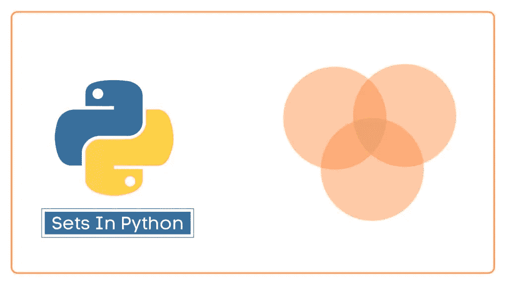

# Python 设置了你需要知道的一切

> 原文：<https://levelup.gitconnected.com/python-set-everything-you-need-to-know-92ccd2c2b557>

本文旨在向您展示 Python 中列表的所有特性。让我们开始吧…



# 内容概述/摘要

1.  **集合定义
    1.1 集合属性**
2.  **布景和冷冻布景**
3.  **列表的初始化
    3.1 创建一个空集
    3.2 创建一个非空集
    3.3 创建一个 fronzenset**
4.  **横向设置元素**
5.  **设定运算/计算**
6.  **集合上的本地方法**

## 1.集合定义

集合用于在单个变量中存储多个项目。

## 1.1 设置属性

Python 的内置`set`类型有以下特点:

*   集合是无序的。
*   集合元素是唯一的。不允许重复的元素。
*   集合本身可以被修改，但是集合中包含的元素必须是不可变的类型。

## 2.布景和冷冻布景

不管 frozenset 是不可变的，set 类型都是可变的。我们可以在 set 上执行 add()、remove()和这类操作，但对于 frozenset 是不可能的。

## 3.列表初始化

**3.1 创建一个空集**

```
s1 = set()  # create an empty set
print(s1)  # output: set(), not {}, to different dict and set
print(type(s1)) # <class 'set'>

d = {}  # this is an empty dict, not set
print(d, type(d)) # {} <class 'dict'>
```

**3.2 创建一个非空集**

```
s1 = {2, 1, 3}
print(s1)  # {1, 2, 3}

s2 = {1, 2, 3, 3}  # auto de-duplication
print(s2) # {1, 2, 3}

# use set factory to convert other iterables to set
s3 = set('12aa')
print(s3) # {'1', '2', 'a'}

s4 = set([1, 2, 'a', 'a'])
print(s4) # {1, 2, 'a'}
```

**3.3 创建一个 fronzenset**

```
s1 = frozenset('12aa')
print(s1) # frozenset({'2', 'a', '1'})

s2 = frozenset([1, 2, 'a', 'a'])
print(s2) # frozenset({1, 2, 'a'})
```

## 4.横向集合元素

```
s1 = {5, 4, 3, 2, 1}
for x in s1:
    print(x, end=" ")
# 1 2 3 4 5
```

集合不可索引

```
s1= { 1 , 2 , 3 }
print(s1[1])
# TypeError: 'set' object does not support indexing
```

## 5.集合运算/计算

```
s1 = {1, 2, 3, 4, 5}
s2 = {4, 5, 6, 7, 8}

print(s1 - s2)  # difference
# {1, 2, 3}
print(s2 - s1)
# {8, 6, 7}

print(s1 & s2)  # intersection
# {4, 5}

print(s1 | s2)  # union
# {1, 2, 3, 4, 5, 6, 7, 8}

print(s1 ^ s2)  # intersection complement
# {1, 2, 3, 6, 7, 8}

print(6 in s1) # False
print(6 not in s1) # True
```

## 6.集合上的本机方法

```
a_set = Set({ 1, 3 })
len(a_set) # 2
max(a_set) # 3
min(a_set) # 1
sum(a_set) # 4
list(a_set) # [1, 3]
tuple(a_set) # (1, 3)
del a_set[1] # TypeError: 'set' object does not support item deletion
```

## 7.设置方法

```
a_set = set({1, 2})
a_set.add(3) # Add an element to a set.
print(a_set)  # {1, 2, 3}

a_set = set({1, 2})
a_set.update({3, 4}) # Update a set with the union of itself and others.
print(a_set)  # {1, 2, 3, 4}

a_set = set({1, 2})
a_set.remove(1) # Remove an element from a set; it must be a member.
print(a_set)  # {2}

a_set = set({1, 2})
a_set.discard(1) # Remove an element from a set if it is a member.
print(a_set)  # {2}

a_set = set({1, 2})
a_set.pop() # Remove and return an arbitrary set element.
print(a_set)  # {2}

a_set = set({1, 2})
a_set.clear() # Remove all elements from this set.
print(a_set)  # set()

a_set = set({1, 2})
a_set = a_set.union({3, 4}) # Return the union of sets as a new set.
print(a_set)  # {1, 2, 3, 4}

a_set = set({1, 2})
a_set = a_set.intersection({1, 3}) # Return the intersection of two sets as a new set.
print(a_set)  # {1}

a_set = set({1, 2})
a_set = a_set.difference({1, 3}) # Return the difference of two or more sets as a new set.
print(a_set)  # {2}

a_set = set({1, 2})
a_set = a_set.symmetric_difference({1, 3}) # Return the symmetric difference of two sets as a new set.
print(a_set)  # {2, 3}

a_set = set({1, 2})
a_set = a_set.issubset({1, 2, 3}) # Report whether another set contains this set.
print(a_set)  # True

a_set = set({1, 2})
a_set = a_set.issuperset({1, 2, 3}) # Report whether this set contains another set.
print(a_set)  # False

a_set = set({1, 2})
a_set = a_set.isdisjoint({3, 4}) # Return True if two sets have a null intersection.
print(a_set)  # True

a_set = set({1, 2})
a_set = a_set.copy() # Return a shallow copy of a set.
print(a_set)  # {1, 2}

a_set = set({1, 2})
a_set = a_set ^ {1, 3} # Return the symmetric difference of two sets as a new set.
print(a_set)  # {2, 3}

a_set = set({1, 2})
a_set ^= {1, 3} # Update a set with the symmetric difference of itself and another.
print(a_set)  # {2, 3}

a_set = set({1, 2})
a_set &= {1, 3} # Update a set with the intersection of itself and another.
print(a_set)  # {1}
```

**呼吁行动**

如果你觉得这个指南有帮助，请鼓掌并跟我来。通过[链接](https://medium.com/@caopengau/membership)加入 medium，获取我和所有其他优秀作家在 medium 上的优质文章。