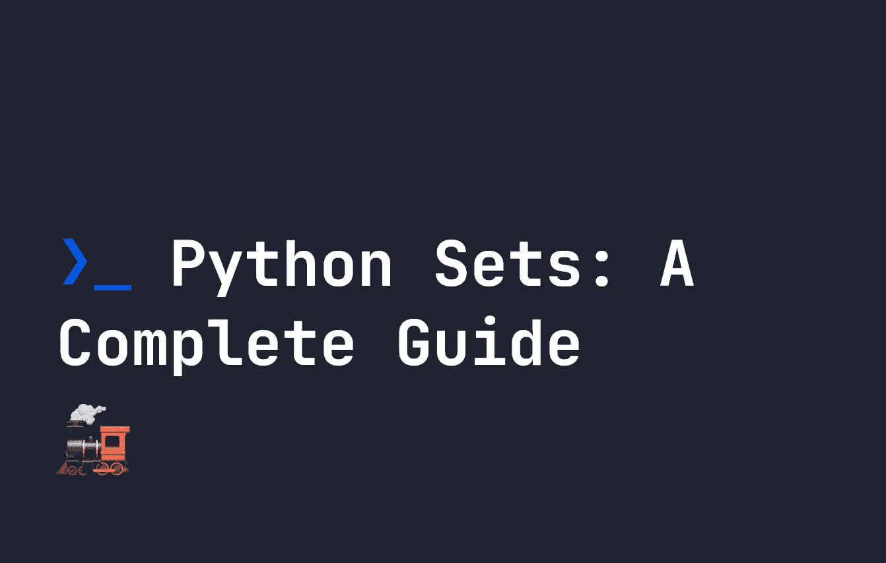

# Python 集:完整指南

> 原文：<https://levelup.gitconnected.com/python-sets-a-complete-guide-dd4233a4c825>



python 中的集合提供了一种方法来创建一组唯一的无重复的无序项。它们的主要用例是检查一个项目是否存在于一组项目中，这在许多不同的情况下都很有用。

创建一个集合非常容易，有点类似于我们在 Python 中定义列表的[。唯一的区别，是我们使用`{}`花括号来定义一个集合:](https://fjolt.com/article/python-lists)

```
mySet = { "some", "set", "of", "items" }
```

也可以使用`set()`功能从列表中定义集合:

```
mySet = set([ 'some', 'list', 'becoming', 'a', 'set' ])
# set is { 'some', 'list', 'becoming', 'a', 'set' }
```

您也可以使用相同的`set()`功能从字符串创建集合:

```
mySet = set('somestring')
# set is { 's', 'o', 'm', 'e', 's', 't', 'r', 'i', 'n', 'g' }
```

与其他可计数类型的数据一样，我们也可以使用`len`来获得一个集合的长度:

```
let mySet = set([ 'some', 'list', 'becoming', 'a', 'set' ])
print(len(mySet)) # Returns 5
```

最后，我们还可以使用`frozenset()`函数定义所谓的`frozenset`，它只是一个具有固定值的集合的不可变、不可更改的版本:

```
let mySet = frozenset([ 'some', 'list', 'becoming', 'a', 'set' ])
```

# 组合和相交集合

我们可以使用`|`操作符将两个集合合并成一个集合。如果一个项目同时存在于两个集合中，只有一个副本会被带过来。这里有一个例子，我们结合了两个集合:

```
mySet = { "set", "one" }
myNewSet = { "set", "two" }combinedSet = mySet | myNewSet
print(combinedSet) # { "set", "one", "two" }
```

我们可以使用`&`使**集合与**集合相交。这意味着我们将最终得到一个集合，其中的项目只是同时存在于两者中的项目。使用相同的示例，我们因此可以创建一个仅包含项目`set`的集合:

```
mySet = { "set", "one" }
myNewSet = { "set", "two" }combinedSet = mySet & myNewSet
print(combinedSet) # { "set" }
```

我们可以组合集合的另一种方法是通过减法，最后得到一个新的集合，该集合只包含当移除两个集合中的任何公共项时剩下的项。例如，下面的新集合只有一个项目— `cool`，因为`mySet`和`mySecondSet`都包含“集合”和“一”:

```
mySet = { "set", "one", "cool" }
mySecondSet = { "set", "one" }
myNewSet = mySet - mySecondSet
print(myNewSet) # { "cool" }
```

最后，我们可以做所谓的**对称差**，我们最终得到一个集合，其中包含在`mySet`或`mySecondSet`中找到的项目，但不是两者都有:

```
mySet = { "set", "one", "cool", "nice" }
mySecondSet = { "set", "one", "friendly" }
myNewSet = mySet ^ mySecondSet
print(myNewSet) # { "cool", "nice", "friendly" }
```

# 使用集合测试成员资格

集合的主要用例是**测试成员关系**，查看集合中是否存在某个项目。我们可以使用`in`和`not in`关键字来实现。让我们看一个例子。如果我们想检查`orange`是否在我们的`fruits`集合中，我们使用`in`:

```
fruits = { "orange", "apple", "peach" }
print("orange" in fruits) # True
```

或者，如果我们想检查橙色是否不在`fruits`中，我们使用`not in`:

```
fruits = { "orange", "apple", "peach" }
print("orange" not in fruits) # False
```

# 制作器械包的副本

与列表一样，我们可以使用附加到所有集合的`copy()`方法来复制一个集合。这不会改变该值，但会改变内存中该新集合的引用。这意味着，如果使用`==`通过值进行比较，集合将是相同的，当使用`is`通过引用进行比较时，集合将不是相同的:

```
mySet = { "set", "one" }
mySetCopy = mySet.copy();print(mySet == mySetCopy) # True
print(mySet is mySetCopy) # False
```

# 测试超集和子集

集合的另一个真正有用的用例是检查一个集合是否是另一个集合的超集或子集的能力(有点绕口令):

*   子集将是完全包含在另一个集合中的集合。
*   超集将是完全包含另一个集的成员的集。

# 在 Python 中检查子集

假设我们有两组，如下所示:

```
mySet = { "set", "one", "two" }
mySecondSet = { "set", "one" }
```

`mySecondSet`实际上是`mySet`的子集，因为它完全包含在`mySet`中。我们可以使用`<=`操作符对此进行测试:

```
mySet = { "set", "one", "two" }
mySecondSet = { "set", "one" }print(mySecondSet <= mySet) # True
```

我们还可以使用`<`操作符来检查**的真实子集**，这意味着`mySecondSet`包含在`mySet`中，但其值不等于`mySet`。在上面的例子中，这也是正确的:

```
mySet = { "set", "one", "two" }
mySecondSet = { "set", "one" }print(mySecondSet < mySet) # True
```

然而，在下面的例子中，`mySecondSet`确实是`mySet`的子集，但它不是**的真实子集**，因为两者的值相等:

```
mySet = { "set", "one", }
mySecondSet = { "set", "one" }print(mySecondSet <= mySet) # True
print(mySecondSet < mySet) # False
```

# 在 Python 中检查超集

超集的工作方式与子集完全相同，唯一的区别是箭头方向相反。因此`>`用于检查**真的**超集，而`>=`用于检查任何超集。使用我们之前的例子，`mySet`是`mySecondSet`的超集，因此下面返回 true:

```
mySet = { "set", "one", "two" }
mySecondSet = { "set", "one" }print(mySet > mySecondSet) # True
```

同样，虽然 mySet 是下面的`mySeconSet`的超集，但它不是真正的超集，所以`>`不返回 true，而`>=`返回:

```
mySet = { "set", "one", }
mySecondSet = { "set", "one" }print(mySet >= mySecondSet) # True
print(mySet > mySecondSet) # False
```

# 在 Python 中测试两个集合是否有完全不同的值

有时，你还会想检查两套在相互比较时是否完全是原装的。例如，`{ "one", "two" }`和`{ "three", "four" }`是两个相互比较时具有唯一值的集合。在 Python 中，`isdisjoint`函数允许我们完成这个任务:

```
mySet = { "one", "two", }
mySecondSet = { "three", "four" }print(mySet.isdisjoint(mySecondSet)) # True
```

# 其他设置方法

虽然我们到目前为止讨论的所有内容都适用于`frozenset`和`set` s，但是还有一些其他方法适用于`set` s，允许我们改变它们的值。这些是:

*   `set.add('item')` -向器械包添加一个物品。
*   `set.remove('item')` -从集合中删除一个项目。
*   `set.update(newSet)` -将`newSet`中的所有项目添加到原来的`set`中。这也可以写成`set |= newSet`
*   `set.clear()` -删除器械包中的所有物品
*   `set.pop(4)` -删除集合中的第 4 个项目，如果没有指定数字，则删除最后一个项目
*   `set.intersection_update(newSet)` -仅保留在`set`和`newSet`中找到的项目。也可以写成`set &= newSet`
*   `set.difference_update(newSet)` -取`set`，并删除`newSet`中发现的任何项目。也可以写成`set -= newSet`
*   `set.symmetric_difference_update(newSet)` -只能在`set`和`newSet`中找到，不能两者都有。也可以写成`set ^= newSet`

虽然前 5 个提供了从集合中添加和删除项目的简单方法，但后 3 个与我们之前讨论交叉和组合集合时讨论的方法相同。这里的区别在于，我们可以使用这些函数来改变`set`本身。虽然这在正常情况下是可能的，但我们不能将这些方法应用于`frozenset`。

# 结论

这应该是你需要知道的关于 Python 中集合的一切。我希望你喜欢这个指南。我还在这里写了更多关于 Python 中所有不同数据结构的内容。如果你喜欢这个指南，你可能也会喜欢我这里的其他工程内容。

感谢阅读！您可以在下面了解有关 Python 数据集合的更多信息:

*   [Python 数据集合](https://fjolt.com/python-data-collections)
*   [Python 数据集合:列表](https://fjolt.com/article/python-lists)
*   [Python 数据集合:元组](https://fjolt.com/article/python-tuples)
*   **Python 数据集合:集合**
*   [Python 数据集合:字典](https://fjolt.com/article/python-dictionaries)

# 分级编码

感谢您成为我们社区的一员！在你离开之前:

*   👏为故事鼓掌，跟着作者走👉
*   📰查看[升级编码出版物](https://levelup.gitconnected.com/?utm_source=pub&utm_medium=post)中的更多内容
*   🔔关注我们:[Twitter](https://twitter.com/gitconnected)|[LinkedIn](https://www.linkedin.com/company/gitconnected)|[时事通讯](https://newsletter.levelup.dev)

🚀👉 [**将像你这样的开发人员安置在顶级创业公司和科技公司**](https://jobs.levelup.dev/talent/welcome?referral=true)